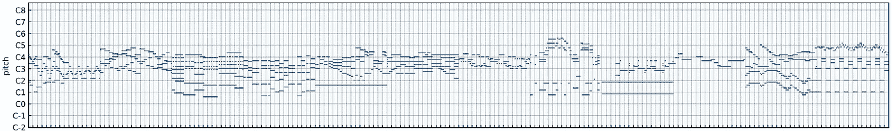

# 用 ML 创作音乐

> 原文：<https://towardsdatascience.com/creating-music-with-ml-b1960bce3b45?source=collection_archive---------21----------------------->

## 变形金刚又来了。

技术设备日复一日地播放音乐。你的手机可以做到，我的电脑可以做到，智能设备根据命令播放歌曲。因此，我们为什么不让技术设备也创造音乐呢？不仅仅是回放我们的结果，而是拿出原创作品？

韦斯顿·麦金农在 [Unsplash](https://unsplash.com?utm_source=medium&utm_medium=referral) 上拍摄的照片

这个方向有一个正在进行的研究领域；DeepMind 凭借其能够生成原始音频的 [WaveNet](https://deepmind.com/blog/article/wavenet-generative-model-raw-audio) 架构做出了巨大贡献。生成原始音频(生成类似音频曲线的浮点值)的缺点是涉及巨大的计算能力。这是一个障碍，因为计算机可能并不总是可用。

另一个效果惊人的方法是使用不同的格式来表现音乐。想想活页乐谱:虽然它本身不会发出声音，但它可以在下一步中用来产生声音。并且通过简单地生成图像，可以容易地训练 ML 模型来生成活页乐谱。

另一种格式是使用 MIDI 文件。这种格式将音乐存储为符号表示。我们不再保留声音，而是保留产生声音的信息。乐谱将音符值放在五线谱上，而 MIDI 表示包含信息。这些信息包含*音符开*和*音符关*事件，指示乐器何时演奏。速度同样可以包括在内。

MIDI 文件可以包含从 C_{-1}到 C_{)}范围内的音符；相比之下，一架标准钢琴有 88 个键，那些漂亮的大钢琴有时更多。

在 MIDI 文件中，音符可以有任意的持续时间，并且必须在回放前量化。然后，为了可视化(量化的)MIDI 文件，我们使用钢琴卷帘窗表示。这本质上是一个矩阵，横轴是时标，纵轴是理论上可以同时演奏的音符数。下面描述了一个可视化示例:

钢琴卷帘窗的可视化示例。y 轴表示音高，x 轴表示时间。在时间 *t，如果存在蓝色标记，则演奏一个音高(或音符)。图片由作者提供。*

现在，用矩阵来表示音乐有什么好处呢？首先，你需要更少的存储空间，典型的 MIDI 文件最多只有几千字节。其次，实际的矩阵可以是布尔型或 int8 型。与原始音频相比，这大大减小了张量的大小。

简而言之:你把音乐表现为一种形象。

反过来也很容易做到。网络的输出也是一个矩阵(或图像),因此可以解释为钢琴曲。然后这个钢琴卷帘窗保存了事件信息，我们用它来(重新)构建一个 MIDI 文件。

现在的问题是:听起来怎么样？

训练越多越好。

但是你可以在这里自己听一听。默认情况下，我们最好的模型会被选中。换一个训练步数更少的，听听区别。

在一个项目中，我有机会成为一个使用 MIDI 文件的小组的一员，并尝试了各种 ML 模型。最初，我们训练自动编码器、变型自动编码器、生成对抗网络、它们的组合，以及不可避免的变形器。

最终，我们选定了由谷歌大脑团队开发的[音乐转换器](https://arxiv.org/pdf/1809.04281.pdf)架构。然后我们在内部的 MIDI 文件数据集上训练这个模型。这个数据集包含了所有时代的音乐，但也包含了伟大的作曲家，如巴赫、柏辽兹、海顿和莫扎特。

由于我们为一个关于莫扎特的节日做了贡献，我们把重点放在了包括莫扎特在内的古典作曲家的作品上。

为了让访问者可以选择与我们的模型进行交互，我们编写了一个 web 应用程序。这是在 [streamlit](http://streamlit.io) 的帮助下完成的(这在大多数情况下非常方便，但在一些重要的地方使用起来*非常*)令人沮丧。

要摆弄模型，从头开始创作新作品，请点击此[链接](https://mozartgenom.professor-x.de/?sub_page=2)。点击按钮，让人工智能做剩下的事情。