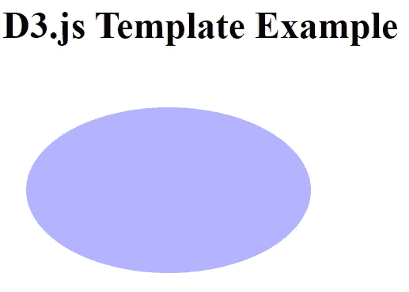
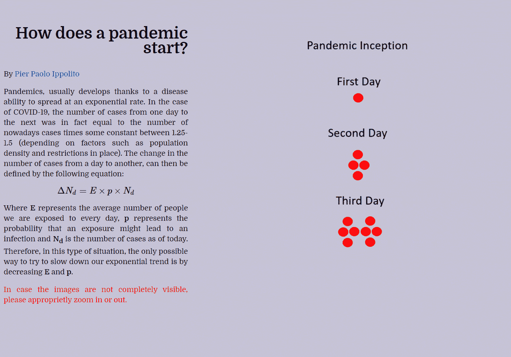

# 创建在线数据驱动的演示

> 原文：<https://towardsdatascience.com/creating-online-data-driven-presentations-6b25fc626072?source=collection_archive---------29----------------------->

## 使用 Reveal.js 和 D3.js 创建交互式在线数据科学演示


[活动发起人](https://unsplash.com/@campaign_creators?utm_source=medium&utm_medium=referral)在 [Unsplash](https://unsplash.com?utm_source=medium&utm_medium=referral) 上的照片

# 介绍

能够总结数据科学项目并展示其潜在的商业利益，在获得新客户方面可以发挥非常重要的作用，并使非技术受众更容易理解一些关键的设计概念。

在本文中，我将向您介绍两个免费的编程框架，它们可以用来创建交互式在线演示和基于数据的讲故事报告。

# Reveal.js

[Reveal.js](https://github.com/hakimel/reveal.js/) 是一个完全基于开放网络技术的开源展示框架。使用 Reveal.js，可以轻松地创建基于 web 的演示文稿，并将其导出为 PDF 等其他格式。

Reveal.js 的一些最有趣的特性是 Latex 和 Markdown 支持、CSS 定制、演讲者注释功能和语法高亮代码工具。

## 设置

Reveal.js 可以通过克隆官方存储库轻松安装:

```
git clone [https://github.com/hakimel/reveal.js.git](https://github.com/hakimel/reveal.js.git)
```

我们的演示可以通过修改 reveal.js 目录中提供的***index.html***文件来开发。使用 Node.js，我们可以很容易地实时观察(在本地服务器上的端口: [http://localhost:8000](http://localhost:8000/) )我们如何更新***index.html***文件。

```
cd reveal.js && npm install
npm start
```

下面是***index.html***演示文件的一个简单例子。从代码片段中我们可以看到，我们首先导入 Reveal.js 库，然后将 black 作为幻灯片的主题(更多主题选项列在 [Reveal.js 文档页面上！](https://revealjs.com/themes/))。每个不同的幻灯片，然后可以通过将它们封装在一个 section 标签中并在里面写入所有需要的内容来创建。嵌套不同的 section 标签，就有可能在演示文稿中创建不同的子部分。最后，在最后一个脚本标记中，Reveal.js 被初始化(传递不同的可选参数，可以添加 Latex 和 Math 格式等功能)。

```
<html>
  <head>
    <link rel="stylesheet" href="dist/reveal.css">
    <link rel="stylesheet" href="dist/theme/black.css">
  </head>
  <body>
    <div class="reveal">
      <div class="slides">
        <section>First Slide</section>
        <section>Second Slide</section> 
        <section>
         <section>Subsection Slide 1</section>
         <section>Subsection Slide 2</section>
        </section>
      </div>
    </div>
    <script src="dist/reveal.js"></script>
    <script>
      Reveal.initialize();
    </script>
  </body>
</html>
```

此外，通过使用以下格式实例化幻灯片，还可以在 Markdown 中创建幻灯片，而不是使用 HTML 和 Javascript。

```
<section data-markdown>
  <textarea data-template>
    ## Slide Title
    Example **text**.
  </textarea>
</section>
```

使用 Reveal.js 创建的完整工作示例演示可在[此链接获得(图 1)。](https://pierpaolo28.github.io/Epidemics-Modelling/presentation//index.html#/)


图 1:视频示例

# D3.js

D3.js 是一个开源的 Javascript 库，旨在使用 HTML、CSS 和 SVG 在 web 中创建数据驱动的可视化。D3.js 可以简单地通过在我们的工作文件中添加下面一行来加载。

```
# As new versions of the library might be released, updated versions # of this link might can be found at [this link.](https://d3js.org/)
<script src="https://d3js.org/d3.v5.min.js"></script>
```

使用 D3.js，可以通过元素名称或 CSS 选择器来选择元素。此外，D3.js 还提供了一些实用程序，用于加载数据集和预处理可视化数据。

下面是一个简单的示例代码，展示了如何设置 D3.js 来创建椭圆图表。

```
<html><head>
  <script src="[https://d3js.org/d3.v5.min.js](https://d3js.org/d3.v5.min.js)"></script>
</head><body>
  <h1>D3.js Template Example</h1>
  <script>
    var svg = d3.select("body")
      .append("svg")
      .attr("width", 270)
      .attr("height", 270); svg.append("ellipse")
      .attr("cx", 140)
      .attr("cy", 100)
      .attr("rx", 120)
      .attr("ry", 70)
      .attr("opacity", 0.3)
      .attr("fill", "blue")
  </script>
</body></html>
```



图 2: D3.js 示例代码输出

然后可以使用 D3.js 图表，通过将它们与 scroller 架构相集成来创建强大的演示。幸运的是，多亏了像[吉姆·瓦兰丁汉](https://vallandingham.me/scroller.html)和[库斯伯特·周](/how-i-created-an-interactive-scrolling-visualisation-with-d3-js-and-how-you-can-too-e116372e2c73)这样的作者，多用途滚动条(可用于任何类型的叙事)在过去几年已经被开发出来。下面的动画展示了我使用基于 D3.js 的滚动条创建的数据驱动叙事的完整工作示例。这也可以在[以下链接中进行测试。](https://pierpaolo28.github.io/Epidemics-Modelling/d3_scroller//index.html)



图 3: D3.js 滚动条演示

如果您有兴趣了解更多关于如何创建 D3.js 图表的信息，那么 [D3 Graph Gallery 文档](https://www.d3-graph-gallery.com/intro_d3js.html)是一个很好的起点。

最后，如果你想让你的演示可以离线使用，可以使用 [FPDF](https://pyfpdf.readthedocs.io/en/latest/index.html) 和 [python-pptx](https://python-pptx.readthedocs.io/en/latest/) Python 库来分别自动生成 PDF 和 PowerPoints。

*希望您喜欢这篇文章，感谢您的阅读！*

# 联系人

如果你想了解我最新的文章和项目[，请通过媒体](https://pierpaoloippolito28.medium.com/subscribe)关注我，并订阅我的[邮件列表](http://eepurl.com/gwO-Dr?source=post_page---------------------------)。以下是我的一些联系人详细信息:

*   [Linkedin](https://uk.linkedin.com/in/pier-paolo-ippolito-202917146?source=post_page---------------------------)
*   [个人博客](https://pierpaolo28.github.io/blog/?source=post_page---------------------------)
*   [个人网站](https://pierpaolo28.github.io/?source=post_page---------------------------)
*   [中等轮廓](https://towardsdatascience.com/@pierpaoloippolito28?source=post_page---------------------------)
*   [GitHub](https://github.com/pierpaolo28?source=post_page---------------------------)
*   [卡格尔](https://www.kaggle.com/pierpaolo28?source=post_page---------------------------)