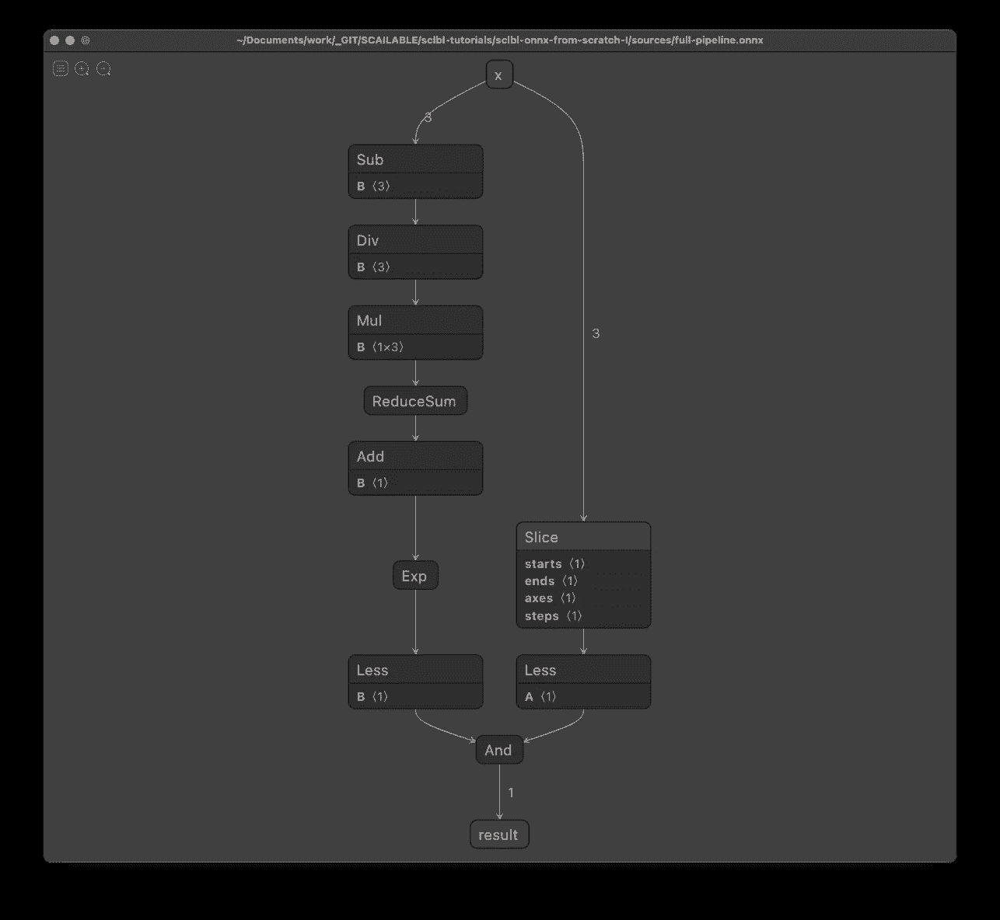
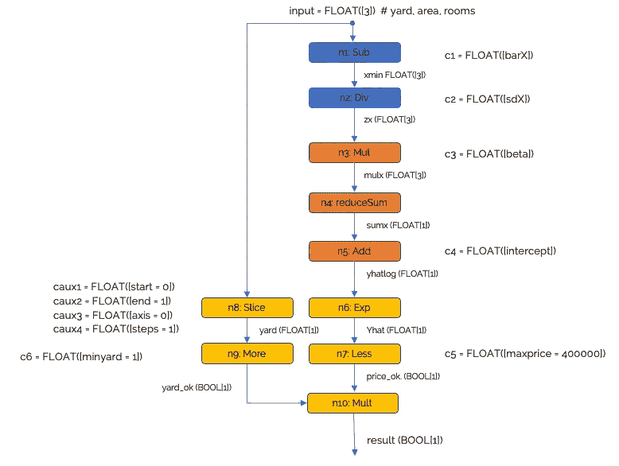
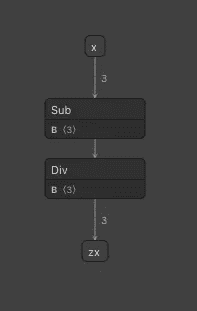
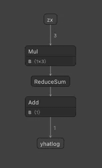
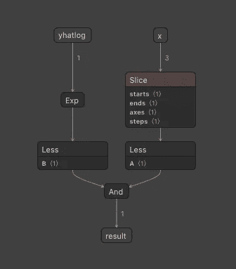

# 从头开始创建 ONNX

> 原文：<https://towardsdatascience.com/creating-onnx-from-scratch-4063eab80fcd?source=collection_archive---------3----------------------->



我们将在本教程中构建 ONNX 管道；图片作者。

## [实践教程](https://towardsdatascience.com/tagged/hands-on-tutorials)

## ONNX 提供了一种非常灵活的格式来存储 AI/ML 模型和管道。要了解如何操作，手动构建 ONNX 图是有指导意义的。

[ONNX](https://onnx.ai) 已经存在了一段时间，它正在成为一种成功的中间格式，将通常沉重的、经过训练的神经网络从一种训练工具转移到另一种工具(例如[在 pyTorch 和 Tensorflow](https://github.com/onnx/tutorials) 之间转移)，或者使用 [ONNX 运行时](https://github.com/microsoft/onnxruntime)在云中部署模型。在这些情况下，用户通常只是简单地将模型保存为 ONNX 格式，而不用担心生成的 ONNX 图形。

然而，ONNX 可以有更广泛的用途:ONNX 可以轻松地用于手动指定 AI/ML 处理管道，**包括现实部署中经常需要的所有预处理和后处理**。此外，由于其标准化和开放的结构，存储在 ONNX 中的管道可以很容易地部署，甚至在边缘设备上(例如，通过[自动编译到 WebAssembly](https://www.scailable.net) 以在各种目标上高效部署)。在本教程中，我们将展示如何使用 Python 中的`onnx.helper`工具从头开始创建 ONNX 管道*并有效地部署它。*

本教程由以下部分组成:

1.  **ONNX 的一些背景**。在我们开始之前，从概念上理解 ONNX 是做什么的是有用的。
2.  **“找房子”场景**。在本教程中，我们将重点创建一个管道来预测广告房屋的价格，并随后判断该房屋是否符合我们的搜索约束条件(即我们的需求)。
3.  **模特培训**。虽然不是真正的部署管道的一部分，我们将展示我们如何使用“sklearn”来训练预测模型。
4.  **创建 ONNX 管道**。这是本教程的主体，我们将一步一步来:
    — *预处理*:我们将使用我们训练的结果来标准化输入。
    — *推论*:我们将使用训练期间拟合的模型来预测(对数)价格。
    — *后处理*:我们将检查结果是否符合我们的要求。
    — *综合起来*:我们将把预处理、推理和后处理管道合并成一个 ONNX 图。
5.  **部署模型**:可以使用 ONNX 运行时部署 ONNX 模型，或者优化拟合图，使用 [WebAssembly](https://webassembly.org) 部署。我们将简要探讨这两种选择。

> ONNX 可轻松用于手动指定 AI/ML 处理管道，**包括现实部署中经常需要的所有预处理和后处理**。

# 1.ONNX 是什么？

根据 ONNX 官方网站:

> “O NNX 是一种开放格式，用于表示机器学习模型。ONNX 定义了一组通用的运算符——机器学习和深度学习模型的构建块——和一种通用的文件格式，使 AI 开发人员能够使用各种框架、工具、运行时和编译器“*”(参见*[*)ONNX . AI*](https://onnx.ai)*)。*

因此，ONNX 是一种开放文件格式，用于存储(**已训练**)包含足够细节(关于数据类型等)的机器学习模型/管道。)从一个平台移动到另一个平台。ONNX 的特性甚至允许将存储的操作自动编译成低级语言，以嵌入到各种设备中。实际上，当从一个平台转移到另一个平台时，一个`onnx`文件将包含重新实例化一个完整的数据处理管道所需的所有信息。

从概念上讲，onnx 格式非常简单:ONNX 文件定义了一个[有向图](https://en.wikipedia.org/wiki/Directed_graph)，其中每条边代表一个特定类型的张量，该张量从一个节点“移动”到另一个节点。节点本身被称为操作符，它们对它们的输入(即图中它们的父节点的结果)进行操作，并将它们的操作结果提交给它们的子节点。ONNX 指定了一个[操作列表](https://github.com/onnx/onnx/blob/master/docs/Operators.md)，它们共同允许你指定任何你可能想要执行的 AI/ML 操作(如果不是，操作符的集合很容易扩展)。

为了提供一个概念性的例子，假设我们想要从一个[逻辑回归模型](https://en.wikipedia.org/wiki/Logistic_regression)中生成推论。给定一个输入向量`x`，我们将:

1.使用例如`Gemm`算子将我们的输入向量`x`乘以学习系数`beta`来计算线性预测值`ylin`。
2。使用`Sigmoid`运算符将线性预测值转换为概率标度。
3。使用`Less`操作符生成对或错的推断。

因此，通过有效地链接多个操作符，我们可以在给定一些特征向量的情况下生成推论。然而，不要被简单的例子所迷惑:由于 ONNXs 张量支持和大量的操作符列表，甚至用于视频处理的复杂 dnn 也可以在 ONNX 中表示。

> 不要被这个简单的例子所迷惑:由于 ONNXs 张量支持和广泛的操作符列表，甚至用于视频处理的复杂 dnn 也可以在 ONNX 中表示。

# 2.我们找房子的场景

为了演示如何从头开始创建 ONNX 图，我们引入一个简单的场景:

> “假设你正在附近找一栋新房子。给定以前房屋销售的数据集，其中包含已出售房屋的庭院大小`yard`、居住面积`area`和房间数量`rooms`及其价格`price`，构建一个模型来预测新广告房屋的价格(即，只给你庭院大小、面积和房间数量)。接下来，您感兴趣的是价格低于 400.000 欧元、带院子(即院子大小大于 0)的任何房子。”

在本教程中，我们将构建一个数据处理管道，包括一个用于推理的线性回归模型，该模型给出了一个示例特征向量`(yard,area,rooms)`提供了一个布尔值，指示该房屋是否是感兴趣的。

# 3.模特培训

要创建管道，我们首先需要创建用于预测价格的模型。下面的代码打开数据文件`houses.csv`(此处可用)并生成模型。请注意，我们执行了几个步骤:

*   我们对输入进行标准化(因此，为了在预处理流水线中进行去标准化，我们将需要每个输入变量的“平均值”和“标准值”)。
*   我们对价格进行对数转换(因此，在我们的后处理流程中，我们需要将我们的推断转换回正确的比例)。
*   我们拟合一个简单的线性回归模型(并且我们存储估计的系数用于我们的处理流水线)。

以下是注释代码(或[点击此处](https://github.com/scailable/sclbl-tutorials/blob/master/sclbl-onnx-from-scratch-I/sources/manual-onnx-pipeline.ipynb)查看完整笔记本):

```
import numpy as np
from sklearn import linear_model as lm# Open the training data:
data = np.loadtxt(open(“houses.csv”, “rb”), delimiter=”,”, skiprows=1)# Retreive feature vectors and outcomes:
datX = data[:, [1,2,3]] # Input features (yard, area, rooms)
datY = data[:, [0]] # Price# Standardize the inputs:
barX = np.mean(datX, 0) # Mean for each of the inputs
sdX = np.std(datX, 0) # Sd for each of the inputs
datZ = (datX — barX) / sdX# Log transform the output
logY = np.log(datY)# Fit a linear model
lin_mod = lm.LinearRegression()
lin_mod.fit(datZ, logY)# retrieve intercept and fitted coefficients:
intercept = lin_mod.intercept_
beta = lin_mod.coef_## Storing what we need for inference in our processing pipeline.
print(“ — — Values retrieved from training — — “)
print(“For input statdardization / pre-processing we need:”)
print(“ — The column means {}”.format(barX))
print(“ — The column sds {}”.format(sdX))print(“For the prediction we need:”)
print(“ — The estimated coefficients: {}”.format(beta))
print(“ — The intercept: {}”.format(intercept))# store the training results in an object to make the code more readable later on:
training_results = {
 “barX” : barX.astype(np.float32),
 “sdX” : sdX.astype(np.float32),
 “beta” : beta.astype(np.float32),
 “intercept” : intercept.astype(np.float32),
}# And, also creating the constraints (for usage in block 3):
constraints = {
 “maxprice” : np.array([400000]),
 “minyard” : np.array([1]),
}
```

虽然`training_results`和`constraints`对象是我们在这个训练阶段在 ONNX 中实现我们的处理管道所需要的，但是演示如何在不转换到 ONNX 的情况下生成推理是有启发性的。以下代码演示了我们旨在使用简单 python 代码构建的完整管道，并使用我们训练集中的第一个实例作为示例:

```
# Get the data from a single house
first_row_example = data[1,:]
input_example = first_row_example[[1,2,3]]  # The features
output_example = first_row_example[0]  # The observed price# 1\. Standardize input for input to the model:
standardized_input_example = (input_example - training_results['barX'])/ training_results['sdX']# 2\. Predict the *log* price (using a dot product and the intercept)
predicted_log_price_example = training_results['intercept'] + np.dot(standardized_input_example, training_results['beta'].flatten())# Compute the actual prediction on the original scale
predicted_price_example = np.exp(predicted_log_price_example)
print("Observed price: {}, predicted price: {}".format(output_example, predicted_price_example))# See if it is interesting according to our simple decision rules:
interesting = input_example[1] > 0 and predicted_price_example < 400000
print("Interesting? {}".format(interesting))
```

# 4.创建 ONNX 管道。

给定一个由长度为 3 `(yard,area,rooms)`的输入向量描述的示例实例，我们的 ONNX 管道应该:

1.  [预处理]通过减去平均值(如在训练集中观察到的)并除以标准差来标准化输入
2.  [推论]在对数标度上预测示例实例的房价(使用来自上述训练好的`sklearn`模型的系数)
3.  [后处理]将价格转换回原始规模，并检查 a)房子是否负担得起，b)是否有院子。

更准确地说，引入所使用的 ONNX 操作符，我们将生成以下管道:



图片作者。

请注意，在下面的代码块中，我们将使用此图片中介绍的命名约定。

## 4a。预处理

我们将使用 Python 中提供的`onnx.helper`工具来构建我们的管道。我们首先创建常数，然后是操作节点(尽管常数也是操作符)，接着是图形:

```
# The required constants:
c1 = h.make_node(‘Constant’, inputs=[], outputs=[‘c1’], name=”c1-node”, 
 value=h.make_tensor(name=”c1v”, data_type=tp.FLOAT, 
 dims=training_results[‘barX’].shape, 
 vals=training_results[‘barX’].flatten()))c2 = h.make_node(‘Constant’, inputs=[], outputs=[‘c2’], name=”c2-node”, 
 value=h.make_tensor(name=”c2v”, data_type=tp.FLOAT, 
 dims=training_results[‘sdX’].shape, 
 vals=training_results[‘sdX’].flatten()))# The functional nodes:
n1 = h.make_node(‘Sub’, inputs=[‘x’, ‘c1’], outputs=[‘xmin’], name=’n1')
n2 = h.make_node(‘Div’, inputs=[‘xmin’, ‘c2’], outputs=[‘zx’], name=”n2")# Create the graph
g1 = h.make_graph([c1, n1, c2, n2], ‘preprocessing’,
 [h.make_tensor_value_info(‘x’, tp.FLOAT, [3])],
 [h.make_tensor_value_info(‘zx’, tp.FLOAT, [3])])# Create the model and check
m1 = helper.make_model(g1, producer_name=’scailable-demo’)
checker.check_model(m1)# Save the model
save(m1, ‘pre-processing.onnx’)
```

上面的代码创建了预处理管道，并以`onnx`格式存储。在 Python 中，我们可以使用`onnxruntime`直接测试存储的模型:

```
# A few lines to evaluate the stored model, useful for debugging:
import onnxruntime as rt# test
sess = rt.InferenceSession(“pre-processing.onnx”) # Start the inference session and open the model
xin = input_example.astype(np.float32) # Use the input_example from block 0 as input
zx = sess.run([“zx”], {“x”: xin}) # Compute the standardized outputprint(“Check:”)
print(“The standardized input using onnx pipeline is: {}”.format(zx))
print(“ — Compare to standardized first row in block 0: {}”.format(datZ[1,:]))
```

评估表明，我们的预处理管道确实正确地标准化了示例实例。



预处理管道，作者图像。

## 4b。推理

创建预处理管道后，我们按照类似的方法创建推理管道:

```
# The constants:
c3 = h.make_node(‘Constant’, inputs=[], outputs=[‘c3’], name=”c3-node”, 
 value=h.make_tensor(name=”c3v”, data_type=tp.FLOAT, 
 dims=training_results[‘beta’].shape, 
 vals=training_results[‘beta’].flatten()))c4 = h.make_node(‘Constant’, inputs=[], outputs=[‘c4’], name=”c4-node”, 
 value=h.make_tensor(name=”c4v”, data_type=tp.FLOAT, 
 dims=training_results[‘intercept’].shape, 
 vals=training_results[‘intercept’].flatten()))# The operating nodes, Multiply, reduceSum, and Add
n3 = h.make_node(‘Mul’, inputs=[‘zx’, ‘c3’], outputs=[‘mulx’], name=”multiplyBeta”)
n4 = h.make_node(‘ReduceSum’, inputs=[‘mulx’], outputs=[‘sumx’], name=”reduceSum”, keepdims=0)
n5 = h.make_node(‘Add’, inputs=[‘sumx’, ‘c4’], outputs=[‘yhatlog’], name=’addIntercept’)# The graph
g2 = h.make_graph([c3, c4, n3, n4, n5], ‘linear_regression’,
 [h.make_tensor_value_info(‘zx’, tp.FLOAT, [3])],
 [h.make_tensor_value_info(‘yhatlog’, tp.FLOAT, [1])])# The model and check:
m2 = h.make_model(g2, producer_name=’scailable-demo’)
checker.check_model(m2)# Save the model
save(m2, ‘linear-regression.onnx’)
```

同样，很容易验证预测是否正确:

```
# test
sess = rt.InferenceSession(“linear-regression.onnx”) # Start the inference session and open the model
xin = standardized_input_example.astype(np.float32) # Use the input_example from block 0 as input
yhatlog = sess.run([“yhatlog”], {“zx”: xin}) # Compute the standardized outputprint(“Check:”)
print(“The log predicted price from ONNX is: {}”.format(yhatlog))
print(“ — Compare to analysis in block 0: {}”.format(predicted_log_price_example))
```



推理管道，作者图片。

## 4c。后加工

后处理流水线稍微复杂一点，因为它检查房子是否符合我们的需要(即`predicted_price < 400000`和`yard > 0`，因此使用各种输入源(注意“Slice”操作符有点复杂):

```
# Constants (note using the constraints object created in block 0 above)
c5 = h.make_node(‘Constant’, inputs=[], outputs=[‘c5’], name=”c5-node”, 
 value=h.make_tensor(name=”c5v”, data_type=tp.FLOAT, 
 dims=constraints[‘maxprice’].shape, 
 vals=constraints[‘maxprice’].flatten()))
c6 = h.make_node(‘Constant’, inputs=[], outputs=[‘c6’], name=”c6-node”, 
 value=h.make_tensor(name=”c6v”, data_type=tp.FLOAT, 
 dims=constraints[‘minyard’].shape, 
 vals=constraints[‘minyard’].flatten()))# Auxiliary constants for the slice operator:
caux1 = h.make_node(‘Constant’, inputs=[], outputs=[‘caux1’], name=”caux1-node”,
 value=h.make_tensor(name=’caux1v’, data_type=tp.INT32,
 dims=np.array([0]).shape, vals=np.array([0]).flatten()))
caux2 = h.make_node(‘Constant’, inputs=[], outputs=[‘caux2’], name=”caux2-node”,
 value=h.make_tensor(name=’caux2v’, data_type=tp.INT32,
 dims=np.array([1]).shape, vals=np.array([1]).flatten()))
caux3 = h.make_node(‘Constant’, inputs=[], outputs=[‘caux3’], name=”caux3-node”,
 value=h.make_tensor(name=’caux3v’, data_type=tp.INT32,
 dims=np.array([0]).shape, vals=np.array([0]).flatten()))
caux4 = h.make_node(‘Constant’, inputs=[], outputs=[‘caux4’], name=”caux4-node”,
 value=h.make_tensor(name=’caux4v’, data_type=tp.INT32,
 dims=np.array([1]).shape, vals=np.array([1]).flatten()))

# Nodes:
n6 = h.make_node(‘Exp’, inputs=[‘yhatlog’], outputs=[‘yhat’], name=’exponent’)
n7 = h.make_node(‘Less’, inputs=[‘yhat’, ‘c5’], outputs=[‘price_ok’], name=’priceLess’)n8 = h.make_node(‘Slice’, inputs=[‘x’, ‘caux1’, ‘caux2’, ‘caux3’, ‘caux4’], outputs=[‘yard’],)
n9 = h.make_node(‘Less’, inputs=[‘c6’, ‘yard’], outputs=[‘yard_ok’], name=”yardMore”) # note reversaln10 = h.make_node(‘And’, inputs=[‘price_ok’, ‘yard_ok’], outputs=[‘result’], name=’andBools’)# The graph
g3 = h.make_graph([c5, c6, caux1, caux2, caux3, caux4, n6, n7, n8, n9, n10], ‘postprocessing’,
 [h.make_tensor_value_info(‘x’, tp.FLOAT, [3]), h.make_tensor_value_info(‘yhatlog’, tp.FLOAT, [1])],
 [h.make_tensor_value_info(‘result’, tp.BOOL, [1])])# The model and check:
m3 = h.make_model(g3, producer_name=’scailable-demo’)
checker.check_model(m3)# Save the model
save(m3, ‘post-processing.onnx’)
```

同样，结果很容易验证:

```
# test
sess = rt.InferenceSession(“post-processing.onnx”) # Start the inference session and open the model
x = input_example.astype(np.float32) # Use the input_example from block 0 as inputyhatlog = np.array(yhatlog).flatten()
result = sess.run([“result”], {“x”: x, “yhatlog” : yhatlog}) # Compute the standardized outputprint(“Check:”)
print(“Predicted price {} and yardsize {} are appealing {}.”.format(np.exp(yhatlog), input_example[0], result))
```



后处理流水线。图片作者。

## 4d。把所有的放在一起

虽然将处理管道的每个部分都转换为 ONNX 以便于部署很好，但 ONNX 的强大之处之一是能够将一组操作链接到另一组操作。因此，我们可以轻松地在一个 ONNX 图中指定完整的管道:

```
g_full = h.make_graph([c1, n1, c2, n2, c3, c4, n3, n4, n5, c5, c6, caux1, caux2, caux3, caux4, n6, n7, n8, n9, n10], 
 ‘fullpipeline’,
 [h.make_tensor_value_info(‘x’, tp.FLOAT, [3])],
 [h.make_tensor_value_info(‘result’, tp.BOOL, [1])])m_full = h.make_model(g_full, producer_name=’scailable-demo’)
checker.check_model(m_full)# Save the model
save(m_full, ‘full-pipeline.onnx’)
```

同样，很容易验证我们的结果:

```
# test
sess = rt.InferenceSession(“full-pipeline.onnx”) # Start the inference session and open the model
xin = input_example.astype(np.float32) # Use the input_example from block 0 as inputyhatlog = np.array(yhatlog).flatten()
result = sess.run([“result”], {“x”: xin}) # Compute the standardized outputprint(“Check:”)
print(“Example {} is appealing: {}.”.format(xin, result))
```

上面的代码演示了我们数据集中的第一所房子不符合我们的需求，因为预测价格超过 400.000E。

当使用 [Netron](https://github.com/lutzroeder/netron) 查看时，我们得到的 ONNX 管道如下所示:


ONNX 中创建的完整数据处理管道。图片作者。

请注意，只要输入和输出匹配，就可以将部分图形组合成其他图形，这使得在 ONNX 中存储常见的预处理和后处理操作并在各种项目中重用它们变得很容易。

# 5.部署。

上面我们希望展示 ONNX 不仅仅是各种复杂的人工智能训练工具使用的抽象文件格式。ONNX 还通过将手工制作的 ONNX 块链接在一起，使手动构建预处理和后处理流水线变得容易。因此，ONNX 是一个非常有效的工具，可以创建可以在任何地方使用(和重用)的数据分析管道。

一旦有了 ONNX 管道，它的部署就有了各种选项:

1.  您可以使用 [onnxruntime](https://github.com/microsoft/onnxruntime) (这是我们在上面的一些快速测试中使用的)。如果您想在云上部署，一个选择是创建一个简单的 REST 端点(例如使用 [Flask](https://flask.palletsprojects.com/en/1.1.x/) )来执行`onnxruntime`，并使用 [Docker](https://www.docker.com) 来部署它。虽然这相对容易，但也经常[效率很低(并且消耗内存)](/exploiting-the-differences-between-model-training-and-prediction-40f087e52923)。
2.  您可以使用 [Scailable](https://www.scailable.net) 提供的工具将 ONNX 模型传输到 WebAssembly，以实现极其高效的部署。实际上，由于其详细程度，ONNX 使得基于 ONNX 图自动生成低级语言的独立可执行文件成为可能。这提供了本机执行速度(当移植到`c`时)，并且(当移植到像`.wasm`这样的可移植目标时)允许您将完全相同的模型从云移动到边缘，甚至移动到[小型(I)物联网设备](https://maurits-kaptein.medium.com/the-making-of-update-ai-ml-models-ota-e72e2219084b)。

相当酷。

最后，简单比较一下上面提到的两种部署选项的大小和速度:

1.  我们在上面创建的完整 ONNX 管道消耗不到 1Kb 的内存。然而，为了运行，`onnxruntime`本身需要 200Mb 多一点。使用这个内存足迹，我可以在我的本地机器上，在 1.9 秒内执行我们的管道 1000 次(当每次重新启动会话时)。
2.  使用到 WebAssembly 的转换(就像 [Scailable](https://www.scailable.net) 为任何 ONNX 图所做的那样)对于`.wasm`二进制文件来说，内存占用大约是 70Kb(这大于`.onnx`规范，因为**包括了**必要操作符的功能规范),但是对于运行时来说只有 60Kb。**这样，总共不到< 0.2 Mb** 。使用这个内存足迹，我可以在同一台本地机器上，在 0.7 秒内生成 1000 个推理(类似地，每次重新加载；在没有重新加载的情况下，ONNX 和 WebAssembly 运行时之间的时间差实际上是 0，因为一旦初始化，两者都以接近本机的速度运行。

所以是的，结合 ONNX 和 WebAssembly 提供了跨所有目标的表现力(ONNX)和效率(WASM)。

> 所以是的，结合 ONNX 和 WebAssembly 提供了跨所有目标的表现力(ONNX)和效率(WASM)。

我希望你喜欢这个教程；如有任何与 ONNX / WebAssembly 部署相关的问题，请随时联系我们！

# 放弃

*值得注意的是我自己的参与:我是* [*杰罗尼姆斯数据科学院*](https://www.jads.nl/) *的数据科学教授，也是*[*Scailable*](https://www.scailable.net/)*的联合创始人之一。因此，毫无疑问，我对 Scailable 有既得利益；我有兴趣让它成长，这样我们就可以最终将人工智能投入生产并兑现它的承诺。这里表达的观点是我自己的。*