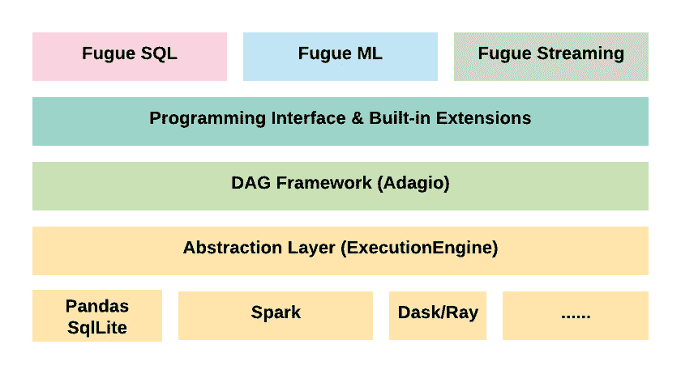

# 用赋格创造熊猫和火花兼容功能

> 原文：<https://towardsdatascience.com/creating-pandas-and-spark-compatible-functions-with-fugue-8617c0b3d3a8?source=collection_archive---------32----------------------->

## 用一行代码在熊猫和 Spark 之间无缝切换

# 动机

数据科学团队通常会投资一套通用的工具，并构建一个共享的 Python 库。这个库包括清理和转换数据的常用方法，以及用于机器学习的实用函数(如自定义指标或特定的训练测试拆分)。

拥有这样一个库为更快地启动新项目提供了基础。理想情况下，随着团队承担更多的项目，共享库会继续成长和成熟。

虽然拥有一个共享库在概念上很棒，但是在不同的设置中使用相同的代码会有一些问题。有不同的用例需要不同的工具。有些数据集大约有数万行，有些数据集可能有数亿行。大数据通常要求 Spark 利用分布式计算。然而，如果一个项目足够小，可以在 Pandas 上完成，那么就没有必要使用集群，也没有必要增加使用 Spark 的开销。正如所料，使用两个框架会导致维护共享库时出现问题。在一个框架中开发的功能不适合另一个框架。

# 熊猫和星火的区别

为了展示不同框架在语法上的不同，下面是一个用例示例。与任何数据科学工作一样，存在数据缺失的情况，我们会尝试填补它。在下表中，我们对使用某人的**家庭状态**感兴趣。如果**家庭状态**不可用，我们得到**工作状态**。如果**工作状态**也不可用，我们将尝试使用**电话**号码区号来推断状态。

```
| id  | home_state | work _state | phone          |
|-----|------------|-------------|----------------|
| "A" | "IL"       | "IL"        | "217-123-4567" |
| "B" | None       | "WI"        | "312-123-4567" |
| "C" | "FL"       | "FL"        | "352-234-5678" |
| "D" | "CA"       | "CA"        | "415-345-6789" |
| "E" | None       | None        | "217-123-4567" |
| "F" | "IL"       | None        | "312-234-5678" |
```

以上问题的 Pandas 和 Spark 实现可以在下面的 Github Gist 中看到。对于一个相对简单的转换，Pandas 和 Spark 之间的代码看起来已经非常不同。除了语法之外，**更大的问题是我们有一个定制的业务逻辑不能在 Pandas 和 Spark 应用程序之间循环使用。**

随着时间的推移，随着项目规模的增加，以及涉及到更复杂的逻辑来转换数据，被锁定到一个框架中变得更加复杂。最终，代码基础逻辑变得与框架紧密耦合，切换框架的开销逐渐增加。

如何才能跨熊猫和 Spark 回收自定义逻辑？我们是否需要实现每个功能的两个版本(一个用于 Spark，一个用于 Pandas)？或者有没有办法把逻辑和计算分开？我们能否专注于定义逻辑，然后选择运行它的底层引擎(Spark 或 Pandas)？

逻辑和执行的解耦允许以与规模和框架无关的方式编写代码。即使数据现在可以由熊猫处理，1 年后它仍然足够小吗？两年后呢？与规模和框架无关的代码允许数据科学家根据数据量在执行引擎之间无缝切换。为 Spark 回收代码不需要重写。

# 火花和熊猫兼容代码与赋格


神游标志

这就是赋格出现的地方。Fugue 是一个开源框架，作为一个适应不同计算框架的抽象层。它统一了分布式计算的核心概念，并将逻辑从用于处理数据的框架(如 Spark、Pandas、Dask)中分离出来。神游适应用户，而不是用户适应神游。



赋格建筑

它还旨在使分布式计算民主化，并使不熟悉 Spark 的人更容易使用它。通过使用 Fugue，用户可以用原生 Python 编写代码，然后轻松地通过逻辑将其移植到 Spark 或 Dask，而不必重写代码。

# 赋格例子

让我们重温一下上面的例子，用原生 Python 和赋格来求解。

赋格示例代码

代码示例中首先要注意的是，第 9–16 行定义的函数是用基本 Python 编写的，没有赋格依赖项。使用的所有数据类型都是原生 Python。函数是纯逻辑的，没有熊猫或者 Spark 的影响。

第二件事是第 9 行中的模式提示。模式在赋格中是强制的，它强制更明确和描述性的代码。如果用户不再神游，这个功能仍然可以被修改为用**应用**语句来处理熊猫或 Spark。模式提示只是一个注释，但仍然是有用的。

最后要注意的是第 18 行中定义的 FugueWorkflow 上下文管理器。默认的执行引擎是 Pandas，但是如果我们想要将整个工作流引入 Spark，我们可以通过一行代码的修改来实现。

```
with FugueWorkflow(SparkExecutionEngine) as dag:
```

现在，FugueWorkflow 上下文管理器中的所有内容都将在 Spark 中运行。

# 神游的好处

随着工作流复杂性的增加，神游的好处也随之增加。最明显的好处是，同样的逻辑将适用于熊猫和 Spark jobs。对于需求快速增长的团队来说，这给了我们灵活性和敏捷性来无缝地适应更大的数据量。即使数据科学团队可以处理熊猫当前的数据量，最终仍有可能需要 Spark。使用 Fugue，转换是毫不费力的，因为改变计算引擎只需要改变一行代码。

此外，Fugue 允许用户在更易管理的数据上构建原型，并在需要时可靠地扩展。这有可能提高开发人员的工作效率并降低集群成本。当准备好在完整数据集上测试代码时，可以交换执行引擎。Spark 作业每次运行的集群成本很容易达到数百美元。这节省了资金，因为集群不需要启动来测试代码。

最后，Fugue 允许用户为更小、更易测试的功能编写单元测试。逻辑是明确的，并且独立于框架。这增强了代码库的可维护性。

# 神游和考拉的区别

Databricks 有一个名为考拉的库，允许熊猫用户在 Spark 上使用相同的 DataFrame API。在某些情况下，更改 import 语句将允许用户从 Pandas 执行更改为 Spark 执行。

这里的一个问题是，不是所有的熊猫函数都在考拉中实现，这意味着一些熊猫编写的代码不会通过改变导入语句立即工作。

即使实现了这些功能，Pandas 和 Spark 之间也存在难以调和的差异。例如，Pandas 允许混合类型的列(包含整数和字符串)，而 Spark DataFrames 不允许。使用混合类型的考拉会导致错误。赋格遵循火花，和阿帕奇箭头，在强有力的和明确的打字。

# 结论

我们已经看到了如何使用 Fugue 来创建 Python 函数，能够在 Pandas 和 Spark 之间使用而不做任何更改。这消除了维护每个函数的两个版本的需要，并且还将逻辑与底层执行引擎解耦。

用神游写一个代码库，让用户一行代码变化就能在熊猫和 Spark 之间变化。

# 联系我们

如果你对使用赋格感兴趣，想给我们反馈，或者有任何问题，我们很乐意在 Slack 上聊天！我们还将为对在数据工作流中应用 Fugue 感兴趣的数据团队举办更详细的研讨会。

[文档](https://fugue.readthedocs.io/en/latest/)
[Git 回购](https://github.com/fugue-project/fugue)
[社区懈怠](https://join.slack.com/t/fugue-project/shared_invite/zt-jl0pcahu-KdlSOgi~fP50TZWmNxdWYQ)