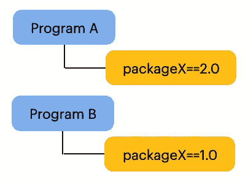
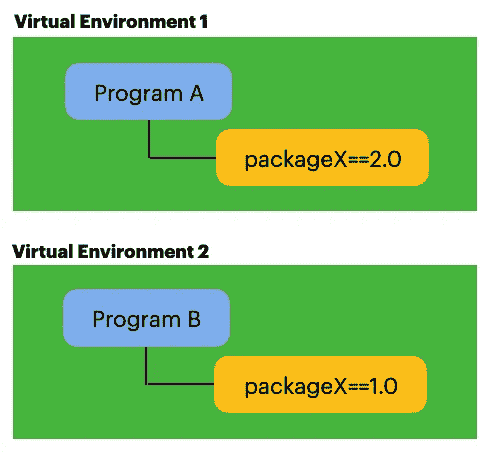
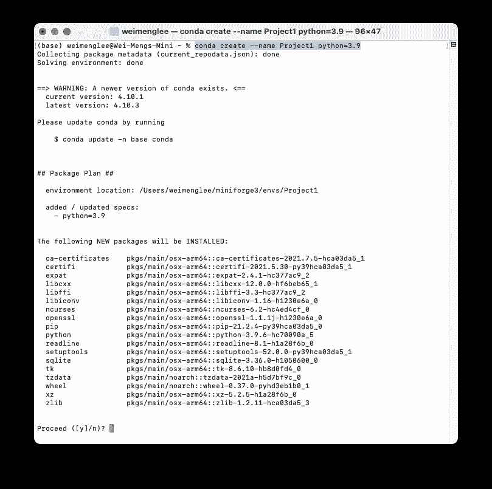
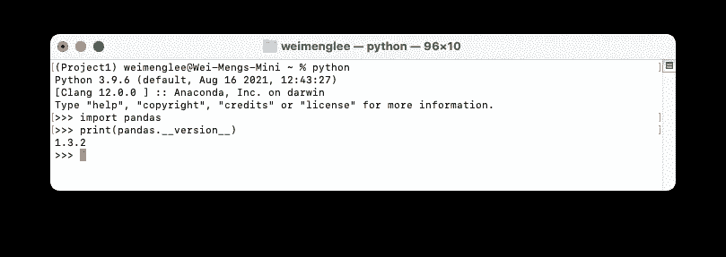
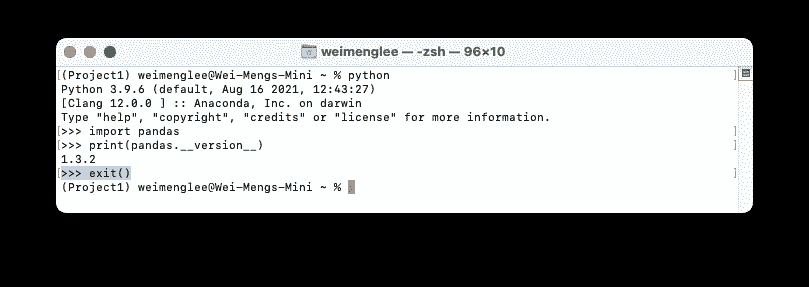

# 创建 Python 虚拟环境

> 原文：<https://towardsdatascience.com/creating-python-virtual-environments-f7bc4cbbd328?source=collection_archive---------10----------------------->

## 了解如何用 Python 创建虚拟环境，并使用 requirements.txt 安装依赖项


照片由[迈克尔·泽兹奇](https://unsplash.com/@lazycreekimages?utm_source=medium&utm_medium=referral)在 [Unsplash](https://unsplash.com?utm_source=medium&utm_medium=referral) 拍摄

在 Python 中，**虚拟环境**是运行 Python 程序的隔离环境。使用虚拟环境允许你的程序拥有自己的依赖项(不同版本的包)。例如，程序 A 使用特定版本的 packageX，而程序 B 使用旧版本的 packageX。这是一个直观的问题:



作者图片

如果你把两个程序放在同一个默认环境中，你会遇到 packageX 的问题——如果你试图安装一个特定版本的 packageX，它会覆盖另一个版本。

更好的解决方案是创建两个隔离的环境——又名 ***虚拟环境*** 。每个虚拟环境将托管每个程序所需的特定版本的 packageX，如下所示:



作者图片

在本文中，我将向您展示如何使用 **conda** 包管理器创建虚拟环境。此外，我还将向您展示如何获得已经安装在您的环境中的包的列表(通过`**pip**`命令),并使用`**requirements.txt**`文件在另一个虚拟环境中执行相同的安装。

> *C****onda****是一个运行在 Windows、Mac OS 和 Linux 上的开源包和环境管理系统。*

本文假设您的计算机上安装了 Anaconda([https://www.anaconda.com/products/individual-d](https://www.anaconda.com/products/individual-d))。

# 创建新的虚拟环境

要创建一个新的虚拟环境，使用带有以下选项的`**conda**`命令:

```
**conda create --name Project1 python=3.9**
```

上面的命令创建了一个名为 **Project1** 的虚拟环境，Python 版本设置为 3.9:



# 查看虚拟环境列表

创建虚拟环境后，您可以使用以下命令查看您计算机上的虚拟环境列表:

```
**conda info --envs**
```

您应该会看到如下所示的内容:

```
(base) weimenglee@Wei-Mengs-Mini ~ % **conda info --envs**
# conda environments:
#
base                *  /Users/weimenglee/miniforge3
**Project1               /Users/weimenglee/miniforge3/envs/Project1**
```

# 激活虚拟环境

创建了新的虚拟环境后，是时候激活它了:

```
(base) weimenglee@Wei-Mengs-Mini ~ % **conda activate Project1****(Project1)** weimenglee@Wei-Mengs-Mini ~ %
```

正如您在上面看到的，一旦 **Project1** 虚拟环境被激活，您将在命令提示符前面看到虚拟环境的名称 **(Project1)** :

```
**(Project1)** weimenglee@Wei-Mengs-Mini ~ %
```

# 查看当前环境中安装的 Python 包列表

要了解您的虚拟环境中当前安装了哪些包，请使用`**pip freeze**`命令:

```
(Project1) weimenglee@Wei-Mengs-Mini ~ % **pip freeze**
```

该命令将返回当前环境中安装的软件包列表，以及它们的版本号。以下是我的**项目 1** 虚拟环境的输出示例:

```
certifi==2021.5.30
```

有时,`**pip freeze**`命令会包含从直接 URL 引用安装的发行版的直接引用，如下所示:

```
certifi==2021.5.30**chardet @ file:///Users/runner/miniforge3/conda-bld/chardet_1610093454858/work**
```

为了防止这种情况发生，对`**pip freeze**`使用以下替代命令:

```
**pip list --format=freeze**
```

这将确保结果始终采用以下格式:

`*<package_name>==<version_number>*`

现在让我们尝试使用`**pip install**`命令在我们的**项目 1** 虚拟环境中安装一些额外的包:

```
(Project1) weimenglee@Wei-Mengs-Mini ~ % **pip install pandas numpy matplotlib**
```

以上命令安装以下软件包:

*   熊猫
*   NumPy
*   Matplotlib

您现在可以使用`**pip freeze**`命令(或`**pip list —-format=freeze**`)来查看您拥有的软件包列表，包括您刚刚安装的软件包。

```
(Project1) weimenglee@Wei-Mengs-Mini ~ % **pip freeze**
certifi==2021.5.30
cycler==0.10.0
kiwisolver==1.3.2
matplotlib==3.4.3
numpy==1.21.2
pandas==1.3.2
Pillow==8.3.2
pyparsing==2.4.7
python-dateutil==2.8.2
pytz==2021.1
six==1.16.0
```

此外，您还将把列表保存到一个名为 **requirements.txt** 的文件中:

```
(Project1) weimenglee@Wei-Mengs-Mini ~ % **pip freeze > requirements.txt**
```

`**requirements.txt**`文件包含当前环境中安装的软件包列表。稍后，您将利用它在另一个虚拟环境中重新安装所有软件包。

> K **ey takeaway** —无论您在这个虚拟环境中安装了什么包，它都将留在这个虚拟环境中。它不会与您在另一个虚拟环境中安装的其他类似软件包冲突。

# 测试新环境

您现在可以测试环境是否正常工作。键入以下命令启动 Python 解释器:

```
(Project1) weimenglee@Wei-Mengs-Mini ~ % **python**
```

然后，导入**熊猫**包并打印其版本:

```
>>> **import pandas**
>>> **print(pandas.__version__)**
```



如果您能够看到上面的输出，那么软件包安装正确。

键入`**exit()**`退出 Python 解释器。



# 停用环境

当您完成环境后，您可以使用`**conda deactivate**` 命令将您带回基本环境:

```
(Project1) weimenglee@Wei-Mengs-Mini ~ % **conda deactivate**
```

# 移除环境

完成项目后，如果不再需要该环境，可以使用以下命令删除该环境:

```
(base) weimenglee@Wei-Mengs-Mini ~ % **conda env remove --name Project1***Remove all packages in environment /Users/weimenglee/miniforge3/envs/Project1:*
```

# 使用 requirements.txt 文件创建另一个虚拟环境并安装软件包

现在让我们创建另一个虚拟环境，称之为**项目 2** :

```
(base) weimenglee@Wei-Mengs-Mini ~ % **conda create --name Project2 python=3.9**
```

创建后，激活新的虚拟环境:

```
(base) weimenglee@Wei-Mengs-Mini ~ % **conda activate Project2
(Project2)** weimenglee@Wei-Mengs-Mini ~ %
```

让我们试试 Python 解释器，看看 Pandas 模块是否可用:

```
(Project2) weimenglee@Wei-Mengs-Mini ~ % python
Python 3.9.6 (default, Aug 16 2021, 12:43:27)
[Clang 12.0.0 ] :: Anaconda, Inc. on darwin
Type "help", "copyright", "credits" or "license" for more information.
>>> **import pandas**
Traceback (most recent call last):
File "<stdin>", line 1, in <module>
*ModuleNotFoundError: No module named 'pandas'*
>>> **exit()**
```

正如预测的那样，Pandas 是默认不安装的。如果您想要安装已经安装在**项目 1** 虚拟环境中的软件包，现在您可以使用您之前创建的`**requirements.txt**` 文件:

```
(Project2) weimenglee@Wei-Mengs-Mini ~ % **pip install -r requirements.txt** Requirement already satisfied: certifi==2021.5.30 in ./miniforge3/envs/Project2/lib/python3.9/site-packages (from -r requirements.txt (line 1)) (2021.5.30)
Collecting cycler==0.10.0...Collecting matplotlib==3.4.3
Using cached matplotlib-3.4.3-cp39-cp39-macosx_11_0_arm64.whl
Collecting numpy==1.21.2
Using cached numpy-1.21.2-cp39-cp39-macosx_11_0_arm64.whl (12.4 MB)
Collecting pandas==1.3.2
Using cached pandas-1.3.2-cp39-cp39-macosx_11_0_arm64.whl...Installing collected packages: six, pytz, python-dateutil, pyparsing, Pillow, numpy, kiwisolver, cycler, pandas, matplotlib
Successfully installed Pillow-8.3.2 cycler-0.10.0 kiwisolver-1.3.2 matplotlib-3.4.3 numpy-1.21.2 pandas-1.3.2 pyparsing-2.4.7 python-dateutil-2.8.2 pytz-2021.1 six-1.16.0
```

在`**requirements.txt**`文件中指定的所有包现在将被安装在**项目 2** 虚拟环境中。

# 结论

使用`**requirements.txt**`文件是指定 Python 程序依赖关系的好方法。在这个文件中，您放置了您的应用程序需要的所有包名(以及它们的特定版本号),这样无论谁运行您的程序，都只需要使用`**requirements.txt**`文件执行一个`**pip install**`。