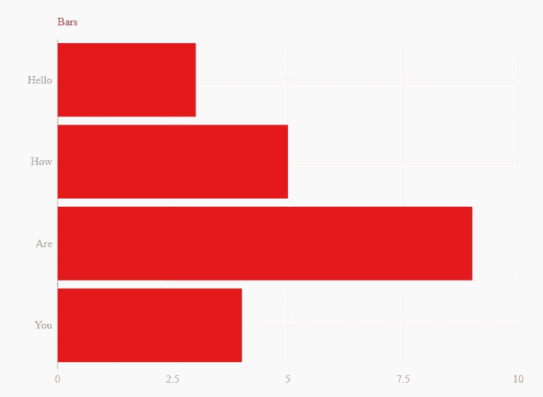
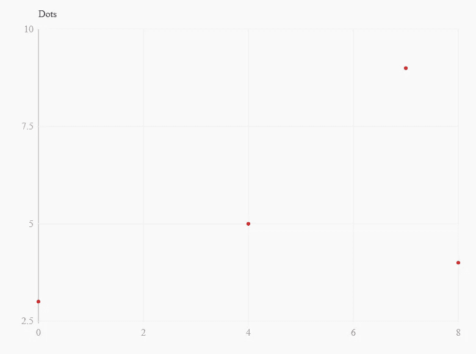
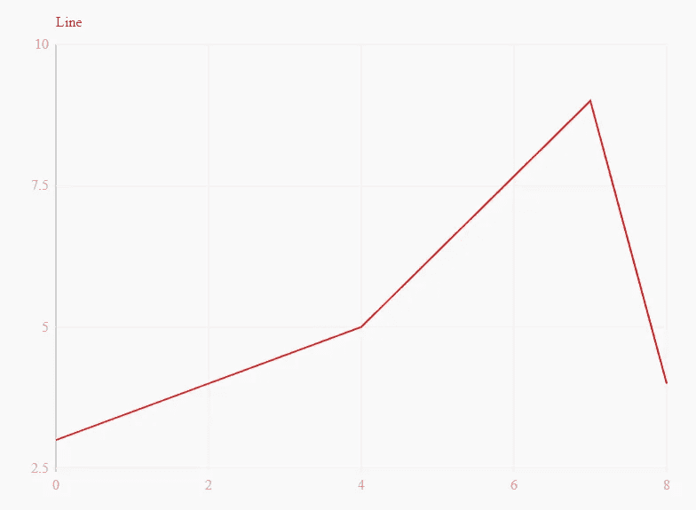
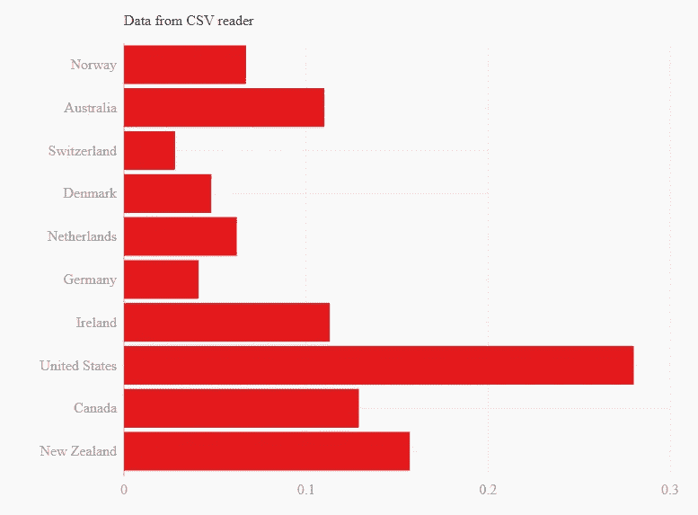

# 创建独立于比例的 SVG 图表

> 原文：<https://towardsdatascience.com/creating-scale-independent-svg-charts-98dfd4a78ba0?source=collection_archive---------36----------------------->

## 使用皮革优化探索性制图


艾萨克·史密斯在 [Unsplash](https://unsplash.com?utm_source=medium&utm_medium=referral) 上拍摄的照片

**数据可视化**在数据分析中起着重要的作用，因为人眼一看到一些图表或图形，就会试图在图形中找到模式。

数据可视化是使用不同的图/图形/图表直观地表示数据，以找出模式、异常值以及数据集不同属性之间的关系。它是数据的图形表示。

Leather 是一个开源 python 库，用于创建与比例无关的 SVG 图表。它可以绘制你传递给它的任何数据。它完全是用 python 开发的，没有其他依赖。

在这篇文章中，我们将探讨如何使用皮革创建不同的图表和情节。

让我们开始吧…

# **安装所需的库**

我们将开始安装皮革像任何其他图书馆使用 pip 安装。

```
pip install leather
```

# **导入所需的库**

在这一步中，我们将导入使用皮革创建图表和绘图所需的库。

```
import leather
```

# **使用皮革创建图表**

接下来，我们将开始创建条形图和曲线图:

1.  **条形图**

```
data = [
    (3, 'Hello'),
    (5, 'How'),
    (9, 'Are'),
    (4, 'You')
]chart = leather.Chart('Bars')
chart.add_bars(data)
chart.to_svg('bars.svg')
```



来源:作者

**2。点阵图**

```
data = [
    (0, 3),
    (4, 5),
    (7, 9),
    (8, 4)
]chart = leather.Chart('Dots')
chart.add_dots(data)
chart.to_svg('dots.svg')
```



来源:作者

**3。折线图**

```
data = [
    (0, 3),
    (4, 5),
    (7, 9),
    (8, 4)
]chart = leather.Chart('Line')
chart.add_line(data)
chart.to_svg('lines.svg')
```



来源:作者

**4。使用 CSV 阅读器绘图**

```
import csvimport leatherwith open('gii.csv') as f:
    reader = csv.reader(f)
    next(reader)
    data = list(reader)[:10]for row in data:
        row[1] = float(row[1]) if row[1] is not None else Nonechart = leather.Chart('Data from CSV reader')
chart.add_bars(data, x=1, y=0)
chart.to_svg('csv_reader.svg')
```



来源:作者

这就是你如何使用皮革创建不同类型的图表和情节。

继续尝试不同的数据集，并让我知道您在回复部分的评论。

本文是与[皮尤什·英格尔](https://medium.com/u/40808d551f5a?source=post_page-----98dfd4a78ba0--------------------------------)合作完成的

# 在你走之前

***感谢*** *的阅读！如果你想与我取得联系，请随时通过 hmix13@gmail.com 联系我或我的* [***LinkedIn 个人资料***](http://www.linkedin.com/in/himanshusharmads) *。可以查看我的*[***Github***](https://github.com/hmix13)**简介针对不同的数据科学项目和包教程。还有，随意探索* [***我的简介***](https://medium.com/@hmix13) *，阅读我写过的与数据科学相关的不同文章。**