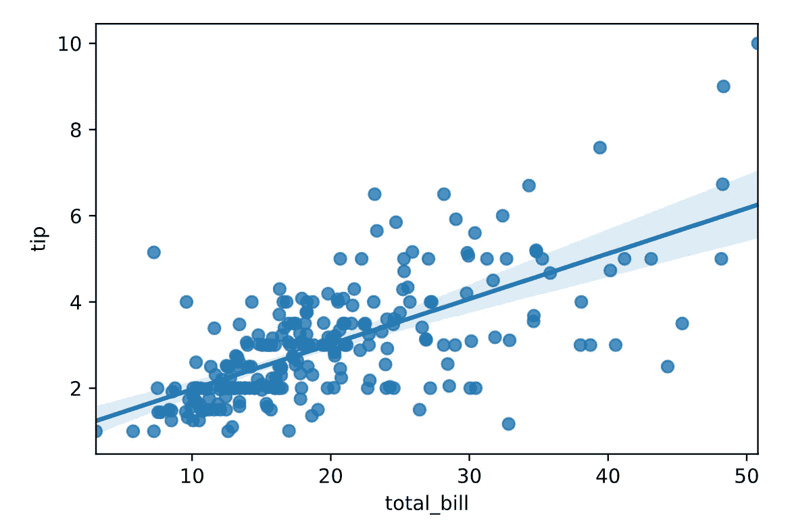
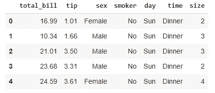

# 创建可共享的数据可视化报告

> 原文：<https://towardsdatascience.com/creating-shareable-data-visualization-reports-75129aa9cbd6?source=collection_archive---------38----------------------->

## 使用 Datapane 进行数据分析和可视化



来源:作者

可以使用不同的 Python 库创建用于数据分析的数据可视化。我们只需要创建不同的可视化，如条形图，直方图等。有各种各样的用于数据可视化的 python 库，可以创建 N 种可视化，但是这些可视化的问题是，您不能以报告格式共享它们，也不能将它们嵌入报告中。

创建数据可视化报告有助于进行演示，或者与客户或老板分享。当您创建一个包含可视化和降价的报表时，它会产生良好的影响。此外，您还可以共享这些报告。

Datapane 是一个开源的 python 库，用于创建数据可视化和分析报告，我们可以将所有的可视化和分析汇总到一个报告中，该报告可以在 Datapane 服务器上发布，并可以轻松共享。

让我们开始吧…

# 创建数据面板帐户

在创建您的报告之前，您首先需要在 Datapane 上创建一个帐户，以便我们可以在该帐户上发布我们的报告，并与任何人共享链接。要创建帐户，您可以通过下面的链接。一旦您创建了一个帐户，您就可以看到一个数据面板访问密钥，我们将使用它从我们的 Jupyter 笔记本上发布我们的报告。

<https://datapane.com/accounts/signup/>  

# 安装所需的库

我们将从使用 pip 安装 Datapane 开始。下面给出的命令可以做到这一点。

```
pip install datapane
```

安装后，我们还将加载用于向我们的帐户发布报告的登录令牌(访问密钥)。

```
!datapane login --token=<YOUR TOKEN>
```

# 导入所需的库

在这一步中，我们将导入所需的库来创建可视化。

```
import datapane as dp
import pandas as pd
import seaborn as sns
```

# 导入数据集

我们将从导入所需的数据集开始。对于本文，我们使用 seaborn 库中已经定义的名为 Tips 的数据集。

```
df = sns.load_dataset('tips')
df.head()
```



数据集(来源:作者)

# 创建可视化

现在，我们将创建一些可视化效果，并添加到我们的报告中。

```
plot1 = sns.regplot(x="total_bill", y="tip", data=df)
plot2 = df.hist()
plot 3 = df.boxplot(column=['total_bill'])
```

# 创建并发布报告

这是最后一步，我们将创建并发布报告。

```
report = dp.Report(
    dp.Text("Visualization Report"),
    dp.Plot(plot1),
    dp.Plot(plo2),
    dp.Plot(plot3)
)report.publish(name='My First Report', open=True)
```

发布报告后，您可以在提供给您的链接上看到它，并且可以通过任何人的邮件 id 与他们分享。

继续尝试不同的数据集，为数据分析创建漂亮的可视化报告。如果您发现任何困难，请在回复部分告诉我。

本文是与 [Piyush Ingale](https://medium.com/u/40808d551f5a?source=post_page-----75129aa9cbd6--------------------------------) 合作完成的。

# 在你走之前

***感谢*** *的阅读！如果你想与我取得联系，请随时通过 hmix13@gmail.com 联系我或我的* [***LinkedIn 个人资料***](http://www.linkedin.com/in/himanshusharmads) *。可以查看我的*[***Github***](https://github.com/hmix13)**简介针对不同的数据科学项目和包教程。还有，随意探索* [***我的简介***](https://medium.com/@hmix13) *，阅读我写过的与数据科学相关的不同文章。**