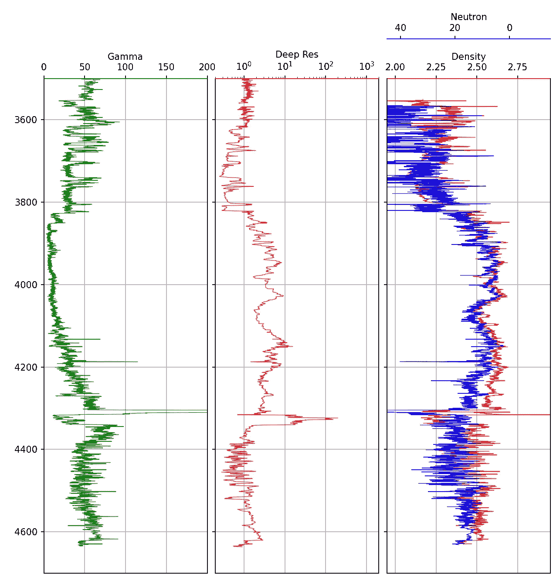
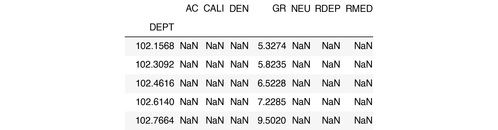
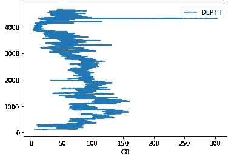
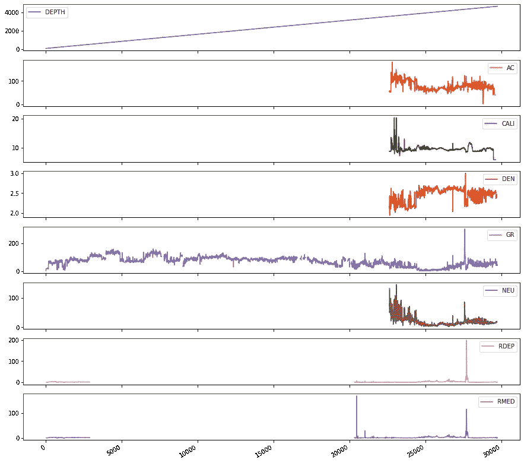
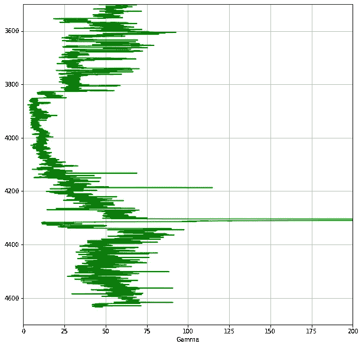
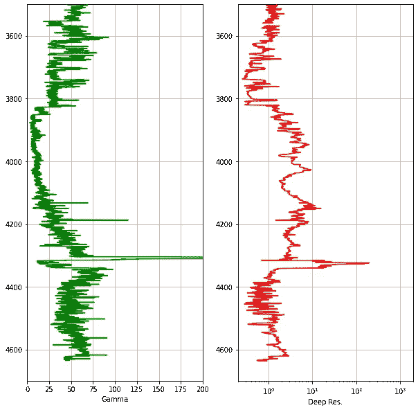
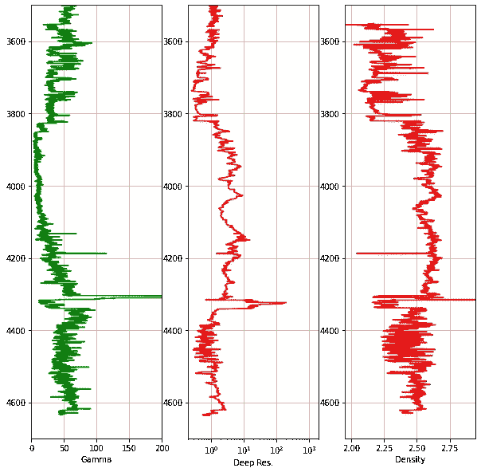
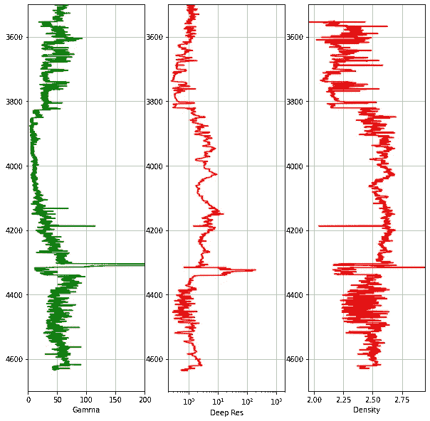
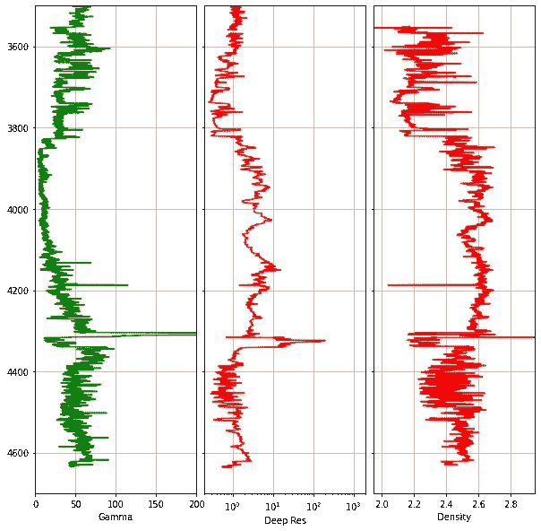
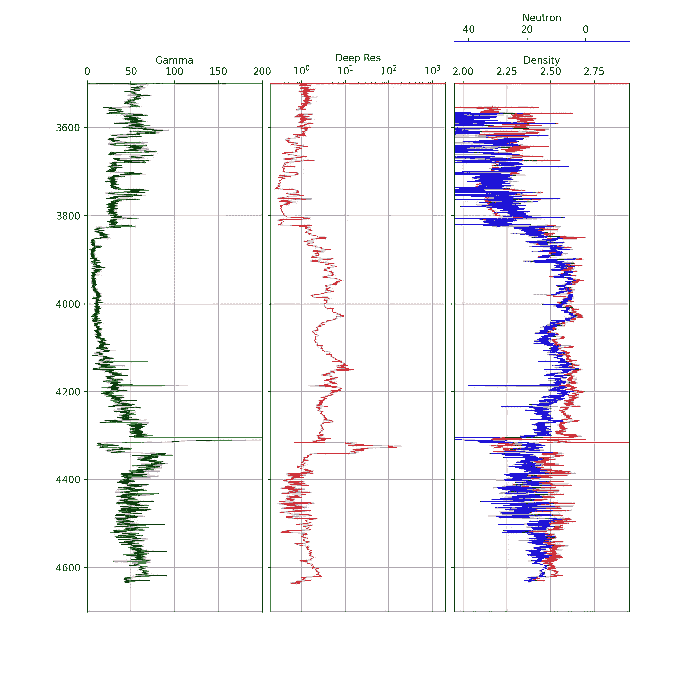

# 使用 Matplotlib 中的线图创建测井数据的简单测井图

> 原文：<https://towardsdatascience.com/creating-simple-well-log-plots-using-the-matplotlib-library-in-python-670325462f9e?source=collection_archive---------20----------------------->

## 使用 Python 中的 matplotlib 库可视化测井数据与深度



使用 matplotlib Python 库创建的测井曲线。图片作者。

# 介绍

测井曲线是地球科学和岩石物理学中常用的可视化工具。它们使得沿井眼长度(深度)采集的数据(例如，伽马射线、中子孔隙度、体积密度等)易于可视化。在这些图上，我们在 x 轴上显示测井测量值，在 y 轴上显示测量深度或真实垂直深度。

在这篇短文中，我们将看到如何从一口 [Volve 井创建一个简单的测井曲线可视化，该井是 Equinor 在 2018 年](https://www.equinor.com/en/what-we-do/norwegian-continental-shelf-platforms/volve.html)作为更大数据集的一部分发布的。

我之前已经在以下文章中介绍了制作这些情节的不同方面:

*   使用 Python 在测井图上显示岩性数据
*   [用 Python 显示随钻测井(LWD)图像测井](/displaying-logging-while-drilling-lwd-image-logs-in-python-4babb6e577ba)
*   [使用绘图填充增强测井曲线的可视化](/enhancing-visualization-of-well-logs-with-plot-fills-72d9dcd10c1b)

对于本教程，笔记本可以在[这里](https://github.com/andymcdgeo/Andys_YouTube_Notebooks)找到，下面的视频也是附带的。

# 导入库和加载 LAS 数据

任何 python 项目或笔记本的第一步都是导入所需的库。在这种情况下，我们将使用`lasio`来加载我们的 las 文件，`pandas`来存储我们的测井记录数据，而`matplotlib`用于可视化我们的数据。

```
import pandas as pd
import lasio
import matplotlib.pyplot as plt
```

为了读取数据，我们将使用 lasio 库，这是我们在之前的笔记本和[视频](https://youtu.be/8U4gxMJybJs)中探索过的。

```
las = lasio.read("Data/15-9-19_SR_COMP.LAS")
```

一旦文件被加载，我们可以通过使用`df.head()`来检查文件的内容。这将返回数据帧的前五行。

```
df = las.df()
df.head()
```



Equinor Volve 数据集 15/9–19-SR 井的前五行

我们可以从返回的结果中看到，我们有几列数据，每列代表测井工具沿井眼移动时进行的测量。

这些列表示以下内容:

*   AC 代表声波压缩慢度
*   井径仪校准
*   容积密度的 DEN
*   伽马射线的 GR
*   中子孔隙度的 NEU
*   RDEP 深电阻
*   中等电阻率 RMED

为了更容易使用我们的数据帧，我们可以将设置为深度的数据帧索引转换为数据帧中的列。我们可以通过像这样重置索引来实现这一点。

```
df.reset_index(inplace=True)
```

请注意，`inplace=True`允许我们对原始 dataframe 对象进行更改。

我们可以再次调用`df.head()`来确保我们的新列已经创建。

```
df.head()
```


Equinor Volve 数据集 15/9–19-SR 井的前五行

我们还需要对 DEPT 列稍加重命名，并将其改为 DEPTH

```
df.rename(columns={'DEPT':'DEPTH'}, inplace=True)df.head()
```


部门列重命名后，Equinor Volve 数据集 15/9–19-SR 井的前五行

现在我们的数据格式正确，列也标记正确，我们可以继续生成对数图了。

# 用 Matplotlib 创建测井曲线

## 创建简单的线形图

通过调用`df.plot()`并传递我们的两个列，我们可以很容易地创建一个简单的情节

```
df.plot('GR', 'DEPTH')
```



伽马射线与深度的简单线图。

当我们运行这个单元格时，我们得到一个非常简单的图，很难阅读，也是颠倒的。

## 快速支线剧情

如果我们想查看数据框中的所有列，我们可以生成一个子图网格。

这是通过使用与之前相同的线(`df.plot()`)来完成的，我们没有传入曲线名称，而是传入了`subplots=True`。我们还可以指定一个图形大小(`figsize()`)，它控制图形将显示多大。

```
df.plot(subplots=True, figsize=(15, 15))
```



使用 df.plot()的测井数据的多个子图

现在我们可以看到一个网格图，数据框中的每一列都有一个网格图。这是检查我们哪里有数据以及哪里可能有差距的有用方法。

然而，我们对这个情节没有多少控制权。在接下来的章节中，我们将了解如何通过多次测量建立测井曲线。

## 在 Matplotlib 中使用子情节

在使用 matplotlib 中有许多方法可以生成支线剧情。对于这个特别的教程，我们将使用`subplot2grid`。

```
fig = plt.subplots(figsize=(10,10))

#Set up the plot axis
ax1 = plt.subplot2grid((1,1), (0,0), rowspan=1, colspan = 1) 

ax1.plot("GR", "DEPTH", data = df, color = "green") # Call the data from the df dataframe
ax1.set_xlabel("Gamma") # Assign a track title
ax1.set_xlim(0, 200) # Change the limits for the curve being plotted
ax1.set_ylim(4700, 3500) # Set the depth range
ax1.grid() # Display the grid
```

在上面的代码中，我们首先要定义一个图形(fig)并将其赋给`plt.subplots`。在支线剧情参数中，我们可以传入图形大小，我们将它设置为 10 乘 10。

接下来，我们需要在我们的图形对象上创建一个轴。我们可以通过赋值`ax1`等于`plt.subplot2grid()`来做到这一点..我们首先传递子情节网格的形状，在本例中，我们将 1 对 1 设置。

接下来，我们使用索引位置来指定子情节的位置。由于我们只有 1 个子情节，我们将把位置设置为零，零(0，0)。Rowspan 和 colspan 都设置为 1，这意味着它们只有 1 列宽 1 行高。

然后，我们需要告诉 matplotlib 我们想要绘制的内容。在这种情况下，我们将使用 ax1.plot，并传入伽马射线和深度列。

使用 ax 符号，我们可以通过设置 x 和 y 限制以及显示网格来进一步定制绘图。

当我们运行这段代码时，我们生成了下面的图。



太好了！这里我们有了一个更好看的图，现在我们可以开始添加新的轨迹/支线剧情到我们的整体日志图中。

## 添加电阻率测井

为了给我们的图形添加一个新的轨迹/子图，我们可以重复上面所做的，添加一个新的轴，`ax2`。

然后我们增加布局参数`plt.subplot2grid()`的第二个数字，所以现在是 1 行，2 列。

对于`ax2`，我们需要把它放在第二个子情节中，这是通过把位置参数从(0，0)改为(0，1)来完成的。

我们最后得到:

```
ax1 = plt.subplot2grid((1,2), (0,0), rowspan=1, colspan = 1) 
ax2 = plt.subplot2grid((1,2), (0,1), rowspan=1, colspan = 1)
```

此外，由于电阻率通常是对数标度，我们需要添加行:`ax2.semilogx()`。

```
fig = plt.subplots(figsize=(10,10))

#Set up the plot axes
ax1 = plt.subplot2grid((1,2), (0,0), rowspan=1, colspan = 1) 
ax2 = plt.subplot2grid((1,2), (0,1), rowspan=1, colspan = 1)

ax1.plot("GR", "DEPTH", data = df, color = "green") # Call the data from the well dataframe
ax1.set_xlabel("Gamma") # Assign a track title
ax1.set_xlim(0, 200) # Change the limits for the curve being plotted
ax1.set_ylim(4700, 3500) # Set the depth range
ax1.grid() # Display the grid

ax2.plot("RDEP", "DEPTH", data = df, color = "red")
ax2.set_xlabel("Deep Res.")
ax2.set_xlim(0.2, 2000)
ax2.semilogx()
ax2.set_ylim(4700, 3500)
ax2.grid()
```



使用 matplotlib 创建的伽马射线和电阻率测井图。图片由作者提供。

## 添加密度日志

要添加第三个轨道/子情节，我们可以通过添加密度作为新的子情节来重复上面的操作。

```
fig = plt.subplots(figsize=(10,10))

#Set up the plot axes
ax1 = plt.subplot2grid((1,3), (0,0), rowspan=1, colspan = 1) 
ax2 = plt.subplot2grid((1,3), (0,1), rowspan=1, colspan = 1)
ax3 = plt.subplot2grid((1,3), (0,2), rowspan=1, colspan = 1)

ax1.plot("GR", "DEPTH", data = df, color = "green") # Call the data from the well dataframe
ax1.set_xlabel("Gamma") # Assign a track title
ax1.set_xlim(0, 200) # Change the limits for the curve being plotted
ax1.set_ylim(4700, 3500) # Set the depth range
ax1.grid() # Display the grid

ax2.plot("RDEP", "DEPTH", data = df, color = "red")
ax2.set_xlabel("Deep Res.")
ax2.set_xlim(0.2, 2000)
ax2.semilogx()
ax2.set_ylim(4700, 3500)
ax2.grid()

ax3.plot("DEN", "DEPTH", data = df, color = "red")
ax3.set_xlabel("Density")
ax3.set_xlim(1.95, 2.95)
ax3.set_ylim(4700, 3500)
ax3.grid()
```



使用 matplotlib 创建的伽马射线、电阻率和体积密度测井图。图片由作者提供。

## 整理常见元素

我们可以从前面的代码片段中看到，我们有许多元素在每个轴调用中都重复出现，比如`ax.set_ylim(4700, 3500)`。我们可以把它们分开，这样我们只需要调用这些函数一次。这节省了我们需要编写的行数，并使代码更具可读性。

为了实现这一点，我们添加了一个新的 for 循环，它将遍历 fig.axes 中的轴。

```
for i, ax in enumerate(fig.axes):
    ax.set_ylim(4700, 3500) # Set the depth range
    ax.grid()
    ax.set_xlabel(curve_names[i])
```

在分离出公共元素后，我们的最终代码如下所示:

```
fig, axes = plt.subplots(figsize=(10,10))

curve_names = ['Gamma', 'Deep Res', 'Density']

#Set up the plot axes
ax1 = plt.subplot2grid((1,3), (0,0), rowspan=1, colspan = 1) 
ax2 = plt.subplot2grid((1,3), (0,1), rowspan=1, colspan = 1)
ax3 = plt.subplot2grid((1,3), (0,2), rowspan=1, colspan = 1)

ax1.plot("GR", "DEPTH", data = df, color = "green")
ax1.set_xlim(0, 200) 

ax2.plot("RDEP", "DEPTH", data = df, color = "red")
ax2.set_xlim(0.2, 2000)
ax2.semilogx()

ax3.plot("DEN", "DEPTH", data = df, color = "red")
ax3.set_xlim(1.95, 2.95)

for i, ax in enumerate(fig.axes):
    ax.set_ylim(4700, 3500) # Set the depth range
    ax.grid()
    ax.set_xlabel(curve_names[i])
```



使用 matplotlib 创建的伽马射线、电阻率和体积密度测井图。图片由作者提供。

## 减少支线剧情之间的间隙

为了更好地整理剧情，我们可以移除每个子情节/轨道之间的深度标签，并减少它们之间的空间。这是通过仅在 ax2 和 ax3 上循环，以及通过调整图之间的填充宽度来实现的。

```
#Hide tick labels on the y-axis 
for ax in [ax2, ax3]:
    plt.setp(ax.get_yticklabels(), visible = False)

#Reduce the space between each subplot
fig.subplots_adjust(wspace = 0.05)
```

然后我们得出以下结论:

```
fig, axes = plt.subplots(figsize=(10,10))

curve_names = ['Gamma', 'Deep Res', 'Density']

#Set up the plot axes
ax1 = plt.subplot2grid((1,3), (0,0), rowspan=1, colspan = 1) 
ax2 = plt.subplot2grid((1,3), (0,1), rowspan=1, colspan = 1)
ax3 = plt.subplot2grid((1,3), (0,2), rowspan=1, colspan = 1)

#Set up the individual log tracks / subplots
ax1.plot("GR", "DEPTH", data = df, color = "green")
ax1.set_xlim(0, 200) 

ax2.plot("RDEP", "DEPTH", data = df, color = "red")
ax2.set_xlim(0.2, 2000)
ax2.semilogx()

ax3.plot("DEN", "DEPTH", data = df, color = "red")
ax3.set_xlim(1.95, 2.95)

#Set up the common elements between the subplots
for i, ax in enumerate(fig.axes):
    ax.set_ylim(4700, 3500) # Set the depth range
    ax.grid()
    ax.set_xlabel(curve_names[i])

#Hide tick labels on the y-axis 
for ax in [ax2, ax3]:
    plt.setp(ax.get_yticklabels(), visible = False)

#Reduce the space between each subplot
fig.subplots_adjust(wspace = 0.05)
```



移除 y 标签并减少图之间的空白后，使用 matplotlib 创建伽马射线、电阻率和体积密度测井图。图片由作者提供。

## 为中子孔隙度的子图添加次轴

标准做法是在同一子图/轨迹上绘制体积密度和中子孔隙度。这两条曲线的相互作用使我们能够识别岩性变化和碳氢化合物的存在。

由于两次测量的单位和尺度不同(堆密度为 1.95 至 2.95 g/cc，中子孔隙度为-15 至 60)，我们需要使用 twiny 函数在顶部添加另一个子图。这允许我们在图之间使用相同的 y 轴，但是 x 轴可以变化。

使用`ax.xaxis.set_ticks_position('top')`和`ax.xaxis.set_label_position('top').`将所有标签移动到图的顶部

然后，我们需要修改主 for 循环，以检查何时到达 ax4(当 i = 3 时，因为 Python 从 0 开始索引)，然后调整脊椎，使其位于密度标签上方。

```
fig, axes = plt.subplots(figsize=(10,10))

curve_names = ['Gamma', 'Deep Res', 'Density', 'Neutron']

#Set up the plot axes
ax1 = plt.subplot2grid((1,3), (0,0), rowspan=1, colspan = 1) 
ax2 = plt.subplot2grid((1,3), (0,1), rowspan=1, colspan = 1)
ax3 = plt.subplot2grid((1,3), (0,2), rowspan=1, colspan = 1)
ax4 = ax3.twiny()

#Set up the individual log tracks / subplots
ax1.plot("GR", "DEPTH", data = df, color = "green", lw = 0.5)
ax1.set_xlim(0, 200) 

ax2.plot("RDEP", "DEPTH", data = df, color = "red", lw = 0.5)
ax2.set_xlim(0.2, 2000)
ax2.semilogx()

ax3.plot("DEN", "DEPTH", data = df, color = "red", lw = 0.5)
ax3.set_xlim(1.95, 2.95)

ax4.plot("NEU", "DEPTH", data = df, color = "blue", lw = 0.5)
ax4.set_xlim(45, -15)

#Set up the common elements between the subplots
for i, ax in enumerate(fig.axes):
    ax.set_ylim(4700, 3500) # Set the depth range

    ax.xaxis.set_ticks_position("top")
    ax.xaxis.set_label_position("top")
    ax.set_xlabel(curve_names[i])

    if i == 3:
        ax.spines["top"].set_position(("axes", 1.08))
    else:
        ax.grid()

#Hide tick labels on the y-axis 
for ax in [ax2, ax3]:
    plt.setp(ax.get_yticklabels(), visible = False)

#Reduce the space between each subplot
fig.subplots_adjust(wspace = 0.05)
```



最终测井曲线显示了轨迹 1 中的伽马射线、轨迹 2 中的电阻率(对数标度)和轨迹 3 中的密度/neturon(每种标度都不同)。图片作者。

# 摘要

在这个简短的教程中，我们已经讲述了如何使用 matplotlib 显示测井曲线，如何添加多个轨迹/子曲线，以及如何绘制两条曲线。Matplotlib 提供了一种从头构建简单日志图的好方法，是一个值得学习的好库。

*感谢阅读！*

*如果你觉得这篇文章有用，请随时查看我的其他文章，这些文章从不同的角度研究了 Python 和测井数据。你也可以在* [*GitHub*](https://github.com/andymcdgeo) *找到我在这篇文章和其他文章中使用的代码。*

*如果你想联系我，你可以在*[*LinkedIn*](https://www.linkedin.com/in/andymcdonaldgeo/)*或者我的* [*网站*](http://andymcdonald.scot/) *找到我。*

有兴趣了解更多关于 python 和测井数据或岩石物理学的知识吗？跟我上 [*中*](https://medium.com/@andymcdonaldgeo) *。*