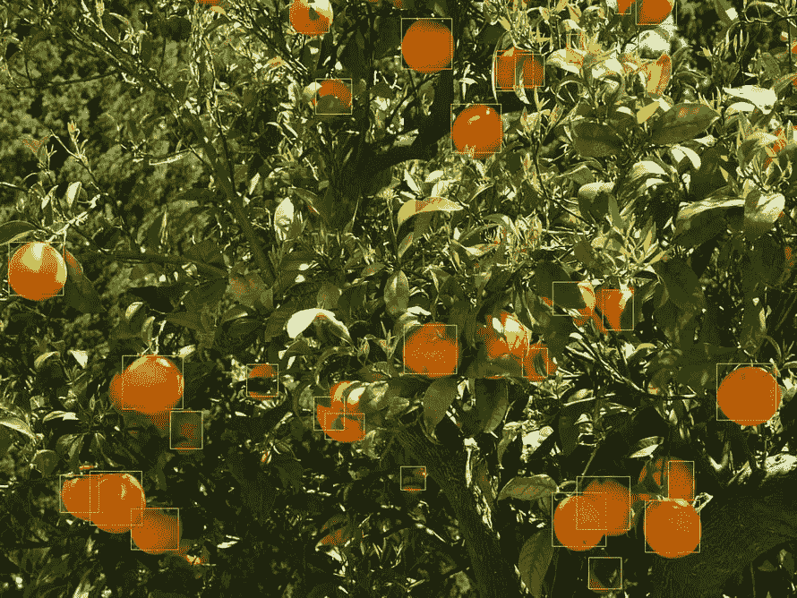

# 为机器学习创建合成数据

> 原文：<https://towardsdatascience.com/creating-synthetic-data-for-machine-learning-dab5728f6411?source=collection_archive---------14----------------------->


## 本教程旨在探索如何创建合成数据来训练对象检测模型

训练本身基于 Jacob Solawetz 关于用 YOLOv5 训练自定义对象的教程

所以我将使用 [Ultralytics](https://www.ultralytics.com/) 的 [YOLOv5 库](https://github.com/ultralytics/yolov5)。

本教程将指导您完成创建合成数据所需的步骤，并展示如何使用 YOLOv5 对其进行训练，以便处理真实图像。

如果您想访问完整的脚本或下载数据集，您可以在这个 [Git 资源库](https://github.com/Amizorach/FruitSyntheticDataset)中找到所有内容。

例如，我将训练分类器来检测树上的橙子。

# 什么是合成数据，我们为什么需要它？

在一个完美的世界中，数据集将是丰富的，我们可以继续在真实图像上训练我们的模型，以便做出更好的预测。然而在现实中，ML 编码者的大部分时间将花费在收集数据和正确注释上。

像谷歌/脸书/亚马逊/苹果这样的大公司，甚至拥有资源的中型公司，都可以着手启动这样的项目。首先，因为他们有数据本身——在我们的例子中是图像。其次，因为他们有能力对数据进行注释，以创建无错误的数据集。但是，即使这些公司也不能确定数据是否被正确标注，所以正常的流程是对每张图片进行多次标注，然后寻找差异。

对于一个小公司或者像我这样试图从头开始构建一个 ML 项目的人来说，这是一个太大的任务。所以我发现自己在使用网上的一个数据集。有许多很好的数据集，在某些情况下，创建一个新的数据集真的没有必要。但是过了一段时间，我开始意识到我所有的项目都没有完全按照我的要求去做，因为它们是在一种不同的数据上被训练的。

对于这个项目，我想在树上数橘子，但找不到合适的数据集。

所以我开始下载图片，并试图给它们加注释。

举个例子，我从维基媒体的下面这张图片开始。


图片来自[维基媒体](https://commons.wikimedia.org/wiki/Category:Orange_trees#/media/File:Lets_become_orange.jpg)

这不是一棵完整的树，但是很快我就明白了，我不能给这张图片做注释。

我想我可以试着选择简单的图像，但我不确定在训练网络时它们会如何站起来。


图片来自[维基媒体](https://commons.wikimedia.org/wiki/Category:Orange_trees#/media/File:Nature_at_his_best.jpg)

继续看更复杂的图片，比如这张(也来自维基媒体)，我明白这不再是一个选项，并开始摆弄我可以在网上找到的不同数据集。

这不是我想做的，很快我就泄气了。

这是我发现自己在寻找一种不同的解决方案，并观看了亚当·凯利斯(我[默塞里极限](https://www.youtube.com/channel/UC1c0mDkk8R5sqhXO0mVJO3Q))的伟大教程，他在其中训练了一个网络，使用合成数据识别杂草。你可以在这里观看他的视频 [AI 杂草探测器](https://www.youtube.com/watch?v=3O42e4-u7hM)。

虽然我对结果没有太多印象(他似乎有),因为我需要更好的结果，我意识到如果我要继续这个项目，这是要走的路。

因此，为了适应我需要的新关键词，我开始在谷歌上搜索，找到了下面这篇由 Maryam Rahnemoonfar 和 Clay Sheppard 撰写的论文

在他们继续进行并根据无需起身开始拍摄图像就能生成的数据训练他们的网络之后，这篇论文似乎正是我想要的。更有甚者，他们试图做一些和我正在做的事情非常相似的事情。

他们没有提供数据集，看着他们的照片，我想我可以做得更好。

总的来说，他们建议采取以下步骤


图片来自[文章](https://www.ncbi.nlm.nih.gov/pmc/articles/PMC5426829/)

但在我看来，他们没有考虑到水果可能被树叶遮挡的事实，他们也没有计算边界框。

尽管如此，当我被这个成功的事实所鼓舞时，我开始创建我自己的合成数据。

# 步伐

我意识到，为了让网络能够统计真实数据，我需要做以下事情

1.  收集关于我可能遇到的背景的信息

2.创建一个由这些颜色构成的背景图像

3.创建不同大小的圆圈来代替橙子

4.创建一个前景，从树叶的颜色，将阻碍一些橙子

为此，我编写了一个简单的 python 程序，它将为我创建图像—(代码被简化了，所以如果你想下载完整的代码，读者可以很容易地阅读它)

```
from PIL import Image, ImageDraw
from PIL import ImageFilter
from PIL import ImageColor
from pascal import PascalVOC, PascalObject, BndBox, size_block
from pathlib import Path
import cv2
import numpy as np
import random
```

我们从一些导入开始，我使用 PIL (pillow)来创建图像，使用 pascal (PascalVoc)来保存信息作为注释。

我从网上下载了一些橘子树的图片，并开始采样像素。他们的颜色被保存到三个数组中的一个

树叶，天空，地面

此时，我没有对橙子取样，因为我对它们使用了不同的方法

```
def prepare_colors():
    txt_leaves = ['#608d2a', '#a8b146', '#ccf0bc']
    txt_sky = ['#e9e3c3', '#99949e', '#9bb5cf']
    txt_ground = ['#3d2c15', '#dfcba6'] bg_colors = []
    fg_colors = [] for t in txt_leaves:
        bg_colors.append(ImageColor.getrgb(t))
        fg_colors.append(ImageColor.getrgb(t))
    for t in txt_sky:
        bg_colors.append(ImageColor.getrgb(t))
    for t in txt_ground:
        bg_colors.append(ImageColor.getrgb(t)) return bg_colors, fg_colors
```

这很简单，但值得一提的是，我采样的颜色比上面代码中的多(你可以在 [Git](https://github.com/Amizorach/FruitSyntheticDataset) 中找到我采样的所有颜色)，但为了清晰起见，我减少了采样

下一步是编写一个函数，将颜色随机放置在图层上

```
def plot_random_color_blobs(draw, colors, count, mins, maxs):
    for i in range(count):
        x = random.randint(0,width)
        y = random.randint(0,height)
        w = random.randint(mins,maxs)
        l = random.randint(mins,maxs)
        c = bg_colors[random.randint(0,len(colors)-1)]
        draw.ellipse((x, y, x+w, y+l), fill=c, outline=None)
```

这个函数接收一个 ImageDraw。从 PIL 绘制对象，并在随机点添加椭圆计数

假设我们使用了红色、绿色和蓝色，并且使用了大量的计数(在本例中为 1500 ),那么图层的结果可能看起来像这样


所以现在是时候构建背景层了

```
def create_bg(colors, width, height):
    im_bg = Image.new('RGBA', (width, height), 
                      ImageColor.getrgb('#7FCBFDFF'))
    draw_bg = ImageDraw.Draw(im_bg)
    plot_random_blobs(draw_bg, colors, 1500, 10, 25)
    im_bg = im_bg.filter(ImageFilter.MedianFilter(size=9))
    return im_bg
```

正如你所看到的，图像是用浅蓝色背景创建的，以消除随机椭圆没有瞄准的任何区域。

绘制完斑点后，我使用模糊滤镜来模糊图像，结果是这样的


这开始看起来好像我是在正确的方向。

但我担心网络会学会如何区分图像的模糊部分和非模糊部分，在我们的例子中是水果，所以我调低了它，并转移到一个 MedianFilter，它允许合并颜色，但仍保留背景的整体清晰度。

接下来，我创建了前景层——这一层将被放置在水果层，以掩盖一些水果

```
def create_fg(colors, width, height):
    im_fg = Image.new('RGBA', (width, height), (0, 0, 0, 0))
    draw_fg = ImageDraw.Draw(im_fg)
    plot_random_el(draw_fg, colors, 40, 10, 25)
    im_fg = im_fg.filter(ImageFilter.MedianFilter(size=9))
    return im_fg
```

正如你所看到的，这个函数几乎是相同的，除了我将背景设置为透明，并使用了更少的斑点(40 个)来确保大部分水果都能被看到

最后，是时候创建水果层了

```
def plot_random_fruit(color_range, count, width, height, mins, 
                       maxs):
    im_fruit = Image.new('RGBA', (width, height), (0, 0, 0, 0))
    draw_fruit = ImageDraw.Draw(im_fruit) fruit_info = []
    for i in range(count):
        x = random.randint(0,width-10)
        y = random.randint(0,height-10)
        w = random.randint(mins,maxs)
        c = (random.randint(color_range[0][0],color_range[0][1]),
             random.randint(color_range[1][0], color_range[1][1]),
             random.randint(color_range[2][0], color_range[2][1]))
        fruit_info.append([x, y, w, w, c])
        draw_fruit.ellipse((x, y, x+w, y+w), fill=c, outline=None)
    return im_fruit, fruit_info
```

与其他图层相似，这一层在图像周围随机地点绘制水果。然而，这一层有四点不同。

1.  绘图总是一个圆形，因为这是水果更常见的形状。
2.  它使用一系列颜色(在我的例子中是所有的橙色变体)来随机选择一种颜色。
3.  没有给图像分配滤镜。
4.  该图像将水果的边界框及其颜色存储在一个数组中，该数组作为水果信息返回。

```
def create_layered_image(im_bg, im_fruit, im_fg):
    img = im_bg.copy()
    img.paste(im_fruit, (0, 0), im_fruit)
    img.paste(im_fg, (0, 0), im_fg)
    return img
```

最后一个函数只是将图像一个接一个地粘贴起来

结果会像这样


显然，这看起来不像一棵果树，但它包括网络可能需要看到的正确颜色和情况，以便能够正确训练。

下一步是创建一个注释文件，我决定使用 PascalObject，因为我对它更熟悉，但是其他任何注释都可以。

```
def create_annotation(img, fruit_info, obj_name,
                      img_name ,ann_name):
    pobjs = []
    for i in range(len(fruit_info)):
        pct = 0
        circle = fruit_info[i]
        color = circle[4]
        for i in range(circle[2]):
            if (circle[0]+i >= width):
                continue;
            for j in range(circle[3]):
                if (circle[1]+j >= height):
                    continue;
                r = img.getpixel((circle[0]+i, circle[1]+j))
                if (r[0] == color[0]):
                    pct = pct +1
        diffculty = pct/(circle[2]*circle[3]) if (diffculty > 0.1):
            dif = True
            if (diffculty > 0.4):
                dif = False
            pobjs.append(
                PascalObject(obj_name, "", truncated=False,
                             difficult=dif,
                             bndbox=BndBox(circle[0], circle[1],
                                           circle[0]+circle[2],
                                           circle[1]+circle[3])))
    pascal_ann = PascalVOC(img_name,
                           size=size_block(width, height, 3),
                           objects=pobjs)
    pascal_ann.save(ann_name)
```

在将边界框添加到注释之前，该函数检查有多少水果没有被前景遮挡。这使得网络可以决定在计算这个水果时的错误是否严重。

然而，PascalObject 中的难度参数是一个布尔值，所以我选择以下 3 个截止点。如果看到的水果少于 10%，我就简单地忽略该信息，任何被遮挡超过 40%的水果都被认为是困难的。

把所有这些放在一起，我现在准备开始生成图像

```
def create_training_image(counter, bg_colors, fg_colors,
                          fruit_color_range):
    fruit_count = random.randint(0, 20)
    ext = '{}_{}'.format(counter, fruit_count)
    img_name = '{}/fruit_{}.png'.format(img_path, ext)
    ann_name = '{}/ann_{}.xml'.format(ann_path, ext) im_bg = create_bg(bg_colors, width, height)
    im_fg = create_fg(fg_colors, width, height)
    im_fruit, fruit_info = plot_random_fruit(fruit_color_range,
                                             fruit_count, width, 
                                             height, 10, 25)
    img = create_layered_image(im_bg, im_fruit, im_fg) #create the anootation File
    create_annotation(img, fruit_info, 'oranges',
                      img_name, ann_name)
    img.save(img_name)
    return img, img_name, ann_name
```

这个函数现在应该是不言自明的，并且创建一个单独的图像及其注释文件。

现在为了制作更多的图像，我补充道

```
def create_training_set(num, start_at=0):
    bg_colors, fg_colors = prepare_colors()
    fruit_color_range = [[180,230],[50,130],[0,5]]
    for i in range(num):
        create_training_image(num+start_at, bg_colors,
                              fg_colors, fruit_color_range)
```

结果是


为测试而创建的批次中的 3 个样品

# 创建数据集

一旦我准备好了图像和注释，我就按照 Solawetz [教程](/how-to-train-a-custom-object-detection-model-with-yolo-v5-917e9ce13208)进行操作，并使用 Roboflow 将其转换为 YOLOv5 的可读数据集——由于 Roboflow 免费使用的最大图像量是 1000 张图像，我确保不要创建太多图像，未来我将尝试通过简单地在代码中创建数据集来克服这一点，但现在应该可以了。

按照 [Roboflow](https://roboflow.com/) 设置中简单的 5 个步骤，我能够在几分钟内构建数据集。

我选择在这一点上不创建增强，但最终将它们用于缩放目的，以允许网络检测更大的对象。

# 训练网络

根据 Solawetz 的教程设置环境后，培训减少到一行代码

```
%%time
%cd /content/yolov5/!python train.py --img 416 --batch 16 --epochs 100 --data '../data.yaml' --cfg ./models/custom_yolov5s.yaml --weights '' --name yolov5s_results  --cache
```

为了训练你自己的模型，我建议看看[罗博弗洛的笔记本](https://colab.research.google.com/drive/1gDZ2xcTOgR39tGGs-EZ6i3RTs16wmzZQ#scrollTo=dOPn9wjOAwwK)。

我最初写了我自己的笔记本，可以在 Git 资源库中找到，但在查看后，我发现上面的笔记本只是写得更好，所以向他们致敬:)。

由于我更习惯于使用 Tensorflow，而不太熟悉 PyTorch，并且由于培训的目的是测试合成数据，所以我选择不更改培训代码，也不尝试调整它。将来，我也打算探索这个问题。

仅仅过了几分钟(在使用 Collab 的 GPU 上运行)和仅仅运行 100 个 epochs，我就获得了精度接近 91%的训练结果。事实上，该网络能够在不到 40 个纪元的时间内收敛到这样的精度。**惊艳。**

但是当然，这都是基于合成数据。

是检验真实数据的时候了。

一如既往，图片胜过 1000 字。



对真实图像的推理结果

# 警告

并不是所有的都很完美。

具有占据屏幕大部分的大橙子的图像效果不好，我猜这是因为我的训练集中的所有橙子都相对较小。我使用带有 zoom 增强功能的 Roboflows 增强功能重新训练了数据集，并获得了更好的结果。但在进一步的测试中，我计划创建包括更大范围的斑点和橙色尺寸的图像。

为背景选择的颜色可能是至关重要的——在我的第一次测试中，我没有添加任何可能出现在图像中的通用颜色，如肤色，在某些情况下，它选择了橙色。但是在背景色中加入一些肤色之后，这个问题似乎就消失了。

# 结论

总之，使用合成数据被证明是有用和容易的。

我可以很容易地在视频上运行它，因为 Yolov5s 非常快，它实际上可以实时运行。

如果你想下载完整的代码和数据集，你可以查看我的 [Git](https://github.com/Amizorach/FruitSyntheticDataset)

我现在进入下一步，将通过许多不同的框架跟踪这些橙子，以允许在不同的视图中进行更强的验证，并最终进行作物估计。

诚挚的问候

大阿米佐拉赫