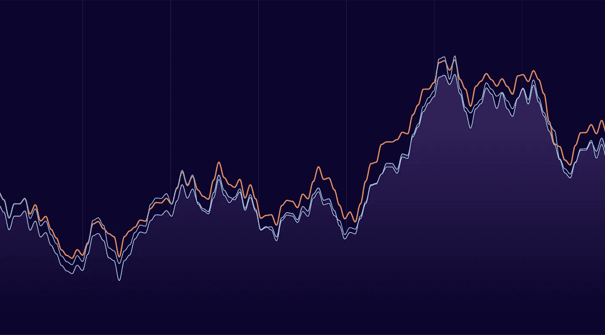
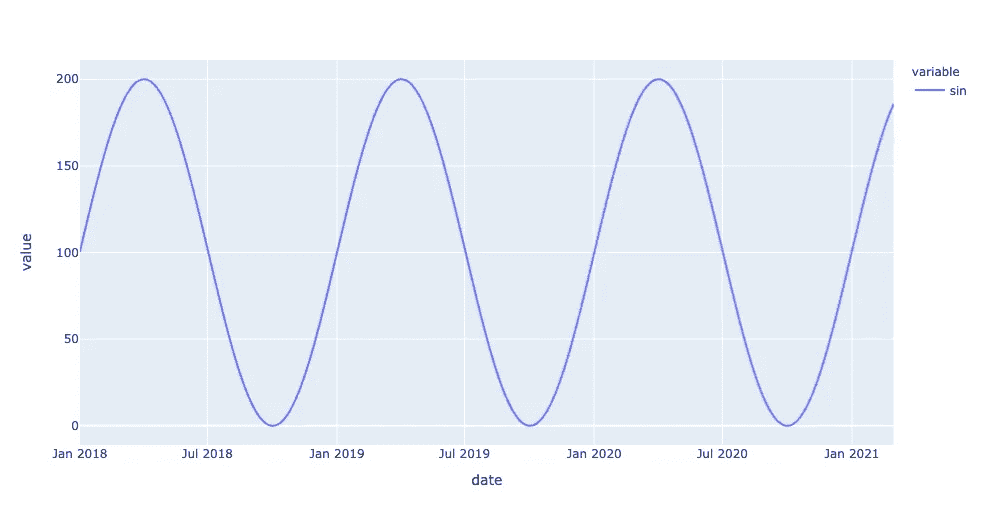
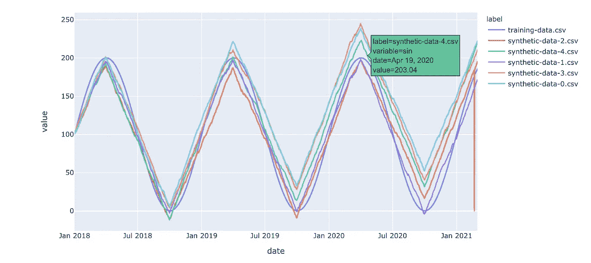

# 创建合成时间序列数据

> 原文：<https://towardsdatascience.com/creating-synthetic-time-series-data-67223ff08e34?source=collection_archive---------10----------------------->

## [实践教程](https://towardsdatascience.com/tagged/hands-on-tutorials)

## 使用 Python 创建高质量合成时序数据集的分步指南

# TL；速度三角形定位法(dead reckoning)

在这篇文章中，我们将使用 [Gretel.ai](https://gretel.ai) 的[合成数据库](https://github.com/gretelai/gretel-synthetics)创建时间序列数据集的合成版本，可视化并分析结果，并讨论[合成时间序列数据](https://gretel.ai/blog/what-is-synthetic-data)的几个用例。

时间序列 Gretel.ai

# 背景

作为数据科学家，我们面临的最大瓶颈之一是没有足够的数据。像亚马逊这样的公司已经转向合成数据，以生成支持 Alexa 的新语言所需的大量训练数据，研究人员正在试验 gan，以生成用于医学研究的 T10 多样化合成图像 T11，像 Unity3D 这样的公司正在应用他们在游戏环境和 3D 资产方面的专业知识，帮助你训练能够 T12 更好地感知现实世界中的物体的模型 T13。

无论我们需要历史数据来测试我们的算法，还是需要更多的数据来建立更好地概括的 ML 模型，使用合成数据来增加有限的数据集正在以令人难以置信的速度增长。由于需要保持严格的排序，以及时间和测量值之间有时复杂的关系，对于创建真实的合成数据来说，一个特别具有挑战性的问题是时间序列数据。

> 让我们从时间序列数据的快速定义开始。时间序列数据可以被认为是一系列的测量值，或者是按时间顺序排列的观察值。

# 入门指南

点击这里[在 GitHub](https://gist.github.com/zredlined/fe0407c3ebedc75837ec707420c1f013) 上查看下面的代码，或者点击这里[在 Google 联合实验室](https://colab.research.google.com/gist/zredlined/fe0407c3ebedc75837ec707420c1f013/synthetic-timeseries-example.ipynb)中启动交互式笔记本。你会想要一个装有图形处理器的盒子来进行模型训练，或者拿一杯☕.要开始运行示例代码，从 [Gretel 控制台](https://console.gretel.ai)获取一个 API 密钥(它是免费的)。

# 训练数据集

对于我们的训练数据集，我们将每小时创建一个时间序列模型。对于 Y 轴，我们需要一个复杂但易于理解的测量函数来测试我们的合成模型，并实现快速的可视化分析。为此，我们可以应用每年重复一次的正弦波函数。

很好，现在我们有了时间序列数据框架。提示:要尝试不同的时间间隔(例如每小时、每分钟)，请尝试更改上面 Pandas 的`date_range()`函数中的`freq`。现在，让我们把时间序列形象化！

绘制时间序列训练集

# 提取趋势数据

接下来，我们为合成模型创建训练集。我们可以直接对时间序列数据进行训练，但我们只是训练模型记住给定时间的测量值。*更直观的方法是根据趋势数据或测量值在一段时间间隔内的变化量来训练模型。*然后，模型重新创建时间序列趋势数据，可以使用累积和将其恢复为原始格式。

# 训练模特

接下来，我们将使用`gretel_synthetics`和`tensorflow`在我们的测试数据集上训练一个合成模型。为了确保生成的合成数据集与源数据集的时间窗口相匹配，我们将日期字段指定为一个种子值，可在生成时提供。

# 生成合成数据集

我们现在可以使用该模型生成任意数量的合成数据集。为了匹配原始数据集的时间范围，我们将使用 Gretel 的`seed_fields`函数，该函数允许您传递数据以用作每个生成行的前缀。下面的代码创建了 5 个新数据集，并从趋势数据中恢复累积和，以匹配原始数据集。

# 可视化结果

最后，让我们将我们创建的 5 个合成数据集与原始训练集进行对比，感受一下合成时间序列数据与源数据的对比。幸运的是，Pandas DataFrame 与 Plot.ly 的图形库的集成使这变得很容易！

合成时间序列数据集与原始训练集

正如我们可以看到的，合成模型在学习我们的源数据集中的 sin 函数和时态关系方面做得很好。为了使这个例子更进一步，尝试添加新的变量和正弦波进行合成，或者尝试改变神经网络配置参数，例如[训练时期、学习速率和生成温度](https://gretel-synthetics.readthedocs.io/en/stable/)，以试验不同的结果。我们很想听听你的尝试，并在以后的帖子中关注更复杂的例子！

# 结论

在 [Gretel.ai](https://gretel.ai/) ，我们对使用合成数据创建 ML 和 ai 模型的可能性感到非常兴奋，这些模型在伦理上是公平的，并且能够更好地针对未知数据进行归纳。我们很乐意听到你的用例——欢迎在评论中联系我们进行更深入的讨论， [twitter](https://twitter.com/gretel_ai) 或 [hi@gretel.ai](mailto:hi@gretel.ai) 。关注我们，用合成数据跟上最新趋势！

有兴趣在自己的数据集上进行训练吗？ [Gretel-synthetics](https://github.com/gretelai/gretel-synthetics) 是免费开源的，你可以通过[联合实验室](https://camo.githubusercontent.com/52feade06f2fecbf006889a904d221e6a730c194/68747470733a2f2f636f6c61622e72657365617263682e676f6f676c652e636f6d2f6173736574732f636f6c61622d62616467652e737667)在几秒钟内开始实验。