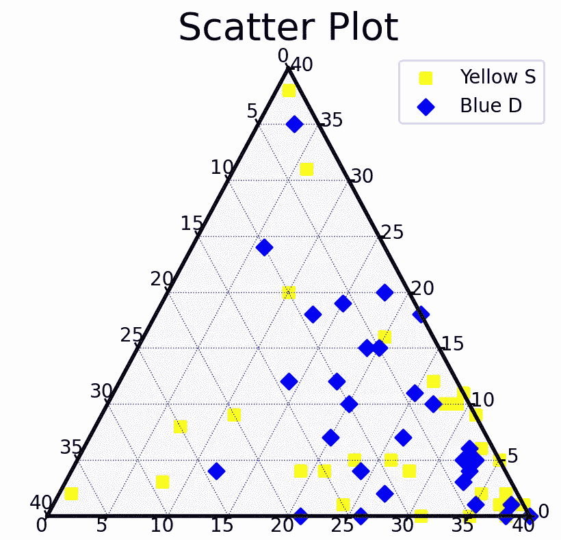
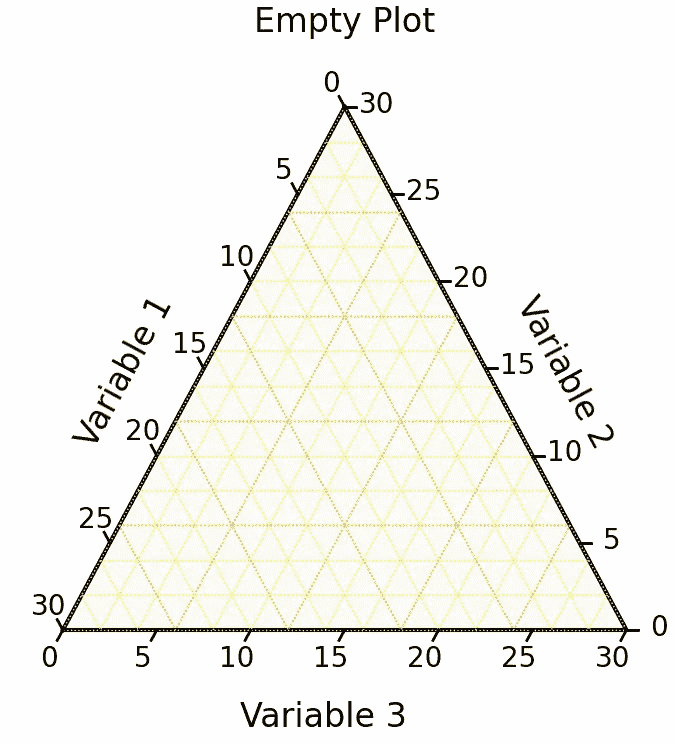
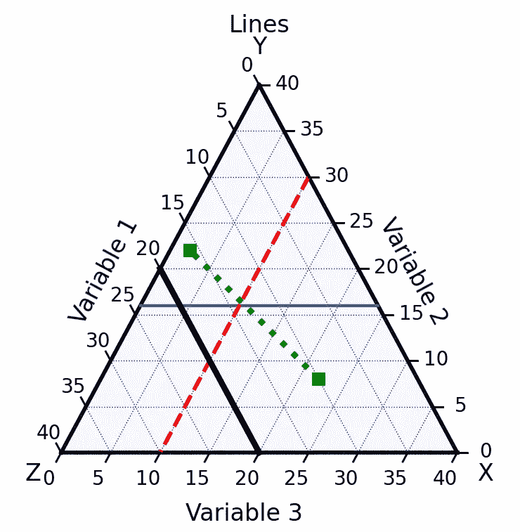

# 创建三元可视化

> 原文：<https://towardsdatascience.com/creating-ternary-visualizations-9b4e5edfd0ff?source=collection_archive---------26----------------------->

## 使用三元来创建三元图



来源:作者

三元图最适合用来显示总和为常数的 3 个变量。它用于根据三个比率在等边三角形中的位置以图形方式显示它们。三元图基本上用于物理化学领域。

通常，如果我们试图在 2D 平面上绘制 3 个不同的变量，那么我们必须传递第三个变量，可能是颜色或大小，等等。但是三元图可以很容易地在 2D 平面上可视化 3 个不同的变量，其中所有 3 个变量都用它们的位置编码并形成一个三角形。

Python 三元是一个开源的 python 库，用于创建三元图。在本文中，我们将探讨三元图的一些特性以及如何将它们可视化。

让我们开始吧…

# 安装所需的库

我们将从使用 pip 安装三元组开始。下面给出的命令可以做到这一点。

```
!pip install python-ternary
```

# 导入所需的库

在这一步中，我们将导入创建地块和可视化地块所需的库。

```
import ternary
```

# 创建一个空地块

我们将首先创建一个空的三元图来显示它的外观，并将向它添加标签。

```
scale = 30figure, tax = ternary.figure(scale=scale)tax.boundary(linewidth=1.5)tax.gridlines(color="red", multiple=6)tax.gridlines(color="yellow", multiple=2, linewidth=0.5)
fontsize = 12
offset = 0.14
tax.set_title("Empty Plot\n", fontsize=fontsize)
tax.left_axis_label("Variable 1", fontsize=fontsize, offset=offset)
tax.right_axis_label("Variable 2", fontsize=fontsize, offset=offset)
tax.bottom_axis_label("Variable 3", fontsize=fontsize, offset=offset)
tax.ticks(axis='lbr', linewidth=1, multiple=5, offset=0.02)
tax.set_background_color(color="whitesmoke", alpha=0.7) # the detault, essentially
# Remove default Matplotlib Axes
tax.clear_matplotlib_ticks()
tax.get_axes().axis('off')
ternary.plt.show()
```



来源:作者

# 用线条绘制

接下来，我们将把线整合到三元图中，以展示如何在三元图中绘制线。

```
scale = 40
figure, tax = ternary.figure(scale=scale)
tax.boundary(linewidth=2.0)tax.gridlines(color="blue", multiple=5)fontsize = 12offset = 0.14tax.set_title("Lines\n", fontsize=fontsize)tax.right_corner_label("X", fontsize=fontsize)tax.top_corner_label("Y", fontsize=fontsize)tax.left_corner_label("Z", fontsize=fontsize)tax.left_axis_label("Variable 1", fontsize=fontsize, offset=offset)tax.right_axis_label("Variable 2", fontsize=fontsize, offset=offset)tax.bottom_axis_label("Variable 3", fontsize=fontsize, offset=offset)
tax.horizontal_line(16)
tax.left_parallel_line(10, linewidth=2., color='red', linestyle="--")
tax.right_parallel_line(20, linewidth=3., color='black')
p1 = (22, 8, 10)
p2 = (2, 22, 16)tax.line(p1, p2, linewidth=3., marker='s', color='green', linestyle=":")
tax.ticks(axis='lbr', multiple=5, linewidth=1, offset=0.025)tax.get_axes().axis('off')
tax.clear_matplotlib_ticks()
tax.show()
```



来源:作者

# 散点图

接下来，让我们看看如何在三元图中创建散点图。这将帮助我们找出 2D 平面上两个变量之间的关系。

```
def random_points(num_points=25, scale=40):
points = []for i in range(num_points):
x = random.randint(1, scale)
y = random.randint(0, scale - x)
z = scale - x - y
points.append((x,y,z))
return pointsscale = 40
figure, tax = ternary.figure(scale=scale)
figure.set_size_inches(5, 5)points = random_points(30, scale=scale)
tax.scatter(points, marker='s', color='yellow', label="Yellow S")
points = random_points(30, scale=scale)
tax.scatter(points, marker='D', color='blue', label="Blue D")
tax.legend()
tax.set_title("Scatter Plot", fontsize=20)
tax.boundary(linewidth=2.0)
tax.gridlines(multiple=5, color="blue")
tax.ticks(axis='lbr', linewidth=1, multiple=5)
tax.clear_matplotlib_ticks()
tax.get_axes().axis('off')
tax.show()
```


来源:作者

在这里，您可以看到我们如何在三元图中可视化不同类型的图，以在 2D 空间中可视化 3 个不同的变量。

继续尝试不同的数据，并使用三元组创建不同的可视化效果。如果您发现任何困难，请在回复部分告诉我。

本文是与 [Piyush Ingale](https://medium.com/u/40808d551f5a?source=post_page-----9b4e5edfd0ff--------------------------------) 合作完成的。

# 在你走之前

***感谢*** *的阅读！如果你想与我取得联系，请随时联系我在 hmix13@gmail.com 或我的* [***LinkedIn 简介***](http://www.linkedin.com/in/himanshusharmads) *。可以查看我的*[***Github***](https://github.com/hmix13)**简介针对不同的数据科学项目和包教程。还有，随意探索* [***我的简介***](https://medium.com/@hmix13) *，阅读我写过的与数据科学相关的不同文章。**