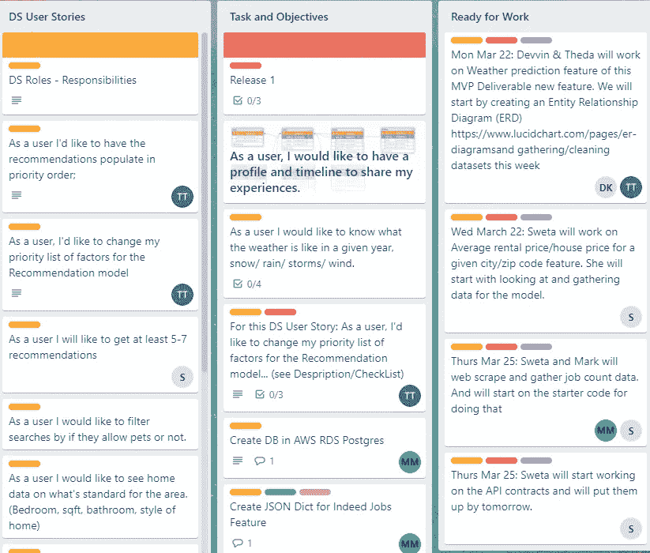
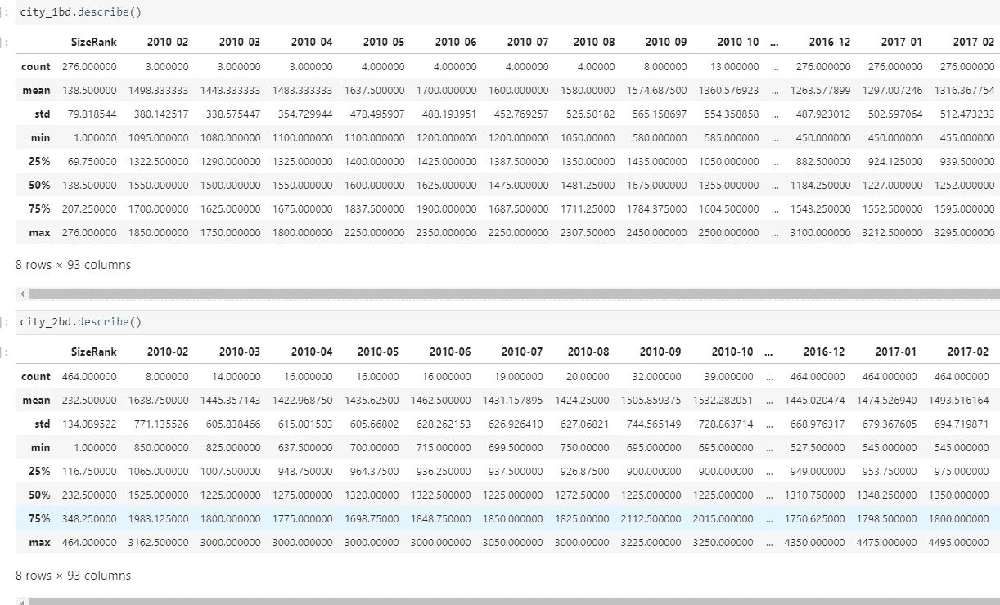
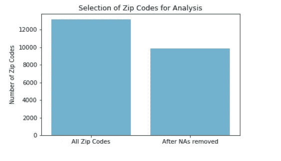
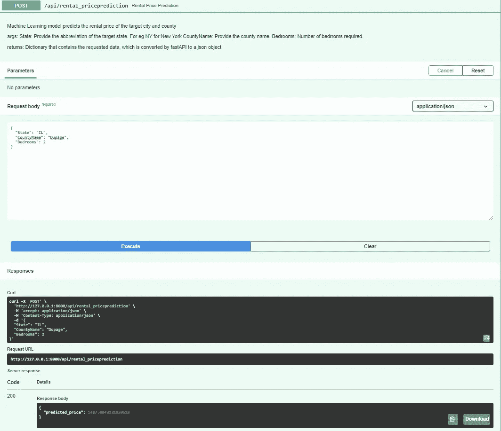

# 创建 CitySpire 应用

> 原文：<https://towardsdatascience.com/creating-the-cityspire-app-my-journey-ff31fc9990ce?source=collection_archive---------24----------------------->

## 我的旅程

Jukan Tateisi 在 [Unsplash](https://unsplash.com?utm_source=medium&utm_medium=referral) 上拍摄的照片

## 关于项目

在过去的八周里，我是一个由前端和后端以及数据科学组成的跨职能团队的一员，来构建一个名为 CitySpire 的应用程序。这是我们在 Lambda 进行的所有培训的高潮，将我们所学的知识整合在一起，这样我们就可以从头开始设计、构建和部署应用程序。

我们的主要目标是创建一个应用程序，分析来自城市的数据，如人口、天气、租赁率、犯罪率、公园(步行得分)、医院评级、学校评级以及许多其他社会和经济因素，这些因素对于决定人们喜欢住在哪里很重要。

我们必须紧密合作，计划出我们想要实现的功能，我们可以在特定期限内完成的版本，我们将使用的技术堆栈，以及哪些信息对用户来说是重要的。

## 规划阶段

第一天，我会见了将与我一起工作的开发人员和数据科学家团队。我起初很犹豫，让别人互相交谈，而我只是观察。但几分钟后，我加入了进来，讨论了几个用户故事，以及它们对我们各自团队的意义。例如，我所做的用户故事是*“作为一个用户，我想查看给定城市/邮政编码的平均租金/房价”。*现在，从数据科学家的角度来看，用户故事可以归结为——在给定的邮政编码/县，未来几个月的房屋租赁价格是多少？

作为一个团队，我们还决定租赁价格也将作为一个单独的端点，即用户可以点击这个端点，并可以获得有关其所需位置的租赁价格的信息。

确保每个人都专注于跨团队目标并了解其他人在做什么以及会议之间事情进展情况的一个好方法是利用项目管理应用程序的帮助。因此，下一步就是每天使用 Trello 与我们的团队交流。我会为我们想要实现的每个功能创建一个 Trello 卡，并附上一个用户故事作为标题，解释我们旨在实现的体验。我会将这些卡片按照数据科学部门的团队(前台、后台)进行分类。这使得更新我们当前正在做的事情、我们的状态以及团队正在做的其他事情变得更加容易。我们会每天站起来向团队更新我们在每个特性上取得的进展，以及我们可能遇到的障碍。

我们的特雷罗卡(图片由作者提供)

完成故事/特写的下一步是将它分解成更小的任务。上述用户故事可以分解为以下任务-

*   决定数据的类型。
*   决定数据的来源。
*   收集数据。
*   数据角力。
*   使用各种数据可视化技术探索数据。
*   根据用户需求创建模型。
*   创建最适合该数据类型的数据库。例如，这是一个关系数据库，所以我决定使用 AWS RDS Postgres 数据库。
*   与前端和后端的 web 开发人员合作，决定如何向我提供用户输入，以及如何将我的模型预测交付给他们。此讨论包括决定数据格式、数据库选择和创建端点。

## 数据

使用了五个不同的数据集来构建机器学习模型。首先我用了 Zillow 租金指数的[历史值](https://www.zillow.com/research/data/)。其余的数据是从[数据世界](https://data.world/)获得的。

作者对数据图像的基本统计描述

## 数据预处理

与许多其他公开可用的数据集和许多私人获得的数据集类似，这个特定项目中使用的数据集包含大量缺失值。

第一步是将数据集分解成更小的数据集，每个数据集只包含一年的值。接下来，在每个新创建的数据集中，包含三个月以上缺失值的邮政编码被删除。在清理了丢失的数据后，我将每年的数据重新组合成一个庞大的数据集。

估算缺失值并删除 3318 行(作者图片)

数据准备预处理的下一步是**归一化**。执行规范化有几个原因。首先，确保解释变量和目标变量之间关系的线性。第二，保证数据分布的正态性。最后，尝试减少异常值对分布的影响。

数据预处理过程的下一步是移除一些明显的异常值，这些异常值会显著改变分布、要素和目标之间的关系，从而降低模型效率。

数据准备过程的最后一步是**构建数据**，这种方式将允许捕获因变量和自变量之间关系的大多数方面。为了进行分析，所有数据集都进行了转换，以包含每个指标的年平均值。出现这种情况的主要原因是所使用的大多数数据集中缺少月水平的数据。

## 机器学习

数据集被分成训练数据集和测试数据集。我建立了一个线性回归模型。我使用了两个主要的模型性能指标——决定系数(R 平方)和均方根误差(RMSE)。第一个帮助我观察我的模型在多大程度上描述了 Zillow 租金指数和变量之间的关系，第二个帮助我评估了模型在多大程度上接近实际租金值(以绝对美元计算)。

## **API 和端点**

下一步是构建 API，包括创建和连接路由(端点)、函数和使用文档。

我使用 FastAPI 创建 API，AWS Elastic Beanstalk 用于托管 API。

租金预测 API 端点—从提取文档字符串。py 文件。显示成功响应和错误消息(图片由作者提供)

## **使用的包/技术**

*   计算机编程语言
*   结构化查询语言
*   Scikit
*   美丽的声音
*   关系数据库服务。
*   AWS 弹性豆茎:平台即服务，托管您的 API。
*   Docker:容器，用于可再生环境
*   FastAPI: Web 框架。像 Flask，但是更快，有自动交互文档。
*   Plotly:可视化库，用于 Python。
*   Pytest:测试框架，运行你的单元测试。

对于源代码托管，我使用 GitHub。Github 提供版本控制和流畅协作。我在 GitHub 中使用了分支技术来保持更好的版本控制。我为这个特性创建了一个新的分支。在将代码推送到分支时，我还添加了一个清晰而详细的提交消息来标识我的更改。然后，我创建了一个 pull 请求，通知我的团队成员我已经完成了一个特性，并请求他们允许我将更改添加到主文件中。

## 我面临的挑战

在整个项目中，障碍给我带来了挑战，我需要去克服。我学习了新的技术，但是在学习过程中遇到了一些障碍。

1.  对于我的主要功能，Zillow price 估计问题在于收集数据，然后理解数据。有几个 CSV 文件。并且没有关于各种 CSV 文件以及它们如何相互关联的细节。
2.  启动应用程序-最初，由于版本不匹配的问题，我无法在本地启动应用程序。Windows 10 不再支持 uvloop。所以我必须从 pipfile 中删除 psycopg2-binary 和 gunicorn ，删除 piplock，然后手动将 psycopg2-binary 和 gunicorn 安装回 pipfile。
3.  我写了代码，帮助我的团队对网站进行网络搜集，并收集所需的数据。然而，我不得不创建几个笔记本，因为网站确实阻止了 2 个城市后的进一步刮擦。
4.  最后，我面临的最大挑战是在 AWS Beanstalk 中托管 API。出于某种原因，我得到了一个 502 网关错误。错误日志也无助于解决问题。因此，必须切换到 EC2 路由来托管 API。

## **未来**

这一应用仍处于早期阶段。仍然有许多我们想要添加的功能，需要研究的缺陷，以及需要改进的功能。这只是开始。这是我的日记，记录了我的旅程和我到目前为止所做的贡献。还有很多事情要做。

我从这个应用程序中学到了很多。我每天都面临挑战，从学习 Flask API、Pydantic、AWS RDS PostgreSQL、AWS Beanstalk 等新事物，到优化代码以提高效率，再到与团队协作。作为一名数据科学家，在这样的项目中工作的最好的事情之一就是与不同的人一起工作，并结识新的人。

那么，这个项目对我的职业目标有什么帮助？这个项目激励我学习新的东西。计划和执行并满足交付特性的截止日期的能力。克服障碍并完成我的任务。在前进的道路上，我将继续鞭策自己，学习，成长，迎接新的挑战，并战胜它们。我期待着未来，因为我的旅程才刚刚开始。