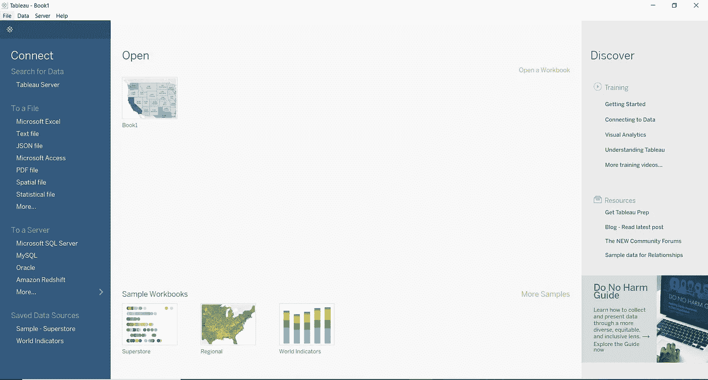
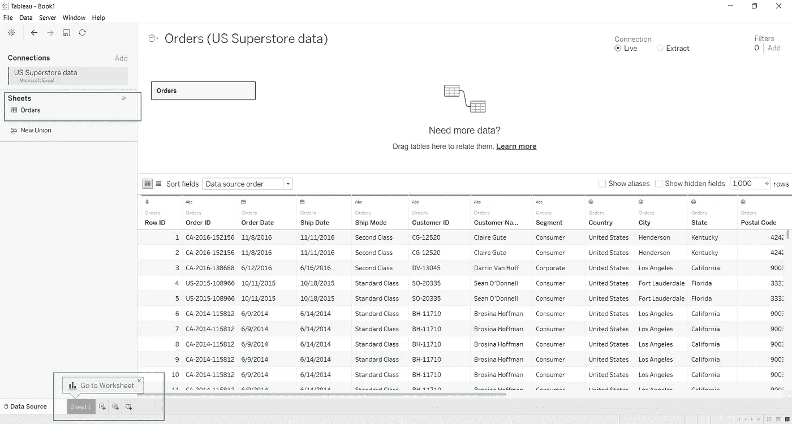
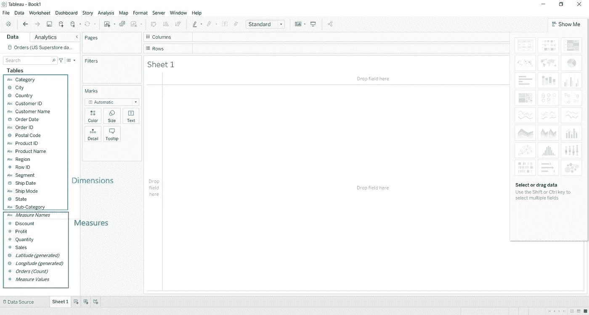
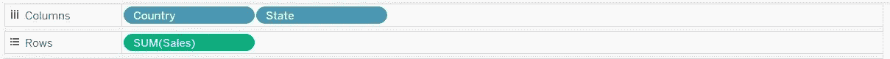
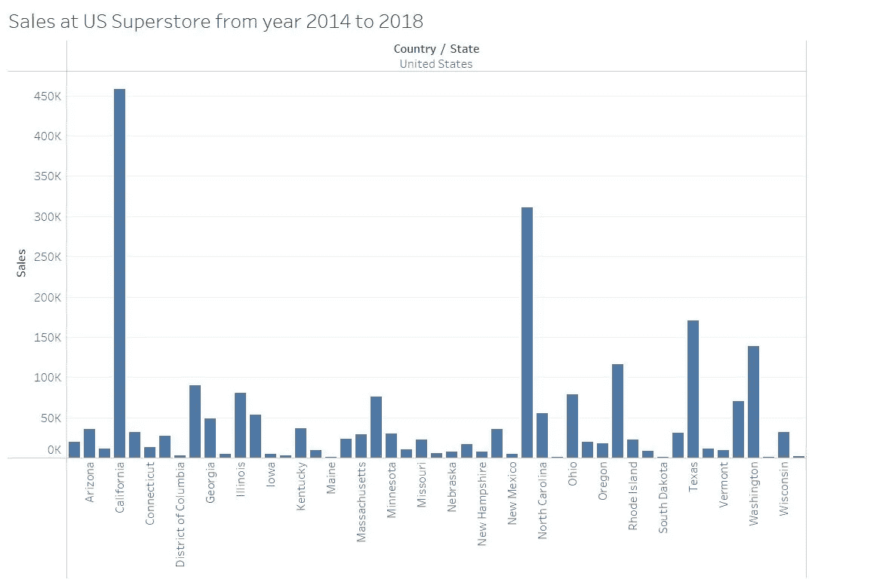
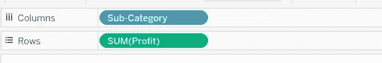
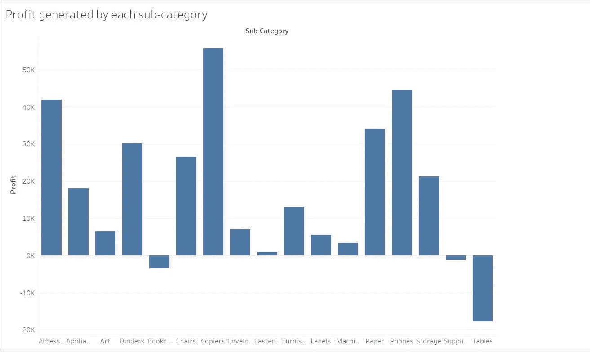
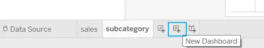
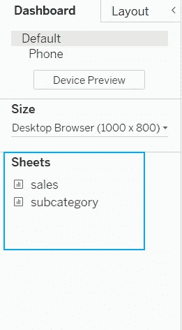
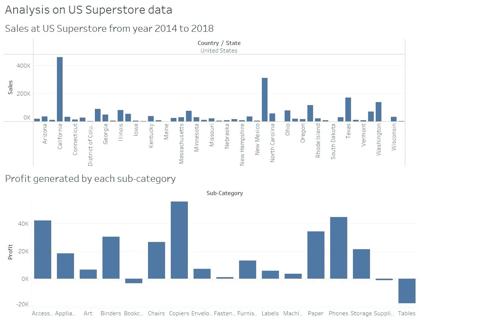

# 用 Tableau 创建可视化变得简单

> 原文：<https://towardsdatascience.com/creating-visualizations-with-tableau-made-simple-ed86401e63b0?source=collection_archive---------31----------------------->

## 从安装软件到交付仪表板

图片由 Freepik 上的 [pressfoto](https://www.freepik.com/free-photo/online-communication_5403029.htm#page=1&position=23) 提供

> “梦想远大。从小处着手。现在就行动。”—罗宾·夏尔马

这是我生活的主要原则之一。这不仅是为了你想要实现的人生目标，也是为了你想要实现的学习目标。

我们中的许多人将任何技术或工具视为障碍，并拖延我们的学习过程，认为我们太忙了，无法在这个时候开始一些重大的事情。

但是我想打断一下，告诉你，开始用 Tableau 创建很酷的可视化并不难。我将通过一个简单的例子来说明它。

把它作为对自己的挑战，和我一起创建你的第一个 Tableau 仪表板，开始你的 Tableau 学习。*你准备好了吗？*

# 什么是 Tableau？

在我们开始动手之前，让我们先来看看什么是 Tableau。

[Tableau](https://www.tableau.com/) 是一款出色而强大的数据可视化和商业智能工具，用于分析和报告海量数据。

数据科学家和机器学习工程师主要依靠 Matplotlib、Seaborn 和 Plotly 进行可视化。但相反，使用 Tableau 进行可视化分析会给人更专业的感觉，并且很容易呈现给利益相关者。

# 安装桌面

Tableau 的安装非常简单。前往 [Tableau 官方网站](https://www.tableau.com/)并将鼠标悬停在菜单栏中的“产品”上。

你可以选择 [Tableau 桌面](https://www.tableau.com/products/desktop/download)或者 [Tableau 公共](https://public.tableau.com/en-us/s/download)。Tableau Desktop 是 14 天免费试用的付费版本，而 Tableau Public 是免费的。

Tableau Public 可以免费使用，但不能保存您在本地创建的工作簿。它们可以保存到 Tableau 的公共云中，任何人都可以访问和查看。

决定您喜欢的产品，根据您的操作系统选择可执行文件，然后单击下载。

下载完可执行文件后，运行它并安装 Tableau。这就是你，准备好进入下一个阶段。

# 连接到数据源

数据是任何可视化的关键。Tableau 支持连接广泛的数据源。

[tabulea 全面列出了所有支持的连接器。](https://help.tableau.com/current/pro/desktop/en-us/exampleconnections_overview.htm)很少有数据源包括您机器上的文件，如 Microsoft Excel、文本文件、JSON 文件、pdf 等。、或诸如 MySQL、微软 SQL Server 或 Oracle 等服务器。Tableau 还支持云服务提供商连接到云资源； [AWS](https://aws.amazon.com/) 、 [Azure](https://azure.microsoft.com/en-us/) ，以及[谷歌云平台](https://cloud.google.com/)。

为简单起见，我们将使用 Microsoft Excel 文件开始我们的学习之旅。

我挑选的是美国超市数据集，由一个电子商务平台从 2014 年到 2018 年的交易列表组成，可在 Kaggle 上[获得。来吧，下载数据(你所需要的只是一个免费的 Kaggle 帐户)*，*然后开始和我一起动手吧。](https://www.kaggle.com/juhi1994/superstore)

打开上一步安装的 Tableau 软件。您将看到一个类似于下面截图中的屏幕。

作者截图

在左侧窗格中的**连接下，**您可以看到所有类型的文件和服务器，您可以从中导入数据。我们将要使用的数据源是一个 Microsoft Excel 文件。因此，在**连接下，**点击 **Microsoft Excel** 并选择您刚刚下载的文件。

一旦你加载了数据，你会看到一个类似下面的屏幕截图。在**连接下，**您将能够看到您刚刚创建的连接。

在主视图中，您可以看到刚刚导入的数据。

作者截图

要开始开发你的可视化，点击 **Sheet1** ，这将打开你的工作表进行开发。

# Tableau 中的尺寸和度量

您的工作表已准备好创建可视化效果。但在此之前，我们先来看看左边的**数据**窗格。它显示加载的数据中的所有变量。

[根据 Tableau](https://help.tableau.com/current/pro/desktop/en-us/datafields_typesandroles.htm) ，加载的数据自动分为维度和度量。分类变量用颜色编码。如果你仔细看的话，你可以看到蓝色的尺寸和绿色的尺寸。这种分离由 Tableau 自动执行，以增强用户体验。

在自动分类之后，作为维度得到的所有变量大多是分类变量，作为度量得到的变量是数值变量。可以聚集或操纵该度量。为了更好地理解这一点，请看一下我们使用的数据集上的分离。

作者截图

了解了尺寸和测量后，让我们继续学习重要的阶段。你和我在一起吗？

# 创建可视化

清楚地了解了数据源、维度和度量之后，让我们进入[创建可视化](https://help.tableau.com/current/pro/desktop/en-us/buildmanual_dragging.htm)。

我们将创建可视化来回答下面的两个问题。

1.  美国各州的销售额有什么不同？
2.  哪个产品类别产生高利润？

为了更好地理解如何解决可视化问题，一个简单的[5 步指南可以帮助你掌握数据可视化](/a-simple-yet-effective-5-step-framework-to-master-data-visualization-a1825e050c7c)。

## 1.美国不同州之间的销售额不同

为了可视化销售随州的变化，我们需要根据需要选择列和行。您必须从数据窗格拖放到顶部的架子上。

*   将**国家**维度拖放到列中。
*   将**状态**维度拖放到列中。
*   将**销售**指标拖放到行中。

*注意:由于数据集中的所有数据都将美国作为 Country 字段的值，所以列中不需要 Country 维度。但是一般来说，如果数据包含一个以上的国家，您将需要它。*

作者截图

一旦执行了上述步骤，就可以创建条形图了。

更新标题以描述您刚刚创建的可视化。

作者截图

*万岁！你已经开发了你的第一个可视化。保持精神，进入下一个我们即将回答的问题。*

## 2.哪个产品类别产生高利润？

为了确定哪个产品类别为超市产生更高的利润，我们将需要利润与子类别的可视化。

为了生成这个图表，

1.  将**子类别**维度拖放到列中。
2.  将**利润**指标拖放到行中。

作者截图

当您执行上述步骤时，将会生成下面的图表。记得用合适的描述更新标题。

作者截图

使用可视化效果，您可以清楚地看到*复印机*子类别的超市利润最高。

# 创建仪表板

你已经走了很长的路。距离完成 Tableau 学习游戏的第一关只有一步之遥！

您已经创建了许多图表(在我们的例子中是两个),并希望将它们展示给利益相关者。你如何以一种更像样的方式展示你所做的所有分析？

Tableau 仪表盘是为救援准备的。

[Tableau 仪表板](https://help.tableau.com/current/pro/desktop/en-us/dashboards.htm)是展示来自许多工作表的图表集合的好方法。生成的图表的集合视图使得交流对数据集的分析变得更加容易。

[要创建仪表板](https://help.tableau.com/current/pro/desktop/en-us/dashboards_create.htm)，点击左下角的**新建仪表板**选项卡。

作者截图

在左侧的**仪表板**窗格中，在**工作表**下，您将看到您已经创建的所有工作表的可视化效果。

作者截图

*注意:您可以通过右键单击工作表标签来重命名工作表。如果您没有重命名这些工作表，您将看到它们是 Sheet1、Sheet2 等等。*

要创建仪表板，

1.  将 sales (Sheet1)表拖放到视图中
2.  拖放“子类别(Sheet2)”表进行查看，使其位于“销售”可视化效果的下方。
3.  更新标题以描述仪表板。(*如果您尚未看到标题，请跟随仪表板菜单>选择显示标题)。*

作者截图

就是这样！您已经创建了您的第一个仪表板！

# 最后的想法

恭喜你！您已经完成了 Tableau 学习游戏的第一关。

请记住:

1.  现在是开始你任何学习愿望的最佳时机。
2.  学习新东西并不难。你必须一次迈出一小步。
3.  与你的努力保持一致，你就在通往成功的路上。

非常感谢你读到这里。我希望你喜欢阅读，你不仅已经开始了你的 Tableau 学习之旅，而且也有动力开始你的任何学习愿望。我希望听到您对我如何改进的反馈。[期待看到您的成功案例！](https://www.linkedin.com/in/anushiya-thevapalan/)