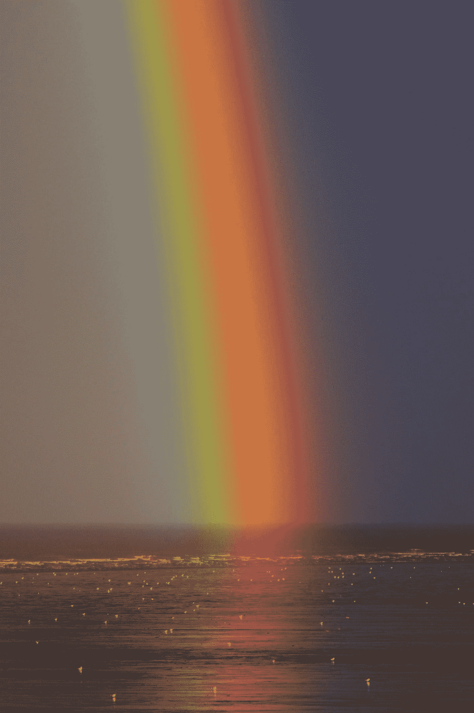
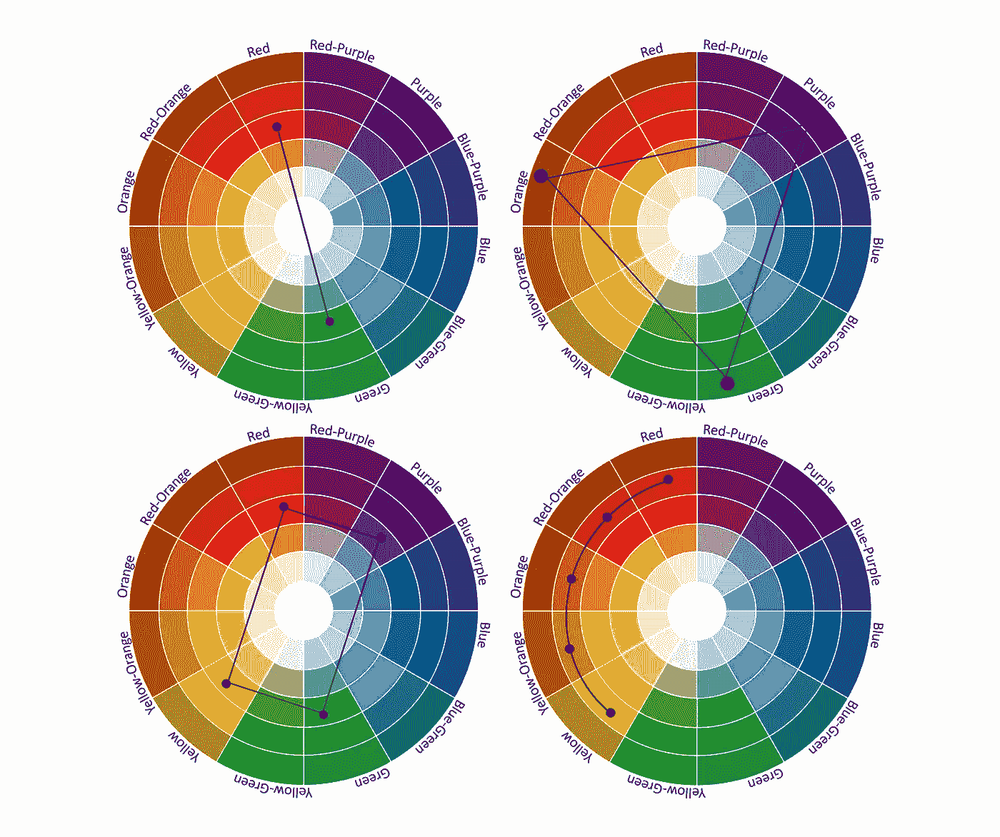
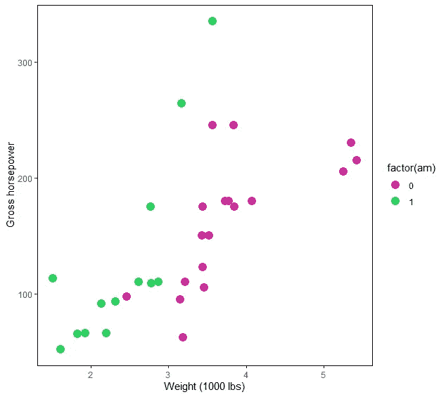
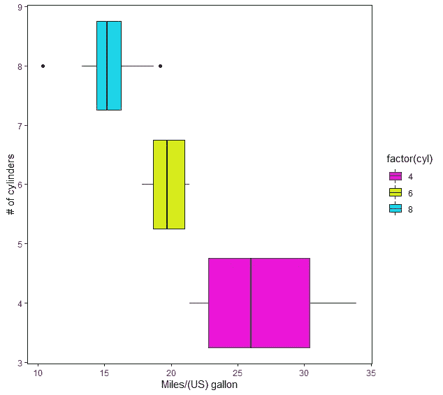
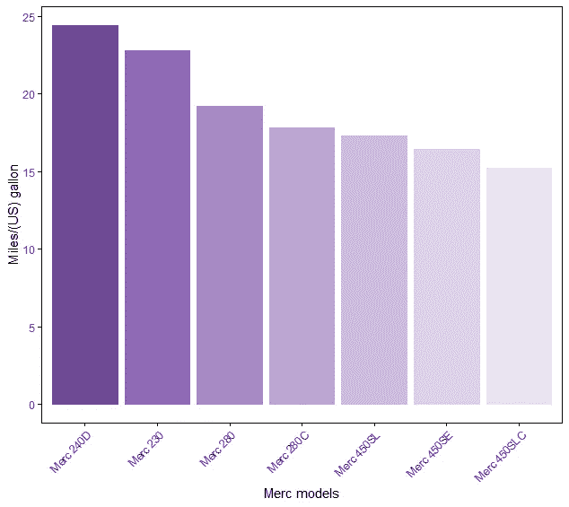

# 为数据可视化创建自己的调色板——第 1 部分

> 原文：<https://towardsdatascience.com/creating-your-own-color-palette-for-data-visualization-part-1-84df48954845?source=collection_archive---------23----------------------->

## 为数据可视化创建个人调色板的全面颜色指南


[斯蒂夫·约翰森](https://unsplash.com/@steve_j?utm_source=medium&utm_medium=referral)在 [Unsplash](https://unsplash.com?utm_source=medium&utm_medium=referral) 上拍照

您在为数据可视化选择正确的颜色组合时是否面临困难？你还在使用大多数程序员使用的调色板吗？如果你想脱颖而出，那么这篇文章就是为你准备的。

你有没有想过，设计师、画家、电影摄影师和摄影师是如何选择完美的色彩组合的？他们描绘的完美形象是通过理解他们希望观众感知到的东西而精心策划的。颜色和视觉的完美融合提供了一种引人入胜的视觉效果，不仅能舒缓眼睛，而且具有美感。上述职业使用的诀窍是，他们知道如何使用色轮来实现颜色的完美混合。最早制造色轮的不是别人，正是伊萨克·牛顿爵士。伊萨克·牛顿爵士在各个领域都做出了贡献，但是让我们把注意力集中在当前的色轮话题上。

# **色轮**

有两种类型的色轮，一种是数字的，另一种是由画家使用的颜料组成的。这两种色轮的主要区别在于原色成分的不同。数字色轮由 RGB(红-绿-蓝)组成，对于颜料，它是 RYB(红-黄-蓝)。混合两种原色产生二次色，原色和二次色的结合产生三次色。

# 颜色理论

色彩理论指导选择视觉效果的色彩组合，或创造一个充满活力、对比鲜明或和谐的色彩组合。这在自然界也很明显，如果一个人看到彩虹，从红色到蓝色的颜色过渡是和谐的，对眼睛来说是放松的。而色轮就是根据这个原理做出来的。



照片由[Zoltan·塔斯](https://unsplash.com/@zoltantasi?utm_source=medium&utm_medium=referral)在 [Unsplash](https://unsplash.com?utm_source=medium&utm_medium=referral) 上拍摄

# 了解颜色组合

有很多方法可以为你的调色板选择颜色。这种选择取决于一旦使用这些颜色，人们想要感知什么。你是在寻找色彩和谐还是对比鲜明的图像？如果还没有决定，那么试着使用不同的配色方案，如下所述。



色轮(图片由作者提供)

出于演示的目的，我将使用 R 数据存储库中的 mtcars 数据集。

> 关于 ggplot2 包首先要知道的是，它们有自己的调色板。ggplot2 包为其最终用户提供的一个有趣特性是通过 **scale_color_manual()** 函数创建自己的调色板的灵活性。

让我们了解不同的颜色组合方案，并尝试将它们可视化。

**互补色**用于创建高对比度和有冲击力的图像，因为这些颜色位于色轮的相对两端(色轮的左上角图像)。

这里的曲线显示了自动或手动变速器汽车的总马力和汽车重量之间的关系。

```
# implementing complementary colors(plot1 <- cars %>%
    ggplot(aes(wt,hp)) +
    geom_point(aes(color = factor(am)), size = 4) + 
    scale_color_manual(values = c("#d12e9f","#2ed160")) +
    theme_classic() +
    xlab("Weight (1000 lbs)") +
    ylab("Gross horsepower") +
    theme(panel.border = element_rect(colour = "black", fill=NA)))
```



作者图片

**三色组合**是从色轮中选择的 3 种等间距颜色，可创建鲜明的高对比度图像(色轮的右上角图像)。

箱形图有助于理解，随着气缸数量的增加，汽车的里程数减少。

```
# implementing triadic color scheme
(plot3 <- cars %>%
  ggplot(aes(mpg,cyl)) +
  geom_boxplot(aes(fill = factor(cyl))) + 
  scale_color_manual(values = c("#EB14D7","#D7EB14", "#14D7EB"), 
                     aesthetics = c("colour", "fill")) +
  theme_classic() +
  xlab("Miles/(US) gallon") +
  ylab("# of cylinders") +
  theme(panel.border = element_rect(colour = "black", fill=NA)))
```



作者图片

**四色**颜色组合，顾名思义就是选择四种颜色，在色轮中形成矩形或正方形的四个角。这创建了主色和强调色的调色板。强调色使其更加醒目，并强调对比度(色轮的左下角图像)。这种配色方案基本上是两组互补色，因为矩形/正方形的对角是互补的。

**类似的**配色方案类似于四色组合。但是这里我们沿着色轮的圆周选择颜色。从主色开始，向强调色发展(色轮的右下角图像)。

**单色**配色方案，顾名思义就是从较深到较浅的阴影创建颜色渐变。这是通过从圆周向色轮的中心径向向内行进来实现的。这种风格在视觉上很舒服，因为配色方案很和谐(色轮的右下角图像)。

直方图比较了数据集中所有奔驰车型的里程。

```
#implementing monochromatic color scheme# defining the color gradient
col_grad <- c("#6F4995","#8F69B6","#A789C5","#BCA5D3","#CDBBDE",
              "#DDD1E9","#EAE3F2")# filtering Merc models to compare the mpg(plot5 <- cars %>% filter(str_detect(cars, "^Me")) %>%
  ggplot(aes(fct_reorder(cars, mpg, .desc = TRUE), mpg, col = cars)) +
  geom_bar(stat = "identity", aes(fill = cars)) + 
  scale_color_manual(values = col_grad, 
                     aesthetics = c("colour", "fill")) +
  theme_classic() +
  xlab("Merc models") +
  ylab("Miles/(US) gallon") +
  theme(axis.text.x = element_text(angle = 45, hjust = 1), 
        panel.border = element_rect(colour = "black", fill=NA)))
```



作者图片

如果你是一个 R 用户，想探索 ggplot2 的新特性，那么看看这个:

</data-visualization-using-ggplot2-5-features-worth-knowing-c0447a760335>  

# 结论

因此，我们看到，通过正确地遵循色轮的属性并选择正确的方案，我们可以轻松地开发自己的调色板。这个过程需要大量的时间来为您的可视化选择正确的颜色集，因为除了数据和故事流本身之外，它还构成了数据故事的一个不可或缺的部分。

如果你是一个喜欢自己探索并尝试想出自己独特风格的人，这是为你的视觉化选择颜色的正确方向。如果你不是这种类型的人，那么不要担心，有很多灵感值得探索，以提高你的可视化颜色选择到一个全新的水平。以下是我的五大灵感链接:

1.  [https://color.adobe.com/create/color-wheel](https://color.adobe.com/create/color-wheel)
2.  【https://www.canva.com/ 号
3.  【https://coolors.co/ 
4.  [https://colorhunt.co/](https://colorhunt.co/)
5.  [https://www.design-seeds.com/by-color/](https://www.design-seeds.com/by-color/)

请继续关注我的下一篇文章，通过学习创建你自己的阴影、色调、色调、饱和度和亮度来增强你的配色方案。

链接到[代码](https://github.com/amalasi2418/Blog-post/tree/master/Color%20palette-part%201)。

你可以在 [LinkedIn](https://www.linkedin.com/in/abhinav-malasi/) 上和我联系。