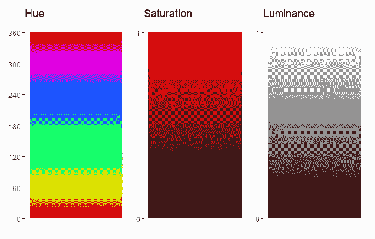
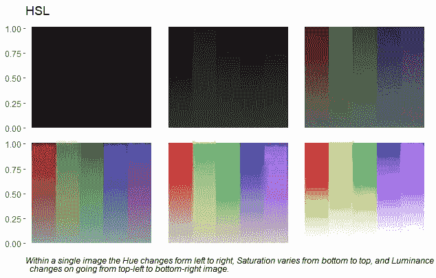
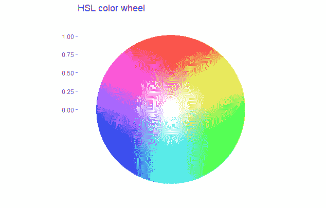

# 为数据可视化创建自己的调色板:第 2 部分

> 原文：<https://towardsdatascience.com/creating-your-own-color-palette-for-data-visualization-part-2-7b02ebc31c19?source=collection_archive---------24----------------------->

平衡色调、色调和饱和度，以生成完美的颜色渐变。


里卡多·戈麦斯·安吉尔在 [Unsplash](https://unsplash.com?utm_source=medium&utm_medium=referral) 上的照片

在博客的第一部分，我们集中讨论了色彩理论和色轮，讨论了选择补色、三色、四色、相似色和单色的不同方法。颜色的选择极大地改变了视觉感受，从对比强烈到对我们的眼睛产生舒缓的效果。这些组合纯粹是通过从色轮中选择不同的颜色来完成的。

在这里，我们讨论如何通过将颜色与黑色、白色或灰色混合来创建新的颜色组合。通过改变黑色、白色和灰色的强度，可以产生美丽的颜色渐变。下一节将介绍基本的定义和数学基础，但不会更深入。

第 1 部分的链接，以防您错过。

</creating-your-own-color-palette-for-data-visualization-part-1-84df48954845>  

现在，我们将通过了解色调、阴影、饱和度、色调、淡色和亮度的影响，重点关注增强视觉效果的替代方法。

> "纯粹的颜色，未受意义的污染，不与确定的形式结合，能以一千种不同的方式与灵魂对话"。~奥斯卡·王尔德

# 黑色、白色和灰色的阴影

RGB 值指定为(红、绿、蓝)，每种颜色的强度在(0，255)之间变化。因此，对于红色，RGB 值为(255，0，0)，对于绿色，为(0，255，0)，对于蓝色，为(0，0，255)。有时，强度值被定义在(0，1)的范围内。转换只是将 RGB 值除以 255。因此，对于红色、绿色和蓝色,( 0，1)标度中的 RGB 值将为:

```
Red color  |(255,0,0) is equivalent to (1,0,0)
Green color|(0,255,0) is equivalent to (0,1,0)
Blue color |(0,0,255) is equivalent to (0,0,1)
```

RGB 颜色组合可以进一步调整为:

颜色的 ***阴影*** 可以通过与黑色混合生成。黑色在 RGB 格式中是(0，0，0)。

颜色的 ***淡色*** 的生成方式与阴影类似，只是将颜色与白色混合。白色在 RGB 格式中是(1，1，1)。

***另一方面，色调*** 通过将颜色与灰色混合而生成。在 RGB 格式中，灰色是(0.5，0.5，0.5)。

如果将 RGB 颜色格式转换为圆柱坐标系，则产生 HSL 系统。HSL 代表色调、饱和度和亮度。



作者图片

*色相(H)代表在可见光光谱中具有主导能量的颜色的角度。角度在(0°**、360°**、**之间变化，就颜色而言，它从红色开始，然后转变为黄色、绿色、青色、蓝色、品红色，再回到红色。***

***现在让我们看看将 RGB 值转换为 HSL 颜色系统背后的数学原理。有 3 个变量 R、G 和 B，因此有 6 种可能的方式来排列 RGB，而不会重复任何颜色两次或三次。可能的结果以及与它们相关的转换为 HSL 的公式:***

```
***a) R>G>B then H = 60**°** * [(G-B)/(R-B)]
b) R>B>G then H = 60**°** * [6-(B-G)/(R-G)]
c) G>B>R then H = 60**°** * [2+(B-R)/(G-R)]
d) G>R>B then H = 60**°** * [2-(R-B)/(G-B)]
e) B>R>G then H = 60**°** * [4+(R-G)/(B-G)]
f) B>G>R then H = 60**°** * [4-(G-R)/(B-R)]***
```

***颜色的*饱和度倾向于告诉它的亮度。它是在(0，1)的范围内测量的。0 值表示没有颜色，1 表示颜色处于最大亮度。为了计算饱和度值，需要 RGB 的最大值和最小值。这意味着最大/最小值是通过比较 R、G 和 b 的值来计算的。****

```
****S = [(max(RGB)-min(RGB))/255]/(1-(2L-1)) if L<1
S = 0 if L =1**** 
```

*******【L】***另一方面，亮度在(0，1)的范围内定义颜色的强度、光度或亮度，其中 1 代表亮区域，0 代表暗区域或纯色。****

```
****L = (max(RGB)+min(RGB))/(2*255)****
```

****另一方面， ***色度******(C)***是最纯净的颜色，没有任何白色、黑色或灰色的混合。它也在(0，1)的标度之间测量。****

****现在我们已经有了所有我们需要知道的关于颜色的定义，让我们将所有这些知识用于构建我们的代码。****

# ****将 RGB 转换为 HSL****

****有两种方法可以将 RGB 转换成 HSL。第一种方法是使用上一节中定义的公式。第二条也是更短的路线是使用 r 的 ***plotwidgets 包*** 中的`rgb2hsl()`函数，我将提供第一种方法的代码，第二种方法留给读者去探索。****

****作者代码****

****通过选择特定的颜色，饱和度和亮度可以改变，如下图所示。****

********

****作者图片****

****我们知道如何将 RGB 转换为 HSL，让我们为 HSL 参数绘制并生成一个色轮。****

****作者代码****

********

****作者图片****

****对于绘制 HCL，其中 C 是色度，可以使用`hcl()`函数代替上面代码中的`hsv()`。****

# ****将 HSL 转换为 RGB****

****对于这一部分，我们将忽略将 HSL 转换为 RGB 的数学运算，可以直接使用 r 的***plot widgets******包*** 中的`hsl2rgb()`函数。`hsl2rgb()`函数的输入参数是一个 3 行的矩阵。3 行代表 HSL 值，其中 H 在(0 ，360 )之间变化。并且结果输出也是标识为 RGB 的 3 行矩阵。****

****下面是一些使用 ggplot2 包在 R 中高效绘图的技巧。****

****</data-visualization-using-ggplot2-5-features-worth-knowing-c0447a760335> **** 

# ******结论******

****因此，我们成功地证明了通过控制黑色、白色或灰色的数量，新的颜色组合可以通过与纯色混合而产生。这些组合是单一颜色的颜色渐变。此外，了解亮度、饱和度、色彩和色调的差异为我们提供了以正确的比例混合黑色、白色和灰色以创建颜色渐变的灵活性。****

******参考文献******

1.  ****[https://www.xspdf.com/resolution/54613930.html](https://www.xspdf.com/resolution/54613930.html)****
2.  ****[https://donatbalipapp.medium.com/colours-maths-90346fb5abda](https://donatbalipapp.medium.com/colours-maths-90346fb5abda)****
3.  ****[https://stack overflow . com/questions/6615002/given-an-RGB-value-how-do-I-create-a-tint-or-shade/6615053](https://stackoverflow.com/questions/6615002/given-an-rgb-value-how-do-i-create-a-tint-or-shade/6615053)****
4.  ****[https://www.december.com/html/spec/colorcodes.html](https://www.december.com/html/spec/colorcodes.html)****

****完整代码的链接在这里是。****

****您可以在 [LinkedIn](https://www.linkedin.com/in/abhinav-malasi/) 和 [Twitter](https://twitter.com/malasi_abhinav) 上与我联系，跟随我的数据科学和数据可视化之旅。****