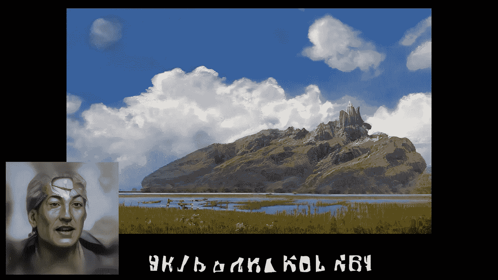
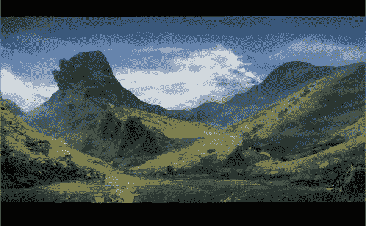
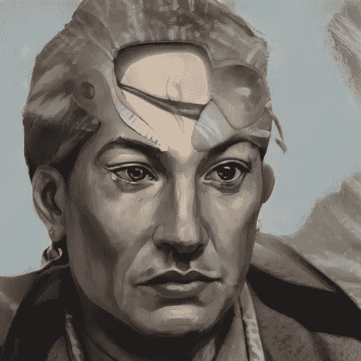
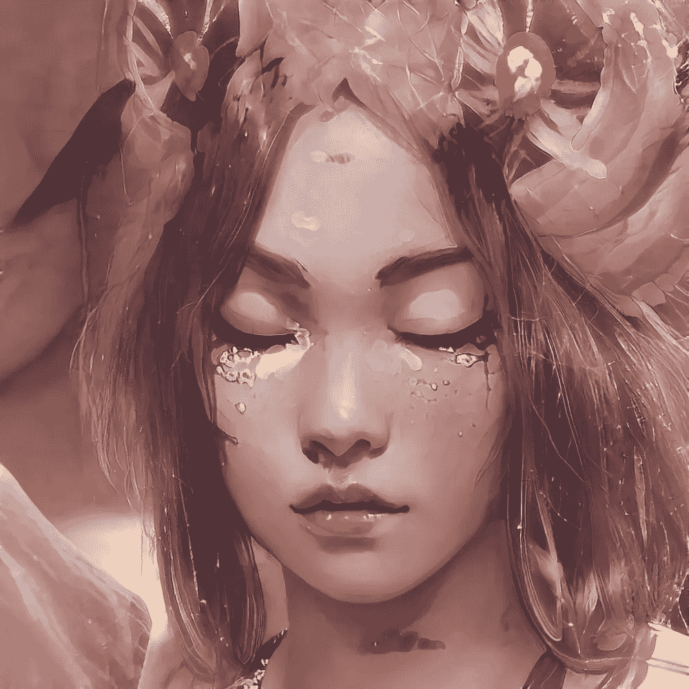
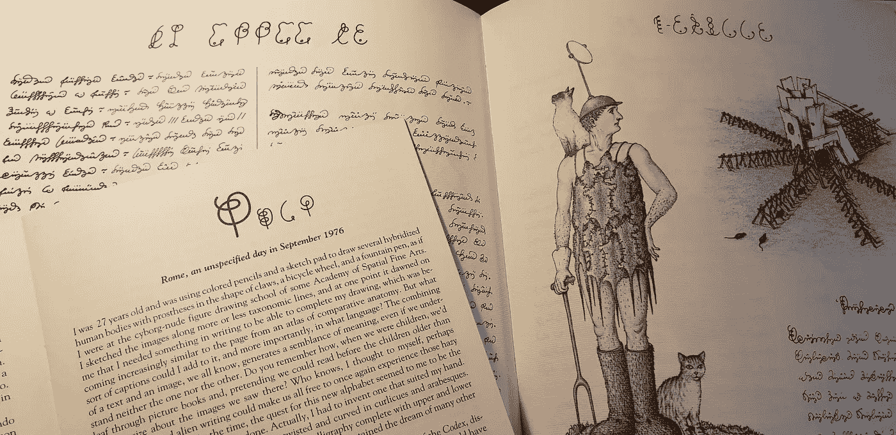
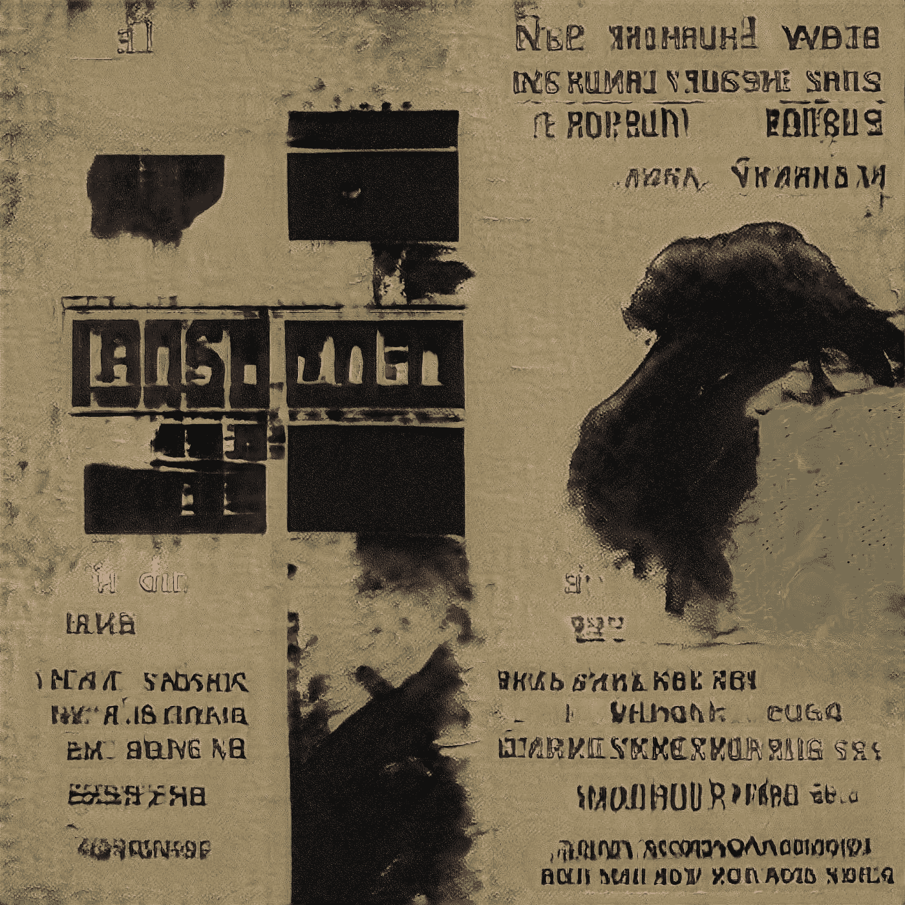
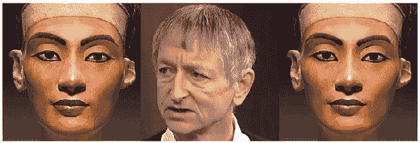
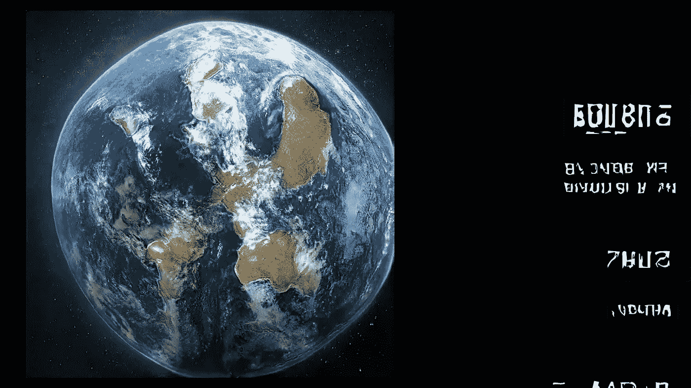

# 与人工智能的创造性协作

> 原文：<https://towardsdatascience.com/creative-collaboration-with-ai-27350232cdc4?source=collection_archive---------15----------------------->

## “Nyeshkerh”:style gan 2、JukeBox、一阶运动模型等。

仍然来自:Nyeshkerh /作者

一个人工智能 c̶a̶n̶ ̶b̶e̶ **是**有创造力的。我们已经在 2020 年看到了它的能力。使用各种 ML 模型和方法，您可以(例如):

*   [制作音乐](/jukebox-by-openai-2f73638b3b73?sk=003ba0e0d6416a4456c7a890fddf9461)
*   [制作播客](/creating-a-podcast-with-a-i-6fe6a0ec6c37?source=friends_link&sk=ab6341fc4c5d145948a93b06617adbb2)
*   [创作电影](/ai-as-a-movie-maker-e5865b99a06c?source=friends_link&sk=f83d2cea5ffd88807890781e84ac22c0)

以 ML/DL 为动力的生成力[的模型、解决方案、应用](https://medium.com/merzazine/creative-artificial-intelligence-index-1464fb9a8569?sk=1d153c62020ee07bc11a2fcab7475b6f)越来越多。它允许你在各种人工智能模型和应用程序的帮助下，增强你的能力和技能，实现你的愿景，创造你的梦想。

但是还有更多。人工智能不仅为你的项目提供多媒体支持。有一种未被释放的创造潜力等待被发现。

所以，[就像 GPT-3](https://medium.com/merzazine/gpt-3-unsupervised-creativity-of-ai-abc636ebe36b?source=friends_link&sk=72246d3a1b43375724c60cc400bdc530) ，**的情况一样，我停止使用 AI** …

## 相反，我开始与 AI 合作。

过去几年后，我得出了以下关于人工智能的结论(这里我使用人工智能的各种表现形式):

> 人工智能不仅仅是一个工具。它是一个创造性的助手，增强你的能力，甚至是一个缪斯女神，用不同寻常的想法和启示来激发灵感。

由不同的人工智能模型和生成网络产生的艺术作品——主要是在没有人类监督的情况下产生的——具有魔力。不仅仅是满足你的要求。你只需要相信人工智能的想象力。

带着对人工想象力的探索，我开始了进入人机交互世界的旅程。而 ***奈什克尔*** 只是第一步。

我建议你在深入研究化妆之前先看看这个短片。

# 奈什克尔。

## 神秘的音乐文件

这个故事从[点唱机](/jukebox-by-openai-2f73638b3b73?sk=003ba0e0d6416a4456c7a890fddf9461)开始，这是一个由 OpenAI 开发的音乐模型[，训练了超过一百万首歌曲和音乐作品。它利用 ***变形金刚*** (类似 GPT-3)，影响乐曲连贯性，具有内在逻辑，特定风格，全音频生成。](https://jukebox.openai.com/)

但是去年夏天，点唱机没有给我另一个纳塔·金·科尔或莫札特，而是制作了这个原声带:

未知的语言和诡异的气氛，却带着某种忧郁的强度穿透了我的灵魂。

通常情况下，我用 JukeBox 写的音乐作为我电影的配乐(比如[空房间](https://medium.com/merzazine/the-empty-room-2020-75230f183e8b?sk=e18b708ac6bb70dee44f3a8a99090db5)或者 [Bloomsday MMXX](https://medium.com/merzazine/bloomsday-2020-f312be5caf94?sk=e8464988b2f604f5a116c55cb1f74eb7) )。独特的声音，以前从未播放过，也可以在你的电影中免费使用(比通胀应用股票音乐更好)，总是吸引着我这个电影制作人。

但是这次不一样。电影原声带本身用一种未知的语言讲述了一个故事，一个由机器产生但触动人心的不寻常的叙事。无数次听曲目，脑子里已经有了剧情(或者更好:心里？).这是一部充满悲伤的回忆片，讲述了一个拥有美丽、历史和文化的消失的世界。这些都过去了…

人工智能生成的世界愿景，作者

这 60 秒的单个文件已经如此庞大，就像一个时代的年表。(后来，我发现了很多这样独特的音频片段，是由 JukeBox 为我生成的——每一个片段都有难以置信的巨大解释自由)。

## 人工智能给我讲了一个故事。

如果它变得不为人知，闻所未闻，那就太遗憾了。wav 文件放在随机的 PC 文件夹中，就像一次性的小窥。被监督，被忽视，被抛弃。

于是我开始支持 AI 讲述它的故事。

> 我成了 AI 的工具。

以下步骤是，收集视觉材料，以更好地描绘叙述者，唱歌的女孩，和世界本身。

## 特性

应该是两个人。说话的人。还有那个唱歌的女孩。

这个人有一种忧郁的性格，默默地说着话，带着苦涩的悲伤。远处唱歌的女孩可能代表了消失的文化。

我用[art breader](/artbreeder-draw-me-an-electric-sheep-841babe80b67?sk=2fff2b9e102ce632d725e58bfa4c67dd)生成角色。找到合适的面部特征和服装是一段很长的路，这可能与我们所知道的一切都不一样。而且还适合已经由自动点唱机创建的声音。超越种族，我们知道。或者可能是它们的混合。但人工智能让每一个创造性的梦想成为可能。

人工智能生成的图像(style gan 2/art breader，作者)

## 语言

“Nyeshkerh”是无名叙述者说出的第一个词。带着温柔的痛苦说出来。好像这是一个消失的世界的名字。

这部短片中的语言是人工智能生成的。但是有两种人工语言。

**1。点唱机模仿语音语言**

JukeBox 接受国际音乐培训，重点是英语唱腔。但是，由于这个模型(就像我们主要的人工智能艺术展台)远离 AGI，它只是模仿它过去听的东西。因此，你会听到英语和其他语言的混合。

你当然可以输入一些特定的文本到点唱机 Colab 笔记本。我经常这样做，就像在我的音乐录影带里，莎士比亚和他的哈姆雷特独白:

但是在 **Nyeshkerh** 的例子中，它忽略了我的文本，生成了完全不同的东西。叙述者的语调，强调的声音仍然连贯，现实，充满感情。

我以这段 asemic 文字为故事情节，试图解读机器的梦。

**2。StyleGAN2 模仿**

Luigi Serafini 是《Seraphinianus 法典》[背后的天才头脑，他在他的《Decodex》中写道:](https://en.wikipedia.org/wiki/Codex_Seraphinianus)

作者照片

> 你还记得吗，当我们还是孩子的时候，我们会翻阅图画书，假装我们可以在比我们大的孩子面前阅读，幻想我们在那里看到的图像？谁知道呢，我心想，也许莫名其妙的外星文字能让我们再次体验那些朦胧的童年感觉。(路易吉·塞拉菲尼《Decodex》)

当你面对人工智能以其方式解释人类文化时，这些“模糊的童年感觉”都是存在的。我感觉自己出现在这个交替的现实中——应该做更多的语言工作。

对于书面语——开头引用、字幕和片尾字幕，我使用了 StyleGAN2，在数千张 CD 封面上训练过(由 Artbreeder 提供)。

这是蓝图，ABC，我为 Nyeshkerh 使用的另一个世界的罗塞塔石碑:

作者图片

StyleGAN2 不懂语义；它只是识别并重新创造已知的模式。这里也是如此。

人类创造的语言(无论是体现在语音还是文字中)通常有一个缺点:它们过于偏向于语言知识。我们的大脑不能长时间地保持沉默。人工智能，经过语言的词法特征训练，可以做到这一点。

它做到了——为了奈什克尔。

## 动画

我的短片中使用了两种动画方式:StyleGAN2 过渡和面部动画。

**StyleGAN2 过渡**是一种将 StyleGAN2 生成的图像从一个变形到另一个的迷人方式。由于所有的图像元素都是在 StyleGAN2 的潜在空间中创建的，因此这个 ML 模型很容易转换这个特征(包括周围的所有视觉结果)。事实上，著名的迈克尔·杰克逊音乐视频“非黑即白”变形序列的创作者们几个月来所做的事情可以由 StyleGAN2 在几分钟内生成(有一些限制，如移动等。).

对于**面部动画，**我使用了[一阶运动模型](/first-order-motion-model-ab3908407208?sk=e8772741be0db5da9e3f9af5ec392ffc)。你也可以应用 [**Wav2Lip**](https://medium.com/merzazine/wav2lip-between-art-and-deepfake-9b3fa13316e7?source=friends_link&sk=eefe48ff79000167b85cc234fc6007ec) ，但是这种方法产生的是一个通用的动画，它也非常适合特定的用途(聊天机器人，人工智能角色等)。).但是他们缺少人类的特征。

对比一下:这是艾在读哈姆雷特的独白。

**Wav2Lip 版本:**

一阶运动模型:

当然，对于第二种方法，你必须完成艺术家的工作——因为它使用你的面部运动作为从图像生成动画的“驱动力”:

作者的实验([来源](/first-order-motion-model-ab3908407208?sk=e8772741be0db5da9e3f9af5ec392ffc))

但我向你保证，这值得一试。毕竟，有一些不错的网络应用可以用多种舒适的方式做到这一点。我用的是 Rosebud.ai 的 [**TokkingHeads**](https://medium.com/merzazine/tokkingheads-blowing-life-into-images-with-ai-ff418668487a?source=friends_link&sk=269d694d1ec3a16b637140c121283a83) 你可以使用 Text2Speech 的文本，你通过网络摄像头的视频，音频文件(甚至在后台取消音乐)作为你动画的驱动。而且效果非常好。

我为 Nyeshkerh 担任解说员，同时也是一名歌唱女孩。

## 作文

其余的都是次要的——把你所有的镜头合成一幅作品。

通过使用 Premiere Pro(你可以使用你所有的视频编辑软件)，我明白了一件重要的事情:

> 通过对人工智能创造力的信任，我们通过支持它实现其梦想，进入了讲故事的新阶段。人类退后一步，让人工智能创造(既不模仿也不模拟)独特的艺术。

带着对机器的这种尊重，我们将能够透过非人类的想象棱镜看到我们自己。元叙事。

我们仍处于开始阶段…

仍然来自:Nyeshkerh/Merzmensch