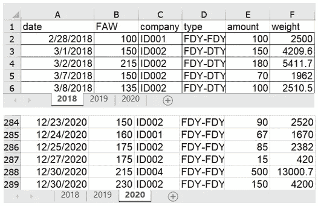
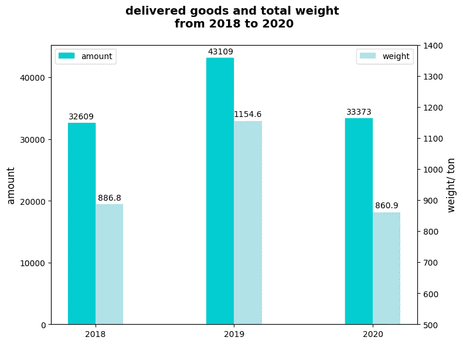
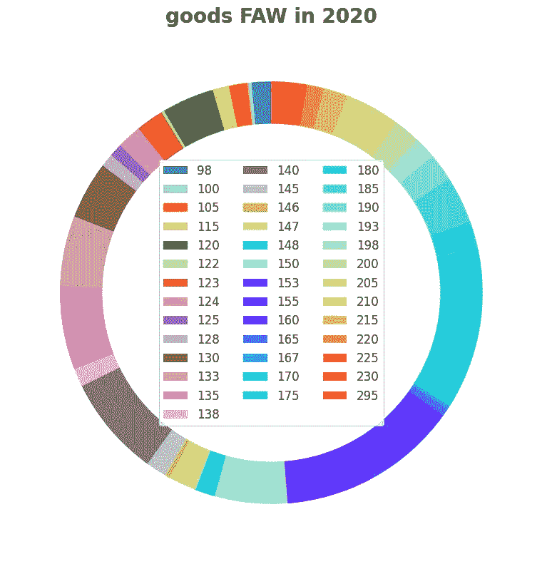
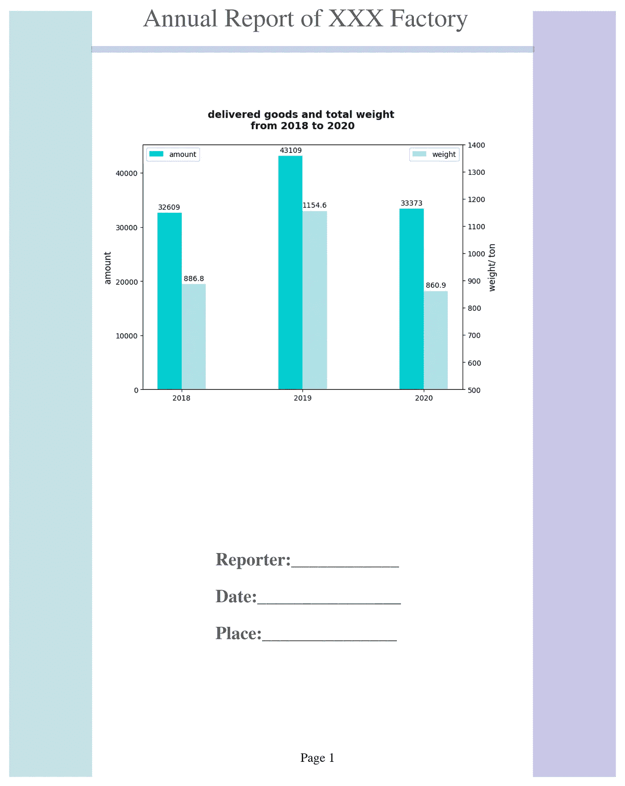
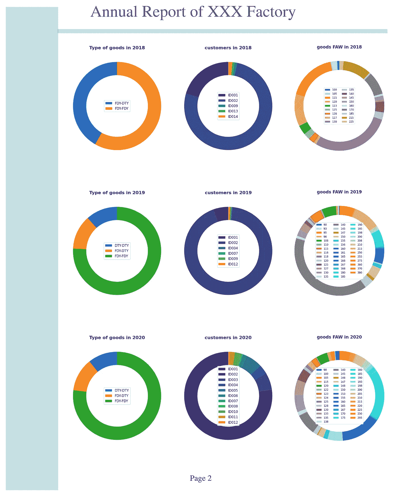
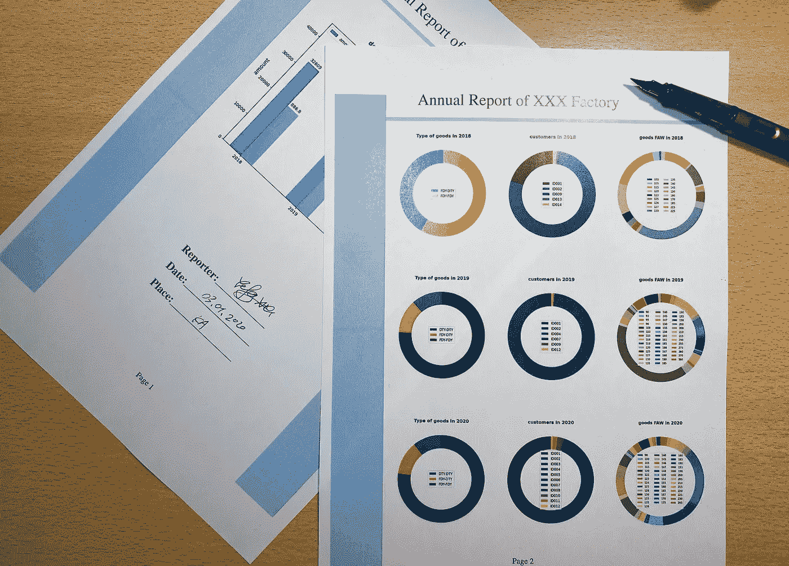

# 只用 Matplotlib 设计的创意报告，不用办公软件

> 原文：<https://towardsdatascience.com/creative-report-designed-only-with-matplotlib-without-office-software-9d8b5af4f9c2?source=collection_archive---------61----------------------->

在本文中，我们的目标是用 Matplotlib 创建一个直观的报告。**注意**:工作期间，不需要任何办公软件。我们唯一使用的是 Python。


由[艾萨克·史密斯](https://unsplash.com/@isaacmsmith?utm_source=unsplash&utm_medium=referral&utm_content=creditCopyText)在 [Unsplash](https://unsplash.com/s/photos/annual-report?utm_source=unsplash&utm_medium=referral&utm_content=creditCopyText) 上拍摄的照片

一系列有意义的数据图通常作为报告的组成部分。正如所说，一份好的图表胜过一篇演讲。如果我们已经提前获得了这些珍贵的食材，那么最后一步就是如何将它们以恰当的方式摆放。

当然，我们可以使用 Microsoft Word、Powerpoint 等。但不是必须的。这里我用 Matplotlib 展示我的食谱。

# 1.数据和图表简介



作者图片:excel 表格，2018 年至 2020 年的总销售额

基于 excel 文件，我们得到了一些有代表性的图表(条形图和圆环图)。如果你不知道如何处理这件事，请检查我以前的故事。链接已经给出，如果你觉得任务对你来说不容易或不新鲜，请逐一检查。

1.  [工厂简介](https://medium.com/datadriveninvestor/a-short-interview-about-a-chinese-sweatshop-in-the-textile-industry-aefa9c2229ef) —数据提供者
2.  [将数据写入有熊猫的数据框中，并绘制它们](/view-a-chinese-factory-from-the-data-aspect-with-python-ad698461f40a)
3.  [深入研究数据，发掘潜在信息](/data-analytics-helps-warehouse-management-f6a7f44f47af)
4.  [如何绘制环形图](/donut-plot-for-data-analysis-5aacac591741)

因此，我们收集了一些由一个条形图和九个圆环图组成的图表。



作者图片:2018-2020 年总销售额柱状图。



作者图片:九个甜甜圈图之一。[Github 上的甜甜圈图](https://github.com/Kopfgeldjaeger/Medium_blogs_code/tree/master/4_donut_plot_and_report/donut%20plots)

# 2.用 Matplotlib 设计布局和基本设置

```
**import** **matplotlib.pyplot** **as** **plt**
*# set font*
plt.rcParams['font.family'] = 'sans-serif'
plt.rcParams['font.sans-serif'] = 'STIXGeneral'# set A4 paper
fig, ax = plt.subplots(figsize=(8.5, 11)) *# Decorative Lines*
ax.axvline(x=.01, ymin=0, ymax=1, color='#44A0AD', alpha=0.3, linewidth=120)
plt.axvline(x=.99, color='#5244AD', alpha=0.3, linewidth=120)
plt.axhline(y=.95, xmin=0.14, xmax=0.86, color='#446BAD', linewidth=5,alpha=0.3)

*# set background color*
ax.set_facecolor('white')

*# remove axes*
plt.axis('off')
```

如果现在输入“plt.show()”，图如下所示


按作者分类的图像:报告模板

接下来，我们应该添加内容(标题、图表等。)到空白纸上。

```
Header = 'Annual Report of XXX Factory'
Contact = 'Reporter:____________ **\n\n**Date:________________ **\n\n**Place:_______________ '
page = 'Page 1'
*# add text*
plt.annotate(Header, (.22,.98), weight='regular', fontsize=20, alpha=.6 )
plt.annotate(Contact, (.34,.18), weight='bold', fontsize=14,alpha=.6)
plt.annotate(page, (.48,.02), weight='medium', fontsize=10)

*#add a vital bar chart*
**from** **matplotlib.offsetbox** **import** TextArea, DrawingArea, OffsetImage, AnnotationBbox
**import** **matplotlib.image** **as** **mpimg**
first_plot = mpimg.imread('barplot3.png')
imagebox1 = OffsetImage(first_plot, zoom=0.4)
a = AnnotationBbox(imagebox1, (0.48, 0.68),frameon=**False**)
ax.add_artist(a)
```

现在，报告的第一页完成了。



作者图片:报告的第一页

类似地，我们继续第二页上的样式，它应该填充有每年的详细环形图。

为了使内容清晰，我们必须把情节安排得整整齐齐。

```
fig, ax = plt.subplots(figsize=(8.5, 11))

*# Decorative Lines*
ax.axvline(x=.01, ymin=0, ymax=1, color='#44A0AD', alpha=0.3, linewidth=120)
plt.axhline(y=.95, xmin=0.14, xmax=0.99, color='#446BAD', linewidth=5,alpha=0.3)
*# set background color*
ax.set_facecolor('white')

*# remove axes*
plt.axis('off')
Header = 'Annual Report of XXX Factory'
page2= 'Page 2'
*# add text*
plt.annotate(Header, (.22,.98), weight='regular', fontsize=20, alpha=.6 )
plt.annotate(page2, (.48,.02), weight='medium', fontsize=10)
first_plot = mpimg.imread('donutplot1.png')
imagebox1 = OffsetImage(first_plot, zoom=0.25)
a1 = AnnotationBbox(imagebox1, (0.29, 0.80),frameon=**False**)
ax.add_artist(a1)
second_plot = mpimg.imread('donutplot2.png')
imagebox2 = OffsetImage(second_plot, zoom=0.25)
b1 = AnnotationBbox(imagebox2, (0.58, 0.80),frameon=**False**)
ax.add_artist(b1)
third_plot = mpimg.imread('donutplot3.png')
imagebox3 = OffsetImage(third_plot, zoom=0.1875)
c1 = AnnotationBbox(imagebox3, (0.87, 0.80),frameon=**False**)
ax.add_artist(c1)

fourth_plot = mpimg.imread('donutplot4.png')
imagebox4 = OffsetImage(fourth_plot, zoom=0.25)
a2 = AnnotationBbox(imagebox4, (0.29, 0.50),frameon=**False**)
ax.add_artist(a2)
fifth_plot = mpimg.imread('donutplot5.png')
imagebox5 = OffsetImage(fifth_plot, zoom=0.25)
b2 = AnnotationBbox(imagebox5, (0.58, 0.50),frameon=**False**)
ax.add_artist(b2)
sixth_plot = mpimg.imread('donutplot6.png')
imagebox6 = OffsetImage(sixth_plot, zoom=0.1875)
c2 = AnnotationBbox(imagebox6, (0.87, 0.50),frameon=**False**)
ax.add_artist(c2)seventh_plot = mpimg.imread('donutplot7.png')
imagebox7 = OffsetImage(seventh_plot, zoom=0.25)
a3 = AnnotationBbox(imagebox7, (0.29, 0.20),frameon=**False**)
ax.add_artist(a3)
eighth_plot = mpimg.imread('donutplot8.png')
imagebox8 = OffsetImage(eighth_plot, zoom=0.25)
b3 = AnnotationBbox(imagebox8, (0.58, 0.20),frameon=**False**)
ax.add_artist(b3)
ninth_plot = mpimg.imread('donutplot9.png')
imagebox9 = OffsetImage(ninth_plot, zoom=0.1875)
c3 = AnnotationBbox(imagebox9, (0.87, 0.20),frameon=**False**)
ax.add_artist(c3)

plt.savefig('report_2.png', dpi=300, bbox_inches='tight')
```

因此，第二页用九个圆环图很好地装饰了一下。



作者图片:报告第二页，包含 2018 年至 2020 年的详细数据

此外，我们可以改进的是得出这些图的结论，我没有时间写在报告中。例如，由于新冠肺炎疫情，2020 年的总销售额正在急剧下降。



作者图片

# 3.摘要

在这篇短文中，详细解释了生成报告的方法，它不需要 Word 或 Powerpoint。我们由 Matplotlib 创建的报告呈现了直接通过数据处理和分析获得的相关信息，这意味着如果你习惯于用 Python 处理数据，就没有必要切换 app 或平台。

代码提交在 [Github](https://github.com/Kopfgeldjaeger/Medium_blogs_code/tree/master/4_donut_plot_and_report) 中，您可以下载并查看。