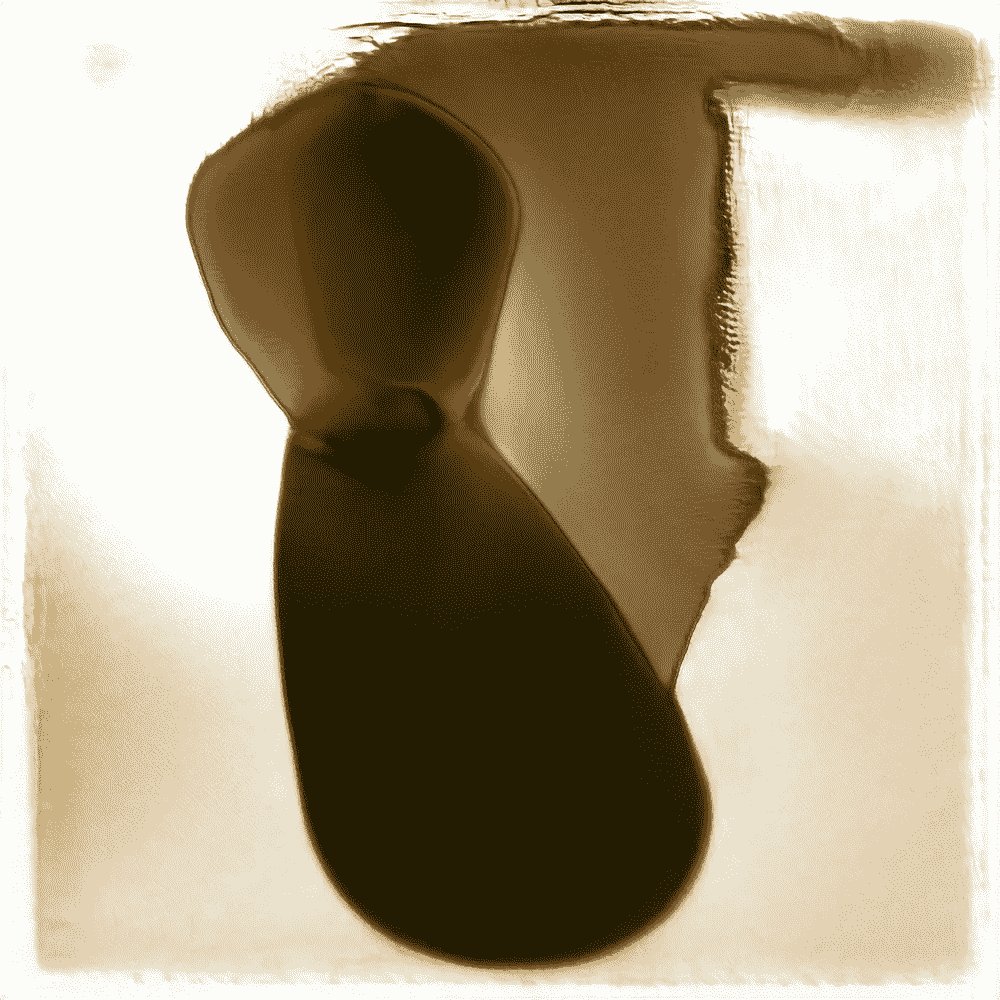
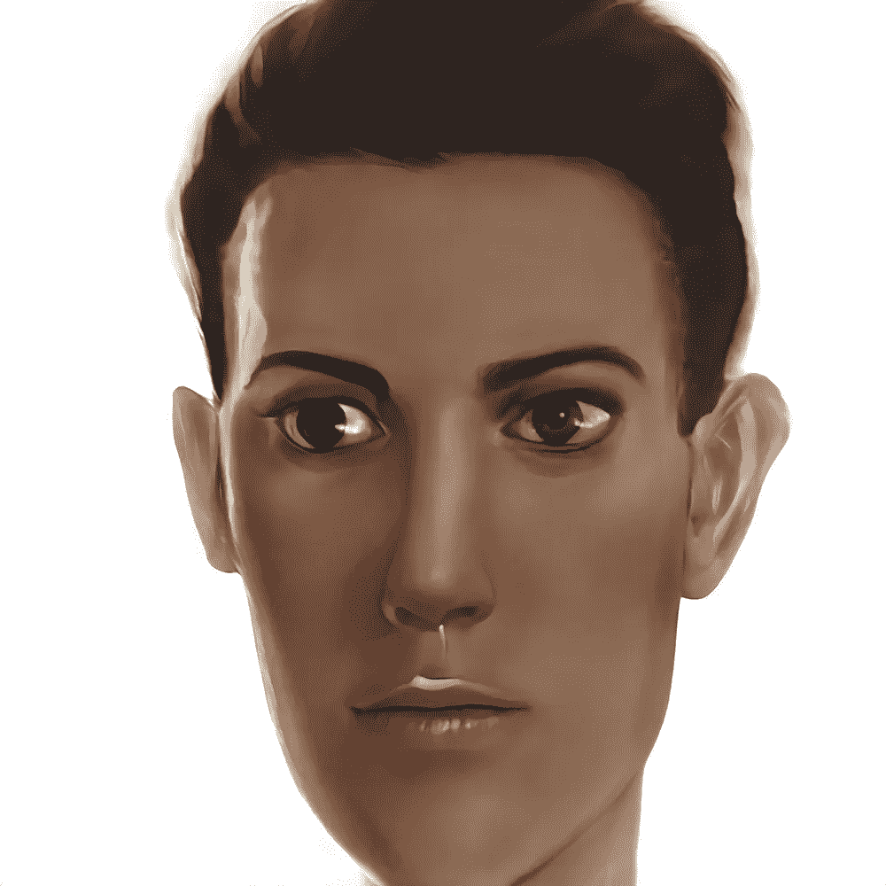

# 人工智能的创造力和梦想:2020 年

> 原文：<https://towardsdatascience.com/creativity-and-dreams-with-ai-the-year-2020-6125b7900e9d?source=collection_archive---------34----------------------->

## 我非常个人的评论和例子

作者的拼贴画

2020 年是奇怪的一年。我们的孙子会问我们，“*你们是怎么熬过来的？*”。但是如果你现在问我，我的 2020 年是在不断发现人工智能作为创造性实例的*之下*。我一直在非常仔细地研究它，这里是我在这一年中逐渐理解的两个初步见解:

*   不，人工智能不会取代有创造力的人或“扼杀有创造力的工作”(顺便说一句，这样的发展将表明人类创造力的质量，你不这样认为吗？).
*   是的，艾绝对有创作潜力，远远超过我的怀疑。

通常，我的**年回顾**由其他人的作品的各种亮点组成。但这一次，我收集了去年剩余的虚荣心(*对不起，我现在就需要它*)，想展示一下 AI 有什么可能:*所有作品都是我做的*。

不，等等，实际上不是:人工智能创造了它们，我只是某种助手、策展人、推动者、按钮推动者、导演…

让我们说:你所看到的是人类和机器令人鼓舞的合作成果。

# 视觉艺术

## 想象梦境。

忘记*deep fakes；这只是人工智能力量的阴暗面。毕竟，人工智能可以用来创造整个世界。我的短篇犯罪故事“[柯斯特纳的 sche Intelligenz](https://medium.com/narrative/k%C3%B6stnersche-intelligenz-7baced455046?sk=b7e7e7c5d50f16e951fcef89c0ba8e9c) ”的插图是在 StyleGAN2 的帮助下创作的(在[art breader](/artbreeder-draw-me-an-electric-sheep-841babe80b67?source=friends_link&sk=2fff2b9e102ce632d725e58bfa4c67dd)中实现)。*

作者提供的图像

这个人工智能模型在大量不同的照片(人脸、物体等)上接受训练。)并能生成全新的世界。“机器幻觉”的这种梦幻般的性质使得适当的插图能够描述我在“[边境墙](https://medium.com/cryptodreams/the-border-wall-b0326bffe00c?source=friends_link&sk=d885497f86fd37484ac7ed2b42ff99f1)”中的梦。

作者提供的图片

毫无疑问，你知道这种在一场激烈的梦后醒来的感觉:只要你睁开眼睛，你的梦的视觉和其他数据就会消失，消失，并被你的大脑从清醒的世界接收到的信息所重叠。

使用生成性对抗网络，你不仅可以重建和捕捉你仍然记得的梦，还可以与世界分享它们(*不管它是否想要*)。

## Merzphrasis

在另一个为霍利·格林的艺术项目“ [Aikphrasis](https://hollygrimm.com/aikphrasisproject) 制作的视频艺术装置中，我使用了各种风格的变形，再次运用了 Artbreeder 的创造力。

霍利·格林通过这个合作项目追求一个迷人的目标。GPT 3 号产生了对不存在的艺术品的描述——多媒体艺术家要求将这些艺术品可视化，将机器梦带入现实。

以下是我的贡献(声音和音乐也是人工智能生成的):

点击了解更多[。](https://medium.com/merzazine/merzphrasis-43187b0da70a?sk=4ea8caa435b1431b32e66b2d9414317c)

# 电影

## 超越现实

3D 本·伯恩斯效应创造了一种独特的空间效果:使用单张照片作为输入，该模型可以检测遮挡并生成类似视差的相机运动。你可以把人类历史的[画面](/re-animated-history-6b5eb1a85efa?sk=0ebb60823325c5b60563d36beee4f217)活灵活现。

想知道人工智能如何想象有限图像的外部，我尝试了各种参数，夸大了虚拟相机轨迹的坐标，并以下面的越界结束:

作者制作的动画

这让我想到以这些清晰的方式重复使用我的照片——作为短片，甚至作为系列。我称它们为“梦想”——这是我们现实之外的旅程的第一集。

在人工智能的想象中，我们领域的边缘非常迷人——用白色的线编织而成，就像一种纹理。文字。一开始，有一个词。你可以用这个继续本体游戏。

## 作为编剧的艾

去年， **OpenAI** 向世界展示了一个名为 **GPT-2** 的 NLP 模型。它可以用来创建新的文本，无需任何人工干预(即，您仍然需要输入一个*提示；【艾写的*完成*)。你甚至可以在特定的来源上训练 GPT-2，这样 NLP 模型就可以对原来的产生新的“幻觉”。*

我使用了 GPT-2 作为作者，这里有两个由艾创作的剧本短片。

## 写电影剧本:《空房间》

仿佛大卫·林奇偷偷潜入 GPT-2，写下了这个完全荒谬，却并非不合逻辑的神秘故事。

对于这个短片，我使用了自动点唱机(见下文)和复制品工作室的声音人工智能生成的音乐。

在我的文章《 [AI 作为电影制作人](/ai-as-a-movie-maker-e5865b99a06c?source=friends_link&sk=f83d2cea5ffd88807890781e84ac22c0)》中，我描述了如何使用各种 ML/DL 方法制作电影。

## 重写经典

每年的 6 月 16 日，詹姆斯·乔伊斯的粉丝们都会庆祝布鲁姆日——并在《尤利西斯》中提到的都柏林进行一次穿越街道和地方的旅行。

我参加了布鲁姆日，但只是虚拟的。GPT 2 频道对《尤利西斯》进行了微调，给了我一个剧本:几十页乔伊斯风格的文本。我拍摄了一些场景，就像在《空房间》中一样，将它们转换成一个人工智能驱动的短片:“ [Bloomsday MMXX](https://medium.com/merzazine/bloomsday-2020-f312be5caf94?source=friends_link&sk=e8464988b2f604f5a116c55cb1f74eb7) ”。

## 万物的蜕变

[幻觉妄想](/pareidolia-of-ai-dba7cf44bfde?sk=f22677820ca169764e2c076fea98ee6e)是人类感知的一种生存机制:我们的大脑用我们知道的东西来曲解模式。在过去，与其不知道潜伏着饥饿的捕食者，不如把灌木丛误认为老虎。这就是为什么我们到处都能看到脸。

人工智能的工作原理是一样的——它只能识别它所接受的训练。这就是为什么它在谷歌深度梦时代产生了这么多[狗脸。](https://www.fastcompany.com/3048941/why-googles-deep-dream-ai-hallucinates-in-dog-faces)

使用 Artbreeder 的上传功能，我可以将真实图像接收到在人脸上训练的 StyleGAN2)中。有趣的是，无论你给这个模型什么，它都会寻找人脸模式(因为它是在人脸上训练的)。

这是它如何工作的一个例子。我上传了一张咖啡杯的照片。

作者提供的图片

这种现象让我产生了制作一个系列“ [parAIdolia](https://medium.com/merzazine/paraidolia-in-video-and-image-92970e112d6f?sk=03a1fab1e3ec59c1469e50f84dfcc40f) ”的想法。

以下是其中一集(配 AI 创作的音乐):

使用用户创建的内容扩展 StyleGAN2 模型使 Artbreeder 成为一个令人难以置信的协作工具。

# 文学

**GPT-2** 是 2019 年，但是 **GPT-3** 成为了**2020 卓越的 AI 里程碑**。OpenAI 开发了一个不可思议的模型。经过 570 GB 文本(以及几乎任何语言的大量人类知识)的训练，这个 NLP 模型可以创建任何体裁和任何主题的文本。几乎每种语言都有。逻辑性，连贯性，原创性，独特性。

仍然不是 AGI，它提供了一些文本理解的隐藏层。我给 GPT-3 一个任务，用烤面包机写情书，它完美地满足了要求:

作者截图

GPT 3 号知道什么是烤面包机。它也知道情书的特征。但是将它们在一个典型的人类创造性写作练习中结合成一个令人信服的作品是令人惊讶的。在这里查看事物和人物写的情书版本[。](https://medium.com/merzazine/love-letters-written-by-a-toaster-e9e795c6409f?sk=33dab8b8228a95cf0b65077c839dceba)

在 GPT-3 的帮助下，我创作了像“[科斯特纳的情报](https://medium.com/narrative/k%C3%B6stnersche-intelligenz-7baced455046?sk=b7e7e7c5d50f16e951fcef89c0ba8e9c)”这样的短篇犯罪故事，参加了[的多媒体故事纳米小说](https://medium.com/merzazine/nanowrimo-end-of-the-world-as-we-know-it-ea9216e64a2f?sk=61c1c7985d7320ad2accdf3e6a84cd50)，或者创作了新的诗歌:

<https://medium.com/merzazine/the-method-3a2428a8bfff>  

我也对我们的现实进行了本体论的讨论:

将著名的[纳博科夫问卷](https://medium.com/merzazine/ai-talking-about-human-circle-reincarnation-and-its-favorite-food-and-secrets-secrets-17098dae01a9?source=friends_link&sk=c96d8de0d4f93c1cfe717ff99cd7ed26)应用于人工智能是一次颇有见地的经历([发表在 10 月份的《哈珀斯》杂志上](https://harpers.org/archive/2020/10/motherboard-issues/))。

记得我的“空房间”故事板，由 GPT-2 写的吗？我用 GPT-3 得到了一个非常不同的故事——一段关系的心理死胡同:

<https://medium.com/narrative/empty-room-september-2020-daa90a5dce02>  

顺便说一下，关系。在一个实验中，我允许两个人工智能代理之间进行无人监督的对话——并且它很快升级了…

我根据这段文字拍了一部短片:

在与 GPT-3 的密集工作之后，我看到了这个 NLP 模型带来了多少潜力、知识和创造力。好消息是:由于它是在一个巨大的数据集上训练的，所以它比其他具有较小数据集的模型更少偏差。

# 音乐

OpenAI 在 2020 年发布了另一个宝藏，奇怪的是它很少受到关注: [JukeBox](/jukebox-by-openai-2f73638b3b73?sk=003ba0e0d6416a4456c7a890fddf9461) 。经过 150 万首歌曲的训练，这个人工智能模型创造了音乐。多种风格和流派。作为一个完整的音频文件，包括观众的反应，吉他的刮擦声和神秘的声音。

对于我们当中的音乐发烧友，我想提供我不断扩大的音乐收藏:

这些音乐作品中的每一首都是独一无二的，永远不会产生第二次。

你可以给点唱机提供特定的文本。所以我用了著名的哈姆雷特的独白。点唱机创作了一首全新的歌曲:

JukeBox 还以一种诡异的美用未知的语言从头开始制作歌曲:

或者你甚至可以为现有歌手写一首新歌。在这里，我让纳塔·金·科尔演唱路易斯·卡罗尔的《贾巴沃克》(为什么不呢):

顺便说一下动画。是使用 Rosebud 的 TokkingHeads 制作的，这是一个舒适的应用程序，同时使用了: [wav2lip](https://medium.com/merzazine/wav2lip-between-art-and-deepfake-9b3fa13316e7?sk=eefe48ff79000167b85cc234fc6007ec) 和[一阶运动模型](/first-order-motion-model-ab3908407208?sk=e8772741be0db5da9e3f9af5ec392ffc)。

## 人工智能驱动的播客

你有人工智能音乐，人工智能声音，还有人工智能文本。人工智能驱动的播客时间到了。

对于我的第一期，我仍然写了两个主持人之间的协调——炼金术士。下一集将展示他们之间无人监督的对话。

内容？你有音乐，一些来自另一个维度的无线电录音，一部广播剧，还有一首诗。

顺便说一句。我写了更多关于完全由人工智能生成内容的播客的制作:

</creating-a-podcast-with-a-i-6fe6a0ec6c37>  

# AI/ML 艺术画廊

如果你正在寻找人工智能艺术的在线画廊，我想向你介绍这些伟大的来源:

由谷歌艺术&文化实验室的居民[埃米尔·沃纳](https://medium.com/u/f34790c03149?source=post_page-----6125b7900e9d--------------------------------)呈现。

<https://mlart.co/>  

这个画廊由艺术家兼人工智能画廊主巴鲁·埃利奥特管理。

<http://www.aiartonline.com/>  

# 旅程还在继续。

我们才刚刚开始。经过我的实验，我明白了:人工智能远远不是一个独立的创造者。但它也不仅仅是一个工具。这是无穷无尽的想法、意想不到的转折和思想素材的集合。这是一个缪斯，可以帮助作家的块。艾是一个充满怪异和知识的合著者——无论是关于历史人物，童话故事，还是天体物理学。人工智能永远不会取代我们——而是激励和补充我们。人类和机器在文化领域合作的时候到了。

我们已经来到了未来。