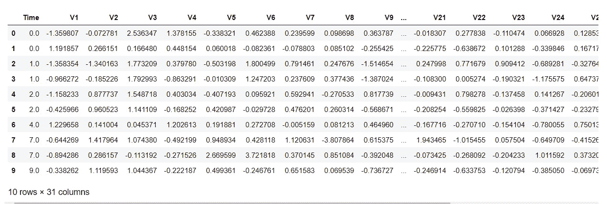
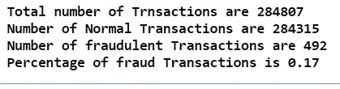
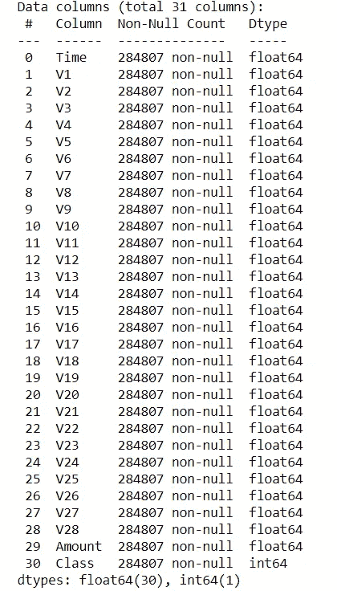
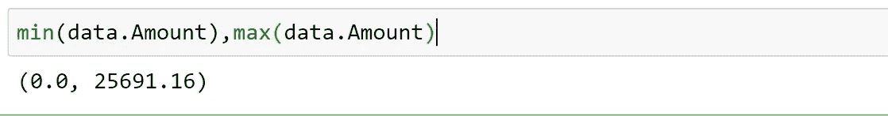
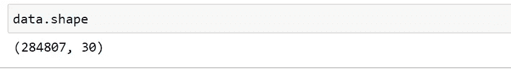
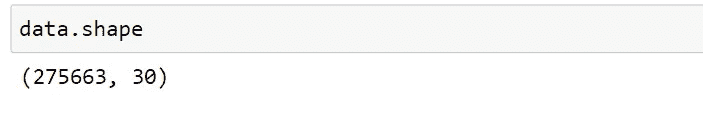
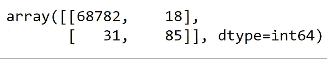

# 使用机器学习和 Python 进行信用卡欺诈检测

> 原文：<https://towardsdatascience.com/credit-card-fraud-detection-using-machine-learning-python-5b098d4a8edc?source=collection_archive---------1----------------------->

## 逐步指导构建、培训和评估


[自由股票](https://unsplash.com/@freestocks?utm_source=medium&utm_medium=referral)在 [Unsplash](https://unsplash.com?utm_source=medium&utm_medium=referral) 上的照片

随着我们迈向数字世界，网络安全正成为我们生活中至关重要的一部分。当我们谈论数字生活中的安全性时，主要的挑战是发现异常活动。

当我们在网上购买任何产品进行交易时，很多人更喜欢信用卡。信用卡的信用额度有时帮助我们购物，即使我们当时没有足够的钱。但是，另一方面，这些功能被网络攻击者滥用。

为了解决这个问题，我们需要一个系统，如果它发现可疑，可以中止交易。

这就需要一个系统来跟踪所有交易的模式，如果有任何模式异常，就应该中止交易。

今天，我们有许多机器学习算法可以帮助我们对异常交易进行分类。唯一的要求就是过去的数据和合适的算法，能够以更好的形式拟合我们的数据。

在本文中，我将在完整的端到端模型训练过程中为您提供帮助—最终，您将获得能够将事务分类为正常和异常类型的最佳模型。

# 关于数据

这篇文章的数据可以在[这里](https://www.kaggle.com/mlg-ulb/creditcardfraud)找到。该数据集包含欧洲持卡人在 2013 年进行的真实银行交易。出于安全考虑，实际变量没有共享，但它们是 PCA 的转换版本。结果，我们可以找到 29 个特性列和 1 个最终类列。



数据快照

# 导入必要的库

在一个地方导入所有必要的库是一个好的做法，这样我们可以快速修改它们。

对于此信用卡数据，数据集中的特征是 PCA 的转换版本，因此我们不需要再次执行特征选择。否则，建议使用 RFE、RFECV、选择最佳和 VIF 评分来查找您的模型的最佳功能。

> 直接从行业专家那里获得 Python 和数据科学的优质内容——使用我的推荐链接成为中级会员以解锁内容:[https://pranjalai.medium.com/membership](https://pranjalai.medium.com/membership)

# 导入数据集

导入数据集非常简单。可以用 python 中的熊猫模块导入。

运行以下命令导入您的数据。

```
data=pd.read_csv("creditcard.csv")
```

# 数据处理和理解

关于这些数据，您会注意到的一个主要问题是，数据集对某个要素不平衡。这似乎对这类数据非常有效。因为今天许多银行已经采用了不同的安全机制，所以黑客更难做出这样的举动。

尽管如此，有时当系统中存在一些漏洞时，此类活动的机会会增加。

这就是为什么我们可以看到大多数属于我们数据集的交易是正常的，只有少数交易是欺诈性的。

让我们检查一下交易分布。



只有 0.17%的交易是欺诈性的。

我们还可以使用下面一行代码来检查空值。

```
data.info()
```



根据每列的计数，我们没有空值。此外，功能选择不是这个用例的情况。无论如何，你可以尝试应用特征选择机制来检查结果是否被优化。

我在我们的数据中观察到 28 个特征是 PCA 的转换版本，但是数量是原始的。而且，当检查最小值和最大值时，我发现差异很大，可能会偏离我们的结果。



在这种情况下，调整这个变量是一个很好的做法。我们可以用一个标准的定标器来固定它。

```
sc = StandardScaler()
amount = data['Amount'].values
data['Amount'] = sc.fit_transform(amount.reshape(-1, 1))
```

我们还有一个变量是时间，它可能是一个外部决定因素，但在我们的建模过程中，我们可以放弃它。

```
data.drop(['Time'], axis=1, inplace=True)
```

我们还可以检查任何重复的交易。在删除任何重复的事务之前，我们的数据中有 284807 个事务。让我们删除重复，并观察变化。



运行下面一行代码来删除任何重复的内容。

```
data.drop_duplicates(inplace=True)
```

现在让我们再次检查计数。



因此，我们有大约 9000 个重复交易。

开始了。！我们现在已经有了正确的数据，没有重复，没有遗漏。现在让我们为我们的模型建设分裂它。

# 训练和测试分割

在分割训练和测试之前，我们需要定义因变量和自变量。因变量也被称为 **X** ，自变量被称为 **y.**

```
X = data.drop('Class', axis = 1).values
y = data['Class'].values
```

现在，让我们分开训练和测试数据。

```
X_train, X_test, y_train, y_test = train_test_split(X, y, test_size = 0.25, random_state = 1)
```

就是这样。我们现在有两个不同的数据集—训练数据将用于训练我们的模型，而不可见的数据将用于测试。

# 模型结构

我们将逐一尝试不同的机器学习模型。定义模型要容易得多。一行代码就可以定义我们的模型。同样地，一行代码就可以使模型符合我们的数据。

我们还可以通过选择不同的优化参数来调整这些模型。但是，如果精度更高，即使参数调整更少，也没必要让它变得复杂。

> 决策图表

```
DT = DecisionTreeClassifier(max_depth = 4, criterion = 'entropy')
DT.fit(X_train, y_train)
dt_yhat = DT.predict(X_test)
```

让我们检查一下决策树模型的准确性。

```
print('Accuracy score of the Decision Tree model is {}'.format(accuracy_score(y_test, tree_yhat)))**Accuracy score of the Decision Tree model is 0.999288989494457**
```

检查决策树模型的 F1 分数。

```
print('F1 score of the Decision Tree model is {}'.format(f1_score(y_test, tree_yhat)))**F1 score of the Decision Tree model is 0.776255707762557**
```

检查混淆矩阵:

```
confusion_matrix(y_test, tree_yhat, labels = [0, 1])
```



这里，第一行代表正，第二行代表负。因此，我们有 68782 个是真阳性，18 个是假阳性。也就是说，在 68782+18=68800 笔交易中，我们有 68782 笔成功归类为正常交易，18 笔被错误归类为正常交易，但它们是欺诈交易。

现在让我们尝试不同的模型，并检查它们的性能。

> k-最近邻

```
n = 7
KNN = KNeighborsClassifier(n_neighbors = n)
KNN.fit(X_train, y_train)
knn_yhat = KNN.predict(X_test)
```

让我们检查一下 K 近邻模型的准确性。

```
print('Accuracy score of the K-Nearest Neighbors model is {}'.format(accuracy_score(y_test, knn_yhat)))**Accuracy score of the K-Nearest Neighbors model is 0.999506645771664**
```

检查 K-最近邻模型的 F1 值。

```
print('F1 score of the K-Nearest Neighbors model is {}'.format(f1_score(y_test, knn_yhat)))**F1 score of the K-Nearest Neighbors model is 0.8365384615384616**
```

> 逻辑回归

```
lr = LogisticRegression()
lr.fit(X_train, y_train)
lr_yhat = lr.predict(X_test)
```

让我们检查我们的逻辑回归模型的准确性。

```
print('Accuracy score of the Logistic Regression model is {}'.format(accuracy_score(y_test, lr_yhat)))**Accuracy score of the Logistic Regression model is 0.9991148644726914**
```

检查逻辑回归模型的 F1 分数。

```
print('F1 score of the Logistic Regression model is {}'.format(f1_score(y_test, lr_yhat)))**F1 score of the Logistic Regression model is 0.6934673366834171**
```

> 支持向量机

```
svm = SVC()
svm.fit(X_train, y_train)
svm_yhat = svm.predict(X_test)
```

让我们检查我们的支持向量机模型的准确性。

```
print('Accuracy score of the Support Vector Machines model is {}'.format(accuracy_score(y_test, svm_yhat)))**Accuracy score of the Support Vector Machines model is 0.9993615415868594**
```

检查支持向量机模型的 F1 分数。

```
print('F1 score of the Support Vector Machines model is {}'.format(f1_score(y_test, svm_yhat)))**F1 score of the Support Vector Machines model is 0.7777777777777779**
```

> 随机森林

```
rf = RandomForestClassifier(max_depth = 4)
rf.fit(X_train, y_train)
rf_yhat = rf.predict(X_test)
```

让我们检查一下随机森林模型的准确性。

```
print('Accuracy score of the Random Forest model is {}'.format(accuracy_score(y_test, rf_yhat)))**Accuracy score of the Random Forest model is 0.9993615415868594**
```

检查随机森林模型的 F1 分数。

```
print('F1 score of the Random Forest model is {}'.format(f1_score(y_test, rf_yhat)))**F1 score of the Random Forest model is 0.7843137254901961**
```

> XGBoost

```
xgb = XGBClassifier(max_depth = 4)
xgb.fit(X_train, y_train)
xgb_yhat = xgb.predict(X_test)
```

让我们检查一下 XGBoost 模型的准确性。

```
print('Accuracy score of the XGBoost model is {}'.format(accuracy_score(y_test, xgb_yhat)))**Accuracy score of the XGBoost model is 0.9995211561901445**
```

检查 XGBoost 模型的 F1 分数。

```
print('F1 score of the XGBoost model is {}'.format(f1_score(y_test, xgb_yhat)))**F1 score of the XGBoost model is 0.8421052631578947**
```

# 结论

恭喜你。！我们刚刚获得了 99.95%的信用卡欺诈检测准确率。这个数字并不令人惊讶，因为我们的数据偏向一个类别。我们从混淆矩阵中注意到的好事情是——我们的模型没有过度拟合。

最后，根据我们的准确度得分，XGBoost 在我们的案例中胜出。这里唯一的问题是我们收到的用于模型训练的数据。数据特征是 PCA 的变换版本。如果实际特征遵循相似的模式，那么我们做得很好！！

> *在你走之前……*

如果你喜欢这篇文章，并希望**继续关注更多关于 **Python &数据科学**的**精彩文章**——请点击这里[https://pranjalai.medium.com/membership](https://pranjalai.medium.com/membership)考虑成为中级会员。**

请考虑使用[我的推荐链接](https://pranjalai.medium.com/membership)注册。通过这种方式，会员费的一部分归我，这激励我写更多关于 Python 和数据科学的令人兴奋的东西。

还有，可以随时订阅我的免费简讯: [**Pranjal 的简讯**](https://pranjalai.medium.com/subscribe) 。