# 使用 Python 和机器学习进行犯罪地点分析和预测

> 原文：<https://towardsdatascience.com/crime-location-analysis-and-prediction-using-python-and-machine-learning-1d8db9c8b6e6?source=collection_archive---------5----------------------->

## 使用 Python、Folium 和 ScyPy，可以构建模型来说明犯罪事件，计算安全事件资源分配的最佳位置，并在非常规事件期间突出显示我们社区中安全关注的关键领域


作者拍摄的摩根敦照片

这篇文章的作者是一位自豪的西弗吉尼亚大学登山运动员，在西弗吉尼亚的摩根敦度过了四年。摩根敦是山州的一座美丽城市，WVU 的校园非常安全。也就是说，像所有城市一样，安全事故确实会发生，大学警察局每天都会在[犯罪日志](https://police.wvu.edu/clery-act/campus-safety/crime-log)中报告这些事件。通过 Python 中的编码包进行分析，可以在地理上更好地可视化这些事件，以评估位置趋势、事件类型、基于一天中时间的事件可能性，以及非常规事件(如足球周末，城镇人口暂时翻倍)期间的趋势。

在 2019 年底，作者详细分析了前一个秋季学期的安全事件日志，并在 JSON schema 中创建了前四个月的数据集，如下所示。

```
{"case": casenumber (Integer),"crime": text (String),"occurred": date and time (String),"comments": text (String),"building": place (String),"address": place (String),"disposition": disposition (String),},
```

在此期间，总共发生了大约 1500 个独特的事件，这些事件保存在一个 JSON 文件中。

开始我们的项目，我们首先需要导入下面的包。

```
# Basic Analysis and Visualization
import pandas as pd
import numpy as np
import matplotlib as mpl
import matplotlib.pyplot as plt
import math
from datetime import timedelta# Mapping
import geopandas
import geopy
from geopy.geocoders import Nominatim
import folium
from geopy.extra.rate_limiter import RateLimiter
from folium import plugins
from folium.plugins import MarkerCluster# Statistical OLS Regression Analysis
%matplotlib inline
import statsmodels.api as sm
from statsmodels.compat import lzip
from statsmodels.formula.api import ols#Scipy sklearn Predictions
from sklearn.ensemble import GradientBoostingRegressor
```

接下来，我们将所有事件从文件导入到程序中。

```
# Pull in JSON and set index as case number (unique key)
df = pd.read_json("MC.json",orient="records")
df = df.set_index("case")
df
```

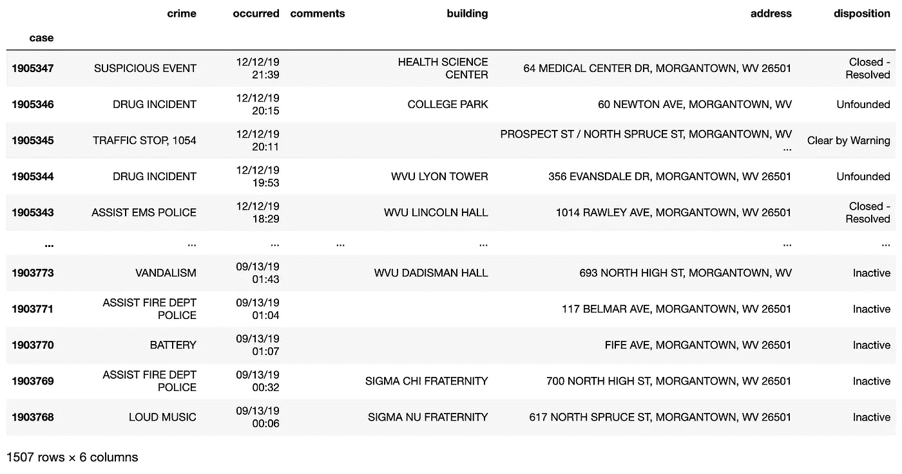

生成的熊猫数据框

我们还应该转换我们的 occurrence 列，以使新的日期、时间和星期几列符合日期-时间模式。我们还应该从数据集中删除任何没有根据的事件。

```
# Convert time objects
df['occurred'] = pd.to_datetime(df['occurred'])
df['date'] = [d.date() for d in df['occurred']]
df['time'] = [d.time() for d in df['occurred']]
df['day'] = df['occurred'].dt.day_name()
# Find Fractions of Day
df['timeint'] = (df['occurred']-df['occurred'].dt.normalize()).dt.total_seconds()/timedelta(days=1).total_seconds()# Remove unfounded events
df = df[df['disposition'] != 'Unfounded']
```

现在让我们也为数据集获取地理数据。 [Abdishakur](https://medium.com/u/d4284ce02aec?source=post_page-----1d8db9c8b6e6--------------------------------) 有一篇很棒的文章[在这里](/geocode-with-python-161ec1e62b89)我们可以跟随收集这些数据，实现如下。

```
locator = Nominatim(user_agent='myGeocoder')
location = locator.geocode('Morgantown, West Virginia')# 1 - conveneint function to delay between geocoding calls
geocode = RateLimiter(locator.geocode, min_delay_seconds=0.5)
# 2- - create location column
df['location'] = df['address'].apply(geocode)
# 3 - create longitude, latitude and altitude from location column (returns tuple)
df['point'] = df['location'].apply(lambda loc: tuple(loc.point) if loc else None)
# 4 - split point column into latitude, longitude and altitude columns and remove empty points
df = df[df['point'].notnull()]
df[['latitude', 'longitude', 'altitude']] = pd.DataFrame(df['point'].tolist(), index=df.index)
df.head()
```

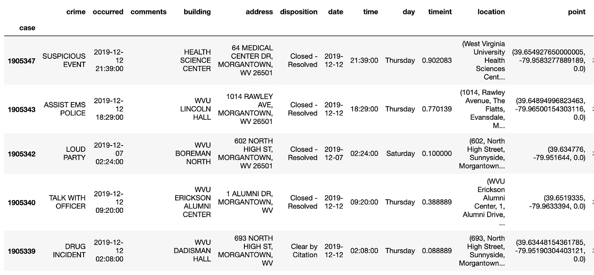

生成的熊猫数据框

评估我们现在完整的数据集，我们可以开始注意到一些趋势。

```
df.groupby("crime")["crime"].count().sort_values()
```

这里记录的大多数事件都是在酒精影响下做出错误决策的结果，在宿舍破坏大学财产，或在非法停车区如保留区停车。

```
VEHICLE ACCIDENT           28
ALARM CONDITION            30
LARCENY                    32
FIRE ALARM                 43
DESTRUCTION OF PROPERTY    55
DRUG INCIDENT              69
TALK WITH OFFICER          74
ABCC VIOLATION             84
ASSIST EMS POLICE          86
BACK TICKET TOW            99
```

这些事件最常发生的地点也反映了向成熟和成年过渡的挑战，大多数发生在宿舍内。

```
df.groupby("building")["building"].count().sort_values()BLUE LOT                                     21
WVU MOUNTAINLAIR                             23
WVU BOREMAN SOUTH                            23
COLLEGE PARK                                 23
WVU SENECA HALL                              25
WVU POLICE DEPARTMENT                        28
WVU SUMMIT HALL                              28
WVU BROOKE TOWER                             29
HEALTH SCIENCE CENTER                        55
WVU DADISMAN HALL                            56
```

最后，我们还可以注意到，一些报道的安全事件最多的日子也是非常规事件发生的日子，例如足球比赛日。

```
df.groupby("date")["date"].count().sort_values()2019-11-01    21 # WVU vs Baylor
2019-10-05    27 # WVU vs Texas
2019-11-09    31 # WVU vs Texas Tech
```

分析完数据框后，现在让我们使用 Folium 在地图上可视化数据。以下代码在开放街道地图上绘制点，并带有发生事件类型的指示器。

```
# Mark events with names on map
m = folium.Map([39.645,-79.96], zoom_start=14)
for index, row in df.iterrows():
    folium.CircleMarker([row['latitude'], row['longitude']],
                        radius=3,
                        popup=row['crime'],
                        fill_color="#3db7e4", # divvy color
                       ).add_to(m)
m
```

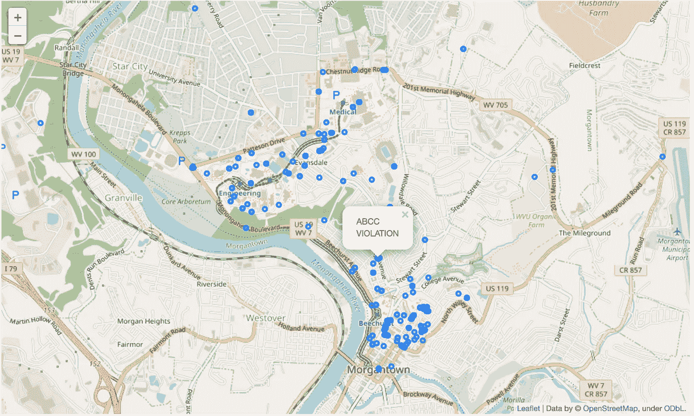

生成的树叶地图

虽然这些指标很有用，并且我们可以放大地图以查看它们的详细信息，但额外的热图将提高多个指标可能重叠的高频区域的可见性。

```
# convert to (n, 2) nd-array format for heatmap
dfmatrix = df[['latitude', 'longitude']].values# plot heatmap
m.add_child(plugins.HeatMap(dfmatrix, radius=15))
m
```

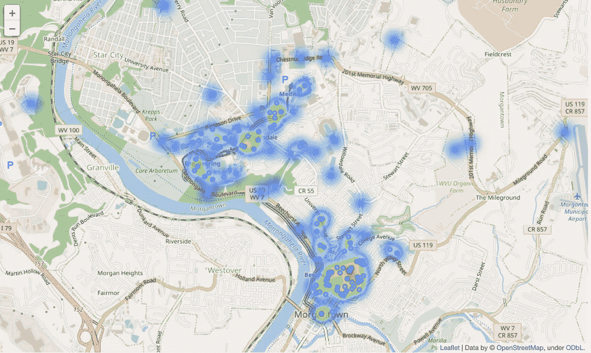

突出显示高频区域的渲染热图

从安全事件的渲染热图中，我们可以看到埃文斯代尔校园中靠近人口稠密的塔楼宿舍和足球场的高频率区域，以及靠近 Frat Row 和高街的市中心校园，那里有很多夜生活，这对于一个大学城来说并不奇怪。

早些时候，我们注意到安全事故最多的日子恰好是足球比赛日。我们的数据可以帮助评估最佳位置，为未来的游戏日提供紧急服务。最活跃的比赛是 2019 年 11 月 9 日对阵德州理工的比赛。我们可以用下面的代码过滤一天的数据集。

```
incidents_on_nov09 = df[df['date'] == pd.datetime(2019,11,9).date()]
```

现在让我们通过重用之前的脚本来可视化这些过滤后的事件。

```
# Map points of events
m2 = folium.Map([39.645,-79.96], zoom_start=14)
for index, row in incidents_on_nov09.iterrows():
    folium.CircleMarker([row['latitude'], row['longitude']],
                        radius=5,
                        popup=row['crime'],
                        fill_color="#3db7e4", # divvy color
                       ).add_to(m2)
# convert to (n, 2) nd-array format for heatmap
dfmatrix = incidents_on_nov09[['latitude', 'longitude']].values# plot heatmap
m2.add_child(plugins.HeatMap(dfmatrix, radius=15))
m2
```

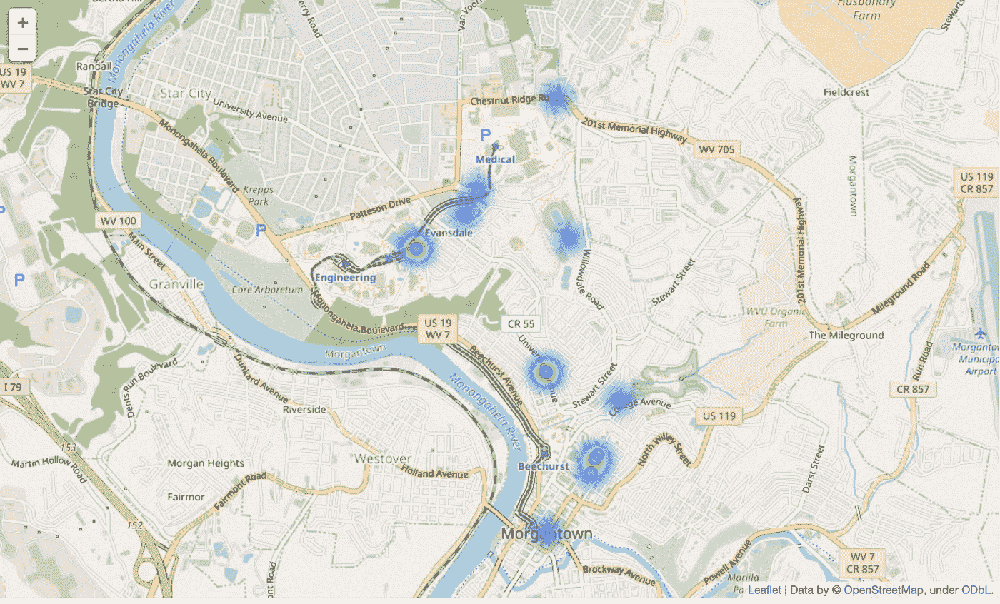

11 月 9 日安全事件的渲染热图

我们可以看到事件发生在整个城镇。使用这些事件的纬度和经度，我们可以找到最优资源分配的质心。如果我们有一辆救护车，为了最快的平均响应时间，将它放置在全天待命的频率加权的每个点的中间将是最有效的。我们可以用这个代码找到质心。

```
lat = []
long = []
for index, row in incidents_on_nov09.iterrows():
  lat.append(row["latitude"])
  long.append(row["longitude"])lat1=sum(lat)/len(lat)
lat2=sum(long)/len(long)
folium.CircleMarker([lat1,lat2],
                        radius=5,
                        popup="CENTER LOCATION",
                        color='black',
                        fill_color="#3db7e4", # divvy color
                       ).add_to(m2)
m2
```

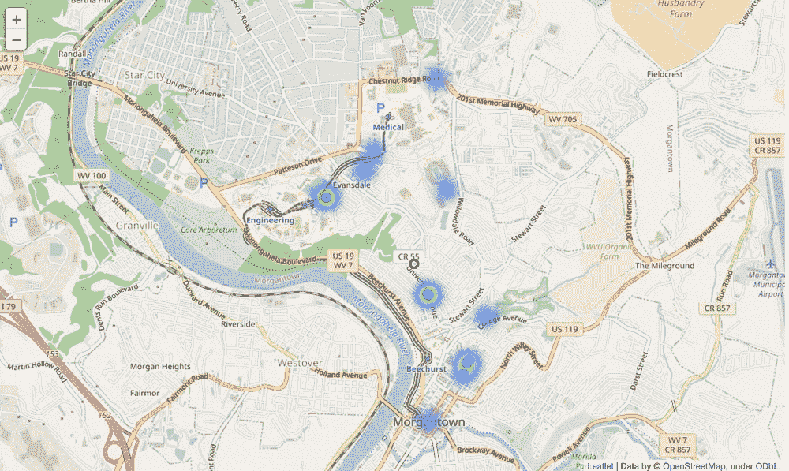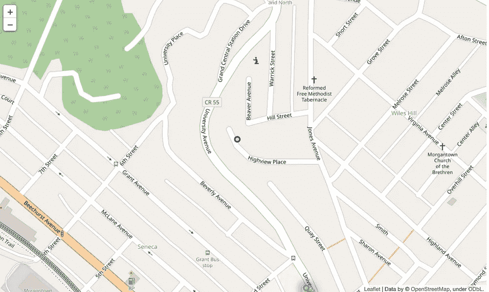

注意地图上的黑色圆圈——事件的质心

上面地图中的黑色圆圈显示了 11 月 9 日的质心。如果我们要在未来的比赛日推出紧急服务，为了最快的平均响应速度，在 Univeristy Avenue 和 Jones Avenue 之间推出是值得的。

如果我们想改变我们的时间框架呢？比赛结束后，比赛当天晚上的质心是多少？

```
after9PM = incidents_on_nov09[incidents_on_nov09['time'] >= pd.datetime(2019,11,9,21,0,0).time()]lat = []
long = []
for index, row in after9PM.iterrows():
  lat.append(row["latitude"])
  long.append(row["longitude"])lat1=sum(lat)/len(lat)
lat2=sum(long)/len(long)
folium.CircleMarker([lat1,lat2],
                        radius=5,
                        popup="LATE HOURS LOCATION",
                        color='red',
                        fill_color="#3db7e4", # divvy color
                       ).add_to(m2)
m2
```

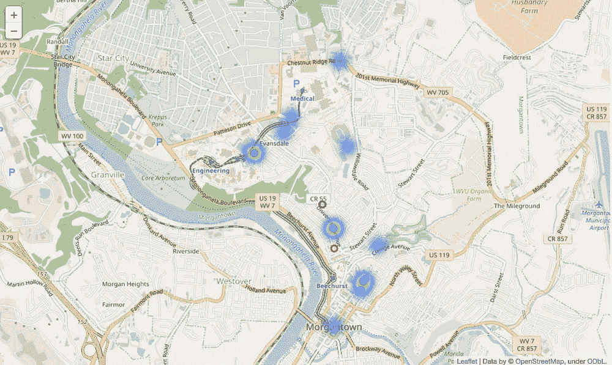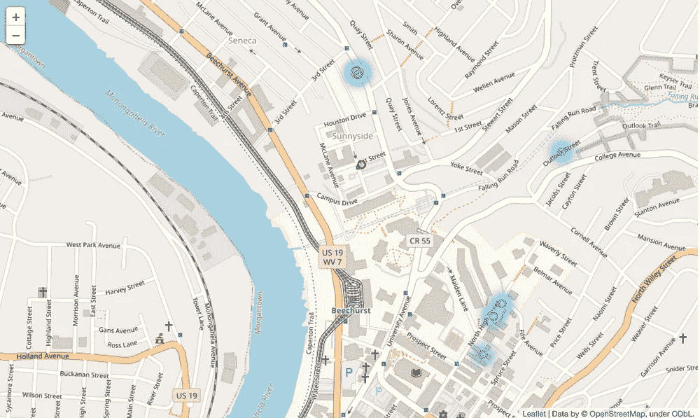

红色圆圈是 11 月 9 日晚 9 点以后事件的重心

请注意，现在最佳集结地转移到了更远的市中心，朝着第一街和生命科学大楼。

我们可以使用时间序列数据和机器学习来预测下一次事件的位置吗？为了进一步研究这个问题，我们需要配置两个预测模型——一个用于纬度，一个用于经度。我们将使用“timeint”列，或时间间隔或一天中的一部分，以及 scikit 来使用梯度推进回归进行预测。下面的代码受到这个[例子](https://scikit-learn.org/stable/auto_examples/ensemble/plot_gradient_boosting_quantile.html#sphx-glr-auto-examples-ensemble-plot-gradient-boosting-quantile-py)的启发，它正在根据我们的数据开发一个预测模型。本教程并不打算完美地解释我们预测背后的数学，scikitlearn 在这方面做得很好，但重要的是，我们正在使用数据集创建一个从均方误差得出的 90%置信区间的函数。

```
#----------------------------------------------------------------------
#  First the noiseless case
X = np.atleast_2d(df['timeint'].values).T# Observations
y = np.atleast_2d(df['latitude'].values).T# Mesh the input space for evaluations of the real function, the prediction and
# its MSE
xx = np.atleast_2d(np.linspace(0, 1, 913)).T
xx = xx.astype(np.float32)alpha = 0.95clf = GradientBoostingRegressor(loss='quantile', alpha=alpha,
                                n_estimators=250, max_depth=3,
                                learning_rate=.1, min_samples_leaf=9,
                                min_samples_split=9)clf.fit(X, y)# Make the prediction on the meshed x-axis
y_upper = clf.predict(xx)clf.set_params(alpha=1.0 - alpha)
clf.fit(X, y)# Make the prediction on the meshed x-axis
y_lower = clf.predict(xx)clf.set_params(loss='ls')
clf.fit(X, y)# Make the prediction on the meshed x-axis
y_pred = clf.predict(xx)# Plot the function, the prediction and the 90% confidence interval based on
# the MSE
fig = plt.figure()
plt.figure(figsize=(20,10))
plt.plot(X, y, 'b.', markersize=10, label=u'Observations')
plt.plot(xx, y_pred, 'r-', label=u'Prediction')
plt.plot(xx, y_upper, 'k-')
plt.plot(xx, y_lower, 'k-')
plt.fill(np.concatenate([xx, xx[::-1]]),
         np.concatenate([y_upper, y_lower[::-1]]),
         alpha=.5, fc='b', ec='None', label='90% prediction interval')
plt.xlabel('$Time of Day by Fraction$')
plt.ylabel('$Latitude$')
plt.ylim(39.6, 39.7)
plt.legend(loc='upper right')
plt.show()ypred2 = y_pred
```

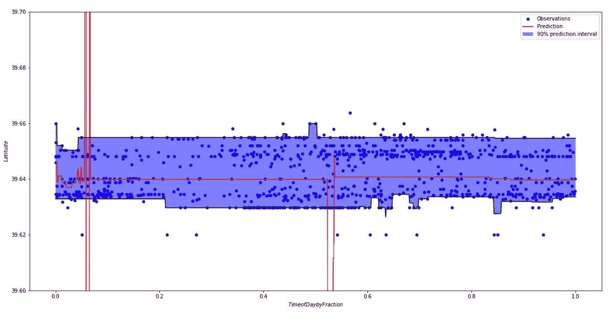

上述模型的预测结果

我们可以看到，我们的数据在纬度轴上几乎是双峰的，一天中的时间并不能很好地预测南北方向的变化。

```
#----------------------------------------------------------------------
#  First the noiseless case
X = np.atleast_2d(df['timeint'].values).T# Observations
y = np.atleast_2d(df['longitude'].values).T# Mesh the input space for evaluations of the real function, the prediction and
# its MSE
xx = np.atleast_2d(np.linspace(0, 1, 913)).T
xx = xx.astype(np.float32)alpha = 0.95clf = GradientBoostingRegressor(loss='quantile', alpha=alpha,
                                n_estimators=250, max_depth=3,
                                learning_rate=.1, min_samples_leaf=9,
                                min_samples_split=9)clf.fit(X, y)# Make the prediction on the meshed x-axis
y_upper = clf.predict(xx)clf.set_params(alpha=1.0 - alpha)
clf.fit(X, y)# Make the prediction on the meshed x-axis
y_lower = clf.predict(xx)clf.set_params(loss='ls')
clf.fit(X, y)# Make the prediction on the meshed x-axis
y_pred = clf.predict(xx)# Plot the function, the prediction and the 90% confidence interval based on
# the MSE
fig = plt.figure()
plt.figure(figsize=(20,10))
plt.plot(X, y, 'b.', markersize=10, label=u'Observations')
plt.plot(xx, y_pred, 'r-', label=u'Prediction')
plt.plot(xx, y_upper, 'k-')
plt.plot(xx, y_lower, 'k-')
plt.fill(np.concatenate([xx, xx[::-1]]),
         np.concatenate([y_upper, y_lower[::-1]]),
         alpha=.5, fc='b', ec='None', label='90% prediction interval')
plt.xlabel('$Time of Day by Fraction$')
plt.ylabel('$Longitude$')
plt.ylim(-80, -79.9)
plt.legend(loc='upper right')
plt.show()ypred1 = y_pred
```

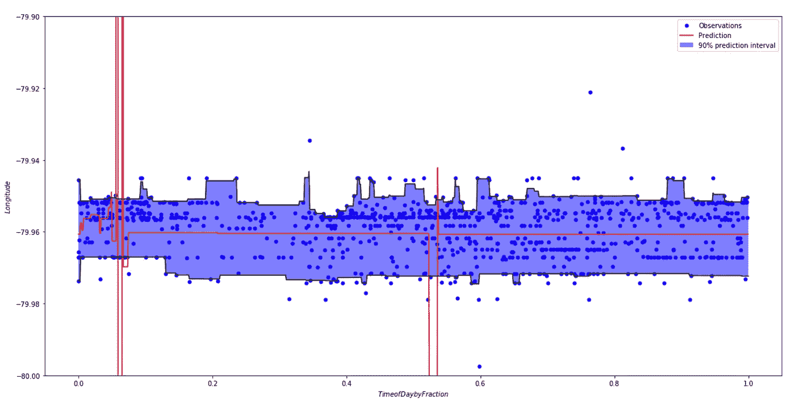

上述模型的预测结果

类似地，我们可以看到东经和西经的趋势几乎不存在，但是数据几乎没有分裂，并且具有更均匀分布的点。如果我们试图预测一天结束时的后续事件，我们也会期望注意到趋势的缺乏，并期望预测质心附近的安全事件，或经度和纬度的平均值。

```
# Map points of events
m5 = folium.Map([39.645,-79.96], zoom_start=14)
for i in range(len(ypred1)):
    folium.CircleMarker([ypred2[i], ypred1[i]],
                        radius=4,
                        popup=str(i),
                        fill_color="#3db7e4", # divvy color
                       ).add_to(m5)
m5
```

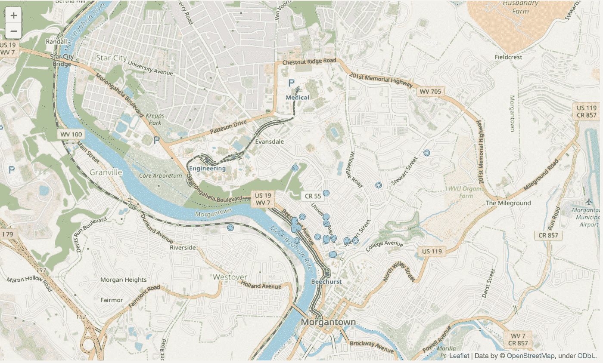

所有事件质心附近的预测事件

评估我们数据的“预测”时间序列，除了证实安全事故发生时间与城镇平均位置之间缺乏因果关系之外，没有给出明确的结论。虽然这可能每天都有变化，或者在特殊情况下，我们确实注意到我们在纬度上的趋势显示双峰，或者南北摩根敦之间的部分区别。如果我们分别评估这两个区域，也许我们可以收集新的资源分配重点区域，例如北部备用位置和南部备用位置。

```
dfDowntown = df[df['latitude']<=39.6425]
```

我们可以首先从上一个数据集中分离出近似函数线上的数据。然后，我们将仅根据市中心的数据再次完成我们的模型回归。

```
#----------------------------------------------------------------------
#  First the noiseless case
X = np.atleast_2d(dfDowntown['timeint'].values).T# Observations
y = np.atleast_2d(dfDowntown['latitude'].values).T# Mesh the input space for evaluations of the real function, the prediction and
# its MSExx = np.atleast_2d(np.linspace(0, 1, 535)).T
xx = xx.astype(np.float32)alpha = 0.95clf = GradientBoostingRegressor(loss='quantile', alpha=alpha,
                                n_estimators=250, max_depth=3,
                                learning_rate=.1, min_samples_leaf=9,
                                min_samples_split=9)clf.fit(X, y)# Make the prediction on the meshed x-axis
y_upper = clf.predict(xx)clf.set_params(alpha=1.0 - alpha)
clf.fit(X, y)# Make the prediction on the meshed x-axis
y_lower = clf.predict(xx)clf.set_params(loss='ls')
clf.fit(X, y)# Make the prediction on the meshed x-axis
y_pred = clf.predict(xx)# Plot the function, the prediction and the 90% confidence interval based on
# the MSE
fig = plt.figure()
plt.figure(figsize=(20,10))
plt.plot(X, y, 'b.', markersize=10, label=u'Observations')
plt.plot(xx, y_pred, 'r-', label=u'Prediction')
plt.plot(xx, y_upper, 'k-')
plt.plot(xx, y_lower, 'k-')
plt.fill(np.concatenate([xx, xx[::-1]]),
         np.concatenate([y_upper, y_lower[::-1]]),
         alpha=.5, fc='b', ec='None', label='90% prediction interval')
plt.xlabel('$Time of Day by Fraction$')
plt.ylabel('$Latitude$')
plt.ylim(39.6, 39.7)
plt.legend(loc='upper right')
plt.show()ypred2 = y_pred
```

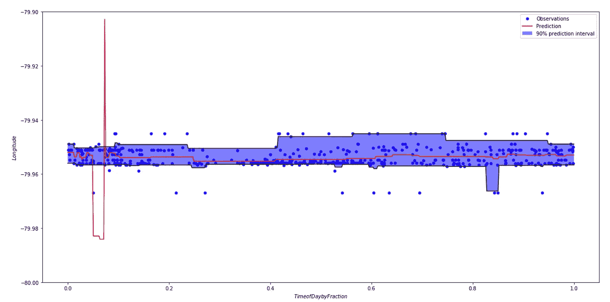

结果预测区间

```
#----------------------------------------------------------------------
#  First the noiseless case
X = np.atleast_2d(dfDowntown['timeint'].values).T# Observations
y = np.atleast_2d(dfDowntown['longitude'].values).T# Mesh the input space for evaluations of the real function, the prediction and
# its MSE
xx = np.atleast_2d(np.linspace(0, 1, 535)).T
xx = xx.astype(np.float32)alpha = 0.95clf = GradientBoostingRegressor(loss='quantile', alpha=alpha,
                                n_estimators=250, max_depth=3,
                                learning_rate=.1, min_samples_leaf=9,
                                min_samples_split=9)clf.fit(X, y)# Make the prediction on the meshed x-axis
y_upper = clf.predict(xx)clf.set_params(alpha=1.0 - alpha)
clf.fit(X, y)# Make the prediction on the meshed x-axis
y_lower = clf.predict(xx)clf.set_params(loss='ls')
clf.fit(X, y)# Make the prediction on the meshed x-axis
y_pred = clf.predict(xx)# Plot the function, the prediction and the 90% confidence interval based on
# the MSE
fig = plt.figure()
plt.figure(figsize=(20,10))
plt.plot(X, y, 'b.', markersize=10, label=u'Observations')
plt.plot(xx, y_pred, 'r-', label=u'Prediction')
plt.plot(xx, y_upper, 'k-')
plt.plot(xx, y_lower, 'k-')
plt.fill(np.concatenate([xx, xx[::-1]]),
         np.concatenate([y_upper, y_lower[::-1]]),
         alpha=.5, fc='b', ec='None', label='90% prediction interval')
plt.xlabel('$Time of Day by Fraction$')
plt.ylabel('$Longitude$')
plt.ylim(-80, -79.9)
plt.legend(loc='upper right')
plt.show()ypred1 = y_pred
```

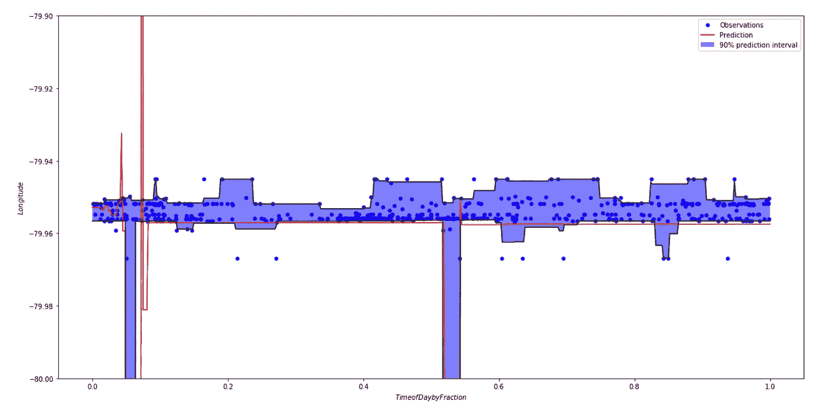

结果预测区间

我们现在可以注意到一个更紧密、更灵敏的预测和预测区间。绘制完成后，我们还可以看到我们可能希望评估安全响应可用性的重点领域。

```
# Map points of events
m7 = folium.Map([39.645,-79.96], zoom_start=14)
for i in range(len(ypred2)):
    folium.CircleMarker([ypred2[i], ypred1[i]],
                        radius=4,
                        popup=str(i),
                        fill_color="#3db7e4", # divvy color
                       ).add_to(m7)
# convert to (n, 2) nd-array format for heatmap
matrix = np.column_stack((ypred2,ypred1))# plot heatmap
m7.add_child(plugins.HeatMap(matrix, radius=15))
m7
```

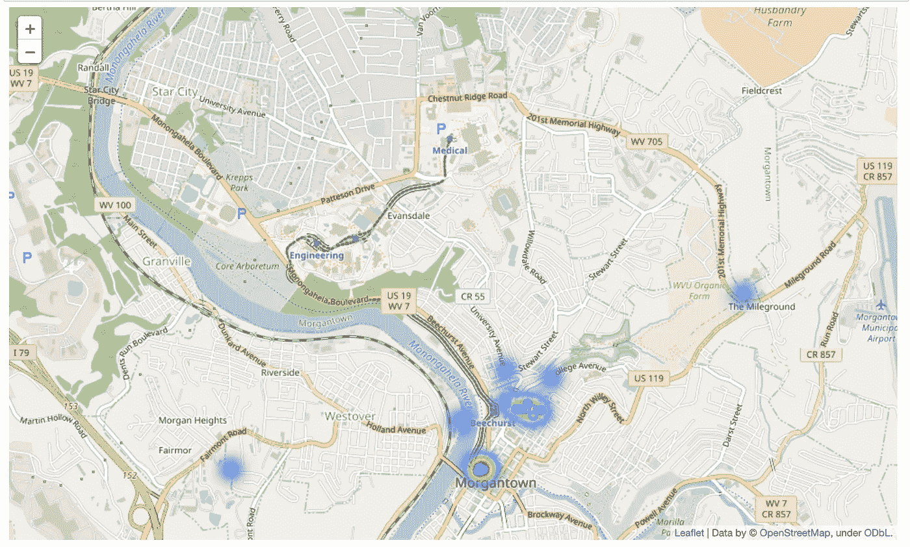

预测的安全服务需求

现在同样的事情也可以在埃文斯代尔发生。

```
dfEvansdale = df[df['latitude']>39.6425]
```

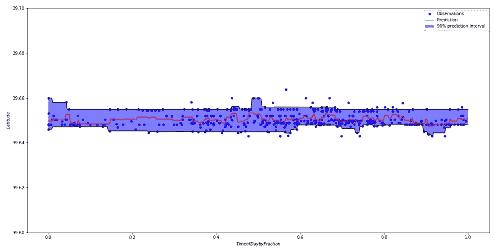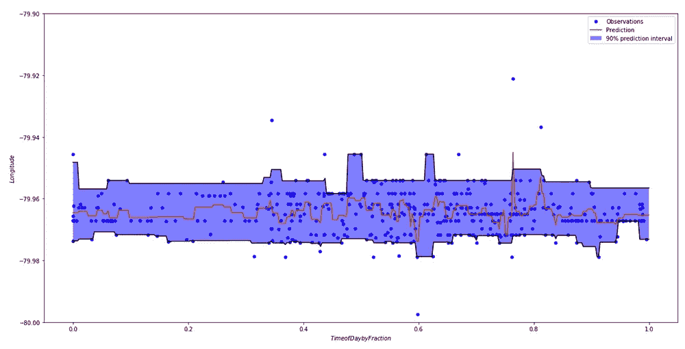

埃文斯代尔纬度和经度的预测

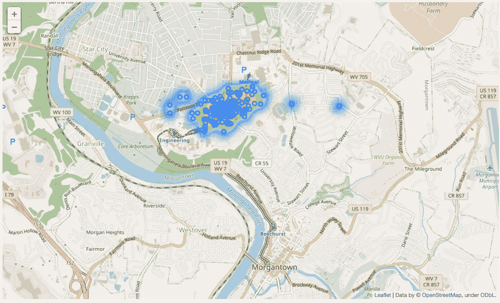

埃文斯代尔校区及其附近的预测位置

从这些数据中，我们可以看到在埃文斯代尔园区提供安全服务的一个很好的位置是靠近塔楼宿舍和足球场附近的娱乐中心。

基于时间序列数据对机器学习进行建模可能非常具有挑战性，而在因果关系明确的情况下，实现起来要容易得多。这个项目未来的步骤可能是寻找更多的因果关系指标或进一步过滤数据，例如在比赛日或周末，甚至按事件的性质。这些数据的目的不是完美地预测接近随机的事件将在何时何地发生，而是为了更好地了解如何为事件做准备，并找到举办事件快速服务的良好位置。该应用程序还可以应用于多个其他来源，例如其他大学甚至城市的事件数据(如果 API 或数据报告可用的话)。

如需进一步了解，请查看[我的一些其他文章](https://medium.com/@willkeefe)和金融数据预测工具！请跟我来，让我知道你的想法！