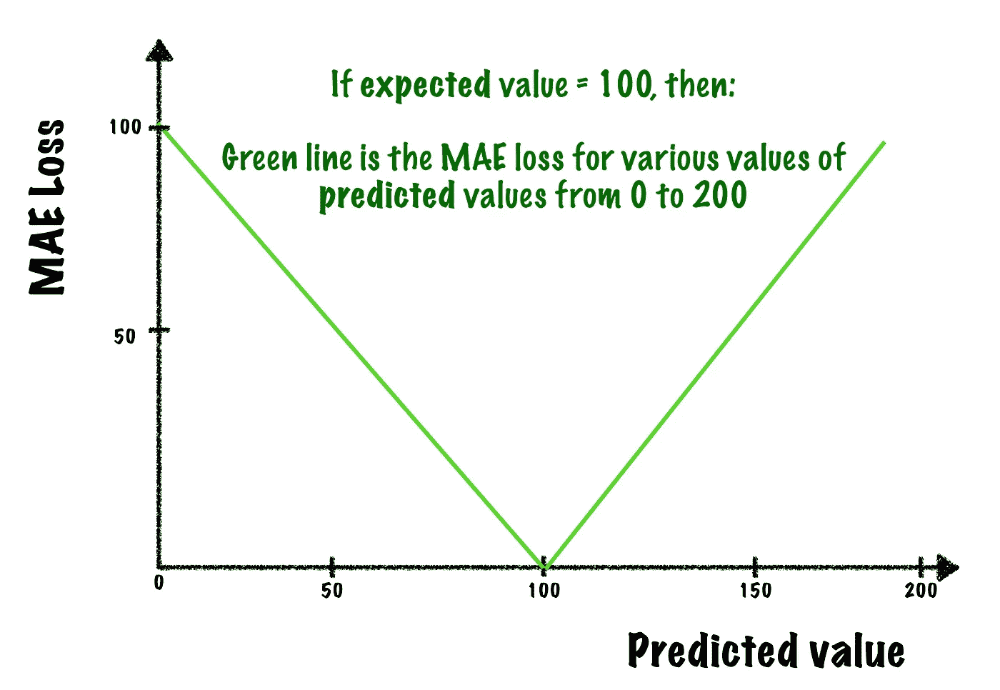
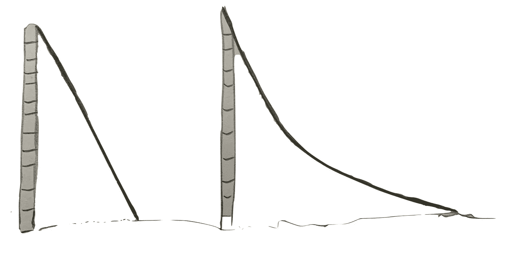
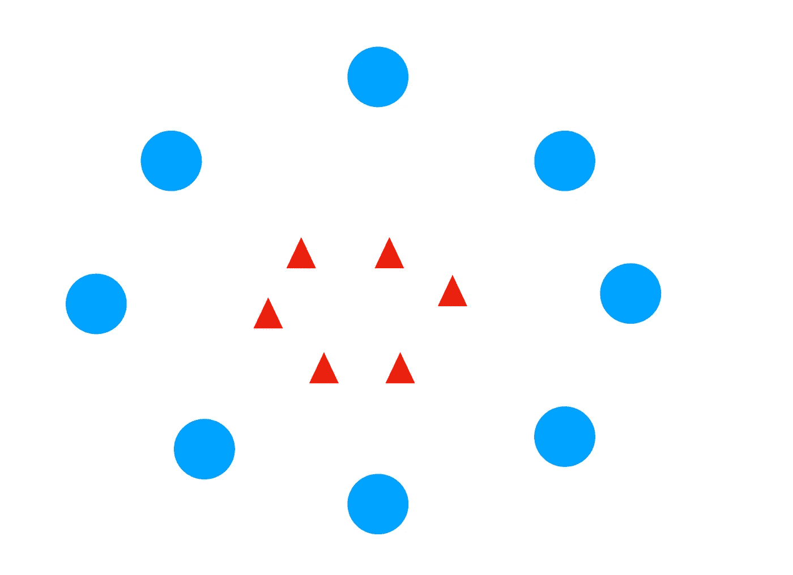
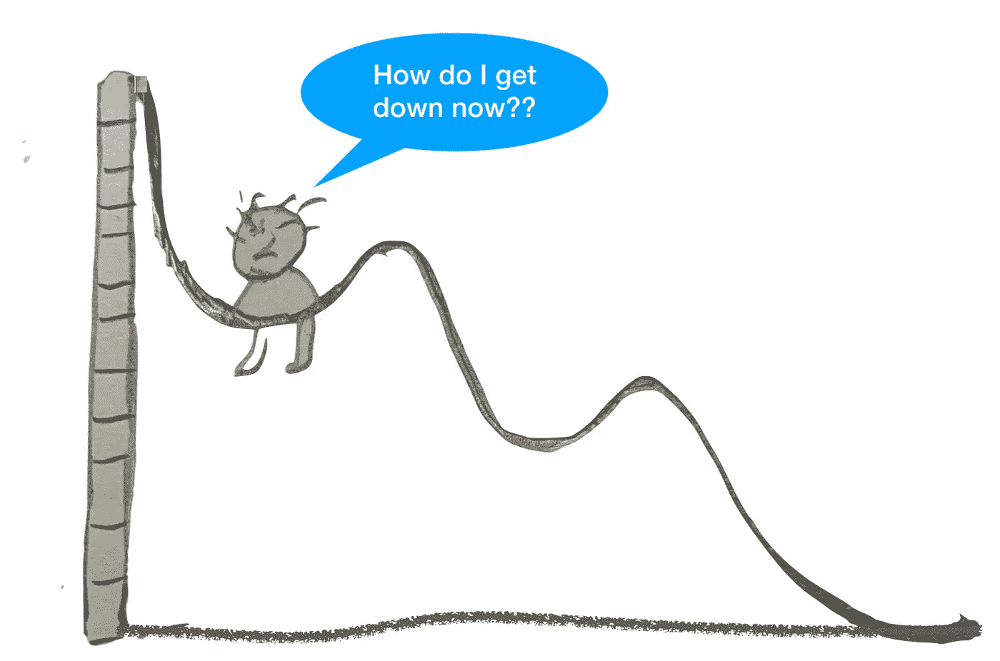
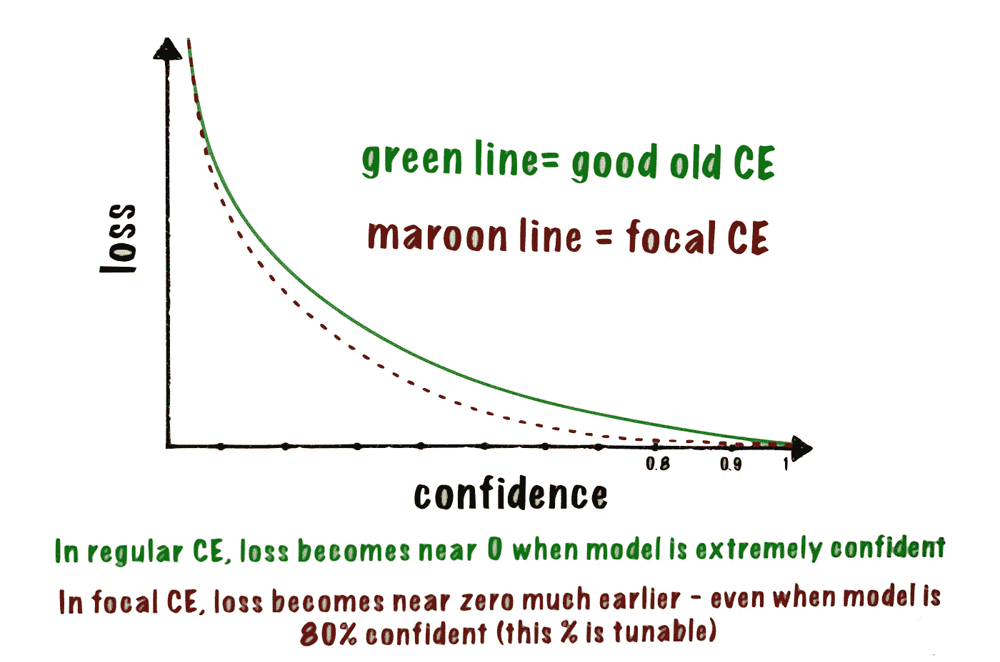

# 交叉熵和分类损失——没有数学，很少的故事，大量的直觉

> 原文：<https://towardsdatascience.com/cross-entropy-classification-losses-no-math-few-stories-lots-of-intuition-d56f8c7f06b0?source=collection_archive---------9----------------------->

## 每次损失都会有所收获

ML 竞赛最期待的部分是赛后讨论。赢家会慷慨地分享成功和失败的策略。在最近的一次比赛中，获胜者谈到了在他的模型中使用*屏蔽的、有焦点损失的二元交叉熵*。损失函数可能是 ML 模型中最关键的部分。选择正确的损失函数可以对模型输出产生巨大的影响。*焦、蒙面、十字、熵*——每个词背后似乎都藏着一个有趣的故事，等待被揭开。让我们从**熵**说起。

图片来源——unsplash.com。作者所做的细微修改

1953 年，在贝尔实验室工作的克劳德·香农雇佣了两名助手——马文·明斯基和约翰·麦卡锡，引发了一系列改变世界的事件。他们在那个时代的一个领域有着共同的兴趣，这个领域被称为“思维机器”，他们正式命名为“人工智能”。马文·明斯基和约翰·麦卡锡都成为了人工智能的传奇，但我们的故事要追溯到香农在十年前做的一件非常有趣的事情。在我们的上下文中使用的熵这个词的起源可以追溯到他在 1948 年写的一篇论文，在这篇论文中，香农为整个通信基础设施奠定了基础，并开创了现代信息时代。

假设你想和一个在不同国家的朋友交流。因为你们的共同爱好是板球，所以你们谈论最多的是理查兹、加瓦斯卡、哈德利和博瑟姆(如果这些名字不熟悉，你可以回想几代以前的板球之神……请*！不要对作者的年龄做任何推测。*

为了简单起见，让我们假设你的词汇量仅限于这四个词。传输介质需要 1 和 0，所以你需要对这 4 个字进行二进制编码。你需要 2 位…所以每个单词都有一个表示法——00、01、10 和 11。现在你可以尽情地交流了！但是有一个小小的挑战。我们看到，从你到你的朋友，每个字需要传输 2 比特。让我们称之为每个单词的平均消息长度。如果你讲一个小时，交流 1000 个单词，那么总的消息长度是 2000 比特，平均消息长度是 2。将这些位从您的国家传输到您朋友的国家是有成本的，因此，您需要重新查看代码，看看是否可以优化成本……换句话说，您需要检查是否将*平均消息长度*降低到< 2。

Gavaskar 是你最喜欢的，你有一半的时间在谈论他，Botham 占 25%，其他两个各占 12.5%。你突然想到一个主意！为什么不用`**0**`代表加瓦斯卡，`**1**`代表博瑟姆，`**01**`代表哈德利，`**10**`代表理查兹？因为 Gavaskar 被编码在一个*单比特*中，你会觉得你的沟通成本会大幅下降，因为你大部分时间都在谈论他。除了当你发送一个像 0000001 这样的信号时，它可能意味着 *6 Gavaskars 后跟 Botham* 或者它可能意味着 *5 Gavaskars 后跟 Hadlee* 。不能正确解读。但是你坚持下来，想出了这个代码:`**0**`:加瓦斯卡:`**10:**`博瑟姆，`**110**`:哈德利和`**111**`:理查兹。*精彩！尝试这 4 个词的任意组合，你不会发现冲突。*

尽管你增加了两名板球运动员的位数，但你最终还是节省了成本，因为你 50%的时间都在谈论加瓦斯卡，而他只拿了 1 位。如果你讲一个小时，交流 1000 个单词，那么总的交流长度将是 500*(500 只加瓦斯卡每只 1 比特)*+500*(250 只博茨卡每只 2 比特)*+375(*125 只哈德利的 3 比特*)+375*(125 只理查兹的 3 比特*)。所以你的总消息长度是 1750，你的平均消息长度从 2 位降到了 1.75 位！耶！

# 输入熵

香农把这个 1.75 叫做**熵！**更准确地说，*使用可能的最佳码时的平均消息长度*称为熵。注意，熵取决于需要传输的单词的概率分布。由于你对 Gavaskar 的偏爱，只要 Gavaskar 用 1 位表示，对其他几个单词使用 3 位编码是有意义的，这提高了我们的熵。

现在你的朋友是理查兹队的球迷。她不会坐着看你没完没了地唠叨伽瓦斯卡。她也用同样的代码给你发信息。她 50%的时间在谈论理查兹，25%的时间在谈论哈德利，剩下的 2%时间在谈论理查兹。她很有钱，这很好，因为她的平均消息长度将比你的长，所以传输成本要高得多。

如果她讲一个小时 1000 个单词，她的消息长度将是 1500 位【1500 个理查兹) + 750 位 *(250 个哈德利)* + 250 位 *(125 个博瑟姆)* + 125 位 *(125 个加瓦斯卡)* = 2625 位，平均消息长度为 2.6 ！虽然这是平均消息长度，但我们*不能*称之为熵，因为在我们之前的定义中，我们说过*熵是使用可能的最佳代码时的平均消息长度* ***。*** 我们凭直觉知道，这不是最好的代码！这个新的平均消息长度——2.6——有一个特殊的名字，叫做**交叉熵。**就是你用针对某个概率分布(你的)优化的码去发另一个概率分布(你朋友的)的字时的熵。

更正式的说法是，交叉熵是从一个发行版用另一个发行版的最佳代码传播一个事件的*平均长度。我们再次看到平均消息长度是如何依赖于潜在的概率分布的。由于你的朋友的四个词的概率分布不同，所以平均消息长度发生了变化。*

她很聪明，很快发现使用“你的”编码方案进行沟通对她来说并不划算。她发明了自己的代码，其中理查兹用 0 表示，哈德利用 10 表示，加瓦斯卡尔用 110 表示，博瑟姆用 111 表示。现在，当她使用这种代码交流时，她的平均消息长度得到优化，变得等于熵。

因此**交叉熵以其怪异的方式给了我们两个概率分布之间差异的度量**。如果差异为零(即你和你的朋友*都在 50 %的时间里谈论 Gavaskar，25%的时间里谈论 Hadlee，剩下的 2 个时间里谈论 12.5%)，那么交叉熵就完全等于熵……否则它总是更大。差异越大，交叉熵越大。*

*我们不需要数学公式来计算我们刚刚如此直观地计算的东西，但是随着你的词汇量增加，你也开始谈论足球，下面的等式可以帮助你快速计算你的交流成本。如果' *p'* 是词的概率分布，那么*熵=-跨越所有概率的 p * log(p)之和。**

*既然你的词汇里有四个词，那么你交流的熵就是:`*— [0.5 * log (0.5) + 0.25* log (0.25) + 0.125 * log (0.125) + 0.125 * log (0.125)]*` *。*所涉及的对数是以 2 为底的，其值正好是我们直观计算的 1.75。*

*交叉熵的公式同样简单。如果有两个分布 A、B，那么交叉熵(CE)=*-总和{分布 A 中的概率*分布 B 中该词的相应概率的对数)}* 。进一步简化一下——如果只有 2 个词，你的概率分布是[20%，80%]，你朋友的概率分布是[40%，60%]，那么`*CE = 0.2 * log (0.4) + 0.8 * log (0.6)*`。*

*另一个疯狂但有用的方法是将熵视为不确定性的度量。如果你 100%的时间都在谈论伽瓦斯卡，那就根本没有必要给你的朋友发信息。她知道你每次开口都会谈到伽瓦斯卡。*所以平均消息长度实际上是* ***0*** *！*在另一个极端，如果你平等地谈论所有板球运动员 25%的时间，平均长度增加到 ***2*** 。如果你在 50%的时间里谈论 Gavaskar，那么不确定性会有所降低，平均长度会变成< 2。如果 90%的时间都在谈论 Gavaskar，那么不确定性会进一步降低，平均消息长度会下降很多。因此，在某种程度上，平均消息长度(**熵** ) *取决于与事件相关的* **不确定性**，这就是它的名字的由来。有一个有趣的故事，讲述了香农如何将他的发现带给现代最伟大的数学家冯·诺依曼，诺依曼带着他顽皮的幽默建议他将这种不确定性的度量命名为**熵**，因为——“*没有人知道熵，它会让你在讨论和辩论中占据优势”。**

*减少不确定性，熵立即下降。比方说，你 90%的时间都在谈论加瓦斯卡，剩下的 3 个板球运动员只有 3.3%的时间在谈论他。如果您使用旧代码计算平均消息长度，结果为 **1.16** 。但是试试数学公式，你会得到 **0.67** 。这里发生了什么事？这仅仅意味着您的旧编码方案对于这种特定的概率分布来说不是最佳方案，可以进行优化。您可以通过组合两个或更多的字来开始利用比特的分数进行通信(例如，为每个两个字的组合分配不同的代码，或者甚至一个简单的方案，如用“0”表示两个背靠背的 Gavaskar，用“01”表示单个 Gavaskar，等等……详见 Colah 的这个精彩[链接](https://colah.github.io/posts/2015-09-Visual-Information/))。*

# *但是这和损失函数有什么关系呢？*

*到目前为止的讨论非常有趣，你想知道这种关于通信行业的直觉与机器学习或损失函数有什么关系吗？好吧，让我们暂时把这个讨论放在一边，看看一个试图做回归的模型的一些可能的直觉损失函数。这个损失函数应该告诉我们什么？显然，它应该给我们一个衡量模型的预测与期望值有多远的标准。一个显而易见的方法是找出每个预期值和预测值之间的差异，然后取平均值。这是一个很好的衡量标准，它有一个名字——*表示绝对误差* ( **MAE** )。我们必须取绝对值，因为我们不想让-ve 偏差抵消+ve 偏差。*

*一个更受欢迎的测量方法是*均方误差*或 **MSE，**我们计算差值的平方并取平均值。平方有几个好处。首先，它消除了所有负面的，正面的偏差消除的麻烦。更重要的是，如果你在 y 轴上画出这个函数，在 x 轴上画出一个偏差范围，你会得到一个漂亮的凸 U 曲线。*

*让我们试一试。取一个期望值(比如说)100 和从 0 到+200 的预测值，并在 y 轴上绘制 MAE，在 x 轴上绘制预测值。你会得到一个 V 字形。*

**

*作者图片*

*现在，用 MSE 做同样的事情(或者只画出范围为 x 的 y = x)。我们得到一个凸形(U)。让我们比较一下 MSE 和 MAE。当我们把它们画在一起时，比例有点大，但让我们只比较形状。*

**

*作者图片*

*这种凸形非常适合“梯度下降”算法。我们稍后将回到这一点，但让我们进一步分析 MAE 和 MSE 的差异。因为我们做了平方运算，较大的偏差被夸大了，因此 MSE 总是试图以许多较小的偏差为代价来适应(少数)较大的偏差。尽管如此，它适用于大多数情况。在某些情况下，您可能想要探索均方对数误差。基本上，你首先计算每个预测值的对数，然后计算均方差，或者你总是可以依靠 MAE。*

*但是如果你使用神经网络，MAE 就有问题了。它是 V 形的，所以它的梯度(斜率)始终是相同的，不会随着你的模型向最优解(底部)移动而减小。然而，尝试计算 MSE 的梯度，你会发现曲线不同点的梯度/斜率是不同的。视觉上，你也能注意到坡度，对吗？它在顶部最陡，当我们沿着斜坡向下到达底部时，它减小到 0。开始时减少的幅度很大&当我们到达最小值时，速度会慢下来。另一方面，MAE 的梯度(斜率)将会很大*(相对而言)*，即使对于非常小的损耗值也是如此。*

*我们知道，梯度乘以一个常数(称为学习率)就是模型每次迭代达到最优解的'*步'*。最初，当模型走向最小值时，大的*步长*是有帮助的，但是一旦接近最小值，模型需要减速，否则它可能会跳过最小值。这不是不可修复的。我们可以使用动态学习率，它随着我们越接近最小值而降低。关于梯度下降的讨论到此为止，我们不再深入讨论。但是让我们给它一个直观的感觉。如果让你选择滑下一个笔直的长坡，或者滑下一个可以缓冲落地的微凸坡，你会选择哪一个？*

**

*操场上的滑梯——一个看起来很陡，另一个开始时很陡，但越往下越陡——作者图片*

*现在让我们来看一个分类问题。让我们尝试使用 MSE 作为损失函数，因为到目前为止它对我们很有用。在某些情况下，这实际上是可行的。但是有一些问题。最重要的一点是，分类问题的 MSE 不再像以前那样是简单的 U 凸形状，而是可以呈现更复杂的形状。这使得模型很难达到全局最小值。*

**但这是怎么发生的？*从那时到现在发生了什么变化？除非我们首先了解这一点，否则我们可能无法寻求补救办法。让我们来看一个有趣的分类问题。给你一个 30 秒的声音剪辑，并期望你能识别出剪辑中唱歌的鸟类。训练数据具有标识 6 种不同鸟鸣的许多剪辑，使用这些剪辑来训练模型。这肯定是一个分类问题(样本属于哪个纲/鸟种)。它是非二进制的(有 6 个类，样本可以属于其中的任何一个，所以它是一个 ***多类*** 模型)。这样的音频片段通常是*多标签的*(每个测试样本可能有不止一个鸟类物种在唱歌)，但是*现在为了简单起见让我们假设每个样本只有一个***物种，所以* ***这就变成了一个单标签的*** *问题*。因此，我们模型的最后一层应该预测如下内容:**

***样本 1: [0，0，0，0，1，0]；样本 2: [0，0，0，0，0，1]***

**显然，我们的模型不会一直 100%有把握，实际上，最终层的输出可能看起来像这样:**

***样本 1: [0.1，0.2，0.0，0.0，0.6，0.1]；样本 2: [0.0，0.1，0.0，0.0，0.1，0.8]***

**对于每个样本，我们只取概率最高的值，这是我们对样本中可能的鸟类种类的最佳“猜测”。这很有趣，因为我们的模型需要预测的是一个概率分布！是的，再看一下数据。这是一个经典的概率分布…很像你之前和你最好的朋友交流时用的词的概率分布。**

# **从简洁的线条到匀称的曲线——进入激活状态**

**不幸的是，默认情况下，这个模型没有给出那种简洁的概率分布。它只是抛出一串从-无穷大到无穷大的数字。这就是 ***激活*** ***功能*** 发挥作用的地方。它是一个函数(在一个新的层中定义),接受前一层的输出，并将其转换为下一层可以理解的模式。在我们的例子中，没有其他层，所以激活函数是最后一层。**

**现在，什么样的函数可以将范围从 *(-inf 到+inf)* 的输入转换为范围 *(0-1)* 而不丢失任何信息？原来有一个功能叫做逻辑单元(叫做 ***logit*** ),它做的*与此完全相反*。它接受范围为 *(0-1)* 的输入，并将其转换为范围为 *(-inf 到+inf)* 的输出。这是一个简单而优雅的函数，如果' *x* '是输入，那么输出' **L** '就是简单的 *ln(x/(1-x))* 。我们要做的就是使用这个函数的反面！所以我们的函数应该取一个输入 L 并返回: *1/(1+e 的-L 次方)*。就是这样！**

**由于存在多个类，该公式被稍微修改以考虑所有的输入，由此产生的激活被称为 **Softmax** 。Tensor-flow 的人开始*调用* ***输入*** *到 softmax 层作为‘logits’*。这并不准确，但是使用这种约定并没有坏处。因此，我们的模型应该在最后一层有一个 Softmax 函数，它接受范围从( *-inf 到+inf* )的输入值( *logit* )，并将其转换为范围从 *(0-1)* 的概率分布。**

**现在，让我们进一步简化事情。让我们说，我们所要预测的只是在提供的音频剪辑中一只鸟是否在唱歌。这现在是一个二元的问题，T2 不再是一个多类的问题。模型现在只需要预测两个概率:***【p，1-p】***，其中“*p”*是鸟鸣出现的概率，*“1-p”*表示没有鸟鸣(*实际上，它只需要预测‘p’*)。对于这种情况，softmax 激活功能有一个特殊的名称，称为 **Sigmoid** 。**

**当我们添加像 Softmax 或 Sigmoid 这样的激活函数时，模型就变成了*非线性*。直觉上，这是有道理的。当我们有一个像 *1/(1+e 的 L 次方)，*这样的函数时，我们知道绘制输出不会产生一条漂亮的直线。事实上，您可以尝试绘制 sigmoid 函数的输入和输出的可能值，您会看到您得到一个漂亮的 S 形！**

**模型的决策边界不再局限于直线(即“直线”ar ),而是可以自由采用其他复杂形状。事实上，这就是激活函数的作用。它们可以帮助网络学习分离数据的复杂模式。请看这个简单的分类练习**

****

**作者图片**

**无论你的神经网络有多深，都没有办法画出一条直线来区分正方形和长方形。然而，一个简单的非线性函数，如 x + y = r，在绘制时，可以产生一个整洁的圆来分隔这两个类。**

**术语“*激活*”有生物学根源——为“激活”下一组神经元而做的预处理。如果没有激活函数，神经网络本质上是线性的——我们只需将输入乘以权重，添加一个偏差，然后将输出传递到下一层，并不断重复这一过程，直到到达最后一层。从头到尾都是线性的。如果我们应用激活，**我们将非线性带入模型**。**

****如果我们在上述场景**中使用 MSE 作为损失函数来测量*预期*和*预测*概率分布之间的差异，*它* ***给出了一个非凸形状*** …而不是我们之前在回归情况下看到的具有单一全局最小值的清晰凸 U 形。当模型下降时，它可能会落在局部极小点上。**

****

**图片由作者提供—我真诚地为我的绘画技巧道歉…想在幻灯片上画一个孩子，但结果是一个食人魔**

**这个问题不是不可克服的，但我们肯定希望探索更简单的替代方案。如果不是 MSE，那么什么可以作为亏损？嗯，我们如何衡量“预期”和“预测”概率分布之间的差异？在比较两个不同的概率分布时，我们可以使用什么样的度量？**

# **再次输入克劳德·香农和熵！**

**我们之前看到，交叉熵(CE)给出了两个概率分布之间差异的度量。如果分布彼此远离，则 CE 较高，随着分布越来越接近，CE 不断降低，直到最终达到熵值，此时，分布完全相同。所以一个简单的损失函数可以是 CE。给定训练数据，我们只需要尽可能地将其最小化。这是分类任务中通常要做的事情。**

**从 CE 中减去熵，然后用这个差值作为损失函数怎么样？那不是更优雅吗？我们的模型可以被训练成将这种差异降低到零。事实上，这个结果实体(从 CE 中减去熵之后)有一个致命的名字叫做*kull back–lei bler divergence*，谢天谢地，它被缩短为 KL-divergence。如果概率分布相同，KL-散度为零，并且根据两个分布的不同程度而增加。**

**我们的损失函数可以是最小化 CE，甚至最小化 KL 散度。两者都工作，并给出很好的梯度友好的输出！CE 计算起来稍微容易一些，因此是首选，但也有 KL 散度有用的情况，例如自动编码器。**

**总之，CE 通常是分类的损失函数选择—**

*   **在*二进制分类*的情况下，最后一层只有*一个神经元*，激活*是一个 sigmoid* ，输出是“ *p* ”，可以表示为*概率分布【p，1-p】。**损失是(二进制)* **交叉熵** *。***
*   **在*多类分类的情况下，*有“ *n* 个输出神经元——每个类一个—*激活是 softmax* ，输出是大小为“ *n* 的概率分布，例如[0.1，0.1，0.6，0，0.2]的概率加起来为 1，损失是*(分类)* **交叉熵。****
*   **在*多标签分类的情况下，*有“ *n* 个输出神经元——每个类一个——*激活* ***s*** *是****s 型*** *【每个神经元一个】*，输出是大小为“ *n* 的分布，如[0.1，0.3，0.9，0 该输出被转换成*n-二进制概率分布*并且*损失*是“*n*”*二进制* **交叉熵** *损失的总和(或平均值)。暂时把这个特别的损失放在一边，我们很快会详细讨论它。***

**虽然 CE 损失(二进制或其他)是正确的术语，不需要任何其他名称，但许多框架使用对数损失、多项式逻辑损失等术语。让情况变得复杂的是，框架经常将激活层功能与损失函数结合起来，并用一个新的名字来称呼它。例如在张量流中:**

*   **Sigmoid 激活+ CE 损失=*sigmoid _ cross _ entropy _ with _ logits***
*   **Softmax 激活+ CE 损失=*soft max _ cross _ entropy _ with _ logits***

**在一些框架中，损失函数的输入参数决定损失函数是否应该表现为仅仅是常规损失函数，或者决定也扮演激活函数的角色。例如，Keras 中的*CategoricalCrossentropy*loss 函数接受一个名为'*from _ logits*的参数，如果该参数设置为 true，将导致该函数首先激活，然后丢失。如果没有指定，函数期望它的输入来自激活层。**

**偶尔，你可能会碰到文献(例如 Keras *分类交叉熵*函数文档)提到结合激活和损失函数更“数值稳定”。不幸的是，细节没有提供，读者留下了挥之不去的好奇心。原因是在这些函数中，极限 logit 值被剪切以避免溢出&下溢错误。这稍微破坏了四肢的损失。我偶然发现了一些有趣的实验，这些实验似乎表明，通常选择并没有什么不同。**

**接下来的两个部分涵盖了概率分布的一些基本信息，这些信息虽然与主题间接相关，但同样重要。**

# **但是什么是概率分布呢？**

**在上面的讨论中，我们对什么是*概率分布*有了直观的感受，尽管我们没有以任何方式定义或讨论它。由于你对 Gavaskar 的着迷，对于 Gavaskar、Botham、Hadlee 和 Richards，你的词汇中单词的概率分布分别为[50%、25%、12.5%、12.5%]，而对于相同的单词序列，你的朋友为[12.5%、12.5%、25%、50%]。概率分布包含 0 到 100%之间的值，所有这些值加起来是 100%。他们通常遵循某些疯狂的模式。在任何人类对话中，单词的概率分布通常遵循齐夫定律。最频繁出现的单词的出现频率大约是第二频繁出现的单词的两倍，第三频繁出现的单词的三倍，等等。**

**这是一个非常有趣的话题，一些常见类型的概率分布已经得到了非常详细的研究。最简单的分配是抛硬币。你有 50%的机会正面或反面。让我们假设一个结果是成功的(为什么总是正面？).这是一个*伯努利*事件，相关的概率分布是一个*伯努利分布*(为了简单起见，我们将只讨论前面的相关分布)。**

**伯努利的概率不需要*使*为 50:50，而是需要加起来为 1。有两种概率为 **p** 和 **(1-p)** 的结果。如果你掷骰子，赌 3 号会出现，你有 **p** = 1/6 和 **(1-p)** 为 5/6，这就是伯努利。一次又一次地重复伯努利，给我们一个**二项式**分布。*每次重复称为一次* ***审判*** 。比如说，你连续投掷硬币 1000 次或者说出 1000 个单词，那么试验次数 **n** = 1000。如果**‘p’是成功结果的概率**，那么**成功事件的总数是 n*p** 。二项式分布表示对于给定值**‘n**’的成功和失败的各种组合，例如*‘n’次成功和 0 次失败的概率是多少,( n-1)次成功和 1 次失败的概率是多少，0 次成功和‘n’次失败的概率是多少等等。***

**然后，还有正态分布或高斯分布，它们中最著名的。无论是人类的平均身高，还是学生的体重或考试分数，或者他们的智商或血压，高斯分布都以钟形曲线的形式表示宇宙中的许多情况。**

**例如，如果你要画出地球上所有人的平均身高，你会得到一条钟形曲线。许多值落在中间 5 英尺 6 英寸的某处，其余的值落在两边，随着我们向两个极端移动，这些值迅速变为 0。大约 70%的人会在 5 英尺 6 英寸左右的任何一边出现 1 英尺左右的小偏差。我们有一个专门的术语来描述这种偏差——它旨在测量值在中心周围的分布，称为*标准差或 sigma* 。**

**大约 95%的人会落在两边的 2 个标准偏差内(所以 95%的人会有 3'6 到 7'6 之间的身高),而 99.999999%的人会落在中间的 6 个标准偏差或 6-sigma 内。换句话说，大约五亿个样本中有一个落在 6 sigmas 之外(*)不要问我这个星球上 13 个 1 英尺或 11 英尺的人的下落，我并不完全是这个钟形曲线的粉丝……这有点过头了……然而在大多数情况下，在没有更好的替代方案的情况下，这被证明是一个合理的近似值。当人们开始把这个钟形曲线当作真理时，问题就出现了——就像企业在评估期间的情况一样*。作为旁注，质量行业的 6-sigma 被定义为百万分之 3.4 的缺陷，而不是五亿分之一。所以质量上的 6-sigma 实际上是 4.5-sigma。**

# **泊松:一个我们必须知道的特殊分布**

**如果你站在一家美容院外面，数一数每小时进入美容院的顾客人数，你面对的是泊松分布。你已经听说这家特定的美容院每年都会吸引 10K 游客，并且渴望投资，但是你想要更详细的信息，例如每天或每小时有多少顾客进入该美容院。在某种意义上，它与二项分布没有太大的不同。路人进入可以被视为成功事件，而路人不进入可以被视为失败事件。如果你的美容院每天营业 8 小时，每个小时可以被视为一个*轨迹(so* **n=8** *)* ，如果你有一个顾客在一小时内进入美容院的概率*'***p***'*，你可以利用二项式分布来计算各种概率(例如，每天有 0 个顾客进入的概率是多少( *0 个成功，8 个失败*) 1 个客户进入的概率是多少( *1 次成功，7 次失败*)，8 个客户进入的概率是多少(*8 次试验全部成功，0 次失败*)等等。**

**但是这种模式存在明显的挑战。二项式不能满足在一个单位时间内*同时*发生的多个试验。在这里，一个小时内，可能不止一个人进去过。你在单位时间内有多种结果，虽然这对你的业务有好处，但这也给你带来了问题，因为从数学上来说，你的公式没有考虑到这种情况。**

**但是你有一个简单的解决方法。将时间范围从 1 小时缩短到 1 分钟。现在你确定每个时间单位最多有一次试验，你仍然可以使用二项式公式。但是你很小心地在计算中使用概率值作为' **p/60** ，而不仅仅是' **p** 。由于试验' **n** '的次数从每天 8 次增加到每天 8*60 次，p 减少了。**

**让我们举个例子来更好地理解这一点。如果平均每天你得到 4 个客户，每个小时算一次试用，那么 **n** =8， **p** =0.5。如前所述，乘积 **n*p** 给出的成功次数为 4。一切都加起来，你现在可以自由地使用二项式计算各种概率分布。现在想象一下，你开始考虑每分钟进行一次试验。在这种情况下，每天的试验次数' **n'** 变为8*60=480。 **p** ' **应该**减少到' *0.5/60'* 因为产品 **n*p** 不能改变…你*不能*继续用 **p** =0.5，对每天获得 480 * 0.5 个客户的前景垂涎三尺。这个数字仍然是 4，不会因为你用分钟而不是小时来计算而增加。**

**到目前为止，一切顺利。但是如果一大家子人进店会怎么样呢？你进一步把你的时间单位减少到 1 秒。事实上，现在你已经厌倦了这一切，为了避免所有进一步的麻烦，你继续减少时间单位，直到*达到一个极小的值，以至于你可以保证在这个小时间间隔*内最多只能发生一个事件。不知不觉，你已经来到了阿松！它需要一个单独的名字，因为我们已经偏离二项式太多了。此外，它具有不同的有用属性。首先，你不再需要知道' **p** 或' **n** 的数值。这是因为，如果我们无限小地划分时间，试验的次数' **n** '(每单位时间一次)趋向于无穷大。现在，这并不意味着你将获得无限的顾客…当' **n** '趋近于无穷大时，成功结果的概率' **p** '必然趋近于零(在该时间单位内进入你的商店的人)。因此' **n** '和' **p** '本身没有任何意义，我们也不需要它们。我们想要的只是产品 **n*p** ，无非是一段时间内进入商店的人数，这个产品用 **λ** 表示。**

**因此，如果你知道 10K 人在一年中进入这家店( **λ** =10000)，那么，使用泊松，你可以很好地模拟在 1 小时、1 天、1 周、甚至 10 年中进入这家店的顾客数量——根本不需要' **n** 或' **p** '。这是很有用的，因为你只知道这家美容院每年接待 10K 游客，但你可能不知道这家美容院一天开放多少个小时，所以你可能无法计算' **n** '和' **p** '。泊松在这种情况下非常有用。**

**如果你开始计算每个顾客到达的时间间隔，指数分布是泊松分布的一个有趣的分支。这是一个*连续分布*，不像二项式或泊松分布给出*离散*输出。掷骰子永远不会是 3.5，顾客可以进也可以不进美容院，没有第三种选择。在指数分布的情况下，输出是连续的时间。**

# **太棒了。但是我可以问一下这些和损失函数有什么关系吗？**

**我们偏离了预期，但是获得各种概率分布的直观感觉真的很重要。CE 就是比较两个概率分布，如果不先理解概率分布，我们就无法理解 CE。此外，不同的分布可以与不同的损失函数相关联。因此，如果训练数据来自某个先验已知的概率分布，我们可以应用相关的损失函数。例如，在高斯分布的情况下，MSE 作为损失函数做得很好。对于泊松分布，我们有泊松损失。*在二项式分布的情况下，CE 是可以使用的适当损失版本，这可以通过数学推导得出。***

**但是我们这篇文章的前提是*没有数学，只有故事和直觉！*上面 Shannon 的*故事*引导我们将 CE 作为潜在损失函数。现在让我们看看是否能*直观地*想出任何其他的损失函数来进行分类。这个函数应该做什么？显然，它需要严厉惩罚坏的预测，奖励好的预测。如果预测的概率是 1.0，类是**真**标签，那么模型做得很好，损失应该是 0。如果模型预测这个样本为 0.0，那么它做得很差，需要被扣分。在这种情况下，损失=无穷大是最理想的。对于 0.0 和 1.0 之间的任何其他概率预测，模型应根据其偏离的程度进行适当的惩罚…对于接近 1.0 的概率预测，损失应从 0 移动，对于 0.0 的预测概率，损失应接近无穷大。这是一种指数增长，自然对数函数是损失函数的合适候选。所以数学函数— ***ln (p)*** 正是给了我们想要的！ ***ln*** 代表自然对数，即基数为“e”的对数，其中 e = 2.718…**

**但这只是故事的一半。如果这个类是一个**假**标签会怎么样？在这种情况下，我们希望发生相反的情况…对于 0.0 的概率预测，损失函数应该为 0，并且随着概率预测增加到 1.0 而增加到无穷大。这不是别的，就是 *ln (1-p)* 。我们不能有两个独立的损失函数，如果我让你想出一个解决方案，你可能会想出:***loss = y * ln(p)+(1-y)* ln(1-p)***其中' **y'** 是正在讨论的标记类，它可以是**真**或**假** (1 或 0)。我们必须将上面的等式乘以-1，因为概率的自然对数总是-ve(或者，如果您选择保留-ve 符号，您可以为您的模型编写一个最大化函数，而不是编写一个最小化函数)。上面的等式是针对一个数据样本的。我们对训练数据中的所有样本取这个损失的平均值。**

**瞧啊。我们又回到了克劳德·香农和熵。我们看到，我们最终得到的函数与我们之前用来计算交叉熵的*函数相同。这里，分布 A 和 B 是`**expected = [y, 1-y]**`和`**predicted = [p, 1-p]**`。不过，还是有一点不同。这里的对数是以 2 为底，这里似乎是以 e 为底。我们可以选择使用以 2 为底的对数，这不会对最小化函数产生任何影响，因为要从以 2 为底的对数转换为以 e 为底的对数，我们只需乘以一个常数。纯粹为了方便起见，许多框架库都使用 log-e，但是如果您是 Shannon 的铁杆粉丝，并且不想偏离他的 ce 版本哪怕一点点，那么您可以编写一个使用 base-2 的自定义损失函数，同样可以很好地工作。***

# **偶尔，你的模特也需要戴面具**

**让我们快速理解我们的主角——竞赛获胜者——使用的其余两个术语。这些是'*遮蔽的*和'*聚焦的*。前者很容易。有时你有训练数据，其中标注部分完成。比方说，模型需要识别图像中 5 个物体的存在——猫、狗、牛、山羊和老虎。也许所有的猫和狗在所有的图像中都被正确标记，但是牛、山羊和老虎被部分标记。所以我们可以有这样的东西:**

***样本 1: [1，1，0，-1，1]* 和*样本 2: [0，1，1，1，-1]***

**这是一个*多标签*(每个数据样本可以有多个标签)*多类*(有 2 个以上的类)场景。在第一个样本(图 1)中，有一只猫和一只狗，绝对没有牛。可能有也可能没有山羊，肯定没有老虎。在第二个样本中，肯定没有猫，有一只狗、一头牛和一只山羊，可能有也可能没有老虎(要么贴标签者不确定，要么有其他个人承诺，并为当天早早打包)。**

**给定这种数据，我们如何充分利用我们的模型？用“0”代替“-1”来训练模型可能**不是**好主意。该模型将假设图像 1 中没有山羊，图像 2 中没有老虎，并相应地进行训练。但是如果**是一只潜伏在图片 2 中的老虎呢？这将导致模型次优。它可能无法非常准确地识别老虎。更好的选择是告诉模型在训练时忽略-1。假设有 1000 个其他样本，在其他标记为“1”的图像中会有足够多的山羊和老虎，因此忽略一些其存在可疑的样本不会损害模型。****

**我们如何让一个模型忽略-1？一种选择是删除所有含有“-1”的样本，但这将意味着丢失大量其他数据。另一种选择是在计算损失函数时忽略-1。因此，如果您的模型在训练时对上述第一个样本给出的预测值为[0.9，0.8，0.1，0.4，0.9]，而期望值为[1，1，0，-1，1]，那么我们不是计算 5 个结果的 CE，而是计算 4 个结果[0.9，0.8，0.1，0.9]的 CE，将[1，1，0，1]作为相应的期望值。读者可能会感觉到这里有些不对劲。然而，现在请随波逐流，我们将在几句话后重新审视这篇文章**

**只要期望值为'-1 '，我们就可以通过创建一个简单的掩码来实现这一点。所以，对于上面的例子，*遮罩*应该是*【真、真、真、假、真】*。然后，我们将*预期*和*预测*值的屏蔽版本提供给损失函数。或者，大多数框架的损失函数已经有某种内置特性来屏蔽不想要的标签。例如，PyTorch 将 *ignore_index* 选项作为损失函数的输入。当 *size_average* 设置为真时，损失在未被忽略的目标上平均。然而，如前所述，许多人更喜欢一起计算损失和激活。因此，建议使用直接采用*逻辑值*的损失函数，并将*预期值*和*预测值*的屏蔽版本输入该函数。**

**但是，等一下！上面有什么问题吗？预测的概率分布怎么可能一开始就是[0.9，0.8，0.1，0.9]？期望概率分布怎么可能是[1，1，0，1]？根据定义，概率分布应该具有加起来为 1 的概率。我们不能只是扔一些随机数，还指望 CE 还能工作。这里发生了什么事？嗯，解释很简单——你看到的是*而不是*用于计算 CE 的概率分布。这些被转换成多个二元概率分布(伯努利分布)。所以实际情况是:**

**[0.9，0.8，0.1，0.9]变成了[0.9，0.1]，[0.8，0.2]，[0.1，0.9] & [0.9，0.1]**

**[1，1，0，1]变成了[1.0，0.0]，[1.0，0.0]，[0.0，1.0]，[1.0，0.0]**

**现在，框架分别为这 4 个分布计算 CE(*为 4 个*中的每一个计算一个二进制 CE)，然后将结果相加(或平均)。这是使用的最终 CE，并给出了(多标签)预测值与预期值差异的精确度量。因此，如果您看到多标签问题，请始终记住使用二进制 CE ( **BCE** )损失和 sigmoid 激活。**

**因此，我们有一套简洁的规则——**单 BCE 和 sigmoid** 用于一个*二进制*分类，**单 CCE (** *基本上是非二进制 CE——我们只是称之为分类 CE 而不仅仅是 CE)* **和 softmax** 用于一个*多类*问题，**多个 BCE 和一个 sigmoid** **用于一个*大多数时候，人们会努力遵守这些规则。*****

# **不过接下来还有*那些* *有违和感的！***

****

**由[马库斯·斯皮斯克](https://unsplash.com/@markusspiske?utm_source=unsplash&utm_medium=referral&utm_content=creditCopyText)在 [Unsplash](/collections/4301228/matrix?utm_source=unsplash&utm_medium=referral&utm_content=creditCopyText) 上拍摄的照片**

*****矩阵重新加载场景—*****

*****巴拉德:*** *你在要求我们中的一个人违抗直接命令。***

*****语素:*** *没错，我就是。但是我们都很清楚，我们大多数人在这里的原因是因为我们对不服从的亲和力。***

**你可能会遇到一些模型，在这些模型中，带 sigmoids 的 BCE(s)用于多类、单标签问题，而不是带 softmax 的 CCE。有意义吗？如果我们使用 CCE，我们以这样一种方式约束个体概率，它们加起来等于 1…这意味着输出相互依赖。在多个 BCE 的情况下，没有这样的限制—模型可以更有创造性。这在某些情况下会有帮助吗？我不确定。**

**下一个区别是，CCE 模型在损失计算中仅考虑正面类别的声音。根据定义，CCE 是 *{p 来自分布 B}* 中对应 p 的分布 A * ln 的**总和，其中 *A 是预期的*，而 *B 是预测的*概率分布*。*在多类别单标签情况下，*预期*概率分布有一个 1 和几个 0。这意味着 CCE 公式最终简化为仅 ***ln (p)*** ，其中“*p”*是样本中 lone +ve 类别的预测值。所以损失完全取决于+ve 阶层的声音。****

**另一方面，如果使用一组*‘n’*BCE 而不是单个 CCE，那么*每个*类——正的或负的——都会造成损失。如果*预期= [1，0，0]* 和*预测= [.7，. 1，. 2]* ，那么 ***CCE = ln(.7)*** 而多 BCE 损失法给出*预期= [1，0]，[0，1]，[0，1]* 和*预测= [.7，.3]，[1，.9]，[2，.8]* 。将各个 BCE 相加得到**损失为*ln(. 7)+ln(. 9)+ln(. 8)***。您可以看到-ve 是如何造成每个样本的损失的。这是好是坏？我不确定，但也许在某些情况下会有帮助。请注意，在这两种情况下，损失继续准确地给出分布差异的度量，尽管规模不同。**

**现在，让我们看看使用 CCE 代替多 BCE 进行多标签分类的情况。听起来可能有点反直觉，但脸书在这篇[论文中做到了](https://research.fb.com/wp-content/uploads/2018/05/exploring_the_limits_of_weakly_supervised_pretraining.pdf)！它是怎么工作的？直觉上，这没有数学意义。我们之前讨论过。概率加起来不等于 1，所以我们甚至不能称*预期值*或*预测值*为概率分布。但首先，让我们试着理解为什么人们在探索各种选择。使用多 BCE 有一个很大的缺点，当有很多标签时就会出现这种情况。从训练我们的模型识别图像中的一只猫，甚至一组 4-5 只动物，我们已经走了很长的路。现代模特必须处理 1000 个标签。这就提出了一个*阶层失衡的有趣问题！***

**我们之前看到，在多 BCE 方法中，负类会导致丢失。想象一下这样一种情况，有 1000 个潜在的类，但是每个样本只包含两个。对于任何特定的样本，2–3+ve 类的声音都被 998 -ve 类淹没了。损失函数不再那么高效了！CCE 的方法在这里会很好，因为损失的公式只考虑了+ve 的声音。不幸的是，CCE 给出了两个*概率分布*之间的差异度量，类似于【1，0，0，0，1，1，0，0】是**而不是**一个*概率分布*！**

**脸书所做的是将每个期望值除以样本中+ve 的数量。所以[1，0，0，0，1，1，0，0]变成了[.3，0，0，0，.. 3，0，0]。现在用的是带 softmax 的 CE。显然这是有效的！**

**一个更简单的替代方案可能是继续使用多 BCE，但丢弃-ve 类的损失。此外，由于我们是在掩蔽的主题，我有另一个有趣的方法。为什么不在这里好好利用掩蔽呢？创建 3 组期望值—每组包含一个+ve 类。然后，我们可以使用屏蔽来为*预测的*值生成相应的逻辑和概率。因此，上述样本的 T18 期望值 T19 将为[1，0，0，0，-1，0，0]，[-1，0，0，0，1，-1，0，0]和[-1，0，0，0，-1，1，0，0]。然后，我们用-1 屏蔽标签的 softmax，并生成 3 组*预测值，*，然后单独计算 CCE，然后将这 3 个 CCE 相加。这将是我们这个特定数据样本的总 CCE。到目前为止，我还没有遇到过这种损失，但请放心，多标签损失函数是 ML 中一个不断发展的领域，在未来的日子里，我们将会看到许多多 BCE 的替代品。**

**另一个有趣的情况发生在框架基于选择的*损失度量*对*准确性度量*做出一些假设的时候。这有时会导致令人惊讶的结果，而[这篇由](https://stackoverflow.com/questions/42081257/why-binary-crossentropy-and-categorical-crossentropy-give-different-performances) [desertnaut](https://medium.com/u/a4bcad1fd1b7?source=post_page-----d56f8c7f06b0--------------------------------) 完成的整洁的侦探作品是一个很好的读物。**

**[这个](https://www.kaggle.com/rejpalcz/best-loss-function-for-f1-score-metric)精彩的内核展示了另一个作者调查 BCE 损失指标对模型评估指标没有太大影响的原因，并提出了一个好的替代方案。**

# **让我们把焦点转移到最后一个故事——焦点丢失**

**通常情况下，还会有其他阶级不平衡的情况。在计算机视觉中，识别图像中物体的一种方法是标出几千个“可能”有物体的区域，然后检查每个区域并识别物体(如果存在的话)。这通常分两个阶段完成。第一阶段，识别所有潜在的区域，第二阶段，检查每个区域，然后模型决定它是否有对象。如果我们试图将这两个阶段结合起来，这个模型就会遇到阶级不平衡的问题。在 1000 个潜在区域中，几乎没有几个可能包含物体。大多数时候模型找不到对象。在训练过程中，这会导致一个问题。您看到了多 BCE 方法如何淹没了少数积极样本的声音。我们可以继续使用多 BCE 方法，但想出一个黑客来减轻这种影响吗？**

**一种解决方案是将所有正例乘以常数' **α** ，将所有负例乘以' **1-α** '。这实现了什么？在上面的例子中，如果α = 0.99，那么 1-α = 0.01，那么乘法之后，lone +ve 类的权重不会有太大的变化，但是 99 -ve 类的权重会大幅度下降，因为每个类都乘以 0.01。*(我现在看到——在研究焦损失时——当****α****= 1 时，我在上面提出的忽略-ve 样本损失的第一个建议已经是一个很好的方法了)。***

**于是 **CE** 现在变成了-***α* ln(p)****为正类-***(1-α)* ln(1-p)****为负类。****

***除此之外，这个解决方案几乎没有给出预期的结果。递减效应起了作用……但不是很令人满意。于是，除了α，还有了与 ***(p 的γ次方)*** 的乘法。于是负类损失就变成了:- *(1-α) ** ***(p 的γ次方)*** ** ln(1-p)。****

**这有什么帮助？这里首先要强调的是' *p* ' **always** 指的是类为正的概率，( *1-p* )指的是类为负的概率。无论我们是计算+ve 样本还是-ve 样本的损失，都不会改变。现在，让我们重新看看上面的公式。由于' *p* '总是小于 1，当我们将' *p* '提高到一个幂时，我们进一步降低了这个值，因此大大降低了负面类的声音。太棒了。但是这种乘法还实现了其他的东西。对于那些模型非常有信心的负类，它增加了递减效应*。***

***让我们取 2 个**负**类……比方说，模型预测第一个的 **p=0.01，第二个**的 **p=0.99。因为' *p* '是一个类为正的概率，( *1-p* )给出了该类为负的概率。因此，在第一种情况下，模型对-ve 类具有高置信度(99%)，而在第二种情况下，模型对-ve 类具有低置信度(1%)。 ***p 对γ*** 的幂对于等级 1(对于***【γ】的任何值)*** 来说是非常非常低的，因此当这个低值乘以原始损耗公式时，其对总损耗的影响严重减弱。对于类别 2， ***p 对γ*** 的幂接近于 1，因此没有区别。*****

**因此，我们最终要做的是严重削弱容易归类为 -ve 的*的声音。*易分类’*顾名思义就是模型预测为-ve 的那些类，可信度很高。这很有帮助，因为在上面的上下文中，绝大多数的类都是-ve 的，并且它们中的绝大多数很容易被分类。总而言之，焦点缺失通过两个技巧降低了大多数人的声音:***

*   *使用 **α** 参数对+ve 类的损失赋予更大的权重，并减少-ve 类的权重*
*   *使用 ***γ*** 参数降低*容易分类的类*的权重(*注意，在上述上下文中，考虑到-ve 类的绝对大小，大多数容易分类的类是-ve 类，并且这些类中的大多数是容易分类的**

*敏锐的读者可能对上面的第 2 步仍有疑问。根据定义，CE 损失不是设计为对于*简单分类*具有最小值，而对于*硬分类*具有高值吗？她可能会问，为什么我们需要所有这些额外的噱头。假设一个给定的类是-ve，模型对它有 100%的把握(所以 p=0%，1-p=100%)。该类的传统 CE 损耗被计算为 0，因此这不会对该批次的总损耗产生任何影响。那么，为什么所有这些令人头痛的事情会削弱那些容易归类为 ve 类的人的声音呢？ *亏损已经是 0 了吧？*没错，但是并不是所有的 ve 类都有 100%的可信度。可能有*许多许多种类的模型可能有 90–99%的置信度*，尽管这些种类的损失值最终非常接近零，但它们*不是*完全等于零。由于-ve 样本的庞大规模，所有这些小值加起来最终会造成麻烦。为了避免这种情况，第 2 步是必须的。它最终会把所有这些损失推得比以前更接近于零。*

**

*作者图片*

*所以**焦损**(嗯我们需要一个新名字，既然不能再叫它 ce 损了)是:- ***α * (1-p)的γ * ln(p)次方*** *为正类，* ***-(1-α) * p 为γ * ln(1-p)*** *为负类。在我们的组合技巧之后，我们得到**

*焦损为 BCE = -[ **y** * *α * (1-p)的γ* ln(p)***+****(1-y)***(1-α)* p 的γ * ln(1-p)* 的幂****

**脸书的一个团队做到了这一点，现在这是计算机视觉领域的前沿解决方案！但我确信，如果到了紧要关头，你也会拿出同样的东西。优化这个模型还需要一个步骤…有时，你可能会注意到这个损失不容易收敛，训练似乎会持续下去…这是因为模型可能会用来自高斯分布的权重进行初始化。因此，生成的初始概率输出集是高斯型的，如前所述，几乎 70%的输出值将落在中心附近。我们上面所有精心策划的公式都假设该模型能够对-ve 个样本进行大量的*简单分类*。但是在第一次迭代中，模型无法做到这一点。初始化算法迫使它生成一组概率输出，其中大部分位于 p=0.5 附近，因此大部分输出是*不易分类*！这使得整个损失计算陷入混乱，并使模型偏离切线方向。**

**我们如何解决这个问题？要么我们将初始权重从高斯改为更合适的值(*我们花了数年时间来完善我们今天使用的权重初始化方案，所以这可能不容易*)，要么尝试更好的收敛优化器，或者像脸书团队那样做。他们在训练开始时调整了最后一层的偏差，以返回接近零的概率值，从而达到类似的效果！当' *p* '接近 0 时，这意味着模型高度确信该类是-ve。这正是我们想要的！我们已经把模型带回了正确的轨道！在同一篇脸书[论文](https://research.fb.com/wp-content/uploads/2017/08/focallossdensedetection.pdf)的偏僻角落里，还藏着另一行有趣的文字，引起了我的注意——“我们将计算 p 的 sigmoid 运算与损失计算结合起来，从而提高了数值稳定性。**

# **CE 和 Shannon——最后一次**

*   **我们*阅读*关于 CE 的*故事*以及它是如何测量概率分布差异的好方法**
*   **我们知道*在数学上*，对于二项式概率分布，CE 是一个很好的计算损失的函数**
*   **当我们*直觉地*试图导出分类的损失度量时，我们最终得到了 CE 的公式。**

**尽管走了三条不同的路线，我们还是不断回到克劳德·香农和熵的问题上来！他的信息论论文被称为“可能是本世纪最重要的硕士论文”，开创了一整个研究领域。香农本可以留在这一切的中心，但他继续追求其他兴趣，完全远离聚光灯。1985 年，在一次信息理论研讨会上，他罕见地出人意料地出现了。消息迅速传遍大厅，人们立即开始接近他，请求与他交谈。他说了几分钟，然后——担心他会让听众厌烦，从口袋里掏出三个球，开始变戏法。观众欢呼着排队签名。正如一位与会者回忆的那样，这就好像牛顿出现在一次常规的物理学会议上一样！**

**传统上，人类总是痴迷于大小和宏伟。在 ML 竞赛中，每一个获胜的解决方案都比其他方案更复杂，更有力量。使用并展示了具有大量处理能力和时间的定制 GPU。我的书签标签中充满了令我兴奋的不同种类的珍宝…来自不同头脑的小而有效的黑客，展示了解决问题的另一种方法。这些几乎从来都不是赢家，但同样，这些解决方案为 ML 社区提供了更多的价值。**

**我们正处于资源无限的时代，我们的模型中使用的处理能力没有任何限制，但随着我们向前发展，我们可能会看到节俭在 ML 竞赛中受到鼓励甚至奖励。优雅的特征工程是实现节俭的一种方式。另一个重要的杠杆是“损失工程”。彻底理解损失函数并对其进行修改是赢得竞争的关键，更重要的是，是创建良好的 ML 模型的关键！**

**PS——用 10，000 多字，大多数作家可以写出十几个轰动一时的故事。早些时候，我曾经在超过 1000 个单词时感到内疚，但现在我主要为自己写作，不再在乎了。每个主题都有足够的时间来彻底解释它——不多也不少。**

***我无法解释现在打字时那种如释重负的感觉……***