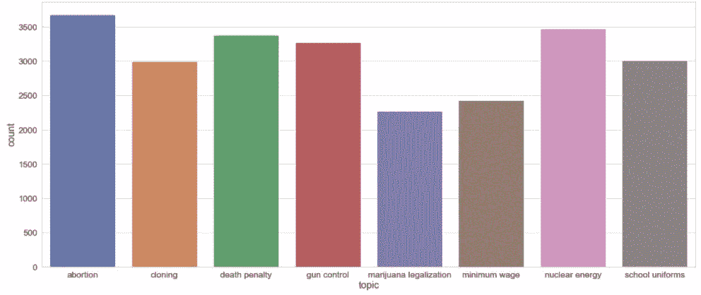
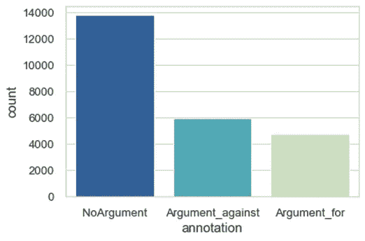
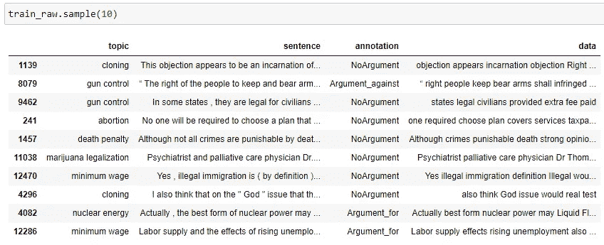
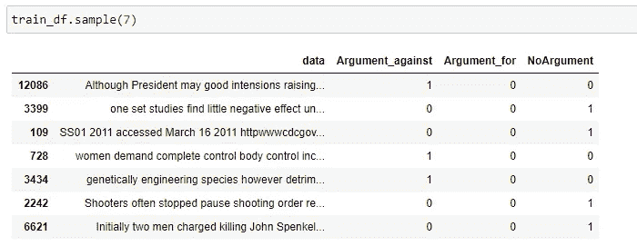
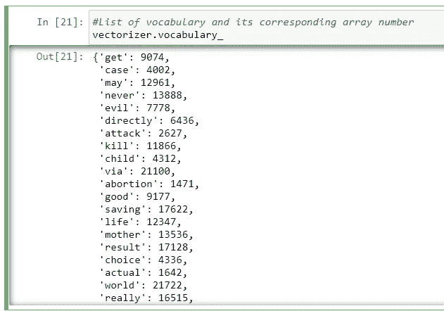
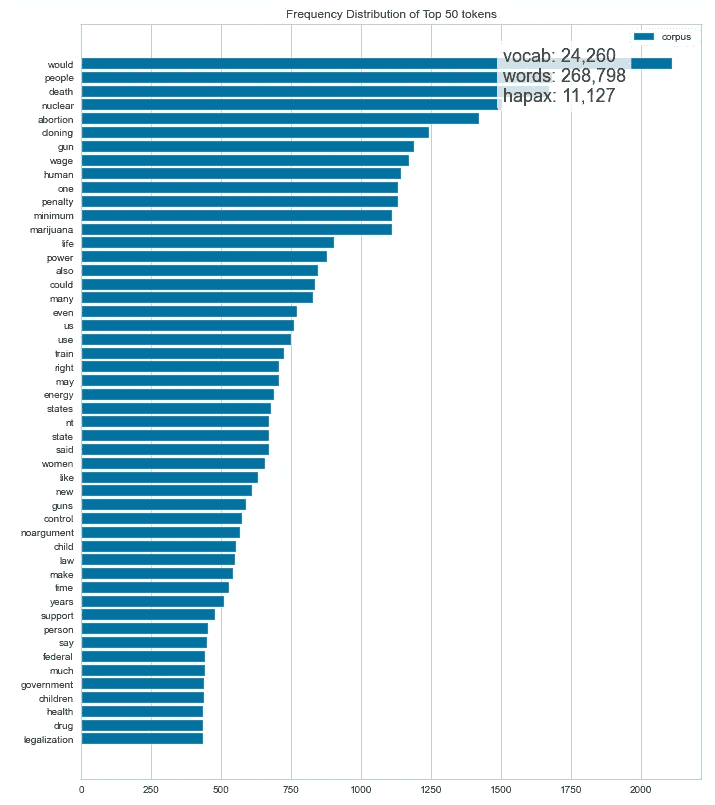
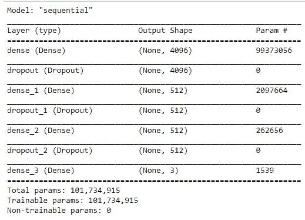
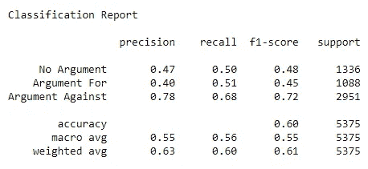
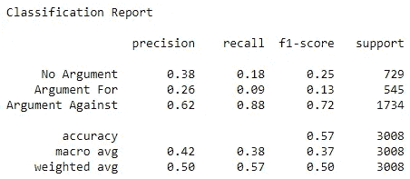

# 跨主题论点挖掘:学习如何对文本进行分类

> 原文：<https://towardsdatascience.com/cross-topic-argument-mining-learning-how-to-classify-texts-1d9e5c00c4cc?source=collection_archive---------29----------------------->

## 机器学习

## 基于使用深度学习的议论文结构对跨主题自然语言文本进行分类


艾蒂安·布朗热在 [Unsplash](https://unsplash.com?utm_source=medium&utm_medium=referral) 上的照片

论辩挖掘是自然语言处理和知识表示学习的研究课题之一。辩论涉及逻辑推理，是人类智力所固有的。论元挖掘的目标是教会机器关于论元结构的知识。AM 自动识别和分类文本中的论点。这允许特定搜索与某个主题相关的参数。强大的 AMs 可以在决策、撰写有说服力的文本和分配法律推理中发挥重要作用。

本文展示了使用机器学习库在 Python 中简单、易于理解、快速地实现 AM。这项工作的目标是为挖掘议论文文本创建一个分类管道，给定一个来自各种在线来源的跨主题句子数据集。

> 正式定义:
> 
> “论证是一种口头的、社会的和理性的活动，旨在通过提出一系列证明或反驳观点中所表达的命题来说服一个理性的批评家一种观点的可接受性。”——T4【3】。

# 资料组

UKP 句子式 AM 语料库[1]是由达姆施塔特大学计算机科学系于 2018 年推出的。这个数据集由涵盖有争议话题的文本组成。它是用谷歌搜索 API 从 400 篇在线文章中收集的。每个句子都通过众包(机械土耳其人)进行了注释。由于可能的版权原因，他们没有发布完整的数据集。然而，从在线文章中收集句子的注释和 java 程序是免费提供的。你可以从他们的[网站](https://www.informatik.tu-darmstadt.de/ukp/research_6/data/argumentation_mining_1/ukp_sentential_argument_mining_corpus/index.en.jsp)下载程序来获得完整的数据集。稍后，我们将研究我自己的 AM 管道实现。

> “对于每个主题，我们在谷歌上查询主题名称，删除未被 Wayback 机器存档的结果，并将列表截断为前 50 个结果。”— [1]

# 履行

假设数据已经被清理，在预处理(即删除 HTML 标签、分隔句子)后呈现在 excel 表格中。数据以成排的句子和注释的形式出现，总计约 25000 个输入输出对。

数据由八个有争议的话题组成:*堕胎*，*克隆*，*死刑*，*枪支管制*，*大麻合法化*，*最低工资*，*核能*，以及*校服*。



主题分布-按作者分类的图片

探究数据，我发现超过一半的标注句子不是一个论点。这是符合逻辑的，因为议论文是观点(主张)。接下来是非论证陈述(前提)，反驳或阐述相应的观点。标签的分布可以在下图中看到。文本分类问题有三个标签:

*   不是争论
*   反对的论点
*   为...辩护



标签分布-按作者分类的图片

我的这个 AM 任务的数据管道如下:


参数挖掘管道-按作者分类的图像

现在，让我们直接进入编码。

导入库:

```
import pandas as pd
import seaborn as sns
import matplotlib.pyplot as plt
import string
from string import punctuation
import nltk
from nltk.corpus import stopwords
nltk.download('stopwords')
nltk.download('punkt')
import tensorflow as tf
```

从 excel 表中读取数据:

```
data_raw= pd.read_excel('data_raw.xlsx')     
fig, ax = plt.subplots(figsize=(16,4))
sns.countplot(x='topic',ax=ax,data=data_raw)
```

训练数据将仅包括七个主题，不包括校服的主题*，其将是测试集的主题*。

```
train_raw = data_raw[data_raw.topic != 'school uniforms']
test_set = data_raw[data_raw.topic == 'school uniforms']
```

目的是验证模型的预测能力。

对于跨主题:给定*校服*测试集，模型的任务是将每一句话归入三个标签中的一个，之前从未见过该主题。

# 预处理

不管议论文的结构如何，在一个英语句子中经常会用到许多单词。此外，模型用数字来表示数据。因此，在自然语言处理技术中，去除停用词和一次性编码通常是必要的。

## 删除停用词

停用词是对句子没有什么意义的英语单词。它们可以被过滤而不会显著改变句子的本质。

```
def remove_stopwords(text):
    stpword = stopwords.words('english')
    no_punctuation = [char for char in text if char not in  
      string.punctuation]
    no_punctuation = ''.join(no_punctuation)
    return ' '.join([word for word in no_punctuation.split() if 
      word.lower() not in stpword])train_raw['data'] = train_raw['sentence'].apply(remove_stopwords)
test_set['data'] = test_set['sentence'].apply(remove_stopwords)
```

例如，中的 the，he，you，we，as，For，have，this，that，do 被认为是英语中的停用词。这减少了数据的大小，并且提高了以后的训练效率。



例句——作者图片

## **一键编码**

这种技术允许用二进制表示分类数据。因为我们有三个标签，注释将被编码成三位数的二进制，其中“1”表示真实，其他的都是零。

```
#Training data
train_one_hot = pd.get_dummies(train_df['annotation'])
train_df = pd.concat([train_df['data'],train_one_hot],axis=1)
y_train = train_df.drop('data',axis=1).value#Test data
test_one_hot = pd.get_dummies(test_df['annotation'])
test_df = pd.concat([test_df['data'],test_one_hot],axis=1)
```

这个实验处理三个标签，所以将有三列来表示标签。示例训练数据如下所示。



一键编码—按作者分类的图像

# 特征抽出

在提取特征之前，必须将输入句子转换成向量。为此，将使用 scikit-learn 库中的 CountVectorizer()创建一个基于训练数据的词汇表。这种将文本转换成向量的过程有时也称为“标记化”

```
from sklearn.feature_extraction.text import CountVectorizer #Define input
sentences_train = train_df['data'].values
sentences_test = test_df['sentence'].value#Convert sentences into vectors
vectorizer = CountVectorizer()
X_train = vectorizer.fit_transform(sentences_train)
X_test = vect.transform(sentences_test)
```



词汇列表—按作者分类的图片

然后，训练数据集将适合词汇表。fit_transform()方法将每个句子转换成一个大小为 21，920 的数组。X_train 将是一个大小矩阵(句子数 x 21，920)。这被称为*计数矩阵*，因为 vocab 的频率将在每个句子中计数，以数学方式表示数据。为了更好地理解数据，让我们形象化地描述一下令牌频率。

```
#Visualize word frequency
from yellowbrick.text import FreqDistVisualizer
features   = vectorizer.get_feature_names()
visualizer = FreqDistVisualizer(features=features, size=(800, 1000))
visualizer.fit(X_train)
visualizer.finalize()
```



词频分布—按作者分类的图片

> **hapax** (名词)
> 
> hapax 一个在一部作品或一类文学作品或某个作者的作品中只出现一次的词[【www.collinsdictionary.com】T4]。

可以看出令牌*会*出现的最多，其次是*死亡*和*人*。不出所料，诸如*核*、*克隆*、*堕胎*和*大麻*等有争议的话题词汇都出现在最常见词汇列表中。

## **Tf-idf**

词频-逆文档频率(tf-idf)为每个词分配权重以提取特征。这种统计方法在搜索引擎和推荐系统等信息检索应用中很常见。

```
tfidf = TfidfTransformer()
X_train = tfidf.fit_transform(X_train)
X_train = X_train.toarray()
```

# 模型

我管道中的深度学习模型只是一个完全连接的神经网络。这些层配备了 *L2 正则化*和 ReLU 函数，但输出层除外，它实现了 softmax 函数。为了防止记忆，还对每一层实施辍学。

```
from tensorflow.keras.models import Sequential
from tensorflow.keras.layers import Dense, Activation, Dropout
from tensorflow.keras.regularizers import l2def create_deep_model(factor, rate):
    model = Sequential()      
    model.add(Dense(units=4096,kernel_regularizer=l2(factor), 
      activation='relu')), Dropout(rate),
    model.add(Dense(units=512,kernel_regularizer=l2(factor),
      activation='relu')), Dropout(rate),
    model.add(Dense(units=512,kernel_regularizer=l2(factor),
      activation='relu')), Dropout(rate),
    #Output layer
    model.add(Dense(units=3, activation='softmax'))
    return model
```

让我们使用参数 L2 因子 0.0001 和退出概率 0.2 来创建模型。

```
model= create_deep_model(factor=0.0001, rate=0.2)
model.summary()
```



Tensorflow 中的深度学习模型—图片由作者提供

可以使用 Adam optimizer 以 0.001 的学习率和 128 的批量来训练该模型。分类交叉熵被用作训练的损失函数。提前停止是为了防止过度拟合。实际上，这个模型根本不会达到收敛。使用构建的词汇和异构数据，模型很难区分支持和反对的论点。

```
early_stop = EarlyStopping(monitor='val_loss', mode='min',   
  verbose=1, patience=5)
opt=tf.keras.optimizers.Adam(learning_rate=learningrate)
model.compile(loss='categorical_crossentropy', optimizer=opt,   
  metrics=['accuracy']) 
```

在拟合之前，数据被分成训练(75%)和验证(25%)。

```
#Split data
X_train_enc, X_val, y_train_enc, y_val = train_test_split(X_train, y_train, test_size=0.1, shuffle= False)#fit the model
history=model.fit(x=X_train_enc, y=y_train_enc, batch_size=batchsize, epochs=epochs, validation_data=(X_val, y_val), verbose=1, callbacks=early_stop)
```

# 估价

> “专家”注释者是两个研究生水平的语言技术研究人员，他们完全了解参数模型的性质和目的。他们获得了 0.862 的一致率，略高于专家和群众注释者之间的一致率(0.844)。使用注释者间协议的 kappa 统计验证了结果的可靠性[2]。

在我的三标签 AM 实验中有两个预测:话题内和跨话题。为了更容易进行评估和基准测试，我使用下面的代码将一键编码还原为整数[0，1，2]:

```
y_train= np.argmax(y_train, axis=1)
y_test= np.argmax(y_test, axis=1)
```

基准将基于准确度、精确度、召回率和 f1 分数。这将在稍后的*混淆矩阵*中呈现。

*   **在七个主题上接受培训，在验证集上进行测试(主题内)**:

```
y_test=y_val
y_test=np.argmax(y_test, axis=1)
y_pred = np.argmax(model.predict(X_val), axis=-1)from sklearn.metrics import classification_reportprint(classification_report(y_test, y_pred, target_names=['No  
  Argument', 'Argument For', 'Argument Against']))
```



主题内分类报告—按作者分类的图片

*   **七个话题的训练，看不见的话题的测试(跨话题):**

```
y_test = test_df.drop('data',axis=1).values
y_test=np.argmax(y_test, axis=1)
y_pred = np.argmax(model.predict(X_test), axis=-1)
```



跨主题分类报告—按作者分类的图片

术语 *Support* 在这个上下文中是标签的数量，用于计算加权平均值。f1 分数的准确性以及宏观平均值通常用于基准分类结果。基于精确度、召回率和 f1 分数，该模型在预测给定句子的“反对论点”方面表现很好。但是，该模型在挖掘“论据”方面表现很差，仅回忆起 10%的真阳性。这表明发展的模型完全缺乏理解论点的能力，倾向于把一切都预测为“反对的论点”当数据在主题内而不是跨主题测试时，这不太明显，如第一次分类报告所示。正如所料，与跨主题预测相比，主题内预测在准确度、精确度、召回率和 f1 值方面得分更高。

# 谈话要点

*   根据研究论文[1]的作者，AM 中的人类上限 f1-分数为 0.861(双标签)。他们在双标签(“参数”或“非参数”)上的最佳 f1 分数是 0.662。对于三标签实验设置，它们的最佳分数是 0.4285。我的渠道在没有任何迁移学习的情况下，取得了 0.37 的 f1 分数宏观平均分。当然，需要做更多的尝试来验证实验。但是，考虑到快速实现，这已经是一个相对较好的结果。57%的准确率几乎是模型给出随机猜测的两倍(~33%)。然而，分数通常不够好，因为我们希望模型的表现与人类相似。因此，跨主题的论点挖掘仍然是自然语言处理中的一个挑战。
*   预处理训练集而不对测试集应用相同的过程将导致非常差的性能。这就是停用词和标记化的效果。未来的工作将是整合知识表示学习方法以及单词嵌入，以便更好地提取特征。过程中的感知和重要性权重将使我的流水线中的预处理变得多余。
*   这项工作的下一步是让模型知道主题和上下文。在最初的论文中，作者试图通过使用迁移学习(参数迁移)来增强他们模型的跨主题预测能力。他们使用从另一个语料库(谷歌新闻数据集和 SemEval)预训练的双向 lstm*、*，并将该方法与*单词嵌入*相结合。他们还表明，在训练深度学习模型时整合主题信息会导致更好的概括和回忆。

# 观点

辩论在许多方面都与人工智能有关。计算语言学的应用范围从检测有争议的推文到识别法律文件中特定主题的指控。例如，这项研究的最新技术可以在 www.argumentsearch.com 的[找到。这个网站使用文本挖掘、大数据分析和深度学习作为文档的搜索引擎，实时给出你的主题输入的利弊。](http://www.argumentsearch.com)

# 参考

[1] C. Stab、T. Miller、B. Schiller、P. Rai 和 I. Gurevych。[异构源的跨话题论点挖掘，](https://fileserver.ukp.informatik.tu-darmstadt.de/UKP_Webpage/publications/2018/2018_EMNLP_CS_Cross-topicArgumentMining.pdf) *自然语言处理中的经验方法会议论文集(EMNLP 2018)。*

[2] C. Stab，T. Miller 和 I. Gurevych，[使用基于注意力的神经网络从异构来源进行跨主题论点挖掘](https://arxiv.org/pdf/1802.05758.pdf)，arXiv e-prints (2018)。

[3] F. Eemeran，R. Grootendorst，[系统的论证理论](http://catdir.loc.gov/catdir/samples/cam041/2003046181.pdf)，p *剑桥大学报业辛迪加出版(2004)。*

***免责声明*** *:注释可在知识共享署名-非商业许可(CC BY-NC)下在线获得。观点是我自己的。*