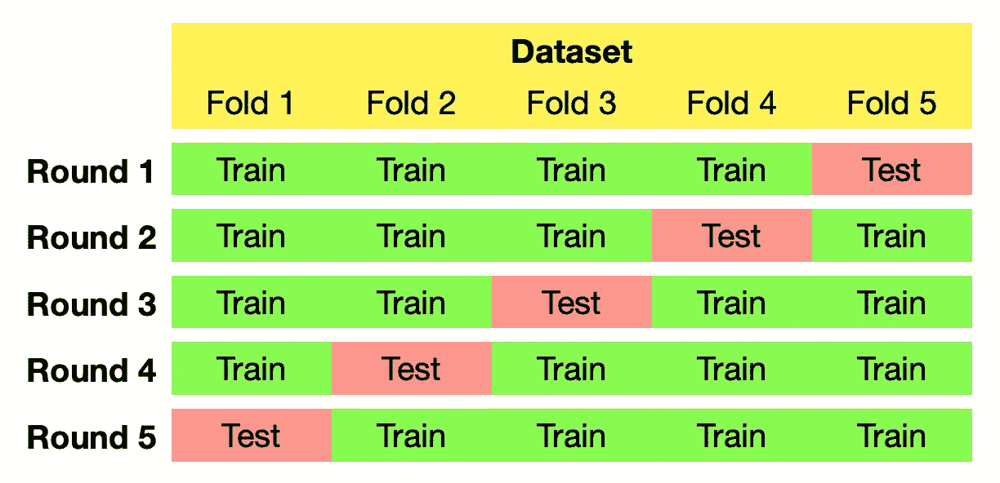
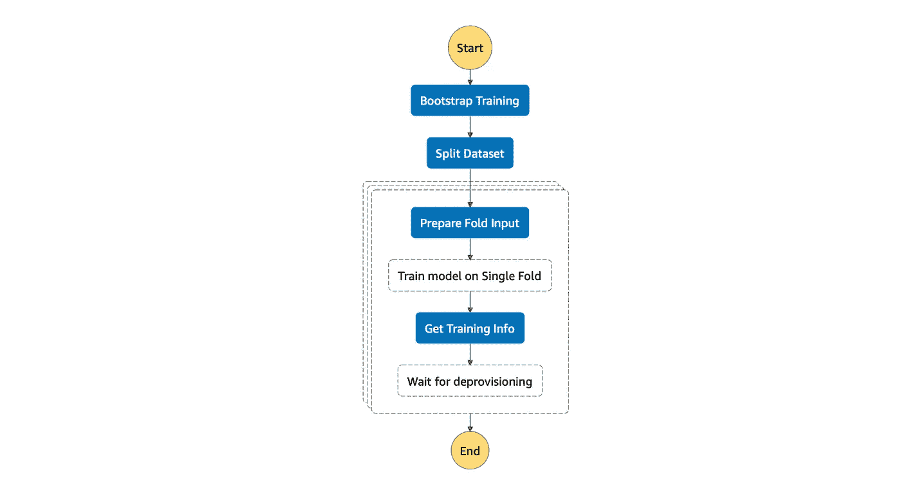

# 用 SageMaker 和 Step 函数交叉验证你的机器学习模型

> 原文：<https://towardsdatascience.com/cross-validate-your-machine-learning-model-with-sagemaker-and-step-functions-6610e9c6ab32?source=collection_archive---------18----------------------->

## *在 AWS 基础设施上自动化交叉验证的机器学习培训工作*


图片来自 [Pixabay](https://pixabay.com/?utm_source=link-attribution&amp;utm_medium=referral&amp;utm_campaign=image&amp;utm_content=3758346) 的 [TeeFarm](https://pixabay.com/users/teefarm-199315/?utm_source=link-attribution&amp;utm_medium=referral&amp;utm_campaign=image&amp;utm_content=3758346)

交叉验证是一种强大的技术，可以建立对未知数据表现良好的机器学习模型。然而，它也可能是耗时的，因为它包括训练多个模型。这篇文章将向您展示如何使用 Amazon Web Services (AWS)的几种服务，包括 SageMaker、Step Functions 和 Lambda，轻松地交叉验证机器学习模型。

# 为什么需要交叉验证？

*如果你知道交叉验证的概念，可以直接跳到介绍*[*SMX-验证器*](#1d23) *的章节。*

## 小数据集和样本分布问题

想象一下，热带草原上的羚羊委托你训练一个图像分类器模型，帮助它们识别照片中的美洲豹。他们给你 50 张美洲虎的照片和 50 张没有美洲虎的热带草原的照片。您将数据集分为 80 张图片的训练集和 20 张图片的测试集，注意每个分区中的美洲虎和非美洲虎图片数量相等。您用您最喜欢的图像分类器算法训练您的模型，并获得令人印象深刻的 100%验证准确性。

作为视觉检查，您可以查看测试集中一些正确分类的照片:


图片来自 [Pixabay](https://pixabay.com/?utm_source=link-attribution&amp;utm_medium=referral&amp;utm_campaign=image&amp;utm_content=4112011) 的[马克·墨菲](https://pixabay.com/users/markmurphy-10772193/?utm_source=link-attribution&amp;utm_medium=referral&amp;utm_campaign=image&amp;utm_content=4112011)

一切看起来都很好。

一段时间后，您重新训练您的模型。您再次将相同的数据集分成 80%的训练集和 20%的测试集，使用与第一个模型相同的超参数，并获得 80%的验证准确率，以及一些假阴性(对羚羊来说是致命的！).那么发生了什么？

您查看测试集中的假阴性，并找到这样的照片:


照片由[维基共享资源](https://commons.wikimedia.org/wiki/Main_Page)的 [Senthiaathavan](https://commons.wikimedia.org/wiki/File:Camouflaged_Sri_Lankan_leopard_(Panthera_pardus_kotiya).jpg) 拍摄

似乎在你的数据集中有“更容易”和“更难”的例子。当您将数据集划分为训练/测试集时，您的目标始终是*测试集能够很好地代表整个数据集*。谈到类别分布，您可以使用分层分割策略来实施，但是样本“硬度”如何呢？这是一项更加困难的任务。特别是如果你有一个小数据集，你可以很容易地得到一个分裂，所有“硬”的样本在训练集中结束，所以你的测试集将只包含“容易”的，导致一个好的测试分数。另一方面，如果大多数“硬”示例都在测试集中，那么使用用相同超参数训练的模型将会得到更差的结果。

## 超参数优化

另一个重要的例子是当你调整模型的超参数时。在[超参数优化](https://en.wikipedia.org/wiki/Hyperparameter_optimization)的情况下，您迭代地修改模型的一些超参数，用相同的训练集重新训练它，并在验证集上检查性能。如果模型性能提高，您就知道超参数调整很可能是在正确的方向上，因此您知道如何继续调整阶段。


图片来自 [Pixabay](https://pixabay.com/?utm_source=link-attribution&amp;utm_medium=referral&amp;utm_campaign=image&amp;utm_content=3721929) 的 [Niklas Ahrnke](https://pixabay.com/users/niklas_ahrnke-10296613/?utm_source=link-attribution&amp;utm_medium=referral&amp;utm_campaign=image&amp;utm_content=3721929)

这种方法的问题是一些信息会从验证集泄露到训练过程中。由于超参数更新步骤取决于模型在验证集上的性能，您可能最终得到一个针对特定验证集而非一般情况优化的超参数集(和模型)。这个问题最简单的解决方案是将数据集分成三个分区:[训练集、验证集和测试集](https://en.wikipedia.org/wiki/Training,_validation,_and_test_sets)；使用训练和验证集调整您的模型，并使用完全不可见的测试集获得最终的性能指标。不幸的是，这意味着训练样本的部分甚至更小，因为您应该将数据集划分为 60%训练-20%验证-20%测试分区。

## 其他原因

在其他一些情况下，交叉验证可能特别有用，例如:

*   当数据集包含相互依赖的数据点时，
*   或者当您计划堆叠机器学习模型，以便一个模型的输入是前一个模型的预测输出时。

关于这些案例的详细讨论，请看[这篇文章](/5-reasons-why-you-should-use-cross-validation-in-your-data-science-project-8163311a1e79)。

# 交叉验证有什么帮助？

[*交叉验证*](https://en.wikipedia.org/wiki/Cross-validation_(statistics)) 是一组评估你的模型对未知数据的概括能力的技术。将数据集的标准训练测试分割视为一轮交叉验证过程。事实上，大多数交叉验证策略使用多轮将数据集分割成不同的分区，在每次分割时训练模型，并评估它们的组合性能。

最常用的交叉验证策略之一叫做 *k 倍交叉验证*。维基百科给出了它的精确定义:

> 在 k 重交叉验证中，原始样本被随机分成 k 个大小相等的子样本。在 k 个子样本中，保留一个子样本作为测试模型的验证数据，其余的 k1 个子样本用作训练数据。然后，交叉验证过程重复 k 次，k 个子样本中的每一个正好用作验证数据一次。然后，k 个结果可以被平均以产生单个估计。

例如，如果您使用五重交叉验证，您将使用以下拆分来训练五个不同的模型:



*作者插图*

在上面的 jaguar 分类示例中,“硬”样本将出现在一轮训练的测试集和其他四轮的训练集中。检查所有五个模型的准确性将使您对模型在未知数据集上的表现有一个更好的总体了解。同时，您已经使用了所有可用的数据来训练和验证您的模型。

这个过程听起来不错，但是这意味着在训练模型之前，您必须执行以下附加步骤:

*   将数据集分成五份，
*   将拆分组合成五轮训练的训练集和测试集，
*   在可用硬件上安排每个机器学习模型的训练，以及
*   从每个培训工作中收集培训指标。

上面的步骤是一个相当大的开销，特别是如果你需要定期训练你的模型。

SMX 验证器开始发挥作用了。

# SMX 验证器

SMX 验证器是一个直接部署到 AWS 基础设施的应用程序，它管理几乎任何监督机器学习模型的交叉验证训练，您可以使用 SageMaker 进行训练。

该应用程序建立在几个 AWS 服务之上:

*   [Amazon SageMaker](https://aws.amazon.com/sagemaker/) 是一个云机器学习平台，使开发人员能够在 AWS 云中创建、训练和部署机器学习模型。
*   [AWS Step Functions](https://aws.amazon.com/step-functions/) 是一个无服务器的函数 orchestrator 和状态机实现，可以排序 AWS Lambda 函数和其他 AWS 服务，包括 SageMaker。
*   [AWS Lambda](https://aws.amazon.com/lambda/) 是一个无服务器的计算平台，它运行代码来响应事件，比如 SageMaker 的“训练完成”事件。它还自动管理运行该代码的计算资源。
*   亚马逊 S3 是一个对象存储服务，它允许使用类似文件系统的接口在云中存储数据。

将 SMX 验证器部署到您的 AWS 帐户后，您可以指定一个机器学习训练模板、一个输入数据集以及您希望在训练阶段使用的折叠数。该应用程序将自动编排所有培训作业，并行执行它们，并报告每个培训作业的结果和性能。跟随训练你的第一个交叉验证的工作与 SMX 验证器。在本演练中，我们将使用图像分类任务作为示例。

## 先决条件

1.  AWS 账户。如果你还没有，开一个[新的](https://aws.amazon.com/premiumsupport/knowledge-center/create-and-activate-aws-account/)。
2.  AWS 为新账户提供了一个[免费层](https://aws.amazon.com/free/)。然而，GPU 实例(强烈建议用于训练图像分类器)不包括在内，因此您应该预计一些训练成本在几美元的数量级。
3.  要用于定型的数据集。在下面的[准备您的数据](#d5c4)部分，我将描述如果您还没有数据集，如何获取数据集。
4.  SMX 验证器是一个[无服务器应用程序模型(SAM)](https://docs.aws.amazon.com/serverless-application-model/latest/developerguide/what-is-sam.html) 应用程序。您可以从[无服务器应用程序库(SAR)](https://aws.amazon.com/serverless/serverlessrepo/) 直接[部署它，或者您可以使用](https://serverlessrepo.aws.amazon.com/applications/eu-west-1/043458249825/SMX-Validator) [SAM 命令行界面(CLI)](https://docs.aws.amazon.com/serverless-application-model/latest/developerguide/serverless-sam-cli-install.html) 构建它，并手动将其部署到您的 AWS 帐户。如果选择手动安装，应该安装带有 Docker 的 SAM CLI，并按照文档中的说明设置 AWS 凭据。

## 支持的 SageMaker 算法和容器

您可以将任何受监督的训练容器与接受换行符分隔的文件作为输入的 SMX 验证器一起使用，例如:

*   **线性学习器**带 [CSV 输入格式](https://docs.aws.amazon.com/sagemaker/latest/dg/linear-learner.html#ll-input_output)，
*   **K-最近邻算法**与 [CSV 输入格式](https://docs.aws.amazon.com/sagemaker/latest/dg/k-nearest-neighbors.html#kNN-input_output)，
*   **图像分类算法**与[增强显示图像格式](https://docs.aws.amazon.com/sagemaker/latest/dg/image-classification.html#IC-augmented-manifest-training)，
*   **XGBoost 算法**与 [CSV 输入格式](https://docs.aws.amazon.com/sagemaker/latest/dg/xgboost.html#InputOutput-XGBoost)，
*   **BlazingText** 在文本分类模式下用[文件模式或增强清单文本格式](https://docs.aws.amazon.com/sagemaker/latest/dg/blazingtext.html#blazingtext-data-formats-text-class)，
*   或者接受换行符分隔的文件作为输入的自定义培训容器。

## 准备您的数据

在本教程中，我们将使用二值影像分类数据集。如果没有，可以用著名的[狗对猫](https://www.kaggle.com/c/dogs-vs-cats)数据集。将数据集从 Kaggle 下载到您计算机上的一个目录中。[创建一个 S3 桶](https://s3.console.aws.amazon.com/s3/bucket/create)并将所有图像文件上传到桶中。

为了将 SMX 验证器与 SageMaker 图像分类结合使用，我们将把数据集元数据组织成一个[增强清单图像格式](https://docs.aws.amazon.com/sagemaker/latest/dg/image-classification.html#IC-augmented-manifest-training)文件。假设您使用狗和猫的数据集，这个 python 片段应该可以完成这项工作:

从本地文件夹中的文件创建扩充清单图像格式

记住将`my_bucket/dogs_vs_cats`更改为输入数据集位置的存储桶名称和前缀。这个脚本将为狗分配类别 id `0`，为猫分配类别 id`1`。将创建的`manifest.jsonl`也上传到输入桶。

如果您喜欢直接从 S3 存储桶的内容生成清单文件，您可以使用类似于下面的脚本。在这种情况下，您应该将`bucket`和`prefix`变量指向您的数据集。

从 S3 存储桶中的文件创建扩充清单图像格式

## 部署 SMX 验证器

[SMX 验证器发布在 AWS 无服务器应用程序存储库](https://serverlessrepo.aws.amazon.com/applications/eu-west-1/043458249825/SMX-Validator)。部署应用程序最简单的方法是单击应用程序页面上的“部署”按钮。在部署应用程序之前，您应该填写两个参数:

*   `InputBucketName`:您上传数据集的 S3 桶的名称。应用程序将在部署时创建一个 [IAM 角色](https://docs.aws.amazon.com/IAM/latest/UserGuide/id_roles.html)，允许从这个桶中读取数据。
*   `OutputBucketName`:应用程序可以在其中写入部分结果和工作数据的 S3 存储桶的名称。通过上面的 IAM 角色，将向应用程序授予读取和写入数据的权限。

您可能希望在部署应用程序之前创建这两个存储桶。您还应该知道，该应用程序将创建自定义的 IAM 角色。这些角色使应用程序能够启动 SageMaker 培训作业，并从/向上述存储桶读取/写入。

或者，您可以克隆 SMX 验证器的 git repo，并用 [SAM-CLI](https://docs.aws.amazon.com/serverless-application-model/latest/developerguide/serverless-sam-cli-install.html) 构建应用程序。详情请参考项目资源库中的[自述文件。](https://github.com/mrtj/smx-validator)

## 开始交叉验证的培训工作

SMX 验证器部署了一个阶跃函数状态机来协调交叉验证折叠的训练。您可以启动一个交叉验证的作业，启动状态机的新执行。

您应该在 JSON 文件中指定交叉验证的培训作业的一些输入参数，例如:

*   输入`manifest.jsonl`的 S3 路径，
*   输出路径(这些路径应该指向您在应用程序部署时指定的存储桶)，
*   交叉验证的培训职务的名称，
*   折叠次数，以及
*   SageMaker 培训作业模板，包括培训超参数和培训资源配置。

您可以在 [SMX 验证器](https://github.com/mrtj/smx-validator)的文档中找到[输入模式规范](https://github.com/mrtj/smx-validator/blob/master/resources/schemas/input.schema.json)、[详细文档](https://github.com/mrtj/smx-validator/blob/master/doc/input.schema.md)，以及输入文件的完整[示例。](https://github.com/mrtj/smx-validator/blob/master/doc/sample_event.json)

一旦创建了输入 JSON 文件，就有不同的选项来启动状态机的执行:

*   使用 [AWS CLI](https://docs.aws.amazon.com/cli/latest/reference/stepfunctions/start-execution.html) :

```
aws stepfunctions start-execution \
  - state-machine-arn {CrossValidatorStateMachineArn} \
  - input file://my_input.json
```

*   在 [AWS 步进功能 web 控制台](https://console.aws.amazon.com/states/home#/statemachines)中，选择`CrossValidatorStateMachine-*`，在状态机页面上，点击“开始执行”按钮。将输入 JSON 的内容复制到输入文本区域。
*   从本地脚本或 lambda 函数中使用[AWS SDK](https://aws.amazon.com/tools/)。

SMX 验证器将把输入数据集分割成多个文件夹，组装训练集和测试集，并可能并行地启动 *k* 训练作业。您可以将状态机规范文件中并发执行的作业数量(默认为两个)调整为 AWS 帐户中可用的 ml 实例数量。下图说明了 SMX 验证器的状态机。虚线框中的步骤是同时执行的。



作者插图

## 培训工作

SMX 验证程序将为每轮交叉验证的培训启动一个 SageMaker 培训任务。您在`crossvalidation.n_splits`参数中定义的分割数(和训练任务数)。培训工作将根据以下模板命名:

```
crossvalidator-{input.job_config.name}-{YYYYMMDD}-{HHMMSS}-fold{fold_idx}
```

其中，`{input.job_config.name}`是输入配置中的作业名称，`{YYYYMMDD}-{HHMMSS}`是作业开始时的时间戳，`{fold_idx}`是该轮从零开始的索引。

访问 AWS 管理控制台中的 [SageMaker 培训工作](https://console.aws.amazon.com/sagemaker/home#/jobs)页面，了解 SMX 验证器启动的所有工作的概况。您可以在单个培训作业的页面上找到培训和验证指标图表以及最终指标值。

应用程序还将在步骤函数执行输出 JSON 中报告培训作业的详细信息。该 JSON 将包含以下字段:

*   `job_config`:整个交叉验证的培训作业的通用参数，如作业名称、SageMaker 实验和试验名称、作业输入和输出数据。
*   `crossvalidation`:交叉验证参数，如作业中使用的分割数。
*   `training`:用于创建培训工作的模板结构。
*   `splits`:这个数组包含了每个训练任务的详细结果。它对应于`DescribeTrainingJob` SageMaker API 调用的输出。除了确切的培训工作输入，您还可以在这个结构中找到培训时间和持续时间、计费秒数、最终度量值和输出工件位置。

# 结论

交叉验证机器学习模型是每个数据科学家工具箱中的一个强大工具。如果数据集包含可变“难度”的样本，或者您正在优化模型超参数，它可以帮助您有效地评估在小数据集上训练的模型。然而，在有限的硬件资源上训练多个模型可能非常耗时，并且需要手动编排。SMX 验证器帮助在 AWS 基础设施上训练 k-fold 交叉验证的机器学习模型，负责训练作业的重型任务编排。

也可以在 SMX 验证器的 [GitHub 页面上查看源代码和完整的文档。](https://github.com/mrtj/smx-validator)

我是 Janos Tolgyesi， [Neosperience](https://www.neosperience.com) 的机器学习解决方案架构师和 ML 团队负责人。我在 ML technologies 工作了四年，在 AWS infrastructure 工作了七年。我喜欢构建东西，让它成为边缘的[视频分析应用](https://www.neosperience.com/solutions/people-analytics/)或基于点击流事件的[用户分析器](https://www.neosperience.com/solutions/user-insight/)。有任何问题，可以在[中](https://medium.com/@janos.tolgyesi)或者推特上找我，账号为 [@jtolgyesi](https://twitter.com/jtolgyesi) 。