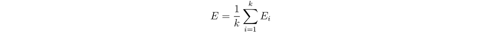
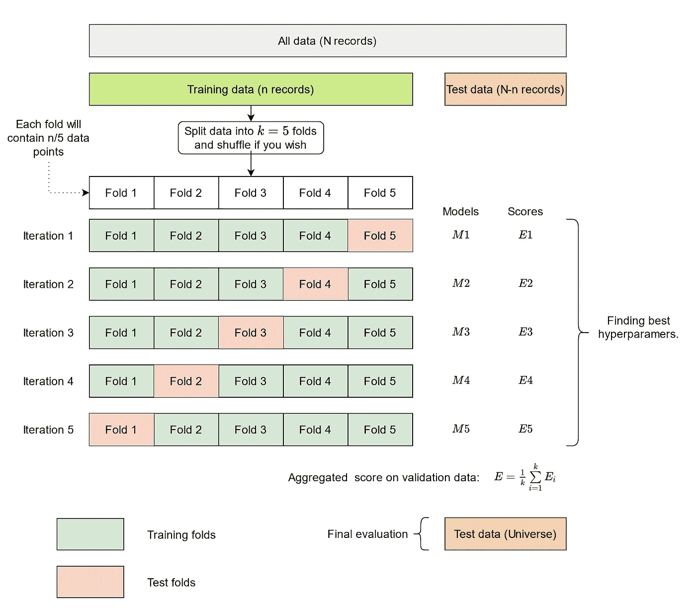
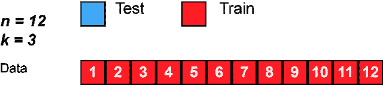
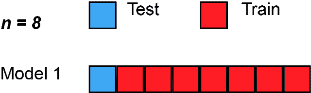
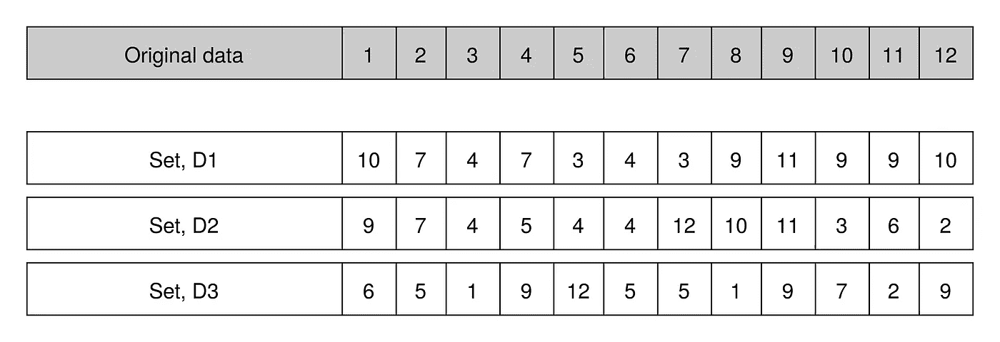
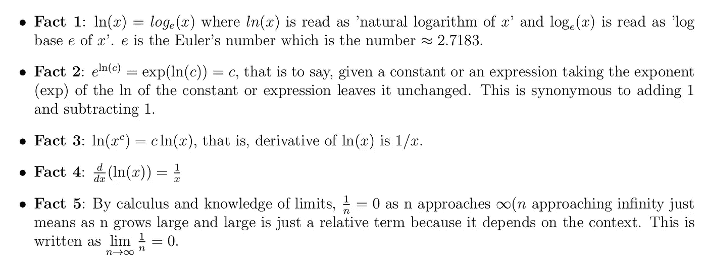
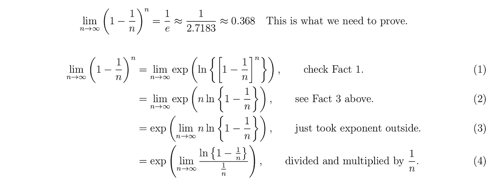
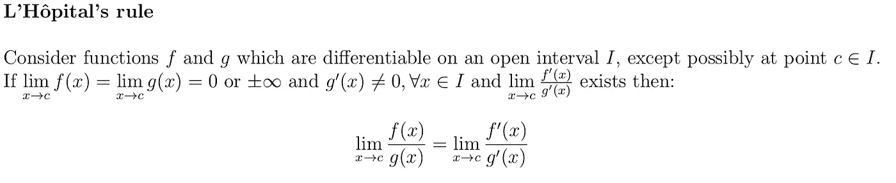
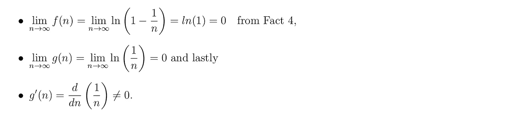
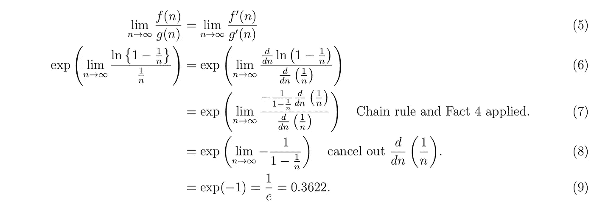

# 机器学习中的交叉验证

> 原文：<https://towardsdatascience.com/cross-validation-and-bootstrap-sampling-2e041fbec126?source=collection_archive---------9----------------------->

## [实践教程](https://towardsdatascience.com/tagged/hands-on-tutorials)

## 了解交叉验证过程以及为什么 bootstrap 样本有 63.2%的原始数据


由 [Clément Hélardot](https://unsplash.com/@clemhlrdt?utm_source=medium&utm_medium=referral) 拍摄于 [Unsplash](https://unsplash.com?utm_source=medium&utm_medium=referral)

在训练了一个机器学习模型之后，每个数据科学家总是想知道*训练好的模型在看不见的数据上表现如何。*好的模型是不仅在训练中而且在测试数据中表现良好的模型。为了估计模型的性能，我们经常使用一部分数据进行训练，保留一部分数据进行测试，希望模型在测试数据上的性能能够代表宇宙中的数据。

下面是一个简单分类问题的例子。在此示例中，Iris 数据集从 Sklearn 模块加载，逻辑回归模型适合数据。数据包含用于训练的`150`记录和用于测试的 `60%`记录。

输出:

```
Model 0 accuracy: 0.967
Model 1 accuracy: 0.967
Model 2 accuracy: 0.933
Model 3 accuracy: 0.967
Model 4 accuracy: 0.933
Model 5 accuracy: 0.933
Model 6 accuracy: 0.85
Model 7 accuracy: 0.95
Model 8 accuracy: 1.0
Model 9 accuracy: 0.95
```

`Line 1–15:`在这些行中，数据被加载，模块被导入。

`Line 17:`这是一种在每次迭代中将逻辑模型拟合到相同数据中的循环。需要注意的重要一点是，模型在每次迭代中都有不同的表现(参见上面的模型得分)。注意，差异并不归因于迭代期间的任何参数变化，因为相同的参数用于所有模型。差异的来源在于数据的分割。`train_test_split`将数据分成`2`，但是在每次迭代中，不同的数据被用于训练和测试，因为没有播种的洗牌。如果您想要在每次迭代中获得一致的结果，请向[sk learn . model _ selection . train _ test _ split](https://scikit-learn.org/stable/modules/generated/sklearn.model_selection.train_test_split.html)的`random _state` 参数传递一个种子值。你可以如下重写第`25`行

`X_train, X_test, y_train, y_test = train_test_split(X,y, test_size=0.40, random_state=42)`

这使得模型结果是可再现的，即一致的。这是因为分裂期间的洗牌是播种的，因此用于训练和测试的数据在所有迭代中都是一致的。

一个经典的验证过程包括完全按照上面的例子所做的事情——将数据分成两组:训练集和测试集——但是对模型评分的一次运行可能无法确定模型在生产中的表现如何。为此，我们需要一种更好的验证方式。这正是交叉验证的用武之地。

# 交叉验证

交叉验证是一种用于验证机器学习模型并估计已训练模型对未知数据的性能的技术。正如你将在下面的讨论中看到的，它比经典的评估要好。

## 交叉验证程序

1.  [可选]无序播放数据。
2.  将数据分成`k`个大小相同(或大致相同)的不同组/折叠(因此，交叉验证也称为***k*-折叠交叉验证**)。
3.  运行模型训练和验证的`k`次迭代。对于`1,2,…,i,…k`中的`i`

在`k`文件夹中，单个文件夹(`i`文件夹)用作保留/验证数据，其他`k-1`文件夹用于训练模型。

模型通过验证后，保留模型分数`E_i`。

4.合计(`3`第二点)中获得的分数，以获得所有`k`褶皱的模型平均性能。在大多数情况下，使用算术平均值进行汇总，因此:



每次迭代中模型得分的平均值。

对于分类任务，可以使用准确度、精确度、召回率等指标对模型进行评分，对于回归问题，可以使用均方误差、平均绝对误差等指标在每次迭代中对模型进行评分。

5.分析平均得分`E`，确定它在看不见的数据(宇宙)上表现良好的可能性。

## 使用 Sklearn 实现 k-fold 交叉验证的简单方法

输出:

```
train: [ 2  3  4  5  6  7  8 11 12], test: [1  9 10]
train: [ 1  3  5  6  7  9 10 11 12], test: [2 4 8]
train: [ 1  2  4  5  8  9 10 11 12], test: [3 6 7]
train: [ 1  2  3  4  6  7  8  9 10], test: [5 11 12]
```



图片:完整的 k 倍交叉验证程序。k=5 的一种情况，即 5 重交叉验证。参考:Sklearn 网站。

下面是来自维基百科的交叉验证过程的动画。



当 n = 12 个观察值和 k = 3 时，k 重交叉验证的图解(3 重交叉验证的一个例子)。经过数据洗牌后，共有 3 个模型将被训练和测试。每个文件夹将包含 12/3=4 个数据示例。来源:维基百科

## *k 的选择*

*   首先，`k` 必须是介于`2`和`*n*`(观测值/记录数)之间的整数。`k`必须至少有`2`才能保证至少有两次折叠。
*   对于`k=2`，我们随机打乱数据(可选)并将其分成`2`组— `d1`和`d2`，以使两组大小相等(或大致相等)。然后在`d1`上训练模型，在`d2`上验证模型，接着在`d2`上训练模型，在`d1`上验证模型。
*   选择`k=n`可以将事情发挥到极致。在这个场景中，我们有一个特殊的交叉验证案例，叫做**留一交叉验证(LOOCV)。**该名称来源于这样一个事实，即在每次迭代中，一个数据点被遗漏用于验证，而其他的`n-1`用于测试。
*   在交叉验证中`k`是不固定的参数，但在选择`k`时应考虑以下几点:

代表性启发法 — `k` 的选择方式应确保保留数据/折叠代表整个宇宙(看不见的数据)。例如，如果我们有`1000`记录，并且我们选择`k=500`，那么在每次迭代中，只有`1000/500=2`数据点用于验证。这使得验证规模非常小。非常大的`k`值意味着跨训练折叠的差异更小，因此限制了跨迭代的模型差异。这意味着`k`不能太大也不能太小。

*经验法则* —尽管`k`是一个不固定的参数(没有特定的公式可用于确定最佳选择)，但`10`仍被普遍使用，因为它已被实验证明在大多数情况下是一个好的选择。

*   给定原始数据中的`n`观察值，每个折叠将包含`n/k`记录。

这里还有另一个来自维基百科的动画，展示了留一法交叉验证的概念:



当 n=8 个观察值时，留一交叉验证(LOOCV)的图示。在交叉验证过程完成之前，总共训练和测试了 8 个模型。每次迭代产生一个在 n-1 个数据点上训练并在 1 个数据点上测试的模型。来源:维基百科

## 使用交叉验证方法的原因

*   模型在训练中的性能，甚至在验证集上运行的性能，都不能保证模型在未知数据上的最佳性能。当数据不足以代表宇宙状态时，就会发生这种情况。在这种情况下，测试数据上的模型误差可能无法反映模型在宇宙中的表现。这正是上面例子中的情况——使用`150`数据记录来训练和测试模型产生了不一致的分数。
*   因此，在缺乏大型数据集的情况下，交叉验证是评估模型性能的最佳选择。

## k-Fold 交叉验证的特征概述

*   在将数据分割成 `k`个文件夹之前，进行混洗(可选操作)。这意味着给定的数据点被分配到单个文件夹中，并且在交叉验证过程的剩余部分中它保持在该组中。这也意味着一个给定的数据点被用于一次验证和`k-1`次训练。
*   每个折叠中有`n/k`个数据点，其中`n`是原始数据中的观察次数，`k`是折叠次数。
*   `k`可以取 `2`和`n`(原始样本中的观察次数)之间的任意整数值。

# 自助抽样

Bootstrap 采样是一种重采样技术，涉及**随机采样和替换**。单词 resample 在字面上的意思是“再次采样”，这意味着通过用“原始”样本的替换进行采样来生成自举样本。

通常，通过选择用于分析的总体子集来生成采样，目的是推断总体(总体->样本)，而重采样是为了推断样本(样本->重采样数据)。

这里有一个简单的例子。假设从给定总体中抽取一个大小为`12`的样本，并从这些样本中产生`3`个引导样本。然后，我们可以将此信息表示如下:



自举抽样(bootstrapping)的一个例子。原始数据包含`12`数据示例，每个样本集还包括从原始数据中取样 12 个数据点并替换。来源:作者。

由于我们是带替换的传导采样，请注意上面示例中的以下内容:

*   一些数据点(可能)出现在多个集合中。例如`6`出现在集合`D2`和`D3`中。
*   有些例子在给定的集合中会出现不止一次。例如`9, 10, 4, 3`和`7`在集合`D1`中出现不止一次。

> “假设 n(原始数据的大小)足够大，实际上它(引导样本)与原始‘真实’样本完全相同的概率几乎为零。”—维基百科

事实上，

****平均而言，63.22%的原始数据出现在任何给定的 bootstrap 样本中，**这与所说的**相同——一个平均 bootstrap 样本遗漏了原始样本中 100–63.22 = 36.78%的数据。****

**让我们用最简单的方法证明这个数学事实。在此之前，让我们陈述一些在证明过程中有帮助的数学事实。**

****

**我们现在可以继续证明了。**

**假设原始数据有`n`个观察值，我们从数据中得到大小为`n`的 bootstrap 样本，那么:**

*   **给定观察不被选择的概率是`(1–1/n)`，被选择的概率是`(1/n)`。**
*   **因为我们要重采样 n 次，所以在 n 次试验中观察结果未被选中的概率是`(1–1/n)^n`。**

**根据微积分，随着`n->∞` (n 变大)，这个概率可以使用极限的概念来确定。也就是说，**

****

**从这里开始，我们需要理解和应用洛必达法则。**

****

**洛必达法则声明。换句话说，该规则规定，考虑两个函数 f 和 g，它们的导数存在于某个区间 I 内，但不存在于该区间内的给定点 c(即，导数存在于区间内的其他任何地方，但不存在于某个点 c)。如果当 x 接近点 c 时，f 和 g 的极限(假设 f 和 g 是 x 的函数)等于零或无穷大，并且对于区间 I 中 x 的所有值，g 的导数不等于零(这确保我们在后续运算中不会遇到被零除的问题) 并且 f 除以 g 的导数极限存在，那么 f 除以 g 的极限等于 f 的导数极限除以 g 的导数，当 x 接近 c 时，参考:维基百科**

**从等式`(4)`中，我们可以证明，在应用洛必达法则之前，我们需要满足的所有条件实际上都满足如下:**

****

**然后，我们可以将洛必达法则应用到等式`4`中，并按如下所示进行操作**

****

**这结束了我们的证明，证实随着`n`变大，自举消除了原始样本中大约 36.22%的数据。**

**今天的文章到此结束。如果你喜欢它，请看看下面这篇关于交叉熵损失函数的文章，也读一读。下次再见，祝阅读愉快:-)**

**[](/cross-entropy-loss-function-f38c4ec8643e) [## 交叉熵损失函数

### 在大多数分类问题中用于优化机器学习模型的损失函数…

towardsdatascience.com](/cross-entropy-loss-function-f38c4ec8643e)** 

**加入 https://medium.com/@kiprono_65591/membership[的媒体](https://medium.com/@kiprono_65591/membership)，全面了解媒体上的每个故事。**

**你也可以在我发文章的时候通过这个链接把文章发到你的邮箱里:【https://medium.com/subscribe/@kiprono_65591 **