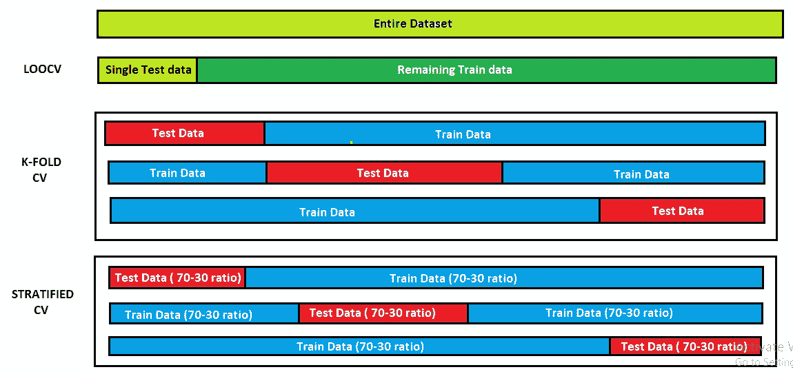
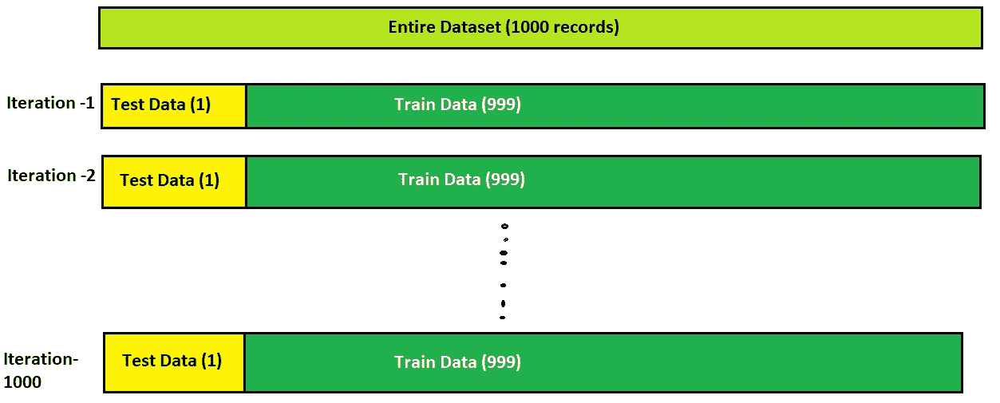
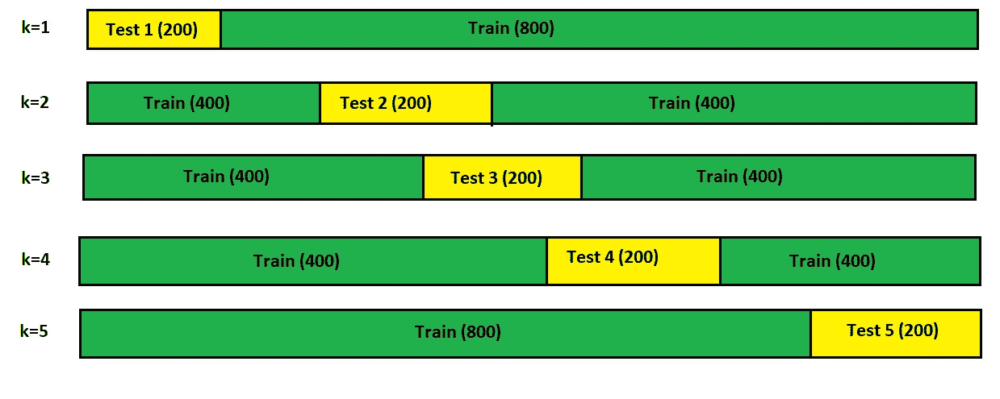
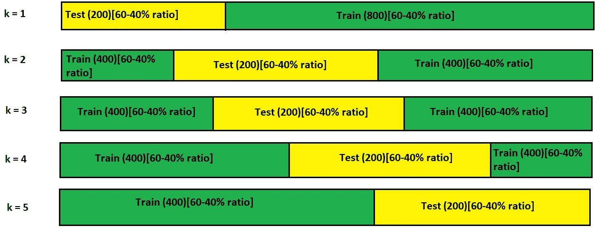

# 交叉验证工程

> 原文：<https://towardsdatascience.com/cross-validation-engineering-a46cc93b9087?source=collection_archive---------47----------------------->

## 无知可能被证明是代价高昂的

作者图片

# 介绍

交叉验证是数据预处理阶段的一个重要方面，但通常被数据科学家所忽略。这是一个从来没有基于接触的领域，最终，利益相关者会对模型质量失去信心，因为如果没有在模型上应用交叉验证，性能会非常差。这是我们在可用数据上应用训练和测试拆分来准备训练和测试模型时要考虑的一个阶段。我们在给定的训练-测试分离模型中设置随机状态参数，该模型通常试图将随机数据集分配到两个数据集，即训练和测试。当我们改变随机状态变量的值时，模型的精度会有很大的变化。因此，我们从来没有得出关于模型准确性的结论性证据。因此，在客户互动过程中，这很可能成为争论的话题，最终影响组织中的业务交易。因此，交叉验证的概念被引入。交叉验证有很多种，本文将逐一讨论。

# 遗漏一项交叉验证(LOOCV)

作者图片

在这种类型的交叉验证中，我们只从给定的记录列表中抽取 1 个样本作为测试数据，其余的记录被移动到训练数据集中。例如，假设我们有一个 1000 条记录的列表，那么我们将把其中一条记录作为测试数据，其余的 999 条记录将被移动到训练数据集的列表中。这样，我们将每个样本放入测试数据集中，并尝试在每次迭代中找到精确度。

这种方法的主要缺点是，我们需要运行与给定数据集中存在的记录数量相等的交叉验证迭代。这将最终影响内存消耗、时间浪费，而且我们可能需要花更多的钱来构建一个更好的系统，以避免上述问题。这种方法的第二个主要问题是，当给定数据集中的记录之外的新测试数据作为测试数据集的输入时，模型性能会发生不变的变化。

# k 倍交叉验证

作者图片

考虑具有 1000 条记录的给定数据集，我们固定 **k** 的值。值 **k** 定义了我们将在总的给定数据集上执行的总迭代次数，并且将总记录的值除以 **k** 给出了我们将包括在测试数据集中的记录总数。例如，在给定的数据集中，我们有 1000 个样本，我们将 **k** 的值固定为 5。然后我们将进行 5 次交叉验证。每一次迭代都将有(1000/5 = 200 条记录)定义测试数据。如图所示，每次迭代都将有一组新的 200 条记录作为测试数据的一部分传递给模型。因此，在迭代 5 结束时，每个记录将在某个时间点成为测试或训练数据集的一部分。因此，从每次迭代获得的精度模型可以被一起平均，并且从其获得的值可以被定义为平均精度模型性能。因此，我们可以向利益相关者传达模型性能可以在 83 到 87 之间变化(如图所示),或者我们可以取平均值为 85(如图所示),并将其传达给利益相关者。

这种方法的主要缺点是数据集不平衡。如果我说 1000 条记录中有 900 条属于 A 类，只有 100 条属于 B 类，那会怎么样呢？在这种情况下，模型每次只暴露给 A 类数据，这将导致模型较少暴露给 B 类数据。最终，当未知数据集由 B 类数据组成时，模型可能无法在大多数情况下正确预测数据，因为其训练阶段通常会暴露给 A 类数据。因此，当模型暴露于 B 类未知数据集时，我们可能会看到模型准确性的下降趋势。因此，在 k 倍交叉验证的情况下，不平衡的数据集可能是真正有问题的。

# 分层交叉验证

作者图片

为了克服 k 重交叉验证的缺点，引入了分层交叉验证的概念。在分层 CV 中，我们确保在每次迭代中，在分割时，我们在训练和测试数据集中保持每个类类型记录的平衡。例如，在上面的例子中，在每次迭代期间，我们将数据集分为测试数据集中的 200 条记录和训练数据集的 800 条记录。现在，对于每个训练和测试数据集，我们将以这样的方式进行划分，即其中存在的记录将有 60%属于 A 类，40%属于 b 类。因此，最终在每次迭代中，模型将获得良好的准确性，最终当模型暴露于未知数据集时，它至少能够在大多数情况下正确地将记录分类到类类型中。

这是关于交叉验证的简单介绍。

希望你喜欢这篇文章！！

你可以在 LinkedIn 上联系我

<https://www.linkedin.com/in/charanraj-shetty-a74831b2/> 