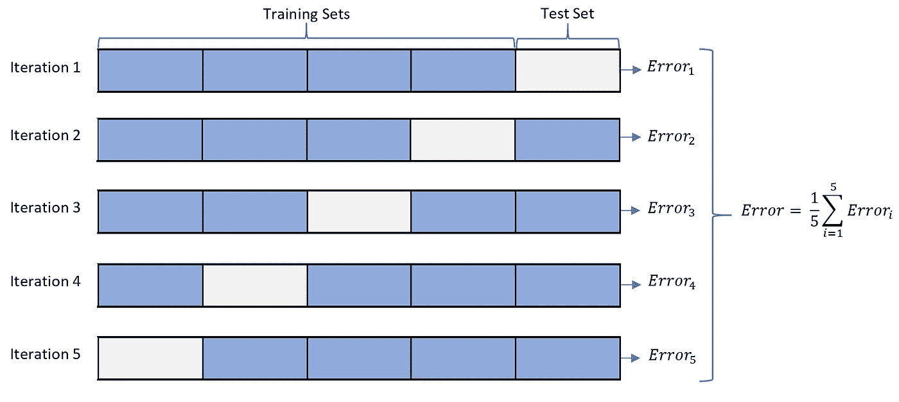

# 交叉验证:K 折 vs 蒙特卡罗

> 原文：<https://towardsdatascience.com/cross-validation-k-fold-vs-monte-carlo-e54df2fc179b?source=collection_archive---------14----------------------->

## …选择正确的验证技术

Riho Kroll 在 [Unsplash](https://unsplash.com?utm_source=medium&utm_medium=referral) 上拍摄的照片

想象一种情况，我们有一个测试集和一个训练集，我们对这些集应用两种不同的机器学习模型。我们如何决定哪个模型表现更好？我们在训练集上训练模型，并使用测试集评估模型。假设模型 A 在测试集上的表现优于模型 B，因为在分割数据时存在偏差。但实际上，B 型才是更优的型号。这就是我们可以使用交叉验证的地方。

# 内容

*   交叉验证
*   k 倍交叉验证
*   蒙特卡罗交叉验证
*   两种方法的区别
*   R 中的示例
*   最后的想法

# 交叉验证

交叉验证(从这里开始我们将称为 CV)是一种用于测试模型预测未知数据的能力的技术，这些数据不用于训练模型。当我们的测试集不够大时，如果我们的数据有限，CV 是有用的。有许多不同的方式来执行简历。通常，CV 将训练数据分成 k 个块。在每次迭代中，模型在 k-1 个块上训练，并使用最后一个块进行验证。我们可以使用 CV 的多次迭代来减少可变性。我们使用所有迭代的平均误差来评估模型。

总是倾向于使用 CV 性能更好的型号。同样，我们也可以使用 CV 来调整模型参数。

# k 倍交叉验证

## 步骤:

1.  将训练数据分成 K 个相等的部分
2.  在 k-1 个零件上拟合模型，并使用第 k 个零件上的拟合模型计算测试误差
3.  重复 k 次，使用每个数据子集作为测试集一次。(通常 k= 5~20)

K 倍 CV，K=5

# 蒙特卡罗交叉验证

也称为重复随机子采样 CV

## 步骤:

1.  随机分割训练数据(可能是 70–30%分割或 62.5–37.5%分割或 86.3–13.7%分割)。对于每次迭代，训练测试分割百分比是不同的。
2.  对该迭代的训练数据集拟合模型，并使用对测试数据拟合的模型来计算测试误差
3.  重复多次迭代(比如 100 次、500 次甚至 1000 次迭代),取测试误差的平均值。

注意——相同的数据可以在测试集中被选择不止一次，甚至根本不被选择。

蒙特卡罗 CV，迭代次数= 100

# 两种方法的区别

# R 中的示例

让我们试着用手写数字数据集来说明这两种交叉验证技术的区别。我们将使用 CV 对 KNN(K 最近邻)模型中的 K 进行超参数调整，而不是在不同的模型之间进行选择。

对于这个例子，我们将把手写数字数据子集化为仅包含数字**和 ***8*** 。然后我们应用 KNN 模型来区分这两者。我们将使用 CV 从 1、3、5、7、9 和 11 中选择 k 的最佳值。**

## **k 近邻(KNN)，速成版**

**KNN 分类给出了基于对象的类在对象的 ***k*** 最近邻中最常见的类。**

## **使用蒙特卡罗 CV 选择 k**

**这里 CV 运行 1000 次迭代( **B** )，为训练集随机选择 **n1** 个观测值，并从剩余的观测值中检索测试误差。在对我们的试验集中的每个 k 值进行迭代之后，我们得到 1000 个测试错误。我们将平均测试误差分配给每个 k 值，并根据平均误差衡量其有效性。**

**KNN 分类中选择 k 的蒙特卡罗 CV 片段**

**下图显示了不同 k 值的 KNN 模型测试误差的变化和范围。每个方框图中的深蓝色线是模型的平均误差。这是我们关注的焦点。**

****

**下图的矩阵给出了 CV 的运行平均测试误差， **B** = 1000。它们表明模型的误差正在收敛到一个特定的值。但是对于较低的 **B** 值，我们会看到移动平均误差的大量波动。**

****

**使用蒙特卡罗 CV 计算不同 k 的运行平均测试误差**

## **使用 K 倍 CV 选择 K**

**对于 K 次折叠，我们使用 k=10(其中 K 是折叠的次数，ML 中的 K 太多了)。对于每个尝试的 k 值，观察值将在测试集中出现一次，在训练集中出现九次。**

**KNN 分类中选择 K 的 K 倍 CV 片段**

## **两个 cv 的平均测试误差**

**我们最后对蒙特卡洛和 K 倍 CV 的测试误差进行平均，并进行比较以选择超参数 K。在本例中，构建 k=3 的 KNN 模型似乎会给出最佳结果。**

****

# ****最终想法****

**使用哪种 CV 技术要视情况而定。蒙特卡罗方法可以让你对结果更有信心，并且因为方差很低，所以重复性更好。但是蒙特卡罗 CV 会比 K 倍 CV 有更高的偏差。这种困境在机器学习中很常见，被称为偏差-方差权衡。在大多数情况下，K-fold CV 就足够好了，而且计算成本更低。**

**要获得完整的代码和数据，请点击下面的链接。**

**[https://github.com/rebeccareeba/CrossValidation_KNN](https://github.com/rebeccareeba/CrossValidation_KNN)**