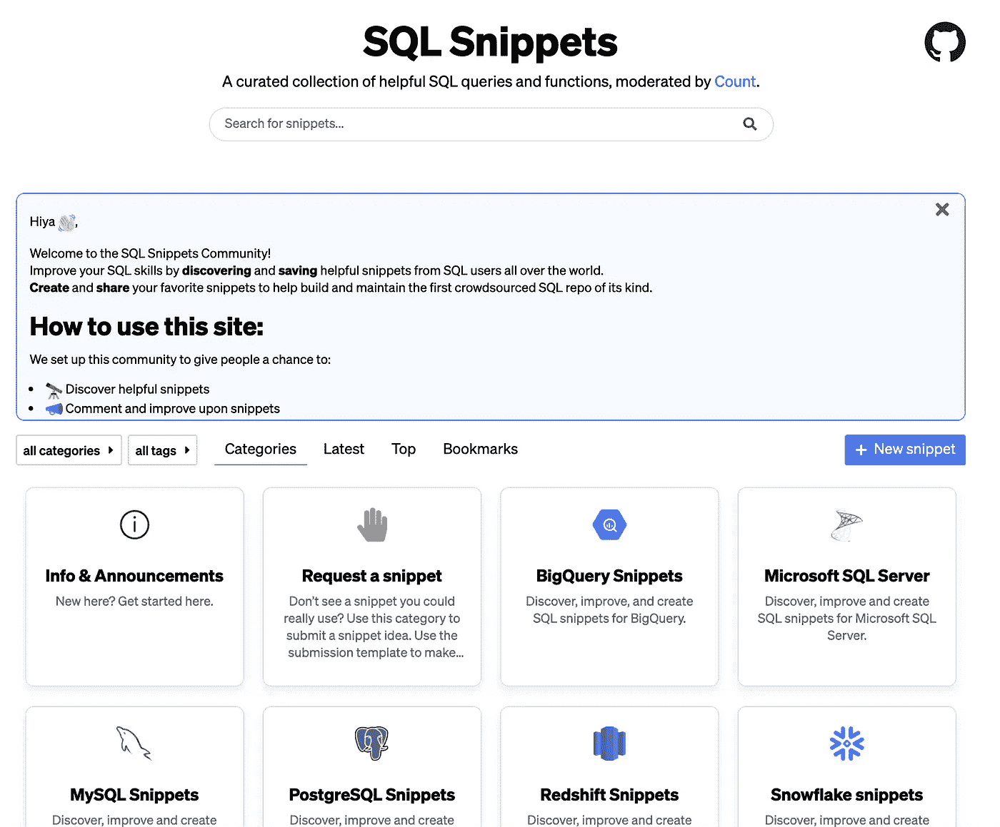

# 众包您的 SQL 查询

> 原文：<https://towardsdatascience.com/crowdsource-your-sql-queries-ebb59446fcd1?source=collection_archive---------24----------------------->

## 让我们一起努力，让 SQL 成为最好的分析语言

约翰·施诺布里奇在 [Unsplash](https://unsplash.com/s/photos/together?utm_source=unsplash&utm_medium=referral&utm_content=creditCopyText) 上的照片

# 背景

有很多人让 SQL 不好过(这里的和这里的等等)。

他们的一些批评当然是正确的，但事实是 SQL 不会有任何发展。作为数据库的语言，它是我们数据的看门人，随着数据仓库的进步，没有更快的方法来查询大数据。其直观的语法虽然冗长，但使技术分析师和业务用户都可以使用它。在一个有越来越多的分析语言需要学习的世界里，无论是专有的还是开源的(比如 Python，R)，SQL 都是我们共享的一种通用语言。

同样重要的是要记住，人们不喜欢其他分析语言是因为它们天生优越，而是因为他们有一个用户社区，这些用户正在积极地使它们更适合于分析。(试想一下，没有熊猫用 Python 做分析。)

我相信 SQL 也是如此。世界上有数以百万计的 SQL 用户，想象一下，如果我们能够开始汇集我们的知识来帮助解决 SQL 的挑战，会发生什么。我相信这是将 SQL 作为一个强大工具的一条有前途的道路，而不是担心它是一个不可避免的祸害。

# 从哪里开始

SQL 的一个常见缺点是冗长和不可压缩性。这无疑是我对 SQL 感到失望的主要原因。

不像在其他语言中，重用普通的代码作为函数或方法并不容易。在 Python 中，我可以很容易地将一段常用的代码转换成一个函数，甚至将该函数作为开源包的一部分共享，这样任何其他 Python 用户也可以使用它。

如果你和我一样，为了应对这个挑战，你会在你的桌面上随意放置一些概念页或 Word 文档，里面都是你想“保存起来下次用”的片段。这是一个粗糙的解决方案，但它让我觉得我正在做一些事情来解决它。

最近，我开始考虑如果我们都把桌面上的 SQL 片段文件放在一个地方会发生什么？我们会围绕标准化和同类最佳的解决方案来解决常见问题吗？我们会节省自己一遍又一遍查找相同语法的时间吗？我们真的能让 SQL 成为众包语言吗？

# 我们也能做到

所以我想我应该验证一下这个理论。我把一些我喜欢的 SQL 片段放到了一个新的开源的 SQL 片段集合**。在这里，任何人都可以:**

*   ****发现**和**保存**有用的 SQL 片段。**
*   ****向上投票**和**对现有片段进行评论**以做出改进。**
*   ****提交**他们自己的片段，进一步扩大知识社区。**

**到目前为止，网站上有超过 100 个片段和近 50 个成员。**

****

**[SQL 片段集合的预览](https://sql-snippets.count.co/)**

# **你怎么想呢?**

**我相信，有了正确的解决方案，众包 SQL 可以成为改进您自己的工作流和更好的 SQL 社区的一个好方法。但是要做到这一点，它必须对每个人(或者至少是大多数人)都有效。考虑到这一点，我请求您查看我们的[片段集](https://sql-snippets.count.co/)和:**

*   **如果你有关于如何做得更好的想法，请发邮件给我，地址:[**snippets@count.co**](mailto:snippets@count.co)**
*   **有片段分享？帮助我们用一些很棒的 SQL 片段作为集合的种子。或者请求社区帮你解决。**
*   **你认为这对其他人有用吗？和一些朋友一起分享吧！**

# **关于我**

**我是 count.co 公司的数据主管。我们是热情的 SQL 爱好者，正在为 SQL 分析构建更好的工作流。**