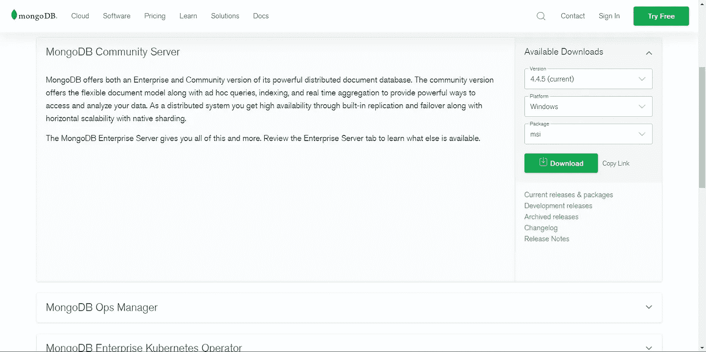
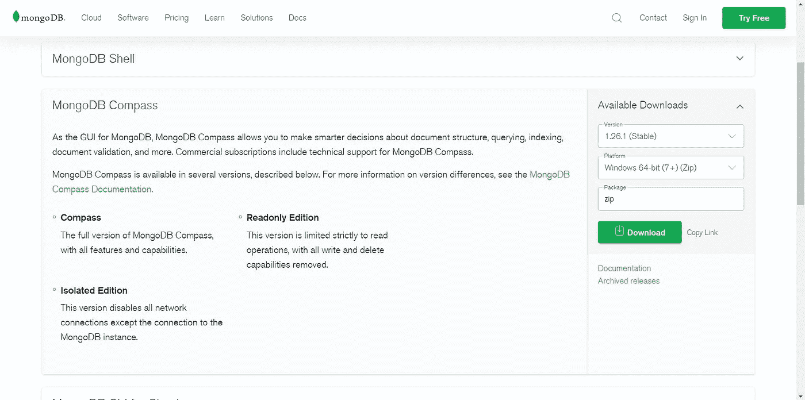
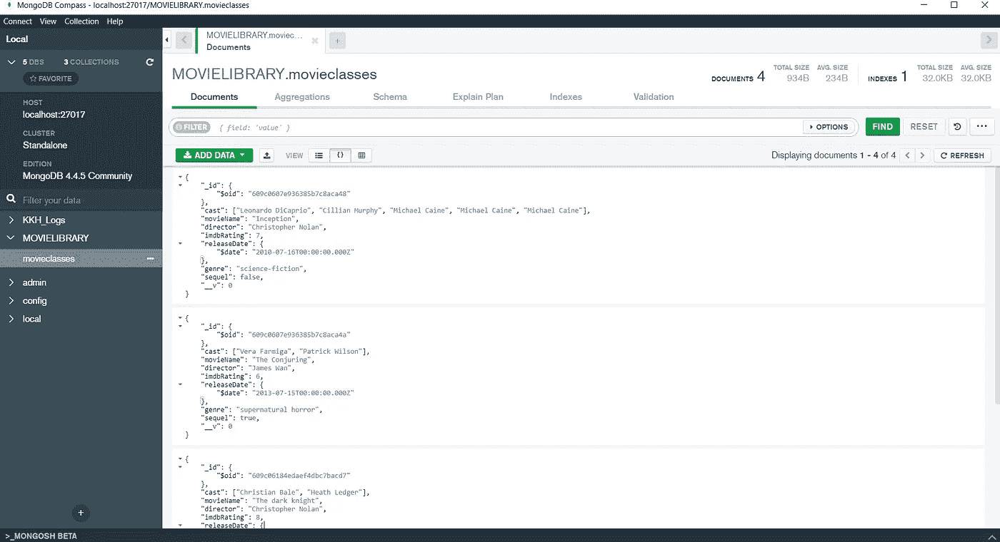
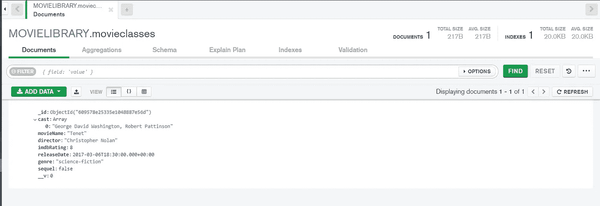

# 使用 Node.js 对 NoSQL 数据库(MongoDB)进行 CRUD(创建、读取、更新、删除)操作

> 原文：<https://towardsdatascience.com/crud-create-read-update-delete-operations-on-nosql-database-mongodb-using-node-js-3979573b9b24?source=collection_archive---------11----------------------->

阿吉达·ATZ 在 [Unsplash](https://unsplash.com?utm_source=medium&utm_medium=referral) 上的照片

读者们好，

在本文中，我演示了 MongoDB 上的 CRUD 操作，并以同步和异步方式执行操作。

有 Node.js 基础知识者优先。

**使用的 NoSQL 数据库:MongoDB**

# 目录:

1.  [简介](#94cb)
2.  [设置 MongoDB (NoSQL)](#0e3d)
3.  [同步与异步执行](#bf3b)
4.  [创建模式、模型、对象](#1141)
5.  [创建(同步)](#dc7d)
6.  [创建(异步)](#1018)
7.  [改为(同步)](#fae5)
8.  [读(异步)](#8677)
9.  [更新(同步)](#fbf2)
10.  [更新(异步)](#42ca)
11.  [删除(同步)](#d25a)
12.  [更新(异步)](#d4a6)
13.  [资源&引用](#fb6b)

# 1.介绍

CRUD 是 CREATE，READ，UPDATE & DELETE 的缩写，是数据库中的基本操作。

在这篇文章中，我使用 MongoDB 作为我的主要数据库，这是一个 NoSQL 数据库，与传统的行/列模型不同，它以 JSON 格式保存数据 aka 文档，并使用 Node.js 语言执行 CRUD 操作。

从根本上说，Node.js 默认情况下是异步或非阻塞的，因此在代码大量使用 CPU 的情况下，它不会等待。

因此，根据我们的情况将 CRUD 操作设计为同步或异步是一个具有挑战性的过程，特别是当我们在实时服务器操作中使用它时，在下面的部分中，我已经以同步/异步两种方式执行了那些操作。

在这篇文章中，我创建并使用了一个电影数据库，它包含了与特定电影相关的细节，因此您可以根据您的用例来操作它。

# 2.设置 MongoDB (NoSQL)

MongoDB 是一个文档数据库，这意味着它将数据存储在类似 JSON 的文档中。我们认为这是考虑数据的最自然的方式，比传统的行/列模型更具表现力和功能。

我们需要两个组件来设置 MongoDB 浏览器。

1.  MongoDB 社区服务器— [在此下载](https://www.mongodb.com/try/download/community)
2.  MongoDB 指南针(GUI 查看器)——[在此下载](https://www.mongodb.com/try/download/compass)

MongoDB 社区服务器

MongoDB Compass(MongoDB 的 GUI 查看器)

安装完这两个应用程序后，我们需要将 MongoDB 服务器路径添加到您 PC 中的环境变量中。

因此，在你的电脑的 C 目录中导航，找到 mongod.exe 文件的位置，并复制地址路径。

在我的例子中，我发现地址是:**C:\ Program Files \ MongoDB \ Server \ 4.4 \ bin**

将上述位置添加到如下所示的环境变量中。

现在我们准备在 MongoDB 数据库中创建文档。

此外，在创建第一个文档之后，我们可以在 MongoDB Compass 中查看数据库。

MongoDB Compass 文档视图。来源—作者

# 3.同步与异步执行

在 NodeJS 中，我们可以以同步(阻塞)和异步(非阻塞)两种方式执行数据库 CRUD 操作。

有时在进行 CRUD 操作时，我们可能需要通过 API 发送变量，或者在后续代码中使用它，等等。，在这种情况下，我们使用同步编程，其中代码中的一行等待前一行完成后再执行。

这是一个耗时的过程，因此我们也可以异步进行操作。这纯粹是基于我们正在处理的用例。

在这里，我将演示执行相同 CRUD 操作的两种方法。

# 4.创建模式、模型、对象

模式就像一个蓝图，它规定了在数据库中存储什么以及以什么格式存储。

为了以一种更舒适的方式发表这篇文章，正如我之前所说的，我将创建一个电影数据库，其中包含电影属性，例如，

1.  电影名称—(字符串)，
2.  导演—(字符串)
3.  IMDB 评级—(数字)
4.  Cast —(数组)
5.  发布日期—(日期时间)
6.  流派—(字符串)
7.  续集—(布尔型)

存储上述元素的主要原因是合并所有类型的数据结构，如字符串、布尔值、数字、数组、日期时间等。,

在上面的代码片段中，我创建了包含文档蓝图的 movieSchema。

后来我创建了一个常量 movieClass，它是一个模型，是基于模式创建的。

使用该模型，我们可以创建一个实例 aka 对象，用于文档中的一个新条目。它非常类似于类和对象的 OOPS 概念。

如您所见，我创建了一个名为“tenet”的新对象来模仿电影名称，填充了字段，然后保存了它。现在，如果我们检查 GUI 数据库查看器— MongoDB Compass，我们必须看到新创建的文档。

现在让我们以同步和异步的方式进一步进行 CRUD 操作。

# 5.创建(同步)

我们之前已经创建了一个以“宗旨”命名的新文档。所以现在我们创建一个函数，它可以用来创建许多电影列表。

在声明了函数 insertMovie 之后，我们可以用它的输入参数进行函数调用，这些参数需要在数据库中进行更新。一旦它们被插入，我们将得到插入的文档。

这里我们插入了 3 部电影。

# 6.创建(异步)

类似地，我们可以在 Mongo DB 中插入新文档，而不需要等待或者没有代码阻塞。另外，我以无代码阻塞的方式添加了另外 3 个电影集。

# 7.读取(同步)

一旦我们创建了文档，现在我们就可以根据自定义条件过滤它们，并从 MongoDB 中提取特定的文档。

为了简洁起见，我用

1.  使用唯一标识符提取数据
2.  通过使用比较操作符来获取数据，比如在 MongoDB 中保留的( >、≥、
3.  Fetch data by using logical operators like (and, or)
4.  Fetch data by using the regex condition.
5.  Fetch data and return the total count of documents.

# 8\. READ (Asynchronous)

READ OPERATION IS STRICTLY SYNCHRONOUS

# 9\. UPDATE (Synchronous)

There are always occurrences where we need to update the document in the future.

So, in the below functions, I have added (append) new records to an array and also replaced the Boolean and Number with new values.

We can use **$push** 和 **$set** 数组更新操作符，您可以尝试所有其他操作符。

您还可以根据下面创建的功能来操作和创建新功能，以符合用例。

# 10.更新(异步)

有时我们不需要等待数据库更新，所以我们可以启动函数并继续下一行代码，更新可以在适当的时候发生。

# 11.删除(同步)

通常，我们还可以通过根据文档指定唯一的 id 来删除记录。

# 12.删除(异步)

# 13.资源和参考

我希望我能够对 MongoDB 上的 CRUD 操作有所了解。

查看包含完整代码实现的 GitHub repo，并随意破解它。

***GitHub—***[https://github.com/bala-codes/Database-CRUD-Operations](https://github.com/bala-codes/Database-CRUD-Operations)

**MongoDB**——[https://www.mongodb.com/](https://www.mongodb.com/)

在那之前，下次见。

**文章作者:**

**BALAKRISHNAKUMAR V**