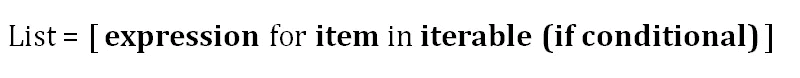
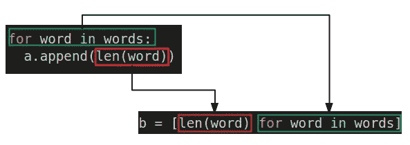
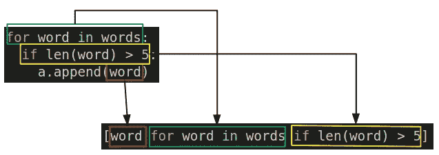
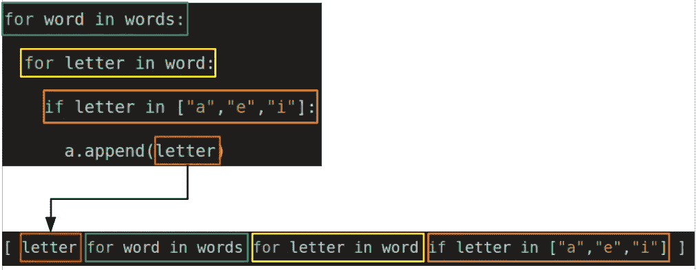

# Python 列表理解的清晰解释

> 原文：<https://towardsdatascience.com/crystal-clear-explanation-of-python-list-comprehensions-ac4e652c7cfb?source=collection_archive---------29----------------------->

## 理解它们的高度直观的方式


照片由 [Unsplash](https://unsplash.com/s/photos/crystal-clear?utm_source=unsplash&utm_medium=referral&utm_content=creditCopyText) 上的 [Dragos Gontariu](https://unsplash.com/@dragos126?utm_source=unsplash&utm_medium=referral&utm_content=creditCopyText) 拍摄

列表理解是一种基于集合、元组、其他列表等其他可重复项创建列表的方式。它还可以被描述为用更简单、更吸引人的语法来表示 for 和 if 循环。尽管列表理解相对来说比循环要快。

列表理解的基本结构如下。



(图片由作者提供)

这似乎很简单，但在某些情况下可能会变得棘手。在本文中，我们将从一个非常简单的列表理解开始，并稳步增加复杂性。我也将清楚地解释如何表示和理解高度复杂的列表理解。

在大多数情况下，列表理解优于 for 和 if 循环，因为

*   它们比循环相对更快。
*   它们被认为比循环和映射函数更具 pythonic 性。
*   列表理解的语法更容易阅读和理解。

让我们从一个简单的例子开始。

```
words = ['data','science','machine','learning']
```

我们想要创建一个包含单词列表中每个单词长度的列表。让我们用 for 循环和列表理解来完成这个任务。

```
#for loop
a = []
for word in words:
   a.append(len(word))#list comprehension
b = [len(word) for word in words]print(f"a is {a}")
print(f"b is {b}")a is [4, 7, 7, 8]
b is [4, 7, 7, 8]
```

理解 list comprehension 语法的最好方法是比较 for 和 if 循环。下图演示了这种比较。



(图片由作者提供)

for 循环末尾的表达式放在列表理解的开头。其余部分从头开始遵循循环中的表达式。

当我们复习这些例子时，就会更清楚了。让我们创建一个包含单词列表中长度大于 5 的条目的列表。

```
#for loop
a = []
for word in words:
   if len(word) > 5:
     a.append(word)#list comprehension
b = [word for word in words if len(word) > 5]print(f"a is {a}")
print(f"b is {b}")a is ['science', 'machine', 'learning']
b is ['science', 'machine', 'learning']
```

下图显示了循环中的表达式在列表理解中是如何表示的。



(图片由作者提供)

和前面的例子一样，在 for 循环结束时做的事情放在列表理解的开始。在这种情况下，我们按原样接受该项目。列表理解的下一部分是循环中的第一个表达式，后面是循环中的第二个表达式。

循环中的逻辑更加直观。因此，与循环相比，掌握列表理解的结构相对容易。过一段时间，随着你的头脑习惯了，你就不必做明确的比较了。

下一个例子稍微复杂一些。我们想要创建一个包含单词列表中所有字母“a”、“e”和“I”的列表。此任务涉及嵌套的 for 和 if 循环。

```
#for loop
a = []
for word in words:
  for letter in word:
    if letter in ["a","e","i"]:
       a.append(letter)
```

我们来详细说明一下语法。我们迭代单词列表。对于每一项，我们迭代字符。如果一个字符符合给定的条件，它将被追加到列表 a 中。

完成相同任务的列表理解如下。

```
b = [letter for word in words for letter in word if letter in ["a","e","i"]]
```

我们从 for 循环中的最后一个表达式开始理解 list。剩余部分从循环的开始处开始。下图说明了每个步骤。



(图片由作者提供)

## 结论

列表理解是一种功能性很强的高效操作。对于简单的任务，它的语法很容易理解。然而，在复杂的情况下，这可能会变得棘手。

如果你在创建或理解复杂的列表理解上有困难，试着用循环来写。这种方法会帮助你理解语法。

值得注意的是，列表理解并不总是最佳选择。它们将整个输出列表加载到内存中。这对于小型或中型的列表来说是可以接受的，甚至是可取的，因为它使操作更快。

然而，当我们处理大型列表(例如 10 亿个元素)时，应该避免理解列表。这可能会导致您的计算机崩溃，由于内存需求的极端数额。

对于这种大型列表，更好的替代方法是使用生成器，它实际上不会在内存中创建大型数据结构。生成器在使用项目时创建项目。物品用完后，生成者会将它们扔掉。生成器不会导致内存问题，但是它们比列表理解相对要慢。

感谢您的阅读。如果您有任何反馈，请告诉我。