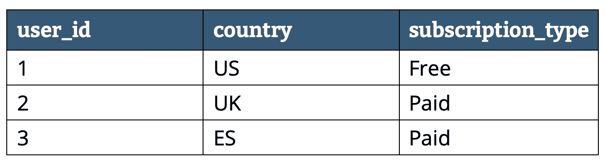
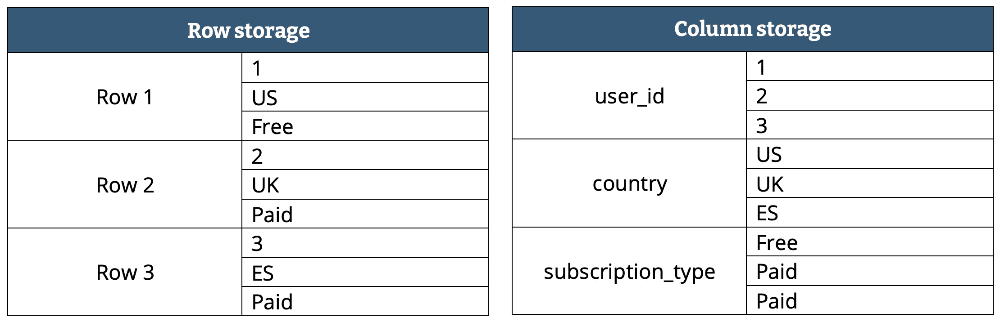
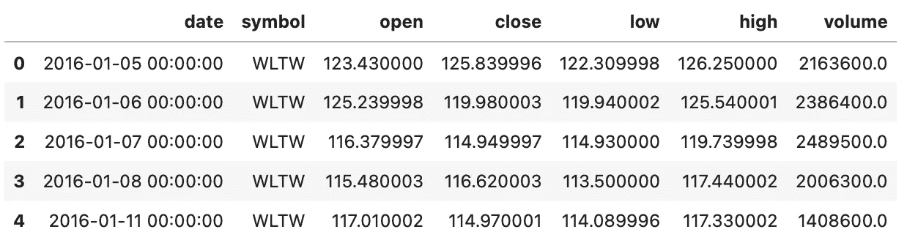
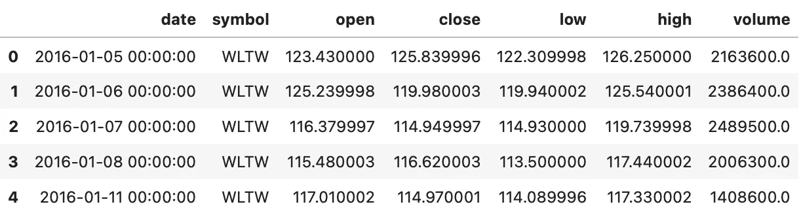
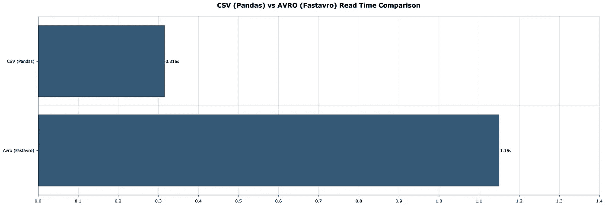
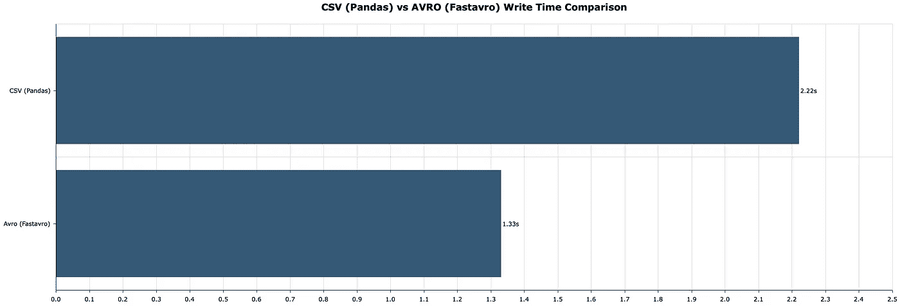
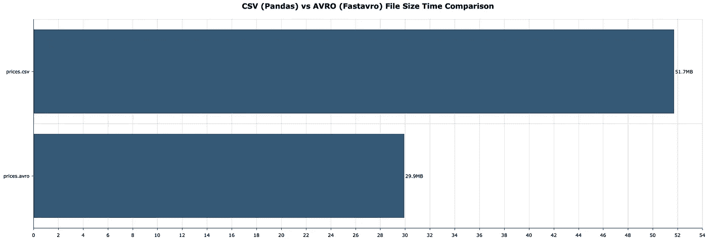

# 用于存储的 CSV 文件？绝对不行。请改用 Apache Avro

> 原文：<https://towardsdatascience.com/csv-files-for-storage-absolutely-not-use-apache-avro-instead-7b7296149326?source=collection_archive---------9----------------------->

## CSV 既耗费金钱又耗费磁盘空间。是时候结束了。


来自 [Pexels](https://www.pexels.com/photo/man-wearing-black-and-white-stripe-shirt-looking-at-white-printer-papers-on-the-wall-212286/?utm_content=attributionCopyText&utm_medium=referral&utm_source=pexels) 的[创业股票照片](https://www.pexels.com/@startup-stock-photos?utm_content=attributionCopyText&utm_medium=referral&utm_source=pexels)

我不是 CSV 的粉丝。它们的查询速度很慢，占用的磁盘空间也比需要的多。如果你使用云来处理大的 CSV 文件，想想*昂贵的*。

有许多替代方案——比如 Excel、数据库和 HDFs——但有一个方案特别突出。也就是说，如果你想坚持使用*行存储*。它被称为阿帕奇 Avro，今天你将了解它的全部内容。

如果您想要更高效的列数据格式，只需看看 Parquet:

[](/csv-files-for-storage-no-thanks-theres-a-better-option-72c78a414d1d) [## 用于存储的 CSV 文件？不用了，谢谢。有更好的选择

### 编辑描述

towardsdatascience.com](/csv-files-for-storage-no-thanks-theres-a-better-option-72c78a414d1d) 

今天的文章回答了以下问题:

*   Avro 是什么？
*   如何在 Python 中使用 Avro？
*   CSV 和 Avro——哪个效率更高？

# 但是 Avro 是什么？

Avro 是一个开源项目，为 Apache Hadoop 提供数据序列化和交换服务。不要担心，你不需要大数据环境，你的笔记本电脑会做得很好。Avro 背后的人是道格·卡丁。他也被称为 Hadoop 之父。

如果你不熟悉术语*序列化*，这里有一个速成班。这是一个将数组和字典等对象转换成字节流的过程，字节流可以有效地存储和传输到其他地方。然后，您可以*反序列化*字节流以获得原始对象。

Avro 是面向行的，就像 CSV 一样。这使得它不同于，比方说， [Parquet](/csv-files-for-storage-no-thanks-theres-a-better-option-72c78a414d1d) ，但它仍然是一种高效的数据格式。

这是另一个速成班——针对那些不熟悉行和列存储区别的人。假设您有以下数据:



图 1-虚拟表数据(作者提供的图片)

以下是在行存储和列存储中的组织方式:



图 2 —行存储与列存储(作者提供的图片)

列存储文件更加轻量级，因为可以对每一列进行充分的压缩。行存储不是那样工作的，因为一行可以有多种数据类型。

但是 Avro 的情况是这样的——它用一个类似 JSON 的模式存储数据，所以正确的数据类型是预先知道的。这就是压缩发生的地方。

简而言之，一个 Avro 文件包含一个类似 JSON 的数据类型模式和二进制格式的数据本身。

Avro 为每一种主要的编程语言都提供了一个 API。但是有一个问题——**熊猫默认不支持**。所以不，你不能访问`read_avro()`和`to_avro()`函数。你必须解决这个问题。

这并不困难——你接下来会看到。

# 如何在 Python 中使用 Avro？

有两个可安装的库用于处理 Avro 文件:

*   `avro` — [文档链接](https://avro.apache.org)
*   `fastavro` — [文档链接](https://fastavro.readthedocs.io/en/latest/)

后者表示，以前的图书馆非常慢，因为处理 10K 记录需要大约 14 秒。出于这个原因，你会坚持使用`fastavro`。

下面是如何设置一个新的虚拟环境并安装必要的库(针对 Anaconda 用户):

```
conda create --name avro_env python=3.8
conda activate avro_env

conda install -c conda-forge pandas fastavro jupyter jupyterlab
```

执行以下命令启动 JupyterLab 会话:

```
jupyter lab
```

您将使用[纽约证券交易所股票价格数据集](https://www.kaggle.com/dgawlik/nyse?select=prices.csv)进行实际操作。数据集采用 CSV 格式，大小约为 50 MB。使用以下代码片段导入所需的库并加载数据集:

```
import pandas as pd
from fastavro import writer, reader, parse_schema

df = pd.read_csv('prices.csv')
df.head()
```

股票价格数据集如下所示:



图 3 —纽约证券交易所股票价格数据集(图片由作者提供)

将 Pandas 数据帧转换为 Avro 文件的过程分为三步:

1.  **定义模式** —您必须定义一个类似 JSON 的模式来指定需要哪些字段，以及它们各自的数据类型。将它写成 Python 字典，并使用`fastavro.parse_schema()`解析它。
2.  **将数据帧转换成记录列表** —使用 Pandas 的`to_dict('records')`函数将数据帧转换成字典对象列表。
3.  **写入 Avro 文件** —使用`fastavro.writer()`保存 Avro 文件。

下面是这三个步骤在代码中的样子:

```
**# 1\. Define the schema**
schema = {
    'doc': 'NYSE prices',
    'name': 'NYSE',
    'namespace': 'stocks',
    'type': 'record',
    'fields': [
        {'name': 'date', 'type': {
            'type': 'string', 'logicalType': 'time-millis'
        }},
        {'name': 'symbol', 'type': 'string'},
        {'name': 'open', 'type': 'float'},
        {'name': 'close', 'type': 'float'},
        {'name': 'low', 'type': 'float'},
        {'name': 'high', 'type': 'float'},
        {'name': 'volume', 'type': 'float'}
    ]
}
parsed_schema = parse_schema(schema)

**# 2\. Convert pd.DataFrame to records - list of dictionaries**
records = df.to_dict('records')

**# 3\. Write to Avro file**
with open('prices.avro', 'wb') as out:
    writer(out, parsed_schema, records)
```

这不像调用单个函数那么简单，但也没那么难。如果数据集有数百列，可能会很乏味，但这是效率的代价。

还有自动生成名称和类型的空间。发挥创造力。我相信你能处理好。

从 Avro 到 Pandas DataFrame 也是一个三步走的过程:

1.  **创建一个列表来存储记录** —这个列表将存储字典对象，您可以在以后将其转换为 Pandas DataFrame。
2.  **读取并解析 Avro 文件** —使用`fastavro.reader()`读取文件，然后遍历记录。
3.  **转换为 Pandas DataFrame** —调用`pd.DataFrame()`并传入一个解析过的记录列表。

代码如下:

```
**# 1\. List to store the records**
avro_records = []

**# 2\. Read the Avro file**
with open('prices.avro', 'rb') as fo:
    avro_reader = reader(fo)
    for record in avro_reader:
        avro_records.append(record)

**# 3\. Convert to pd.DataFrame**
df_avro = pd.DataFrame(avro_records)

**# Print the first couple of rows**
df_avro.head()
```

下面是前几行的样子:



图 4 —从 Avro 文件中读取的纽约证券交易所股票价格数据集(图片由作者提供)

数据集的 CSV 和 Avro 版本是相同的，但是您应该使用哪一个呢？接下来我们来回答这个问题。

# CSV 与 Avro——您应该使用哪一种？

回答这个问题有点棘手。有些人喜欢 CSV，因为你可以直接编辑它们。Avro 没有这个选项。您将看到的所有结果都基于原始的 50 MB CSV 文件。您的里程可能会有所不同。

下面是读取时间— `pd.read_csv()`和`fastavro.reader()`之间的比较，并附有一个列表:



图 5 — CSV 与 Avro 读取时间的关系(CSV = 0.315s，Avro = 1.15s)(图片由作者提供)

如果数据集为 50 MB，Pandas 的速度大约是它的三倍。

这里有一个写时间的比较——`pd.to_csv()`和`fastavro.writer()`:



图 6 — CSV 与 Avro 写时间的关系(CSV = 2.22s 秒，Avro = 1.33s 秒)(图片由作者提供)

风水轮流转——Pandas 需要更长的时间来保存相同的数据集。

最后一个比较可能是最有趣的—文件大小比较。由于串行化，Avro 应该提供文件大小的显著减少。结果如下:



图 7 — CSV 与 Avro 文件大小(CSV = 51.7MB，Avro = 29.9MB)(图片由作者提供)

虽然不像拼花地板那样降价，但也不算太差。

*这对 50 MB 数据集有影响吗？*可能不会，但在更大的数据集上，节省的规模也会扩大。如果您在云上存储数据并为整体大小付费，这一点尤其重要。

这是值得思考的问题。

喜欢这篇文章吗？成为[中等会员](https://medium.com/@radecicdario/membership)继续无限学习。如果你使用下面的链接，我会收到你的一部分会员费，不需要你额外付费。

[](https://medium.com/@radecicdario/membership) [## 阅读达里奥·拉德契奇(以及媒体上数以千计的其他作家)的每一个故事

### 作为一个媒体会员，你的会员费的一部分会给你阅读的作家，你可以完全接触到每一个故事…

medium.com](https://medium.com/@radecicdario/membership) 

# 保持联系

*   在[媒体](https://medium.com/@radecicdario)上关注我，了解更多类似的故事
*   注册我的[简讯](https://mailchi.mp/46a3d2989d9b/bdssubscribe)
*   在 [LinkedIn](https://www.linkedin.com/in/darioradecic/) 上连接