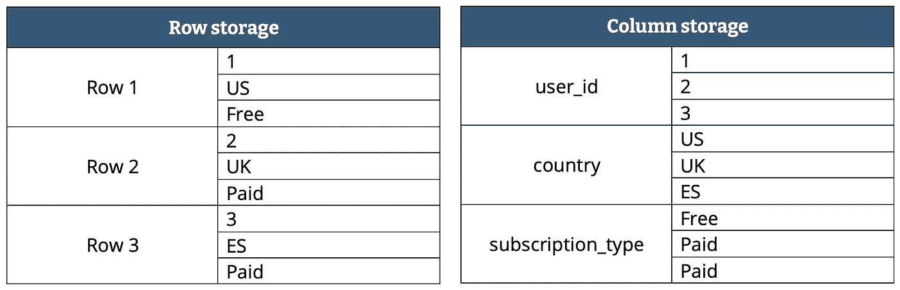

# 用于存储的 CSV 文件？不用了，谢谢。有更好的选择

> 原文：<https://towardsdatascience.com/csv-files-for-storage-no-thanks-theres-a-better-option-72c78a414d1d?source=collection_archive---------0----------------------->

## 将数据保存到 CSV 文件中既浪费金钱又浪费磁盘空间。是时候结束了。


大卫·艾姆里奇在 [Unsplash](https://unsplash.com/?utm_source=unsplash&utm_medium=referral&utm_content=creditCopyText) 上的照片

每个人和他们的祖母都知道 CSV 文件是什么。拼花地板，没那么多。*它是一种地板吗？*是的，但不是——这是一种高效的数据存储格式，今天你将会了解到这一切。

CSV 无处不在——从公司报告到机器学习数据集。这是一种简单直观的数据格式，只需打开一个文件，就可以直接访问数据。它并不像听起来那么好，原因你会读到一点。

CSV 有许多替代方案，如 Excel、SQLite 数据库和 HDFs，但有一个方案尤其具有竞争力。那是镶木地板。

今天的文章回答了以下问题:

*   CSV 有什么问题？
*   什么是拼花地板数据格式？
*   CSV 还是拼花？你应该用哪一个？

# CSV 有什么问题？

我喜欢 CSV，你可能也是。几乎任何软件都可以生成 CSV 文件，甚至是纯文本编辑器。如果你对数据科学和机器学习感兴趣，就去 Kaggle.com 吧——几乎所有的表格数据集都是这种格式。

CSV 是面向行的，这意味着它们的查询速度很慢，并且难以高效存储。拼花地板则不是这样，它是一种柱状储物选择。对于相同的数据集，这两者之间的大小差异是巨大的，您很快就会看到这一点。

雪上加霜的是，任何人都可以打开和修改 CSV 文件。这就是为什么你不应该使用这种格式作为数据库。有更安全的选择。

但是让我们来看看对公司来说真正重要的是什么——时间和金钱。你可能会将数据存储在云中，作为 web 应用程序或机器学习模型的基础。云服务提供商将根据扫描的数据量或存储的数据量向您收费。这对 CSV 来说都不太好。

让我们先来看看亚马逊 S3 的存储定价。这些数字取自这里的:


图 1 —不同数据格式的亚马逊 S3 存储定价(图片由作者提供)

呀。拼花文件比 CSV 占用更少的磁盘空间(亚马逊 S3 上的列*大小)，并且扫描速度更快(列*数据扫描*)。因此，相同的数据集以拼花格式存储要便宜 16 倍！*

接下来，让我们看看 Apache Parquet 的速度提升:


图 2 —不同数据格式的亚马逊 S3 存储和查询价格比较(图片由作者提供)

又一次——呀！如果您的原始 CSV 文件大小为 1TB，那么 Parquet 会便宜 99.7%。

所以，不，当您的数据很大时，CSV 绝对不是一个好的选择——无论是时间还是成本。

# 但是到底什么是拼花数据格式呢？

这是存储数据的另一种格式。它是开源的，并在 Apache 的许可下使用。

CSV 和 Parquet 格式都是用来存储数据的，但是它们内部不会有更多的不同。CSV 就是您所说的*行存储*，而 Parquet 文件则是按列组织数据。

这是它的意思。假设您有以下数据:


图 3 —虚拟表数据(作者提供的图片)

下面是前一个表在行和列存储中的组织方式:



图 4 —行存储与列存储(作者提供的图片)

简而言之，列存储文件更加轻量级，因为可以对每一列进行充分的压缩。行存储则不是这样，因为一行通常包含多种数据类型。

阿帕奇拼花地板是为效率而设计的。原因就在于列存储架构，因为它允许您快速跳过不相关的数据。这样查询和聚合都更快，从而节省了硬件(理解为:更便宜)。

简而言之，对于较大的文件，Parquet 是一种更有效的数据格式。使用拼花地板比使用 CSV 更节省时间和金钱。

如果你是一个 Python 爱好者，在 Pandas 中处理 CSV 文件应该听起来很熟悉。接下来让我们看看库是如何处理 Parquet 文件的。

# 实践 CSV 和拼花地板比较

您将使用[纽约证券交易所股票价格数据集](https://www.kaggle.com/dgawlik/nyse?select=prices.csv)进行这一动手操作部分。CSV 文件的大小约为 50MB 没什么大的——但是您会看到 Parquet 将节省多少磁盘空间。

首先，加载包含 Python 熊猫的 CSV 文件:

```
import pandas as pddf = pd.read_csv('data/prices.csv')
df.head()
```

它看起来是这样的:


图片 5 —纽约证券交易所股票价格数据集的头部— CSV(图片由作者提供)

您必须使用`to_parquet()`函数来保存数据集。它的工作原理在很大程度上与`to_csv()`相同，所以使用它不会有什么不同:

```
df.to_parquet('data/prices.parquet')
```

数据集现已保存。在比较文件大小之前，让我们看看如何加载它。熊猫有`read_parquet()`功能，用于读取拼花数据文件；

```
df_parquet = pd.read_parquet('data/prices.parquet')
df_parquet.head()
```

以下是数据集的外观:


图片 6 —纽约证券交易所股票价格数据集的头部—拼花地板(图片由作者提供)

两个数据集完全相同。命令`df.equals(df_parquet)`会将`True`打印到控制台，所以可以随意使用它进行验证。

那么，文件大小有没有减少呢？嗯，是的:


图 7 —纽约证券交易所股票价格数据集上 CSV 与拼花文件大小的对比(图片由作者提供)

这大约减少了四分之一的磁盘空间使用。

*这对 50MB 的数据集重要吗？*可能不会，但在更大的数据集上，节省也会增加。如果您在云上存储数据并为整体大小付费，这一点尤其重要。

这是值得思考的问题。

*喜欢这篇文章吗？成为* [*中等会员*](https://medium.com/@radecicdario/membership) *继续无限制学习。如果你使用下面的链接，我会收到你的一部分会员费，不需要你额外付费。*

<https://medium.com/@radecicdario/membership>  

# 保持联系

*   在[媒体](https://medium.com/@radecicdario)上关注我，了解更多类似的故事
*   注册我的[简讯](https://mailchi.mp/46a3d2989d9b/bdssubscribe)
*   在 [LinkedIn](https://www.linkedin.com/in/darioradecic/) 上连接