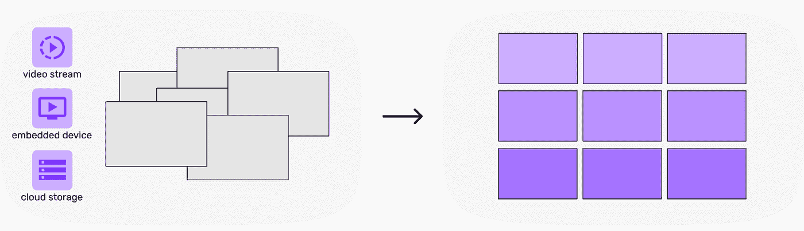
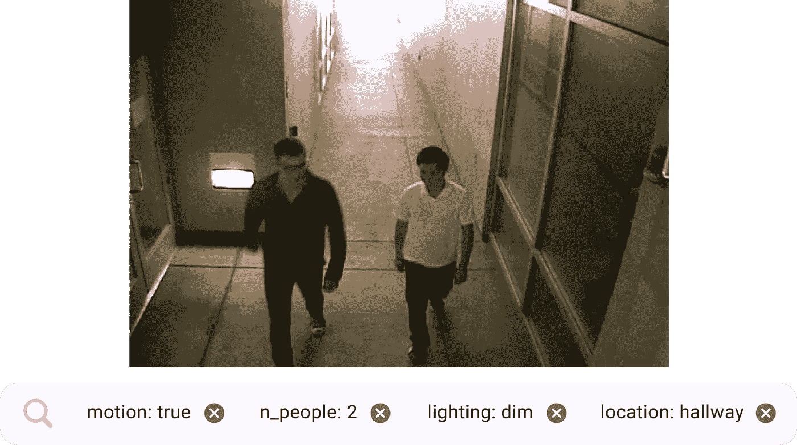
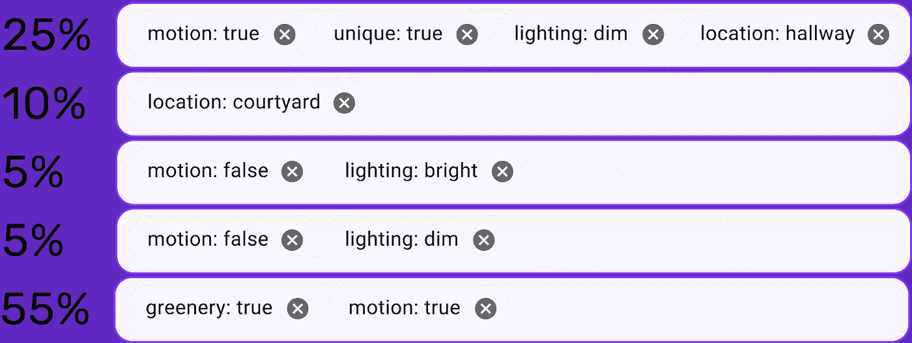
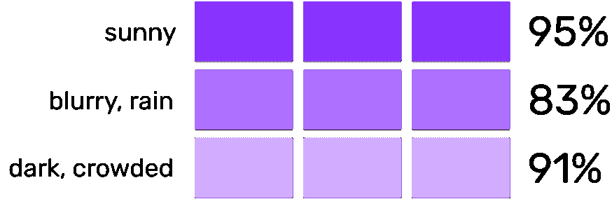
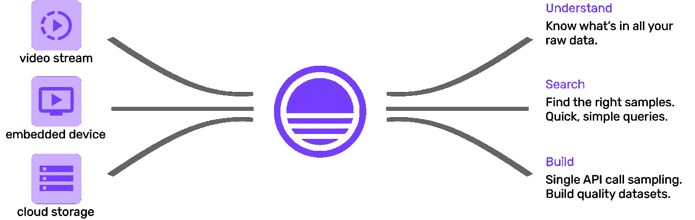

# 从原始图像和视频中管理数据集

> 原文：<https://towardsdatascience.com/curating-a-dataset-from-raw-images-and-videos-c8b962eca9ba?source=collection_archive---------17----------------------->

## 构建图像和视频数据集时要遵循的最佳实践。

作者图片

几乎每个组织都囤积了大量数据。人们杜撰出“[数据是新的石油](https://www.wired.com/insights/2014/07/data-new-oil-digital-economy/)”这样的短语，进一步刺激了这一点。视觉数据也不例外。日志和视频片段不断被打包并存储在机器人车队中。特斯拉汽车不断将录制的镜头发送回特斯拉服务器，用于开发其自动驾驶汽车技术。安全摄像头全天候存储录像。不过，有一个重要的模式需要注意:

**虽然生成新数据很容易，但组织和找到*相关的*数据却极其困难。**

让我们以一个安全摄像头设置为例。您有 10 台摄像机以 30 FPS、1920x1080 的分辨率全天候录制镜头。它们都被配置为每隔 10 分钟将视频片段发送回云端。标准的压缩设置导致每天存储 **~1 TB 的视频**或**2700 万个单独的帧**。这些视频可能可以通过时间戳进行搜索，但找到有动作或人物的瞬间就像大海捞针一样。如果让人们标记这些图像(假设每张图像需要 5 秒钟)，那么仅一天的数据就需要大约 38000 个小时。

使用这些数据建立数据集是很困难的。在这篇博客中，我们将介绍从原始的 Pb 级图像和视频数据中管理数据集的最佳实践。我们将使用安全摄像头示例来指导我们。

# 我们的示例任务

让我们记住这个安全摄像机设置，并定义一个任务:**检测帧中每个夹克周围的边界框。**

来自 [CamNet](https://vcg.engr.ucr.edu/sites/g/files/rcwecm2661/files/2019-02/2015b.pdf) 数据集的样本图像，由 [UC Riverside](https://vcg.ece.ucr.edu/datasets) 提供。[链接到原始数据。](https://drive.google.com/drive/folders/0B7uDdIqGrZlVfmdlOFZyUEg3RHUxaUdSaGVGTTNDT3R0dUNLSFdCSkZYVWk0dE16TFg4cTA?resourcekey=0-oE2y5n2qFOlKoXc6dW224A)

下面，我们将展示一个循序渐进的过程，它将帮助您构建最佳数据集，这意味着对于此任务也是最佳模型。我们将在这里使用标准的深度学习范式，这意味着我们需要一个大型的标记数据集。

作者图片

## 1.清楚地定义模型应该在哪里工作

深度学习模型与泛化斗争。这意味着为我们的模型设定合理的期望值很重要。我们需要我们的安全摄像机来检测夹克吗，即使在大雪覆盖摄像机镜头的时候？还是我们期待更“理智”的天气状况？让我们考虑几个这样的因素:

*   天气(晴天、刮风、下雨、下雪)
*   照明(漆黑、黑暗、昏暗、正常、明亮)
*   摄像机角度(低角度、面部水平、观看、自上而下)
*   反射表面的存在(真，假)
*   运动的存在(真、假)
*   在场人员(真，假)
*   模糊度(数字标度)
*   分辨率(标清、高清、4K 等。)

对于每一个因素或因素的组合，要理解它发生的频率，以及在这种情况下你的用例可以容忍的性能水平。想出每一个可能的变量和它的期望值是非常困难的，但是涵盖你认为最重要的变量并设定期望值是很重要的。

## 2.收集+预处理您的数据

出去收集一些监控录像。记住上一步的因素，看看是否有办法设置摄像机，使它们能够收集涉及上述所有场景的数据。

对于我们的用例，我们需要提取视频的单个帧来训练我们的深度学习模型。我们需要通过使用指定的文件夹/命名约定保存单个帧来预处理视频，以保持视频顺序完整。这样，您可以在后面的步骤中访问原始数据。

在[screen](https://sievedata.com/)我们发现这部分过程相当烦人，所以我们建立了一个[简单回购](https://github.com/Sieve-Data/automatic-video-processing)你可以运行它，它将使用我们的平台自动收集和存储视频数据，以便以后方便查询。通过 API 请求上传视频，Sieve 会处理剩下的事情——更多信息请见本文末尾。

## 3.理解你拥有的数据

在构建好的数据集的过程中，最被低估的步骤之一是首先理解你可以访问的原始数据。通过了解这一点，我们可以意识到数据收集中存在的任何偏差，并有机会消除它们。将原始数据分布与产生最佳性能模型的精选数据集的分布进行比较也是有帮助的。

我们可以使用步骤 1 中的模型约束变量作为分析数据集的有用指南。理想情况下，我们应该能够用这些分析信息准确地标记数据集中的每个图像。这样，我们对分布有了一个整体的看法:我们有什么，我们没有什么？

根据特定摄像机的 *camera_id* 或其他唯一标识符以及在数据收集过程中设置的位置，可以自动标记位置(如走廊、走廊、庭院等)和摄像机角度等因素。其他动态因素，如天气、运动、人、照明等，必须以其他形式提取。

通过[筛选](https://sievedata.com/)从 [CamNet](https://vcg.engr.ucr.edu/sites/g/files/rcwecm2661/files/2019-02/2015b.pdf) 数据集标记的图像——作者提供的图像

**选项 1:高质量数据标签服务**

我们可以将我们的图像提交给一个高质量的标签平台，并要求我们的每个变量都被一群人精确地标记。不幸的是，准确性带来了很高的成本——每个分类大约 0.05 美元，每个图像有 5 个标签，这使得每个样本的总成本为 0.25 美元。

亲:高品质，准确

缺点:成本高

**选项 2:类似土耳其人的机械服务**

[Mechanical Turk](https://www.mturk.com/) 是一个更便宜的标签平台，在这里我们可以支付~ 0.01 美元/分类(比上面低 5 倍)。问题是它提供的专业服务和质量保证检查更少，你必须自己管理。这意味着更便宜的标签，但你需要付出更多的努力和不一致的结果。

教授:它更便宜，但不是很多

缺点:质量不一致

**选项 3:基于模型的标签**

基于模型的标记使用现有的计算机视觉或深度学习模型，用我们正在寻找的目标变量来标记我们的图像。挑战在于建立良好的模型，能够检测出我们感兴趣的确切特征。我们在这里更大的目标是建立一个检测人的模型，当我们建立这些侧模型时，我们似乎被引入了一个需要更多努力的过程。这就是为什么我们需要利用已经存在的通用模型。**同样需要注意的是，我们并不在乎这些标签的 100%准确性。**即使我们用这些模型达到大约 75–80%的准确率，与没有任何信息相比，它也能让我们更好地了解我们的数据集中有什么。

**传统的计算机视觉模型**和算法可以帮助我们确定一些基本的东西，如亮度、照明、对比度、轮廓等等。

**像 [YOLO-9000](https://github.com/ultralytics/yolov5) 这样的深度学习模型**可以帮助我们检测列在它们类别列表下的对象。此外，我们可以根据我们在每个设置中期望的对象类型，有条件地创建其他标签，如“室内/室外”。

我们可以使用更多的**尖端模型，如** [**CLIP**](https://openai.com/blog/clip/) 来为我们的一些图像生成精确的字幕，并以这种方式提取更多的标签。

优点:自动，便宜，一致

缺点:不是 100%准确，目标变量略有不同

总的来说，没有一个选项是绝对的赢家。根据你的资金预算、时间预算、团队规模等等，不同选项的组合可能会工作得最好。

然而，我们仍然不能忽视一些问题。最大的问题是我们试图处理的数据量。以 30 FPS 的速度收集视频数据意味着单个摄像机每天会产生大约 260 万个单独的帧。即使使用我们最便宜的基于模型的标记方法，我们也很难在每一帧视频上运行昂贵的模型。我们需要更聪明的东西。

**高效的视频处理流水线**

如果我们有选择地在特定的视频帧上运行特定的操作会怎么样？假设我们为我们关心的帧建立了一个任意的定义。例如，对于安全镜头，我们可能只关心由运动组成的帧。我们可以在视频帧上运行运动检测器，然后只在这些帧上处理昂贵的模型。我们甚至可以决定运行运动检测器，然后在通过运动检测的帧上运行更便宜的人物检测器模型，然后在通过两者的帧上运行我们非常昂贵的模型。我们可以同时构建各种形式的平滑/聚类，以确定每层中哪些视频“间隔”是感兴趣的，从而消除错误触发。

视频过滤设置示例，由[筛](https://sievedata.com/)提供—图片由作者提供

完成所有这些工作后，我们可以将标签写入数据库，将视频帧链接到它们的相关标签，这样我们就可以进行任意查询，并在宏观层面上分析我们的数据。

## 4.对好的数据集进行采样

现在我们有了构建一个好的数据集所必需的所有工具。基于我们在第一步中设定的期望值，我们可以构建多个子集来均衡所有提到的变量。

通常，数据可能是在短期内(约 1 个月)收集的，而由于季节和天气等各种因素，在更长的时间跨度内(约 1 年)可能会发生更大的可变变化。这就是您的数据集分布可能与您的模型在现实世界中部署时的分布不匹配的原因。

来自[筛网站](https://sievedata.com/)的基于百分比的抽样查询示例—图片由作者提供

即使直觉告诉我们，您定义的场景并不总是以相同的频率出现，但重要的是从相等的分布开始，并根据模型在训练时的反应对数据集进行迭代更改。考虑到一些场景只是在数据集中出现的频率较低，您可以尝试各种方法，比如从[欠采样](https://www.mastersindatascience.org/learning/statistics-data-science/undersampling/)开始。如果您觉得这样会使数据集过小，请包含尽可能多的少数民族类样本，并将下一个最少出现的类视为少数民族类，以便再次进行欠采样。深度学习模型倾向于与[长尾](https://venturebeat.com/2020/08/14/how-to-improve-ai-economics-by-taming-the-long-tail-of-data/)作斗争，因此应用这些技术对于在培训中重新强调这种场景至关重要。

Sieve 的[查询功能](https://docs.sievedata.com/#query-by-metadata)使得整个过程完全自动化，可以处理 Pb 级的视频。

## 5.标注数据集

有大量的文献都是关于如何让数据贴上最高质量的标签。诸如[秤](https://scale.com/)、[标签盒](http://labelbox.com/)、[蜂巢](https://thehive.ai/)、[超级注解](https://www.superannotate.com/)等平台都提供了很棒的解决方案。

## 6.火车模型

通过试验各种超参数、数据扩充组合、模型架构、集合等，遵循典型的模型训练程序。

## 7.评估模型

当人们谈论模型准确性时，他们通常使用单一的数字或度量。这是一种有缺陷的方法。

你的模型将会有不同的性能水平，这取决于它的部署位置和所处位置的条件。单一指标隐藏了这些性能差异。

就像常规的软件单元测试一样，让我们提出一组案例，或者关键的数据群体，我们可以分别评估我们的模型。如果它分别通过了这些测试，就可以部署了。“通过”这些测试通常是一个任意的性能阈值，由任务的难度、可以访问的数据量以及模型的计算密集型程度来设置。

创建不同的子集场景来测试模型，照片来自[筛子](https://sievedata.com/) —图片由作者提供

从事最大规模项目的世界级 ML 团队将这种方法视为黄金标准。如果你有兴趣了解更详细的原理，请阅读[这篇文章](https://blog.mokshith.xyz/tech/2021/06/30/production-ml-testing.html)。

## 8.反馈回路

根据哪些测试用例低于期望的性能标准，我们现在可以尝试一些不同的方法来达到期望的性能水平。

首先，我们可以尝试增加训练集中表现不佳的场景的百分比。这意味着模型更加关注那些特定的情况，意味着更好的性能。然而，这种类型的重新平衡总是伴随着其他场景中的性能折衷——因此需要进行实验来获得正确的平衡。

接下来，我们还可以在每个测试场景中找到我们的模型输出低置信度分数的样本。然后，我们可以进行两种类型的采样，向我们的训练集添加更多的数据。

1.  在每个标记的属性中，测量包含至少一个低于某个阈值的置信度得分的样本的分布。根据这些分布中的每一个，从原始数据中分别采样更多的图像到我们的数据集中。
2.  在每个测试场景中查找低置信度的样本，并执行相似性搜索来查找看起来相似的其他图像。在边界框级别进行相似性搜索更加困难，但在寻找具有相似外观对象的场景时更有效。这个过程被称为[主动学习](https://blog.roboflow.com/what-is-active-learning/)。

重新训练您的模型，并循环执行下面的步骤，直到验证数据达到所需的性能水平。

## 9.最终模型性能

在一组数据上测量最终的模型性能，这些数据在前面的步骤中是完全没有的。这是一种评估模型性能的无偏方法，在训练过程中不会出现偏差。

# 筛子能有什么帮助

作者图片

在[screen](https://sievedata.com/)，我们正在构建核心基础设施，使处理、组织、搜索和导出 Pb 级视频数据变得容易。我们知道，我们在本教程中描述的只是利用您的视觉数据的冰山一角，并且知道实现任何人都可以使用的即插即用管道所涉及的所有复杂性。[使用我们的 API](https://docs.sievedata.com/#push-video-data) 上传视频数据，剩下的交给我们。[这个资源库](https://github.com/Sieve-Data/automatic-video-processing)可以帮你入门。

*   将视频分割成单独的帧
*   在帧级别自动生成与领域相关的元数据，如运动、对象、人物等
*   基于单个帧级元数据搜索您的视频
*   探索和分析数据统计，如运动帧数百分比等。
*   基于搜索查询导出数据集，在几分钟内自动打包供下载

上面是使用 Sieve API 和仪表板的简短演练。

如果您有任何问题，请随时留下您的意见或通过 sievedata.com mokshith 直接联系我！