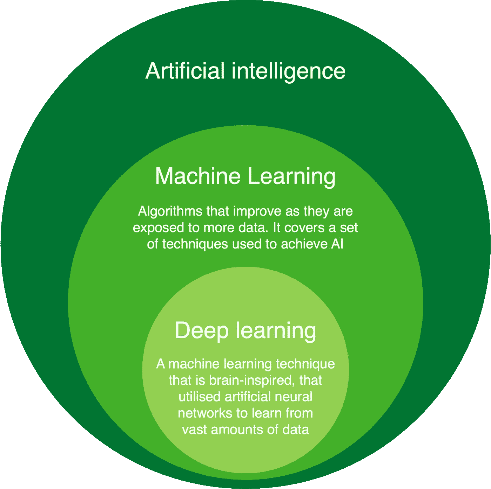

# 数据科学和人工智能的当前和未来趋势

> 原文：<https://towardsdatascience.com/current-and-future-trends-in-data-science-and-ai-b404105e73ca?source=collection_archive---------20----------------------->

## 以及对企业界的影响

肖恩·波洛克在 [Unsplash](https://unsplash.com/s/photos/corporate?utm_source=unsplash&utm_medium=referral&utm_content=creditCopyText) 上的照片

世界上的移动设备比人还多，每次你拿起一个，你就与人工智能互动。从我们的智能手机摄像头在自拍或解锁苹果手机时自动检测我们的面部，到在谷歌上搜索英国顶级咨询公司，或者当网飞向 Siri 和 Alexa 等智能助手推荐下一部值得狂欢的电视剧时，人工智能系统正在成为我们生活的一部分。这些助手利用最先进的人工智能技术来“理解”他们的用户想要什么。但 AI 不仅仅如此。随着这一领域的发展，一个充满机遇的全新世界展现在我们面前。这包括有助于社会和促进经济增长的技术。

作者创造的形象

疫情无疑影响了每个人的生活，并因此影响了企业界。有趣的是，我们正在目睹许多公司的数字化加速，引入新的数字平台来举行更加自动化的后台流程会议。这种数字化转型的副产品是数据，数据是人工智能解决方案的血液。

## 数据科学和人工智能对人力资源职能的影响

随着大部分人的远程工作几乎通宵达旦，企业与客户联系的*本质*已经变得更加数字化。许多企业已经转向在线客户参与/互动。工作实践中的这种变化——工作和家庭之间的界限仅被一扇门模糊——不太可能是暂时的转变，因为员工和企业本身都从中受益。特别是，新闻报道[谷歌由于在家工作每年节省 10 亿美元](https://www.bloomberg.com/news/articles/2021-04-28/google-is-saving-over-1-billion-a-year-by-working-from-home)，员工受益于更好的工作生活平衡和没有通勤。雇主们意识到，重点应该是你做什么，而不是你在哪里工作。这种思维模式的转变将允许人们申请以前在地理上被锁定的工作，因此，企业将收到比过去多得多的申请。此外，人口群体的包容性和多样性将会增加，这在经济上刺激了“提升议程”，也就是说，你不再需要住在大城市就能获得“城市”工作。

人工智能可以通过利用它来建立模型，以了解未来劳动力的需求，即确定招聘和保留的关键驱动因素。它还可以帮助人力资源部门对候选人做出决定，特别是消除选择过程中的偏见。实际上，作为选择过程的一部分，人工智能系统可以审核或协助人力资源部门确定与特定角色相关的最佳候选人。然而，重要的是，如果人工智能解决方案没有得到彻底的评估和测试，人工智能系统本身可能会引入偏差。这就是为什么[亚马逊放弃了开发的人工智能招聘工具](https://www.reuters.com/article/us-amazon-com-jobs-automation-insight-idUSKCN1MK08G)，该工具显示出对女性的偏见。此外，这种先进的技术有望帮助“校对”职位描述，以确保它们不分性别，并吸引更广泛和更相关的受众。一个例子可以是扫描工作描述中的攻击性词语或短语，如“粉碎它”，检查代词或具有性别内涵的词语，从而增加候选人的多样性。与网飞利用人工智能对你的观察名单进行个性化类似，人工智能能够根据经验创建个性化的学习和发展路径，以便根据个人优势和发展领域提升员工技能。

## 数据科学和人工智能对客户服务的影响

许多企业已经上网，因此，所有的客户支持都必须通过电话或在线聊天。聊天机器人将变得越来越普遍，因为它们也变得越来越智能，以减轻人类操作员的一些查询。这在 24/7 全天候服务客户时变得更加重要，并且可能只对人工操作员无法回答的问题进行分类。这将使客户更加快乐，不那么焦虑，因为他们知道他们的问题可以在任何时候得到解决，而不是被搁置或无法联系到任何人。例如，由于新冠肺炎在不确定时期产生了大量的政策检查，一家国际银行希望减少员工回答问题的时间，同时标准化回答。通过利用谷歌云平台，[一家咨询公司构建了一个智能聊天机器人](https://cloud.google.com/blog/products/ai-machine-learning/hsbc-builds-an-internal-chatbot-to-answer-questions-on-policies),通过执行动态文档搜索和自然对话来应对这些挑战。

此外，由于我们的在线业务和活动显著增加，现在约 60%的总交易在网上进行，相比之下，Covid 之前只有 20–30%的交易在网上进行，以前不一定在网上购物的人现在也在这样做，这通常不是出于选择，而是与 Covid 相关的锁定。封锁期间的“数字窗口”让企业能够收集更多关于客户的数据，并监控在线行为，以定制购物体验，改善客户旅程。例如，人们可以监控用户的行为，并在用户难以导航到他们想要的页面时，通过弹出的聊天机器人进行干预。或者，这可能意味着在浏览界面时定制偏好，以更好地满足他们的期望，甚至是在某些页面上查看产品和服务的建议。简而言之，通过更多地了解客户的行为，并能够预测他们在网上旅行中可能面临的任何潜在问题，或更多地了解他们的需求，就有机会更好地为他们服务。

正如我们所讨论的，人工智能系统可以通过将客户转向不同的自助服务渠道来帮助人类操作员。为了做到这一点，每个渠道中有关客户行为的数据应该是可用的，并创建人工智能系统来预测每个场景中什么更相关和更有帮助。

最后，我们不仅可以通过利用人工智能将电话引导到正确的部门来改善对客户电话的理解，还可以监控电话以了解背景、解决方案和满意度。

## 数据科学和人工智能对企业基础设施的影响——拉近团队之间的距离

随着越来越多的组织需要增强其数字存在并在该领域进行投资，云服务提供商及其数据科学服务堆栈(如 GCP 的人工智能平台、AWS 的 Sagemaker 或微软的 AML)的使用将会越来越多。这使得更先进的机器学习模型的开发成为可能(特别是深度学习，推动了谷歌翻译/地图等的发展。).从性能的角度来看，这些深度学习方法已被经验证明最适合大数据，而传统统计技术的性能处于平稳状态。

为了利用基础设施并充分利用数据，拥有不同技能的团队必须更加紧密地合作。具体来说，数据工程师、数据科学家和 DevOps 之间将需要更多更密切的合作，以大规模交付有影响力的人工智能解决方案。简而言之，对云服务的投资和正确的技能组合将释放人工智能的潜力。

## 对幸福的影响

可以理解的是，在解决疫情问题方面已经进行了大量必要的投资。国家和大陆之间的数据共享加速了对病毒动态的集体理解。疫情还迫使医疗保健提供商加快开发人工智能解决方案。从[人工智能应用](https://news.mit.edu/2020/covid-19-cough-cellphone-detection-1029)区分各种类型的咳嗽(与 covid vs 无关)，到通过自动化数据科学系统了解和区分流感与 covid 症状。主要目的是提高诊断的速度和准确性，以便及早进行医疗干预，挽救生命。

未来可能涉及更多的预测性、预防性和个性化护理。这暗示了人类和机器通过增强智能(AI 和人类智能)的协作。例如，理解和预测幸福恶化的原因将有助于早期干预。

此外，我们知道，许多 NHS 信托机构正在变得或在过去几年中变得更加数字化成熟，采用云技术并收集足够的数据，以便在内部流程中使用人工智能解决方案，使他们能够更快地处理医疗记录和为患者服务。这些系统可用于预测重症监护室的需求，预测患者在那里的停留时间，并优化空间和护士轮班。

考虑到病毒传播和政策，类似的技术可以用来优化机场的空间和客流。

## 道德和责任 AI

数据中的偏差会导致不公平的模型。Finastra 最近的一份[报告可以证明这一点，该报告强调了人工智能模型中偏差的原因和影响。](http://finastra.com/viewpoints/report/algorithmic-bias-and-financial-services-kpmg-report-prepared-finastra)

人工智能可以成为一种好的力量，但如果没有从伦理的角度正确实施，它可能会对社会有害。因此，组织将不得不考虑如何开发和部署具有最佳实践的人工智能解决方案，以确保公平、负责任和道德地使用人工智能。这将是一个潜在的关注和审查领域，因为目前没有统一的指导方针或框架。

## 可持续人工智能

鉴于云提供商的能力所带来的大量计算能力，在某些使用案例中，对于收益甚微或根本没有收益的复杂模型，错误利用重要资源的风险很高。这将对环境产生巨大影响，因此数据科学家应该对他们采用的模型和方法小心谨慎。更具体地说，创建高级语言理解模型估计需要[相当于一次跨美洲飞行](https://faculty.washington.edu/ebender/papers/Stochastic_Parrots.pdf)的能量。此外，试图用过于复杂的方法解决不同的问题也有效率低下的风险。这是数据科学团队应该考虑的事情，并影响他们在开发方面的选择。

## 最后的想法

总而言之，我们通过今天计算的镜头来思考 AI 的未来。因此，我们只能讨论人工智能将如何在短期内改变世界。然而，一种新的计算范式在地平线上闪耀，即量子计算，它将把人工智能带到一个未知但令人兴奋的旅程。

更多阅读请见下文:

 [## 什么是人工智能(AI)？

### 人工智能(AI)的经典和现代定义

pub.towardsai.net](https://pub.towardsai.net/what-is-artificial-intelligence-ai-deccb034f192)  [## 与数据隐私相关的 5 个关键人工智能问题

### 解决机器学习模型的问题将如何提高数据隐私合规性

towardsdatascience.com](/5-key-ai-problems-related-to-data-privacy-f39558290530)