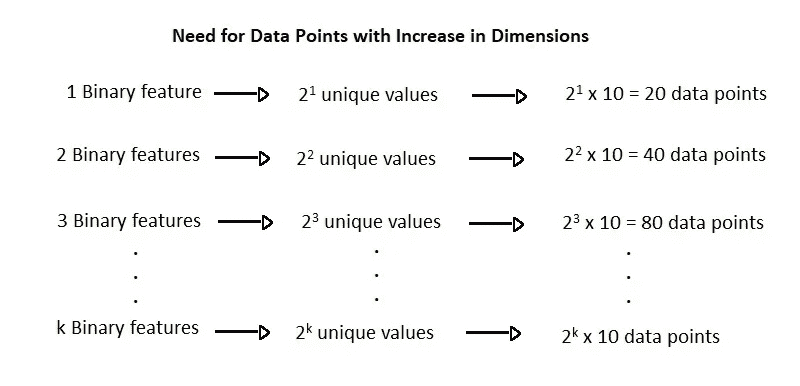
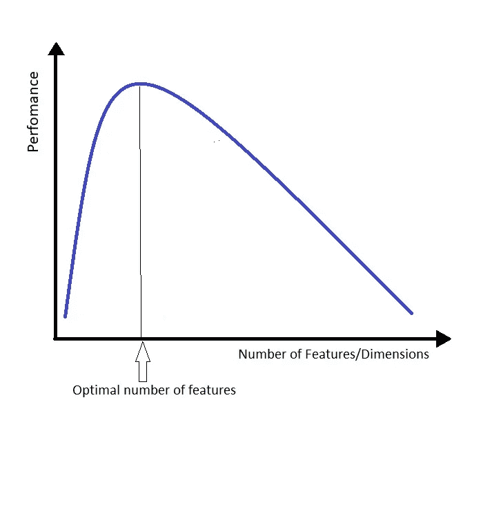
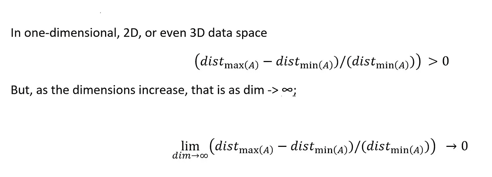

# 维度的诅咒——机器学习的“诅咒”

> 原文：<https://towardsdatascience.com/curse-of-dimensionality-a-curse-to-machine-learning-c122ee33bfeb?source=collection_archive---------1----------------------->

维数灾难描述了不断增长的数据维数的爆炸性本质，以及数据处理和/或分析所需的计算工作量的指数级增长。这个术语首先是由 Richard E. Bellman 在动态编程领域引入的，用来解释与增加额外维度相关的欧几里得空间体积的增加。今天，这种现象出现在机器学习、数据分析、数据挖掘等领域。理论上，维度的增加可以为数据增加更多的信息，从而提高数据的质量，但实际上增加了数据分析过程中的噪声和冗余。

**机器学习算法的行为——需要数据点和模型的准确性**

在机器学习中，对象的特征可以是定义它的属性或特征。每个特征代表一个维度，一组维度创建一个数据点。这表示定义机器学习算法要使用的数据点的特征向量。当我们说维数增加时，它意味着用于描述数据的特征数量的增加。例如，在乳腺癌研究领域，年龄、癌性结节的数量可以用作定义乳腺癌患者预后的特征。这些特征构成了特征向量的*维度*。但其他因素，如过去的手术，病史，肿瘤类型和其他类似的特征，有助于医生更好地确定预后。在这种情况下，通过添加功能，我们在理论上增加了数据的维度。

随着维度的增加，任何机器学习算法的良好性能所需的数据点数量都呈指数增长。原因是，对于任何给定的特征组合，我们需要更多数量的数据点，以使任何机器学习模型有效。例如，假设一个模型要表现良好，对于特征值的每个组合，我们至少需要 10 个数据点。如果我们假设有一个二元特征，那么对于它的 21 个唯一值(0 和 1 ),我们需要 2 x 10 = 20 个数据点。对于 2 个二元特征，我们将有 2 个唯一值，并且需要 2 x 10 = 40 个数据点。因此，对于 k 个二元特征，我们需要 2ᵏ x 10 个数据点。

Hughes (1968)在他的研究中得出结论，在训练样本数量固定的情况下，任何分类器的预测能力首先随着维度数量的增加而增加，但是在维度数量达到一定值之后，性能会恶化。因此，维数灾难现象也被称为休斯现象。

休斯原理的图示

**维数灾难对距离函数的影响:**

对于任意一点 a，我们假设 distₘᵢₙ(A 是 a 和它最近的邻居之间的最小距离，distₘₐₓ(A 是 a 和最远的邻居之间的最大距离。

也就是说，对于 d 维空间，给定 n 个随机点，distₘᵢₙ(a≈distₘₐₓ(a 意义，任何给定的点对彼此等距。

因此，当数据中的维数非常高时，任何基于包括 KNN(k-最近邻)的距离度量的机器学习算法都容易失败。因此，在这样的算法中，维数可以被认为是一个“诅咒”。

**维度诅咒的解决方案:**

减少高维度影响的方法之一是在空间向量中使用不同的距离度量。人们可以探索使用*余弦相似度*来代替欧几里德距离。余弦相似度对高维数据的影响较小。然而，这种方法的使用也可以特定于问题的所需解决方案。

其他方法:

其他方法可以包括使用尺寸缩减。可以使用的一些技术有:

1.正向特征选择:这种方法包括从所有给定的特征中挑选最有用的特征子集。

2.主成分分析/t-SNE:虽然这些方法有助于减少特征的数量，但它不一定能保持类别标签，从而使结果的解释成为一项艰巨的任务。

**参考文献**:

1.应用人工智能机器学习课程，[https://www . applied AI Course . com/Course/11/applied-Machine-Learning-online-Course](https://www.appliedaicourse.com/course/11/applied-machine-learning-online-course)

2.G. Hughes，“关于统计模式识别器的平均精度”，IEEE 信息论汇刊第 14 卷第 1 期，第 55-63 页，1968 年 1 月，doi:10.1109/tit . 1968 . 19861986087