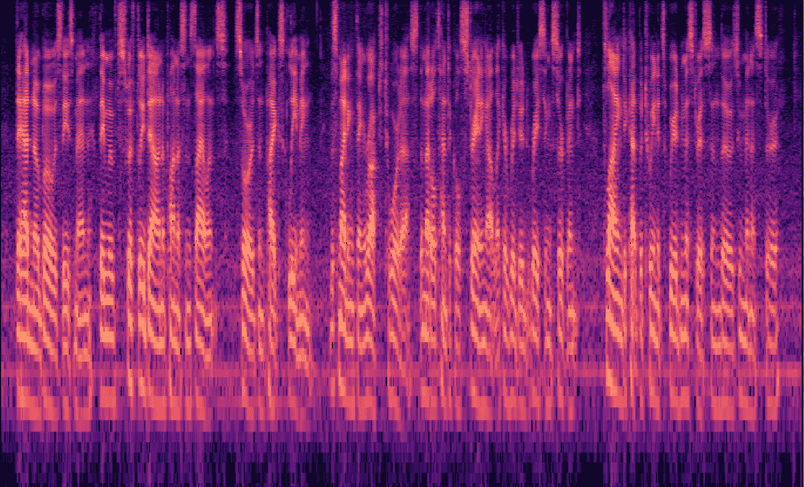
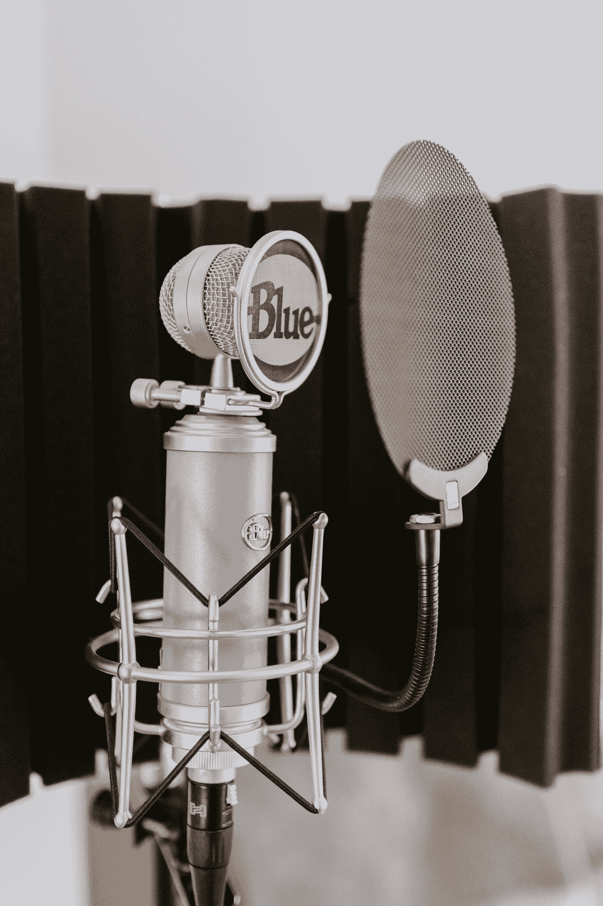
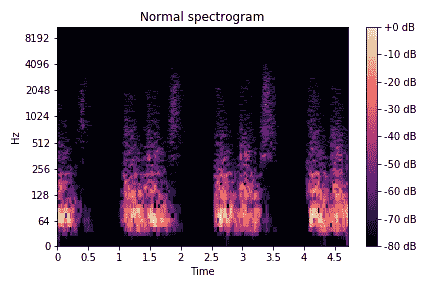
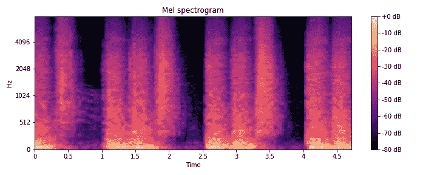
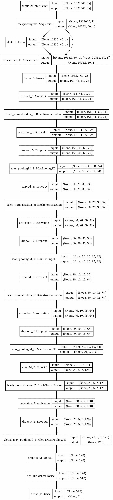

# 使用 TensorFlow 进行自定义音频分类

> 原文：<https://towardsdatascience.com/custom-audio-classification-with-tensorflow-af8c16c38689?source=collection_archive---------6----------------------->

## [实践教程](https://towardsdatascience.com/tagged/hands-on-tutorials)

## 包含代码的端到端示例项目



梅尔标度谱图。作者创建的可视化。

在最近的一个研究项目中，我有机会探索音频分类的世界。基于我为此任务创建的代码，我将引导您完成一个端到端的机器学习项目。目标是识别在音频样本上说话的人的性别。

我们将从收集初始数据开始。基于此，我们生成培训、测试和验证数据。为了便于处理，我们将数据存储为 TFRecords 文件。在我们完成数据工程之后，我们创建我们的模型。有了它，我们终于可以进行训练了。

## 任务描述

> 给定一个人说话的音频样本，确定说话者是女性还是男性。

这种说法使手头的任务成为一个分类问题；我们有一个数据样本，并给它分配一个或多个标签。为了尽可能多地学习，我们根据免费提供的音频样本，从头开始创建数据。

## 概观

为了清楚起见，我把这篇文章分成了几个部分:

第一部分是数据采集步骤。

第二部分介绍数据生成。

第三部分是 TFRecords 文件的生成。总的来说，我已经在这里写了这种数据格式[的实用介绍。](https://medium.com/swlh/using-tfrecords-to-train-a-cnn-on-mnist-aec141d65e3d)

第四部分结合我们到目前为止所做的一切来做实际训练。

所有部分都以 Colab 笔记本的形式附带代码:

*   [下载 LibriSpeech 数据集](https://colab.research.google.com/drive/15zjLQEW5tOnuhDrmRCqV2dZNnOrBGED-?usp=sharing)
*   [创建我们的定制音频数据集](https://colab.research.google.com/drive/16zJZwN5433pqro6gl9altfB4XYbf8tNK?usp=sharing)
*   [创建 TFRecord 数据集](https://colab.research.google.com/drive/1yQRDYzJsHX8w5g042w02y0lm1S3vMscL?usp=sharing)
*   [训练模型](https://colab.research.google.com/drive/1WBheq0KCKQgrQxEyj3RP6h331i5bUI1k?usp=sharing)

# 数据采集


由 [Markus Spiske](https://unsplash.com/@markusspiske?utm_source=medium&utm_medium=referral) 在 [Unsplash](https://unsplash.com?utm_source=medium&utm_medium=referral) 上拍摄的照片

## 下载、导入和项目设置

我们的第一步是获取数据。对于这个项目，我选择了一个免费的音频数据集，名为 [LibriSpeechASR](http://www.openslr.org/12/) corpus。它包含了自愿朗读 LibriVox 项目有声读物的人的简短片段[1]。

数据集以各种大小的子集提供。我们有几个具有不同挑战性语音(例如，不清楚的发音、口音)的训练和测试集。我选择了 6.3 GB 的 train-clean-100 子集——可以随意选择另一个可能更小的版本；在这种情况下，记得修改下面的代码。

出于演示的目的，代码被编写为在 Jupiter 笔记本上运行，例如在 Google Colab 上。我们将数据下载到挂载(！idspnonenote)的目录中。)Google drive 如果选择不同的位置，请调整路径。在接下来的文章中，你会用到这些数据。

我们首先创建项目文件夹，下载数据并将其提取到我们的驱动器:

现在数据在我们的驱动器上，我们听 10 个随机样本:

## [计]元数据

然后，我们查看一下元数据文件，以便识别出在我们下载的子集中出现的所有发言者。检查后，我们删除前 12 行，其中包含对我们的任务不必要的信息:

一个示例行是

```
20   | F | train-other-500  | 30.07 | *name*
```

第一个条目是 ID，第二个条目是性别，第三个条目是该发言者所在的子集，第四列列出了该特定发言者贡献的音频内容的总持续时间，最后一列包含该发言者的姓名。

接下来，我们检查所有这样的行(即，检查所有说话者)，如果说话者出现在我们的数据集中，则临时存储性别(当第三列显示 *train-clean-100* 时就是这种情况)。基于这些元数据，我们将说话者分为不同的男性和女性——这是数据采集步骤的关键部分。

请注意我们上面生成的*目录*列表:我们将迭代下载的目录，它们以包含音频文件的说话者的 ID 命名:如果目录的名称是 345，那么它包含来自 ID 为 345 的说话者的样本。基于这个 ID，我们可以通过查找存储在我们的 *available_speakers* 文件中的关键字 *ID* 的值来检查说话者的性别。

最后，我们将列表保存到我们的驱动器中，在下一节中，我们将使用它们来生成我们的培训、测试和验证数据。

这一节到此为止。你可以在这里找到 Colab [上托管的相应笔记本。如果您有建议或发现任何错误，请留言。](https://colab.research.google.com/drive/15zjLQEW5tOnuhDrmRCqV2dZNnOrBGED-?usp=sharing)

# 音频数据生成



凯利·西克玛在 [Unsplash](https://unsplash.com?utm_source=medium&utm_medium=referral) 上的照片

在这一节中，我们将回顾音频数据的创建:我们涵盖了创建训练、验证和测试数据。为了防止测试和验证数据泄露到我们的实际训练数据中，我们将参考我们在上一节中创建的 *speaker.pkl* 文件。

## 进口

让我们从安装和导入所有必需的包开始。我决定使用名为 [PyDub](http://pydub.com) 的 python 包来创建音频文件；它易于使用，并支持相互叠加和附加音频样本。我们导入了 *argparse* 包，这样我们就可以轻松地将我们的 Colab 笔记本变成一个*。py* 文件支持命令行参数:

## 助手功能

接下来，我们实现几个助手函数。我们从一个简单的动态创建数据集路径开始。请注意*混合*参数:虽然我还没有为这个项目实现这个特性，但是您可以尝试用代码创建第三个类，男女混合语音样本。

接下来，我们实现了一个函数，该函数返回说话者可用的所有语音样本。在上一节中，我们创建了一个 *speaker.pkl* 文件来存储演讲者的目录路径。通过这种方法，我们可以获得这个特定说话者的所有样本(不仅是目录，还有实际的*)。flac* 文件):

在下一个方法中，我们为说话者样本创建训练、测试和验证拆分。请注意，到目前为止，我们还没有创建任何训练数据，我们只是将我们的语音样本分类为不重叠的分裂。我们加载扬声器，对于每个性别，使用前 80 %的扬声器作为训练扬声器，接下来的 10 %作为验证扬声器，最后的 10 %作为测试扬声器。为了使这个过程可重复，我们预先对列表进行排序(我们可以通过使用*种子*参数来进一步修改它)。

在 return 语句中，使用前面的方法，我们将发言者列表转换为实际样本列表。到目前为止，每个子集都包含发言者目录的路径；现在我们通过这些扬声器获得音频样本的路径:

## 生成语音样本

最后，我们可以创建两个函数来创建用于训练、测试和验证子集的实际数据。对于文件路径列表( *speech_list* )，我们加载语音样本，随机置换音频，并存储它们。然后，我们开始将样本叠加到基本声音上( *base_sound* )，基本声音可以是任何东西，但在我们的例子中只是一个 60 秒的无声音频样本。

注意，我们在这里实现了两个函数:第一个函数覆盖了同一时间位置的所有语音样本，模拟了一屋子人在说话。第二个函数按顺序覆盖样本，中间有 0 到 5 秒的停顿:

您可能已经注意到，在前面的代码中，我们调用了一个函数 *permutate()* 。函数很短，我们随机改变语音的响度和长度。该函数可以作为更复杂的扩充的起点:

我们现在创建一个小的包装器函数，它包装了上面的三个函数:

在我们最终创建主方法之前，我们需要一个从女性/男性训练、测试和验证子集提取语音样本的函数。我们在下一步实现这个函数。给定一个 *number_of_samples* 、一个 *gender* (表示从哪些集合中抽取)，以及一个*子集*(实际抽取的子集)，我们从相应的子集中返回一个随机样本列表。如果*性别*为 1(真)，我们从女性集合中抽取，否则我们从男性集合中抽取随机样本:

## 主要方法

现在，核心方法， *create_sample()* 。我们创建一个 *base_sound* ，在上面覆盖所有的语音样本。我决定处理长度为 60 秒的数据，所以我将持续时间设置为 60000 毫秒。然后，我们决定是要创建女性还是男性训练样本。给定这两个信息，我们使用前面实现的方法对一些语音进行采样以进行叠加。原则上，如果我们允许多个说话者在相同的时间戳说话，我们现在决定是否对这个具体的样本这样做(这是我们之前实现两个独立方法的原因)。然后，我们创建语音覆盖，并检查我们创建的数据样本是否足够长。

如果这种健全性检查成立——这对于下一个博客部分很重要——我们将数据样本存储在磁盘上。为此，我们需要*子集*参数，它告诉我们对哪个子集使用这个生成的样本。这个子集也是标签信息，我们将其与 outname 一起返回:

我们使用这两个信息创建一个 csv 文件的过程中，这个文件包含一个路径->标签映射。我们这样做是为了对我们创建的文件有一个总体的了解。当然，我们可以稍后迭代创建的文件夹，但这是低效的，因为我们可以把它作为副产品。

## 命令行参数

我们还使用 *argparse* 模块来定义我们的命令行参数和任何默认参数。 *— output_path* 参数指向一个文件夹，我们的数据集将存储在这个文件夹中，而 *— speaker_file* 参数指向在前面的部分中创建的 speaker 文件。其他论点是不言自明的；如果您想要扩展脚本以创建混合类别，列出 *— mixed* 参数是为了完整性，它没有任何功能。 *num_{train，test，valid}_samples* 控制相应子集中的样本数量。在研究中，对于大型数据集，分割通常是 80 %、10 %和 10%，但出于我们的目的，我们只是为每个分割创建相同数量的样本。

为了调用所有函数，我们使用 Python 提供的 *__main__* 语句。在这里创建的语音样本列表，包括男性和女性，在全球范围内都是可用的。我们为数据子集创建输出路径，然后创建训练、测试和验证子集，并将循环的索引作为当前创建的文件的名称。在 *tqdm* 包的帮助下，进度是可视化的，它显示一个实时的进度条。在每个子集之后，我们将新创建的样本列表保存到一个 CSV 文件中，供下一节使用:

在 Colab 上，创建一个文件大约需要 5 秒钟，速度很慢。这可能是因为我们将数据写入(缓慢的)Google Drive 存储。在使用 SSD 和更好的 CPU 的机器上，这个速度更快。因为我们只创建一次音频数据，所以这可以忽略不计。

这一节到此为止。该代码可作为 [Colab 笔记本在这里](https://colab.research.google.com/drive/16zJZwN5433pqro6gl9altfB4XYbf8tNK?usp=sharing)获得。在下一节中，我们使用我们创建的音频数据来创建 TFRecord 文件，以使训练高效快速。

# 正在创建 TFRecord 文件


照片由[迈克·本纳](https://unsplash.com/@mbenna?utm_source=medium&utm_medium=referral)在 [Unsplash](https://unsplash.com?utm_source=medium&utm_medium=referral) 上拍摄

在本节中，我们将复习如何将最近创建的音频数据写入 TensorFlow 的 TFRecord 文件格式。我假设知道 TFRecord 的布局，但会适当地刷新任何需要的内容。如果你对它不熟悉，你可以在这里阅读我的介绍(我们在这里训练 CNN)或者在这里阅读(我们在这里讨论用 TensorFlow 解析各种数据)。本质上，这种格式以串行布局存储数据，使它们易于从驱动器中读取。说实话，对于只有几百个样本和 MB 的小数据集来说，这个转换步骤可能是不必要的。

对于更大的维度，这是非常方便的——对于一个研究项目，我们有几百 GB 的数据集，数据加载很快成为瓶颈。在对数据处理进行了一些优化之后，我们每个时期的时间从 10 分钟减少到了大约 2 分钟。那更好。

## 进口

像往常一样，我们从导入所有必需的包开始，这里没有什么不寻常的。我们使用 *pandas* 库加载我们在上一节中创建的 CSV 文件，使用 *librosa* 从磁盘加载音频数据。我们还定义了一个全局变量， *tfr_dir* ，它稍后将指向存储所有 TFRecord 文件的目录:

## 助手功能

然后，我们创建四个简短的助手函数，将数据点转换为特征对象。这个 Feature 对象是存储在 TFRecord 文件中的核心对象，即存储在一个示例对象中(我们很快就会看到):

有了这些辅助函数，我们就可以定义一个示例文件的布局了。这个字典包含了我们以后可能需要的所有特性:采样率、标签、形状和实际数据。以下函数获取此信息，并返回用转换后的要素对象填充的字典:

## 主要方法

现在我们来看看创建 TFRecord 文件的核心方法。这个方法相当长，但是这里没有发生什么特别的事情。它是此处所示[方法的更复杂版本，也在此处](https://medium.com/swlh/using-tfrecords-to-train-a-cnn-on-mnist-aec141d65e3d)的[中涉及。为了更好地理解，我们将分块讨论，从加载 CSV 文件开始，并确定保存所有数据所需的碎片(比如容器)数量。TensorFlow 建议保持单个碎片的大小大于 100 MB，这意味着存储大量的样本。因为我们有一个小数据集，所以稍后我们将只对每个数据子集(训练、验证、测试)使用两个分片。](/a-practical-guide-to-tfrecords-584536bc786c)

我们用熊猫加载我们的 CSV 文件，洗牌，然后确定碎片的数量。+1 偏移量用于说明样本数量在两个边界之间的情况:当我们使用 100 的碎片大小(参数 *max_files* )时，我们将只有 50 个数据点，那么 50//100 将计算为 0。+1 确保我们至少有一个碎片来保存我们的数据。另一方面，如果我们的文件数量是碎片大小的整数倍，那么我们不需要额外的(空的)碎片；我们用 if 语句处理这种情况:

在下面的代码块中，我们首先创建一个文件计数器来计算成功存储到碎片中的文件数量。然后我们迭代每个碎片(称为*分割*)并为这个 TFRecord 文件创建一个文件名，遵循以下约定:

{当前碎片} {所有碎片} _ {子集}。tfrecords

有了这些信息，我们就可以创建一个 writer 来将文件写入磁盘。然后，我们填充碎片，如果我们已经存储了所有的音频样本，就提前停止。我们在较低部分加载这些样本，并检查样本是否持续 60 秒(60 秒 x 22050 Hz 采样速率= 1 323 000 个数据点):

从这里读取文件后，我们现在可以创建一个示例对象，保存我们上面确定的所有信息。然后，该示例对象被写入当前的 TFRecord 文件。最后，我们增加 file_counter，在循环完所有碎片后关闭 writer，并打印最后一条语句来关闭该方法:

本着类似的精神，我们创建了一个函数，它从给定的子集中加载一些音频样本，并将它们存储到一个 numpy 数组中。这个数组可以在以后的训练中用来记录一些统计数据(我们将在最后一节中看到)。这是完全可选的，我们已经用上面的方法完成了关键部分。

我们消费我们的 CSV 文件；如果它只包含几个样本，我们可以选择使用所有的样本进行监控，而不仅仅是一个小的子集。我们创建一个空的 numpy 数组作为占位符，然后遍历子集并随时填充数组。最后，我们将音频数据和相应的标签存储在两个独立的文件中:

我们的 main 方法首先覆盖全局 *tfr_dir* 变量(在上面的两个方法中访问过)，然后为所有子集创建 TFRecord 文件。可选地，它再次为每个子集创建监视样本。我们通过 args 参数来控制它，它保存了我们所有的命令行参数:

## 命令行参数

最后，我们用 Python 的 *__name__* check 调用 main 方法。这将开始创建我们的 TFRecord 文件:

这一节到此为止。代码可在 [Colab 笔记本这里](https://colab.research.google.com/drive/1yQRDYzJsHX8w5g042w02y0lm1S3vMscL?usp=sharing)获得。在下一节中，我们终于接触到了这篇文章的深度学习部分，定义了我们的模型和在训练中使用的回调。

# 培养


[阿丽娜·格鲁布尼亚](https://unsplash.com/@alinnnaaaa?utm_source=medium&utm_medium=referral)在 [Unsplash](https://unsplash.com?utm_source=medium&utm_medium=referral) 上的照片

在这一节中，我将介绍如何处理 TFRecord 数据，如何设置回调，如何设置我们的网络，以及如何进行培训。

## 进口

像往常一样，我们从进口开始。一个特点是，我们将使用原始音频数据作为输入，并让网络(从而 GPU)做任何进一步的计算。为此，我们使用了 [*kapre* python 包](https://github.com/keunwoochoi/kapre)，这是一个定制 TensorFlow 层的集合，专门为音频相关任务而设计。其次，我们还安装了[砝码&偏置](https://wandb.ai/site)包、 *wandb* 。W & B 提供了模型和统计跟踪的无缝集成。我已经将代码设置为不依赖于 W & B(因为免费帐户是必需的)，所以您可以在任何情况下运行它:

## 助手功能

下一步，我们实现两个助手函数。

首先，我们编写一个函数来设置我们可能使用的任何随机生成器的种子，无论是显式的还是隐式的(对于 TensorFlow，我的经验是这很不幸**不可靠**):

第二个函数为我们创建了一个 logger 对象，为我们将任何感兴趣的东西记录到一个文件中。这是一种常见的最佳做法；我保存日志以验证和理解任何后来的结果。我们将在整个代码中使用返回的 logger 对象:

## 数据处理

现在我们处理与数据相关的部分，即解析我们在上一节中创建的 TFRecord 文件，并创建一个 TFRecordDataset。为了加载任何 TFRecord 文件，我们首先创建一个函数，该函数返回与模式匹配的文件列表。

还记得我们给 TFRecord 文件起的名字吗？根据文件名，我们将文件分类为训练集、测试集和验证集，记录(并打印)我们在每个子集找到的碎片数量:

既然我们有了获取文件的方法，我们只需要一个方法来提取存储在其中的单个数据样本。在上一节中，我们用以下代码定义了单个样本的结构:

我们现在将模仿它，但是这次提取一个样本，而不是写。我们为数据定义一个字典占位符(类似于上面的)，然后用来自单个元素的数据填充它(在我们的例子中是一个音频样本)。

然后，我们获取特征(我们的原始音频数据)，并将其解析为张量，然后根据我们存储在 *x* 和 *y* 中的数据形状对其进行整形。对于我们的任务，特性及其标签很重要，所以我们只返回这两个:

到目前为止，我们可以找到所有的 TFRecord 文件并解析单个示例。然而，我们的模型不能只在单个例子上工作，所以我们需要创建一个结构来自动解析文件中的所有样本。这就是 TFRecordDataset 派上用场的地方。

我们首先创建一个自动调优对象，它自动确定预取和并行化的最佳参数。给定一个 TFRecord 文件列表，我们创建前面提到的 TFRecordDataset，并将读取缓冲区中的字节数设置为 1000。

接下来，我们将每个元素映射到 *parse_tfr_elem()* 函数。加载时，每个元素都“通过”此函数，并转换为{要素，标签}对。我们设置了并行调用的数量和要预取到自动调优的元素的数量。

如果我们提供了一个缓存路径，我们就可以将数据集缓存到这个位置，否则我们就将它缓存在 RAM 中。如果您的数据驻留在慢速硬盘上，此选项非常有用，可以防止在每个时期重新加载样本。这是可选的，如果不需要任何缓存，只需删除这四行。

最后，我们洗牌，批处理，并重复数据集。如果我们不启用重复，数据集将在一次迭代后耗尽:

## 分销策略

在接下来的代码中，我们动态定义在何种策略下训练模型。编写与策略无关的代码的优点是，它可以在单个训练设备上工作，也可以在两个、三个甚至更多的设备上工作。(到目前为止，我已经使用这段代码用两张卡进行了多设备训练，以及 TPU 训练)。代码不是我写的，而是来自 [Hugginface 的*变形金刚*库](https://github.com/huggingface/transformers/blob/8eb7f26d5d9ce42eb88be6f0150b22a41d76a93d/src/transformers/training_args_tf.py):

## 复试

接下来的两个代码块用于训练期间的回调，我已经在这里稍微详细地介绍过了[。](https://medium.com/swlh/curated-custom-callbacks-e74a49c08100)

我们实现了一个 ClassificationReportCallback，它每隔 *k* 个时期将 *sklearn 的* [分类报告](https://scikit-learn.org/stable/modules/generated/sklearn.metrics.classification_report.html?highlight=classification%20report#sklearn.metrics.classification_report)写入 TensorBoard。如果我们想用 W & B 记录我们的实验，我们可以选择在那里上传报告:

第二个定制回调是 ConfusionMatrixCallback，它在每个*频率*时期创建一个混淆矩阵。代码主要基于 TensorFlow 的[教程:](https://www.tensorflow.org/tensorboard/image_summaries)

有了两个定制回调函数，我们现在需要一个方法来设置它们。为此，我们首先为我们记录的所有内容创建一个 TensorBoard 目录，并创建一个 *file_writer* 对象。有了这个对象，我们可以方便地将图像、标量和文本数据记录到 TensorBoard，我们已经在上面的两个回调中看到了这一点。

然后我们实例化一个 TensorBoard 回调来监控训练，这里没什么特别的。更有趣的是设置我们自己的回调。我们从混淆矩阵回调开始。顾名思义，它在每个 *k* 时期后生成一个混淆矩阵。为了创建这个图，我们解析一些样本数据——还记得我们在 TFRecord 生成步骤中另外保存到一个 *numpy* 数组中的数据吗？我们现在将使用它来生成实时混淆矩阵，并使用我们之前创建的 *file_writer* 对象将其写入 TensorBoard。

我们创建了两个这样的回调，一个用于验证样本，一个用于训练样本。

我们实例化的下一个回调是 ClassificationReportCallback。我们用它来记录每 *k* 个时期的训练统计数据:

```
precision    recall  f1-score   support male       0.00      0.00      0.00        10
  female       0.60      1.00      0.75        15accuracy                           0.60        25
```

我们使用的最后一个回调是默认的 EarlyStopping 回调。深度学习的一个常见问题是过拟合。该模型(越深、越大的模型越容易出现这种情况)在训练数据上取得了高分，但未能推广到看不见的数据。有几种方法可以防止这种情况，一种是使用单独的验证集。一旦这个子集的分数在*耐心*时代没有变得更好，我们就停止训练；我们还可以从这个最佳状态恢复模型的权重。

如果我们使用 W&B，我们最后设置他们的回调。It **自动**处理他们服务器的日志数据。

所有回调都准备好了，然后我们返回它们的列表:

## 音频功能

现在我们终于来到了模型设置。为了理解这一点，让我们简短地了解一下音频分类的世界:

您可能已经注意到，我们将原始音频数据写入 TFRecord 文件，并且我们还将原始音频数据提供给我们的模型。通常的方法，也是我在论文中使用的方法，是使用特征来代替。特征是数据的可测量或可观察的特征；一个常见的音频特征是(Mel 标度的)声谱图。

在我们深入讨论之前，让我先介绍一下声谱图。正常频谱图显示给定时间标记的频率功率:



请注意，我们使用的是对数标度，数值越高表示功率越大。基于这个正常的谱图，我们得到了梅尔标度的谱图:



人类的听觉系统可以处理高达 20，0 00 赫兹的频率(根据年龄、训练和天赋，可能会有所出入)，但不是线性的。在 12 000 赫兹之后，辨别频率或声音的能力大大下降[2]。Mel 标度建立在这一事实上，较低的频率范围被映射到更多的仓，较高的频率被映射到较少的仓。

换句话说:对于较低的频率，我们有窄的仓，也就是说，只有很小范围的频率被捕获。对于较高的频率，我们有较宽的仓，也就是说，较宽范围的频率被映射到相同的仓。请注意，*y*-轴仍然是对数轴，但仅达到 4 kHz——与正常频谱图相比，在此范围内具有更多能量。

另一个很酷的特性是 Delta 特性，即给定时间戳的曲线(在我们的例子中，曲线是音频信号)的导数的近似值。我读过一些将 Mel 谱图和 Delta 特征相结合的论文[3]。这就是我们在这里所做的:我们的第一个通道保存 Mel-spectrogram，我们的第二个通道保存它的 Delta 值。

现在，为什么不预先计算它们呢？因为，如果我们要改变任何有影响的参数，我们必须从头再做一遍。让网络做计算的好处是*第一*我们可以更快地进行实验，*第二*我们可以将创作参数化，*第三*我们可以保持原始数据不变。我们也不会在硬盘上放更多的文件夹和文件。

话虽如此，我们现在可以回到定义网络。

## 模型



第一层是我们的输入层，它接收 shape (1323000，1)的数据样本。第一个来自 60 秒× 22050 Hz，即 60 秒，每秒 22050 个数据样本。第二个条目 1 是通道数，在我们的例子中是单声道。(边节点上， *kapre* 支持更多声道，我见过 6 声道音频输入)。

接下来，我们定义特定于音频的 Mel 谱图层。顾名思义，这一层从原始音频输入生成 Mel 缩放的声谱图。参数控制产生的声谱图——覆盖它们不是这篇文章的范围。如果你对它们的效果很好奇，可以查阅 [librosa 的文档](https://librosa.org/doc/latest/generated/librosa.feature.melspectrogram.html#librosa.feature.melspectrogram)。

下一层是 *Delta* 层，计算声谱图输入的 Delta 值。我们将它们结合起来，得到一个双通道张量。

下一步操作，由*帧*层分帧，我们将输入分割成帧。这是一种常见的技术。想象一个很长的音频样本:不是把它保存在这个长版本中，而是把它分成(重叠的)片段。这就是这里发生的事情。

接下来的块是非常标准的:我们使用卷积批处理范数丢弃池块。第一种方法让内核学习低级特征，第二种方法将输出的平均值调整到接近 0，其标准偏差接近 1。(这是统计，或者更确切地说是分布扮演重要角色的情况之一)。dropout 层防止过度拟合，MaxPooling 层将每个维度减半，而不考虑最后一个维度；因为我们将池大小设置为(2，2，2)。

这个块重复四次，最后一个块有一个全局最大池操作。该操作仅选择每个轴的最大值。我们这样做是为了保持较小的权重——我们可以直接使用密集层，但那样会大幅增加权重的数量。

我们以具有两个神经元的密集层结束我们的模型，每个类一个，并且 softmax 激活。这种激活返回神经元上的概率分布，其总和为 1。为了推断我们的阶级，我们取最高值的位置。如果我们的预测向量将是[0.2，0.8]，那么类将是 1(女性，对于我们的整体任务)。

相应的代码:

上面的代码依赖于一个配置文件。下一个方法创建了我们的模型配置:

为什么我们使用配置文件，而不是对超级参数进行硬编码？首先，您可以轻松地将此配置记录到磁盘中，其次，您可以从磁盘中调整和加载这样的配置，第三，您可以将它合并到超级参数搜索中。

## 设置

有了上面定义的主函数，我们现在创建几个包装函数。遵循干净代码的原则，这些函数相当简单，它们主要做一件事，调用前面的代码。

第一段代码用于建立模型。给定一个训练策略，模型配置(核的数量，退出概率等。)，以及命令行参数(args 参数)，我们创建一个模型并编译它。作为损失，我们使用*稀疏分类交叉熵*；这与 *CategoricalCrossentropy* 相同，但是与非一个热点向量一起工作，即，它与原始类别号一起工作，而不需要将它们编码为一个热点向量。这同样适用于稀疏分类的准确性。

其次，我们还将模型的可视化保存到我们的 *out_dir* 中，这是所有内容都写入的主目录。除了 *rankdir* 之外的参数都是自解释的。此参数控制绘图的方向；“TB”代表垂直图(如上所示)，“LR”代表水平图:

下一个函数将我们训练好的模型保存到磁盘上。如果模型目录不存在，我们就创建它，然后将模型保存在那里。因为我们使用自定义层，所以我们使用[的“TF”保存格式](https://keras.io/guides/serialization_and_saving/) t:

使用下一个函数，我们将根据测试数据评估我们的模型。我们记录一个格式良好的消息，包含我们已经达到的损失和准确性，并返回这两个值。 *test_dataset* 不需要传递给函数，它是全局可用的(您很快就会看到)，logger 对象也是如此:

下一个短函数只服务于一个目的:模型训练。它接受模型、训练期间要应用的回调列表以及命令行参数(其中我们只需要 epochs 的数量)。因为我们将数据集设置为无休止地重复(见上文)，所以我们需要告诉 TensorFlow 一个历元包含多少个批次，包括训练数据集和验证数据集。一旦训练结束，我们返回训练好的模型:

有了这些简短的函数，我们创建一个函数来适当地调用它们。我们从设置种子开始，然后请求我们的模型配置。如果我们想使用 W&B，我们在这个地方登录(完全可选)。然后，我们确定用于训练模型的分布策略，并用它来建立我们的模型。最后，我们初始化所有的回调，这些回调和模型一起返回:

这个函数是由我们的 main()函数调用的，它负责调用 setup 函数，打印模型的概要，以及训练。我们也可以将我们的结果记录到 W&B(完全可选)，然后运行一些步骤来关闭代码:

## 培养

现在，运行这一切的代码:我们使用 *argparse* 库来解析命令行参数。他们控制保存模型的目录、训练时期的数量、批量大小、种子等等——只需查看他们的描述:

在我们解析了命令行参数之后，我们使用 python 的 *if __name__ == "main"* 语句来完成所有工作。

我们创建输出目录，并确定实际的批量大小。如果我们有两个或更多的设备来训练，我们将我们的 *per_device_batch_size* 乘以设备的数量来加速训练。你可以尝试这些价值观，它们只是一个坚实的基础。

确定了批量大小之后，我们就可以确定迭代训练、测试和验证集所需的步骤数量。这个值是通过将数据集长度(在我们的例子中是 50，因为我们每组有 50 个音频样本)除以批量大小来计算的。

我们还加载我们的回调所使用的额外的 *numpy* 数据。

这里发生的一切都是全局可用的，因此我们不必向 main 方法传递任何东西——*args*参数只是为了说明。一旦 main()被调用，它将设置网络，训练它，保存它，并评估它。当我们看到时，脚本已经成功完成

```
Script finished.
```

在尝试检测测试集中说话者的性别后，我得到

```
Finished evaluation. Loss: 0.3812, Accuracy: 0.9583.
```

就是这样。代码可以在 [Colab 笔记本上找到，这里是](https://colab.research.google.com/drive/1WBheq0KCKQgrQxEyj3RP6h331i5bUI1k?usp=sharing)。

# 摘要

总结一下我们所做的:

我们的总体任务是使用定制的音频数据对说话者的性别进行分类。

我们从下载公共 LibriSpeech 数据集开始，该数据集由自愿阅读有声书籍的人的简短音频样本组成，并创建了一个按性别排序的发言者索引。

有了这些文件，我们创建了自定义的音频数据集；一个类是男性类(标签 0)，另一个类是女性类(1)。我们创建了训练集、验证集和测试集。

在第三步中，我们从原始 FLAC 音频数据创建了一个 TFRecord 数据集。我们这样做是为了加速数据加载——数据是按顺序保存的——也是为了学习如何使用它(TFRecords 真的很有用。但是有点复杂。参见[获取实际操作指南](/a-practical-guide-to-tfrecords-584536bc786c)。

在我们的第四步，也是最后一步，我们结合了之前所做的一切:我们编写了加载数据集的代码，我们使用了自定义回调，是的，我们还做了一些深度学习的事情:创建和训练模型。

## 现在何去何从？

有些事情你可能已经注意到了。

首先是数据集的大小。您可以将其增加到数百或数千个样本——我已经使用代码创建了一个包含 10 000 个样本的数据集，因此这是完全可能的。在这种情况下，您必须在本地运行，因为 15 GB 的 Google Drive 存储空间是不够的。

第二个值得注意的事情是不稳定的训练:损失和准确性跳来跳去。先尝试不同的学习速率，然后用其他优化器进行实验。

第三种选择是尝试完全不同的架构——一个连体网络，一个 LSTM。

这篇博文到此结束。

Colab 笔记本的链接，让你自己动手:

*   [下载 LibriSpeech 数据集](https://colab.research.google.com/drive/15zjLQEW5tOnuhDrmRCqV2dZNnOrBGED-?usp=sharing)
*   [创建我们的定制音频数据集](https://colab.research.google.com/drive/16zJZwN5433pqro6gl9altfB4XYbf8tNK?usp=sharing)
*   [创建 TFRecord 数据集](https://colab.research.google.com/drive/1yQRDYzJsHX8w5g042w02y0lm1S3vMscL?usp=sharing)
*   [训练模型](https://colab.research.google.com/drive/1WBheq0KCKQgrQxEyj3RP6h331i5bUI1k?usp=sharing)

## 参考

[1] Panayotov，Vassil 等人， [Librispeech:一个基于公共领域音频书籍的 asr 语料库](http://www.wash.edu.mn/storage/app/uploads/public/5b6/fde/b28/5b6fdeb283881733591649.pdf) (2015)，IEEE 声学、语音和信号处理国际会议(ICASSP)

[2] R. J. Pumphrey，[人类听觉频率的上限](https://www.nature.com/articles/166571b0.pdf) (1950)，自然

[3]凯罗尔·j·皮扎克，[卷积神经网络环境声音分类](https://ieeexplore.ieee.org/document/7324337) (2015)，IEEE 第 25 届信号处理机器学习国际研讨会