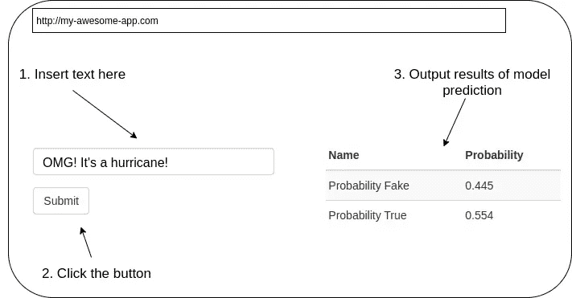
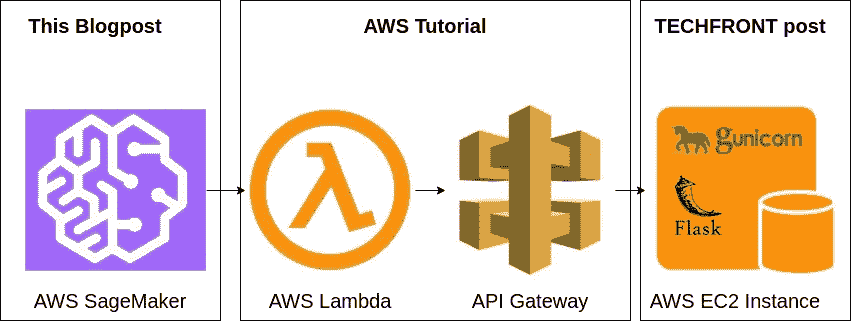
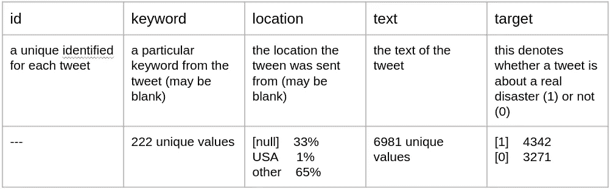
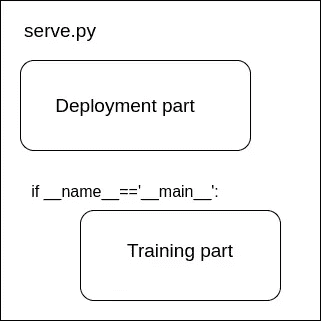

# 定制 AWS SageMaker:训练和部署假推预测器

> 原文：<https://towardsdatascience.com/custom-aws-sagemaker-train-and-deploy-fake-tweets-predictor-9178f20d0f99?source=collection_archive---------23----------------------->

在数据和信息技术领域，云提供商势头强劲。AWS、Azure、Google Cloud 等最大的云提供商不仅在云中租用硬件。它们还为机器学习模型的简单操作提供了基础设施。在我的[上一篇文章](/colab-synergy-with-mlflow-how-to-monitor-progress-and-store-models-fbfdf7bb0d7d)中，我提到了用谷歌云训练模型的可能性。同时，AWS 提供了自己的一套工具来训练和管理模型。在这篇文章中，我想深入探讨的工具之一是 AWS SageMaker。

我不确定 SageMaker 的名字是否与鼠尾草(鼠尾草)有关，但是我喜欢它的味道。


照片由[菲利普·拉金](https://unsplash.com/@phillip_larking?utm_source=medium&utm_medium=referral)在 [Unsplash](https://unsplash.com?utm_source=medium&utm_medium=referral) 上拍摄

SageMaker 是一款准备、构建、培训和调整、部署和管理机器学习模型的首选工具。SageMaker 提供了大量的预设置和即用型容器。范围涵盖了不同的框架:PyTorch、Scikit-learn、Chainer、MXNet 以及 Huggingface。当您想要构建一个只使用其中一个框架的模型时，设置容器是很方便的。但是越来越需要使用它们的组合。例如，我可能想从 Huggingface 获取一个模型，并在输出中添加一些 Scikit-learn ML 模型。那我该怎么办？幸运的是，可以构建一个定制的 Docker 容器并用 SageMaker 部署它。这可能是一个不错的通用解决方案。然而，如果使用 Scikit-learn 部署预构建容器需要大约 10 行代码，那么定制 Docker 的开发可能[需要一些时间](https://github.com/aws-samples/amazon-sagemaker-custom-container)。如果我告诉你有一个中间的解决方案。它花费了超过 10 行的代码，但是，你不应该为 SageMakers 定制 Dockers？忍耐一下，我们会找到路的。

**问题描述**

**目标**

为了展示定制的 SageMaker 设置，让我们看看一个 [Kaggle 竞赛数据集](https://www.kaggle.com/vbmokin/nlp-with-disaster-tweets-cleaning-data)的例子，它由关于灾难的虚假和真实推文组成。任务是对推文进行分类。在这篇博文中，我们构建了一个应用程序，它接受文本作为输入，并返回关于灾难的推文是真实的概率。最终的应用程序可能如下所示:



我们可以将任务分成三个子任务:

1.  使用 SageMaker 培训和部署定制模型
2.  创建将使用 SageMaker 模型的 API
3.  构建并部署一个 Flask 应用程序，它将获取 tweets 并返回 API 的结果

在这篇博文中，我们将详细讨论第一个任务。另外两个在 [AWS 教程](https://aws.amazon.com/blogs/machine-learning/call-an-amazon-sagemaker-model-endpoint-using-amazon-api-gateway-and-aws-lambda/)、 [TECHFRONT 帖子](https://medium.com/techfront/step-by-step-visual-guide-on-deploying-a-flask-application-on-aws-ec2-8e3e8b82c4f7)中有所涉及。最终的架构将如下所示:



[AWS 教程](https://aws.amazon.com/blogs/machine-learning/call-an-amazon-sagemaker-model-endpoint-using-amazon-api-gateway-and-aws-lambda/)、 [TECHFRONT 帖子](https://medium.com/techfront/step-by-step-visual-guide-on-deploying-a-flask-application-on-aws-ec2-8e3e8b82c4f7)

这里我们故意牺牲模型的准确性(不包括其他特征，不了解太多数据，不降维等。)为了训练脚本简单起见。目的是展示如何使用 SageMaker 训练和部署一个应用，而不是展示如何建立一个准确的模型。人们可以在 Kaggle 的[相应解决方案](https://www.kaggle.com/vbmokin/nlp-with-disaster-tweets-cleaning-data/code)中了解更多关于构建更好模型的信息。

**数据集**

[数据集](https://www.kaggle.com/vbmokin/nlp-with-disaster-tweets-cleaning-data?select=train_data_cleaning.csv)由带标签的虚假和真实推文组成。标签在“目标”栏中提供。有几个特征，尽管为了这篇博文的目的，我们将只使用“文本”字段来表示推文的文本。



更多信息请参见[卡格尔比赛](https://www.kaggle.com/vbmokin/nlp-with-disaster-tweets-cleaning-data?select=train_data_cleaning.csv)

记住，我们要对真假推文进行分类。

**模型训练脚本**

对推文进行分类的一个选择是导出推文的嵌入，然后在其上运行一些分类算法。HuggingFace 是一个很酷的库，可以为嵌入推文提供模型！只需要几行代码就可以派生出嵌入:

所以我们得到了嵌入，现在可以进行分类。Scikit-learn RandomForest 是这项任务的理想人选。培训脚本可能如下所示:

在这个设置中，使用了两个机器学习库:HuggingFace 和 Scikit-learn。我们现在知道我们想做什么了。让我们在 SageMaker 上训练和部署模型！

# **列车&部署！**

**准备工作**

下面的部分，我用的是 SageMaker 的 Jupyter 笔记本。请进行相应的设置，以确保 SageMaker 可以提前访问 S3 桶！

首先，在 SageMaker 的 Jupyter 实验室中，我们需要创建一个目录，我们的培训+部署脚本就位于这个目录中。该目录可能如下所示:

```
Deployment_Notebook.ipynb
mysrc
|--serve.py
|--requirements.txt
```

总共有三个文件。在下一节中，我们将详细介绍这些文件:requirements.txt、serve.py 和 Deployment_Notebook.ipynb。在这里，我们将放置我们想要使用的库。在我们的例子中，它是 HuggingFace 和 Scikit-learn。requirements.txt 看起来是这样的:

```
scikit-learn==0.24.1
transformers==4.5.1
```

**训练部署脚本:serve.py**

我们的 serve.py 文件有两个目的。它必须能够:(1)训练模型和(2)部署模型。因此，它应该由两部分组成:



先说培训部分。当我们指示 SageMaker 训练模型时，它将执行 if _ _ name _ _ = = ' _ _ main _ _ ':in serve . py 脚本中的任何后续内容。因此，我们将这篇博文的“模型训练脚本”中的脚本稍加修改:

现在数据存储在 S3 桶中，所以我们直接从 PATH_TO_DATA 文件中读取我们的训练数据(不要忘记插入您自己的路径)。另外，在 SageMaker 容器中有一个名为 *model-dir* 的环境参数。我们应该解析它，将我们的模型存储在由该参数定义的文件夹中。

在部署阶段，SageMaker 容器希望我们在 serve.py 中定义四个函数:

如果没有定义这些函数，就有默认的替代函数。默认情况下， *input_fn* 期望拥有 NPY 格式的参数 *request_body* 。在我们的例子中，我们需要将其修改为 JSON，因此我们的部署脚本部分看起来应该是这样的:

在组合训练和部署部件之后，我们得到 [serve.py](https://github.com/azarnyx/CustomSagemaker/blob/master/SageMaker/mysrc/serve.py) 文件。

**用 SageMaker:Deployment _ notebook . ipynb 运行测试**

HuggingFace 依赖于 PyTorch python 库。为了减少安装时间，我们可以选择 SageMaker 的 PyTorch estimator。这将在预装 PyTorch 的容器中部署我们的脚本，因此我们不必将 PyTorch 添加到 requirements.txt 文件中。现在我们准备在 SageMaker 笔记本中运行脚本:

我们应该使用 Predictor 类来告诉容器接受 JSON 格式。另外，PyTorch 估计器要求指定一些参数:PyTorch 的 *framework_version* 和 python 的版本。我们用 *sourced_dir* 参数告诉估算器我们想要哪个文件夹复制到容器中。此外，我们将*入口点*定义为我们上面构建的 *serve.py* 脚本。在执行这些命令之后，我们将为模型做好一切准备并部署它。这可以通过以下命令来完成:

在计算实例上剥离容器，然后部署端点，大约需要 5 到 10 分钟。完成后，我们可以用 boto3 测试我们的端点:

训练部分应该返回两个概率。

# 在 EC2 中构建 API 和 Flask App！

接下来的步骤是创建一个 API，并在 EC2 实例上部署 Flask 应用程序。如上所述，这些任务在 [AWS 教程](https://aws.amazon.com/blogs/machine-learning/call-an-amazon-sagemaker-model-endpoint-using-amazon-api-gateway-and-aws-lambda/)和 [TECHFRONT 帖子](https://medium.com/techfront/step-by-step-visual-guide-on-deploying-a-flask-application-on-aws-ec2-8e3e8b82c4f7)中有很好的介绍。烧瓶应用程序代码和 SageMaker 的完整代码可以在 [GitHub repo](https://github.com/azarnyx/CustomSagemaker.git) 中找到。祝你快乐！