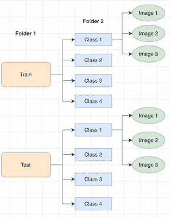
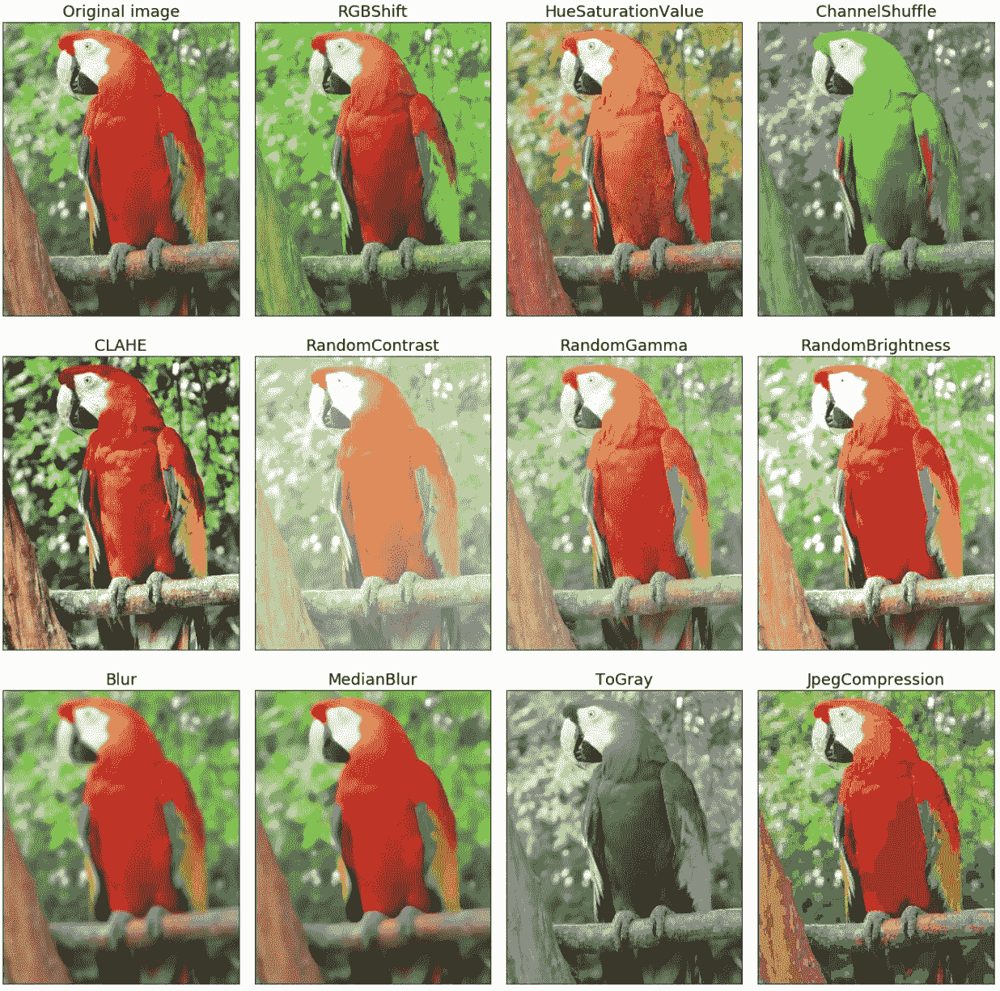
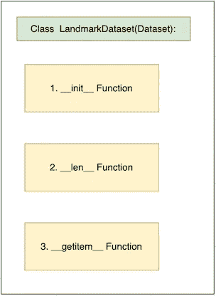
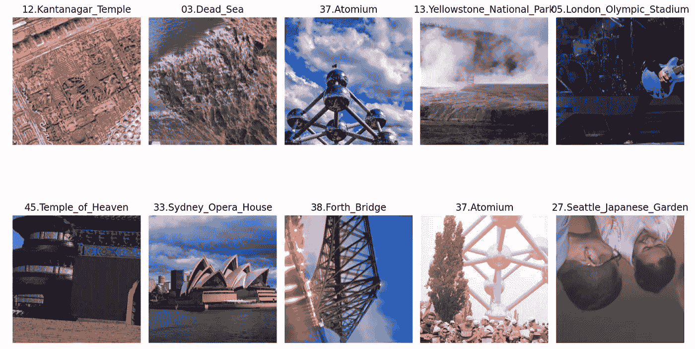
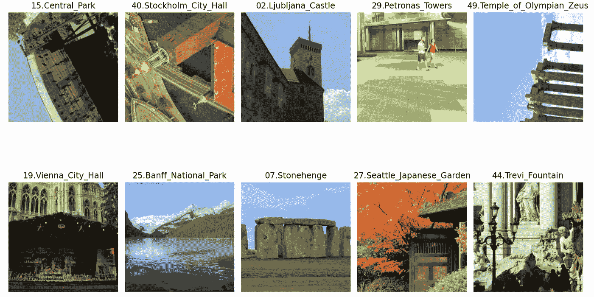

# Pytorch 中的自定义数据集—第 1 部分。形象

> 原文：<https://towardsdatascience.com/custom-dataset-in-pytorch-part-1-images-2df3152895?source=collection_archive---------3----------------------->


马克·特里亚皮奇尼科夫在 [Unsplash](https://unsplash.com?utm_source=medium&utm_medium=referral) 上拍摄的照片

Pytorch 有一个很好的生态系统来加载定制数据集，用于训练机器学习模型。这是关于在 Pytorch 中加载自定义数据集的两部分系列文章的第一部分。在[第 2 部分](/custom-datasets-in-pytorch-part-2-text-machine-translation-71c41a3e994e)中，我们将探索为机器翻译任务加载自定义数据集。在本演练中，我们将了解如何加载自定义影像数据集进行分类。本演练的代码也可以在 [Github](https://github.com/UtkarshGarg-UG/Deep-Learning-Projects/blob/main/Computer-Vision/Loading-Custom-Dataset/loading_custom_dataset_images.ipynb) 上找到。

在这里，我们将使用可用的地标数据集[。它是谷歌地标数据 v2 的子集。它有 50 个班级，包含来自世界各地的各种地标。](https://udacity-dlnfd.s3-us-west-1.amazonaws.com/datasets/landmark_images.zip)

在本练习中，我们将保持以下文件夹结构:



图一。我们数据的文件夹结构(来源:self)

这是一个简单的文件夹结构，根文件夹是 Train/Test 文件夹，其中包含带有图像的类。正如我们将看到的，我们用什么结构获取数据并不重要。数据可以全部放在一个文件夹中，图像名称中有类名(如“Cat_001.jpg”)，甚至可以放在一个 CSV 文件中，我们可以在自定义数据集类中处理所有这些数据。

此外，我们将使用[albuminations](https://github.com/albumentations-team/albumentations)库进行图像增强。这个库包含了大量可用的图像增强选项。因此，我们将了解如何在我们的自定义数据集管道中使用它。您可以使用以下方式安装它:

```
pip install -U albumentations
```



图二。白蛋白中图像增强的例子(来源:[https://github.com/albumentations-team/albumentations](https://github.com/albumentations-team/albumentations)

# **让我们编码**

## 1.导入库

## 2.定义转换

接下来，我们使用白蛋白定义我们的扩增。我们为训练和测试定义了不同的扩充。我们对训练数据应用与裁剪/旋转、颜色/饱和度和亮度相关的变换。我们还用图像净平均值和标准差来归一化训练和测试数据。最后，我们使用 ToTensor()将数据转换为 PyTorch 张量。

## 3.创建训练集、有效集和测试集

接下来，我们创建训练集、有效集和测试集。这里，我们为训练集、有效集和测试集创建单独的图像路径列表。这些将在我们的数据集类中使用，该数据集类将为自定义数据集定义。

我们得到以下输出:

```
train_image_path example:  images/train/15.Central_Park/462f876f97d424a2.jpgclass example:  42.Death_Valley_National_Park

Train size: 3996
Valid size: 1000
Test size: 1250
```

## 4.创建索引到类和类到索引字典

我们不能直接为模型使用类名。我们创建类到索引和索引到类的映射。

我们得到 idx_to_class 的输出如下:

```
{0: '42.Death_Valley_National_Park',
 1: '39.Gateway_of_India',
 2: '13.Yellowstone_National_Park',
 3: '44.Trevi_Fountain',
 4: '32.Hanging_Temple'}
```

## 5.数据集类

这是我们自定义数据集的核心。数据集类的结构如下所示:



图 3。数据集类的结构

我们通过继承 Dataset 类来创建我们的 LandmarkDataset 类:

```
from torch.utils.data import Dataset
```

首先，我们定义 __init__ 函数。一旦我们创建了 LandMarkDataset 类的实例，默认情况下就会调用这个函数。这个函数应该包含我们想要在整个数据集(如 train) **上运行一次**的所有操作。在本系列的下一部分，我们将创建一个定制的机器翻译数据集，这一点的用法将会更加清楚。现在，我们为相应的训练集、有效集和测试集定义 image_paths 和转换的变量。

然后我们有 __len__ 函数，它只返回数据集的长度。数据加载器随后使用它来创建批处理。

最后，我们有 __getitem__。这一次处理并返回一个数据点。

从上面可以看出，__getitem__ 需要一个索引。这是由数据加载器自动处理的，它为**批处理中的每个**图像运行 __getitem__。在 __getitem__ 的代码中，我们加载索引“idx”处的图像，从文件路径中提取标签，然后通过我们定义的转换运行它。该函数返回图像数组的张量及其对应的标签。

创建 train_dataset 后，我们可以访问如下示例:

```
output:
The shape of tensor for 50th image in train dataset:  
torch.Size([3, 256, 256])The label for 50th image in train dataset: 
37
```

让我们通过 train_dataset 可视化一些增强后的图像。



来源:self

还有一些，



来源:self

## 6.创建数据加载器

最后一步。DataLoader 类用于为模型批量加载数据。这有助于我们以小批量的方式处理数据，这些数据可以放在我们的 GPU RAM 中。首先，我们导入数据加载器:

```
from torch.utils.data import DataLoader
```

通过发送数据集的对象和批处理大小来启动数据加载器。

一旦我们有了 dataloader 实例— train_loader，我们就可以使用迭代器来访问数据，如下所示:

```
#batch of image tensor
next(iter(train_loader))[0].shapeoutput:
torch.Size([64, 3, 256, 256])#batch of the corresponding labels
next(iter(train_loader))[1].shapeoutput: 
torch.Size([64])
```

这是我们在训练循环中用来批量处理数据的。每次我们运行迭代器时，dataloader 都会选择接下来的 64 个索引，并逐个运行 dataset 类中的 __getitem__ 然后将其返回给训练循环。

# 结论

在这个由两部分组成的系列的第 1 部分中，我们看到了如何编写我们自己的定制数据管道。我们还学会了使用白蛋白来增强图像。此外，我们了解了数据集和数据加载器类的内部工作方式。在下一部分中，我们将通过为机器翻译任务创建一个自定义数据集类来提升级别。

下一集再见！

第二部分可以在这里找到[。](/custom-datasets-in-pytorch-part-2-text-machine-translation-71c41a3e994e)

# 更多来自作者

</custom-datasets-in-pytorch-part-2-text-machine-translation-71c41a3e994e>  <https://medium.com/@ug2409/a-non-technical-introduction-to-reinforcement-learning-part-1-62373183b2bc>  

## 参考

 