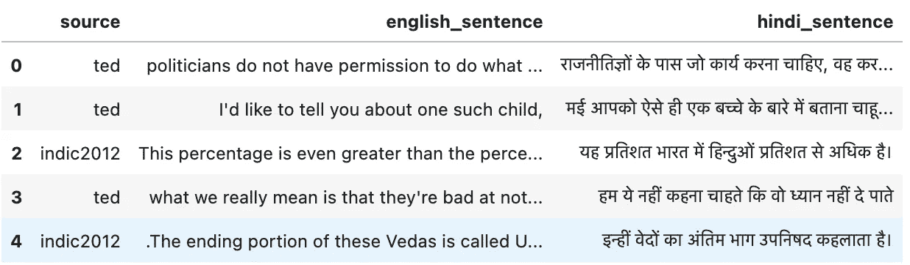
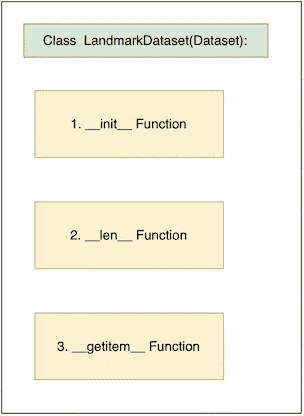

# Pytorch 中的自定义数据集—第 2 部分。文本(机器翻译)

> 原文：<https://towardsdatascience.com/custom-datasets-in-pytorch-part-2-text-machine-translation-71c41a3e994e?source=collection_archive---------5----------------------->


[皮卡伍德](https://unsplash.com/@pickawood?utm_source=medium&utm_medium=referral)在 [Unsplash](https://unsplash.com?utm_source=medium&utm_medium=referral) 上拍摄的照片

在本系列的[第一部分](/custom-dataset-in-pytorch-part-1-images-2df3152895)中，我们学习了加载自定义图像数据集。在那篇文章中，我们还介绍了 Pytorch 中数据集和数据加载器的一些基本功能。我建议先浏览一下那篇文章，但是我们也会在这篇文章中为 NLP 的人们介绍一些基础知识。在本演练中，我们将介绍如何为机器翻译加载自定义数据集，并使其为模型做好准备。本演练的代码也可以在 [Github](https://github.com/UtkarshGarg-UG/Deep-Learning-Projects/blob/main/NLP/Custom%20Dataset/loading%20custom%20dataset%20(text).ipynb) 上找到。

我们将使用[英语-印地语](https://www.kaggle.com/aiswaryaramachandran/hindienglish-corpora/kernels)语言数据集。数据集如下所示:



图一。数据集(来源:作者图片)

# 让我们编码

## 1.导入库

首先，我们导入必要的库。除了这些库，我们还导入了[panda parallel](https://pypi.org/project/pandarallel/)。这个库使得我们的 apply 函数可以利用我们所有的 CPU 线程并行运行，从而使进程快如闪电。

## 2.加载数据和预处理

接下来，我们加载数据并进行一些基本的预处理，以清理数据并为自定义数据集管道做好准备。

## 3.创建训练集和验证集

接下来，我们创建训练集和有效集。我们将仅基于训练数据来创建词汇表。我们将把有效集视为拒绝集。

```
output: 
len of train:  112343
len of val:  12482
```

我们现在有了火车和有效的数据帧。接下来，我们为这些数据帧创建 Pytorch 数据集和数据加载器。

## 4.创建 Pytorch 数据集

我们将分两部分创建 PyTorch Train_Dataset:

1.  建立词汇课
2.  构建训练数据集

## 4.1 词汇

在创建 Train_Dataset 之前，我们需要定义一个构建词汇表的过程。为此，

1.  我们将创建一个“词汇”类，它将只使用我们之前创建的训练数据帧来创建单词到索引和索引到单词的映射
2.  同样,“词汇”类返回数据帧中每个句子的数字版本。例如:['我'，'爱'，'苹果']-->[23，54，1220]。我们需要将单词转换成数字，因为模型希望我们词汇表中的每个单词都用一个数字来表示

为了更好地理解代码，已经对代码进行了注释(代码有点冗长，但不要放弃！这非常简单)

我希望代码足够清晰，可以遵循。如果没有，请在评论中联系我们。让我们测试这个类。我们将为几个句子创建一个虚拟词汇。

```
output:
index to string:  {0: '<PAD>', 1: '<SOS>', 2: '<EOS>', 3: '<UNK>', 4: 'that', 5: 'is', 6: 'a', 7: 'cat', 8: 'not', 9: 'dog'}string to index: {'<PAD>': 0, '<SOS>': 1, '<EOS>': 2, '<UNK>': 3, 'that': 4, 'is': 5, 'a': 6, 'cat': 7, 'not': 8, 'dog': 9}numericalize -> cat and a dog:  [7, 3, 6, 9]
```

我们得到两个(索引-单词和单词-索引)映射。同样，我们可以把一个新句子转换成它的数字格式。注意‘and’的值是 3，它对应于<unk>(又名 unknown)令牌，因为它不在我们的 vocab 中。另外，请注意，我们将在下一节中向 Train_Dataset 类中的数字化文本添加开始和结束标记。</unk>

## 4.2 训练数据集

酷！我们有积累词汇的渠道。让我们创建 Train_Dataset。

正如我们在第 1 部分中讨论的，PyTorch 的这个数据集类是我们定制数据集的核心。数据集类的结构如下所示:



图二。数据集类(来源:作者图片)

我们通过继承 Dataset 类来创建 Train_Dataset 类:

```
from torch.utils.data import Dataset
```

对于 Train_Dataset 类，

1.  我们首先继承 PyTorch 的 Dataset 类。
2.  然后，我们为训练数据帧中的源列和目标列初始化并构建 vocabs。
3.  然后，我们使用 getitem()方法为数据加载器(一个批量加载数据的函数)一次对一个文本示例进行数值化。在接下来的章节中会有更多的介绍)。

让我们了解一下，一旦创建了 Train_Dataset 类的实例，将会发生什么。我们一创建实例，就会运行 __init__ 方法，并创建词汇类的两个对象——source _ vocab 和 target_vocab。我们将能够通过这些实例访问各自的 vocab 映射和数值化方法。从上面可以看出，__getitem__ 需要一个索引。这是由数据加载器自动处理的，对于**，批处理中的每个**示例都运行 __getitem__。在我们的代码中，__getitem__ 在连接开始和结束标记后，返回特定索引处给定示例的数字化源和目标(因此一次一个示例)。

现在，我们测试上面的代码。

```
output:english_sentence    narrowed or blocked arteries are bypassed by t...
hindi_sentence      संकुचित हो गयी या अवरोधित धमनियों को टाँग से ल...(tensor([   1,    3,   24, 8001, 5987,   17,    3,   20,    4,  151,    5,    9,
         7360,    5,    3,  256,   23,    4, 1826,   27,   10, 1120,    7,    4,
            3,   31,   39,  189,    6,    7,    4,    3, 7360,  918,    4, 2794,
           16,    4,   52,    2]),
 tensor([   1, 6701,   25,  162,   31,    3, 4979,   11,    3,    9,   19,  112,
            3,    4, 3555,   10,  169,   23,    3,   23,   51,   42,    3,    4,
           20, 3555,    4,   13, 3598,   11,    3,    9,    8,  174, 3598,   11,
         4980,    4,  338, 1821,   51,   42,    6,    2]))
```

酷！我们得到了源句子和目标句子的索引。

## 4.3.创建验证数据集类

我们为验证创建一个单独的数据集类。为了获得验证数据框的数字文本，我们将重用训练的词汇表(因为我们将验证集视为不可见集，因此无法访问它的词汇表)。更好的做法是为验证定义一个单独的类。我们将把 train_dataset 实例和其他东西传递给 Valid_Dataset 类，以访问 train_dataset 源和目标词汇表。

现在，我们有了 train 和 valid datasets 对象。接下来，我们必须创建数据加载器来批量加载数据。

## 5.创建数据加载器

首先，我们了解一下校对。该函数在使用数据加载器创建批处理后运行。在我们的应用程序中，我们使用这个函数为批处理中的句子创建填充。为此，我们使用 torch.nn.utils.rnn 中的“pad_sequence”。它在我们的批处理中选择最大的句子，并将所有其他句子填充到这个长度。我们这样做是因为模型期望一个正方形矩阵，即每个示例在一批中应该是等长的。

在定义数据加载器时，我们使用上面的函数作为参数。

让我们看看数据加载器的结果。我们创建一个迭代器，得到大小为 32 的源和目标批处理的元组。

```
output:
source: 
 tensor([[   1,    1,    1,  ...,    1,    1,    1],
        [4125,  420,   37,  ...,   46,   95, 5406],
        [  91,   32,   17,  ..., 1407,   53,   17],
        ...,
        [   0,    0,    0,  ...,    0,    0,    0],
        [   0,    0,    0,  ...,    0,    0,    0],
        [   0,    0,    0,  ...,    0,    0,    0]])source shape:  torch.Size([64, 32])
target shape:  torch.Size([44, 32])
```

在上面的张量数组中有一个句子是垂直排列的。我们可以看到 0 是句子的填充。而 44 是目标批次中最长的句子。

就是这样！现在，数据已经准备好用于我们的模型了！

在 PyTorch 中加载自定义数据集感觉很多。但是这个管道为我们提供了为任何类型的数据集或问题陈述加载和创建模型就绪数据加载器的灵活性。

# 结论

在这个由两部分组成的系列的第 2 部分中，我们看到了如何编写自定义的机器翻译数据管道。尽管本演练是为机器翻译任务编写的，但同样的概念也可以转移到从广泛的应用程序领域加载多模式数据。这个演练的代码可以在我的 [Github](https://github.com/UtkarshGarg-UG/Deep-Learning-Projects/blob/main/NLP/Custom%20Dataset/loading%20custom%20dataset%20(text).ipynb) 上找到。

喜欢吗？给一个👏 😄并关注更多！

# 有关系的

[](/custom-dataset-in-pytorch-part-1-images-2df3152895) [## Pytorch 中的自定义数据集—第 1 部分。形象

### Pytorch 有一个很好的生态系统来加载定制数据集，用于训练机器学习模型。这是…的第一部分

towardsdatascience.com](/custom-dataset-in-pytorch-part-1-images-2df3152895) [](/visualizing-context-with-googles-universal-sentence-encoder-and-graphdb-c5f92b2f3db3) [## 使用 Google 的通用句子编码器和 GraphDB 可视化上下文

### Neo4j 中的句子嵌入和图形连接

towardsdatascience.com](/visualizing-context-with-googles-universal-sentence-encoder-and-graphdb-c5f92b2f3db3)