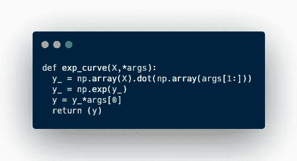
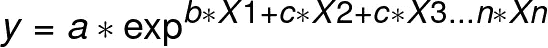
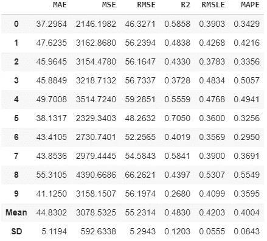
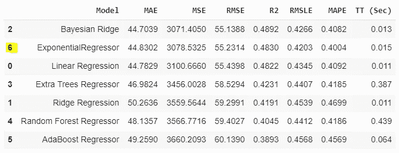
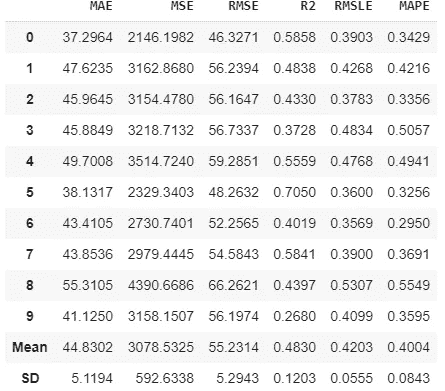
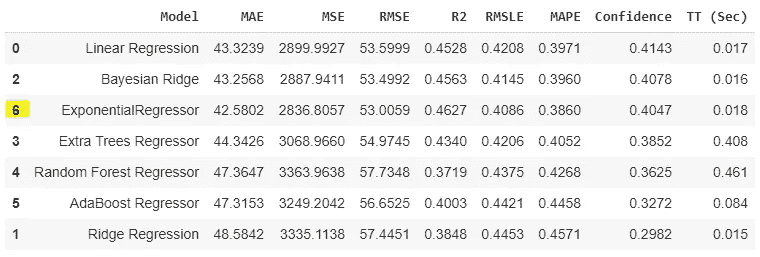

# 使用 PyCaret 的自定义估算器|第 2 部分|作者:Fahad Akbar

> 原文：<https://towardsdatascience.com/custom-estimator-with-pycaret-part-2-by-fahad-akbar-aee4dbdacbf?source=collection_archive---------20----------------------->

## 通过 PyCaret 创建、使用和部署灵活的定制估算器

## 通过 PyCaret 在 Scipy 中从头开始构建和部署 Sklearn 兼容估算器的实践指南


图片来源:[https://unsplash.com/photos/D5nh6mCW52c](https://unsplash.com/photos/D5nh6mCW52c)

在第 1 部分中，我们学习了估计器、python 类对象、指数函数、曲线拟合函数、位置参数打包/解包、枚举函数&最后构建了一个更加定制和灵活的回归估计器。您可以访问本实践教程的第 1 部分:

</custome-estimator-with-pycaret-part-1-by-fahad-akbar-839513315965>  

在这一部分，我们将主要学习和构建两件事情:

1️⃣如何使定制估算器 sklearn 兼容
2️⃣如何与 PyCaret 集成

让我们一起来构建它，但是在我们触及这些具体的点之前，最好向我们的估计器类添加一些东西来改进性能和功能。

如果您还记得第 1 部分，我们使用迭代方法在 Python 中编译了指数函数。在某些情况下，这可能会导致速度变慢。幸运的是，Python 提供了矩阵运算，与迭代方法相比，这种运算要高效和快速得多。在这种情况下，我们可以使用 NumPy 模块中可用的`dot`方法。我们可以这样做:



作者图片

`np.array(X).dot(np.array(args[1:]))`等于 x[1]*b +x[2]*c …x[n]*n.
这导致数组的长度等于 y. `np.exp(y_)`取数组 y_ 中每个元素的指数。`y_*args[0]`用数组`y_`的每个元素乘以第一个系数‘a’。结果是等式的输出:



作者图片

**2:** 下一件事，我们可能要做的是添加一个自定义的“评分”方法到我们的估计器中，这样我们就可以访问拟合的结果。这是一件很简单的事情。我们将使用 sklearn 的度量来获得平均绝对误差的得分函数。如果您愿意，您可以创建一个适合您的用例的评分函数。

我们想添加的最后一件事是通过 __init__ 方法在我们的估计器类中为参数(超参数)留出一些空间。改变超参数的值会影响模型的执行和准确性。您只需在 __init__ 函数的参数中传递所需的超参数，并将其绑定到 self。我们将添加一个名为 Maxfev 的参数，它指定在试图找到全局最小值时，我们允许 fit_curve 函数改变系数值的次数。

这是我们添加这些功能后代码的样子:

我们现在已经准备好让我们的评估者更上一层楼了！

# 👉定制估算器和 Sklearn

为了让你的估算器与 sklearn 兼容，我们需要在代码中包含一些东西。我们正在使它与 sklearn 兼容，因为这是 PyCaret 的一个要求。在 **这里可以找到一个完整详细的需求列表 [**。下面是我们需要完成的几件重要事情:**](https://scikit-learn.org/stable/developers/develop.html)**

从 sklearn 继承 base 和 estimator 子类到我们的类中。继承是一个详细的主题，超出了本教程的范围。简单地说，将 sklearn 类继承到我们的类中，将使我们不必在我们的类内部创建所有必要的方法(函数)。为了继承，我们只需要从 sklearn 导入`BaseEstimator` & `RegressorMixin`(因为我们的估计器是一个回归器，为了分类我们将使用`ClassifierMixin`)子类，并简单地将它们作为参数传递到我们的估计器类中，就像这样`class ExponentialRegressor(BaseEstimator,RegressorMixin):`。

在 __init__ 方法中，所有的参数都应该有一个默认值

**3):** 当我们将超参数绑定到类时(当我们创建属性时)，它们的名称应该保持不变

```
def __init__(self,maxfev=300):
    #Wrong way
    self.maxf = maxfev
    #Right way , name of parameter should be the same as attribute
    self.maxfev = maxfev
```

**4):** 不要通过`__init__`方法取 X 或 y。

**5):** 不要改变`__init__`方法中的属性值，例如

```
def __init__(self,maxfev=300):
    #Do not do this !
    if maxfev < 300:
        self.maxfev = 300
    else:
    self.maxfev = maxfev
```

**6):** ️Every 估计量应该有`get_prams` & `set_prams`方法。嗯，我们已经通过导入`BaseEstimator`子类解决了这个问题。

在 fit 方法中，我们需要部署一些直接来自 sklearn 的检查。一个是`check_x_y()`，它检查 X & y 的形状是否正确，X 需要是 2D 数组，y 需要是 1D 数组。第二，如果是做分类，需要通过`unique_label()`功能查看标签。这里不需要，因为我们在做回归。

**8):** 当`fit`方法被调用时，它应该生成一些(至少一个)属性，这些属性的名称跟在一个‘下划线’之后。下划线将用于在`predict`方法中运行另一个检查，以确保在调用`predict`之前已经调用了`fit`方法，例如

```
def fit(self,X,y):
    # 'underscore' after self.X & self.y is required
    self.X_,self.y_ = check_x_y(X,y)
```

**9):**`fit`方法应该返回自身的一个实例，简单来说，`fit`的`return`应该是`self`

**10):**`predict`方法也应该有一些检查，类似于`fit`方法。一个是`check_is_fitted()`函数，它检查`fit`方法是否已经被调用。另一个是`check_array()`函数，检查 X 的形状，非空的&有限值，就像`check_x_y()`一样

这似乎是一个冗长乏味的列表，但是一旦你掌握了其中的诀窍，你会注意到实现时它不超过 4/5 行代码。所以振作起来😺并检查下面的代码。我将尽量减少评论，因为到目前为止你已经看过很多次了😃。

我们现在准备跳到旅程的最后一段！你所需要做的就是把这个 py 文件保存在你想要的文件夹/目录中，或者只是把它保存在你的 Juypter 笔记本中，然后继续编码

# 👉与 PyCaret 集成

一旦我们的估算器与 sklearn 兼容，与 pycaret 的集成就非常容易了。您将照常进行 PyCaret 的设置，可以将您的类传递给 create_model & compare_models 函数。请参见下面的代码片段:

现在，如果你运行`m = creat_model(ExponentialRegressor())`你会看到这个:



作者图片

现在运行 compare_models 命令，指定要与我们构建的回归器一起运行的模型:

```
c = compare_models(include=['lr','ridge','br','et','rf','ada',ExponentialRegressor()])
```



作者图片:6 号模型是我们的定制回归器

相当令人印象深刻的结果👍，至少对于这个数据集，我们击败了 AdaBoost 和随机森林回归器，而且它也非常快…

我们还可以通过调用函数`tune_model`来调整超参数`maxfev`，以及`maxfev`的自定义网格:

```
tune_model(m,custom_grid={'maxfev':[2000,3000,4000]})
```



作者图片

关键是，你现在可以使用 PyCaret 的许多内置特性(ensemble_model，stack_models 等)来运行你自己亲手从头构建的模型！

## 奖励材料:

在这个阶段，您可以为 PyCaret 创建并添加一个自定义指标。您所需要的只是一个捕获逻辑并返回标量(单个值)的函数。我想根据模型在实际值的 20%以内的预测能力来衡量模型的准确性。如果预测值在实际值的 20%以内，我将赋值 1，否则为 0。然后简单统计一下 1 的百分比。你要这样做:

```
# create a custom function
def confidence(y, y_pred):
    score = np.where(np.abs(y_pred-y)/y <=.20 ,1,0)
    return ((np.sum(score))/len(y))
# add it to PyCaret
add_metric(id ='CI',name="Confidence",score_func=confidence)
```

现在，当我们运行比较模型命令时:

```
c = compare_models(include=['lr','ridge','br','et','rf','ada',ExponentialRegressor()],sort='Confidence')
```

我们得到:



图片由作者提供:指数回归约占 40.47%，预测误差在实际误差的 20%以内

下面的代码是我们努力工作的最终成果。代码是自给自足的，假设您已经安装了所有需要的库，您应该能够在您的机器上运行它

这个系列到此结束。在这一部分中，我们学习了矩阵乘法，添加了一个计分方法，使我们的估计器 sklearn 兼容，最后我们学习了如何将其与 PyCaret 集成。我们还学习了如何创建一个定制的度量以及我们的定制估计器，并在 PyCaret 中一起使用它们。

➖➖➖➖➖➖➖➖➖➖➖➖➖➖➖➖➖➖➖➖➖➖➖
可以关注我上[t5】中 t24】联系我上](https://medium.com/@fahadakbar_50702)[LinkedInt11】访问我的](https://www.linkedin.com/in/fahadakbar/)[t13】github](https://github.com/brainalysis) **t18】➖➖➖➖➖➖➖➖➖➖➖➖➖➖➖➖➖➖➖➖➖➖➖**

# 您可能还对以下内容感兴趣:

👉[Docker](/make-your-data-science-life-easy-with-docker-c3e1fc0dee59)
让您的数据科学生活变得简单👉[使用 PyCaret 的自定义估算器，第 1 部分](/custome-estimator-with-pycaret-part-1-by-fahad-akbar-839513315965)