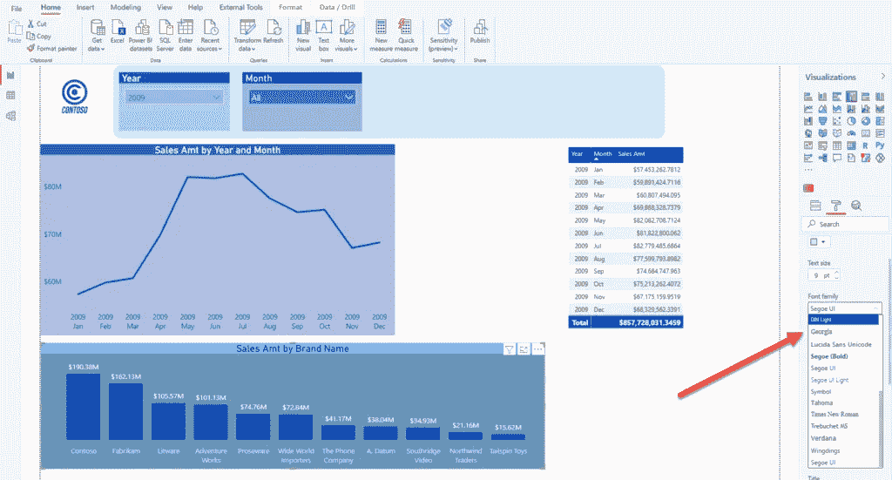
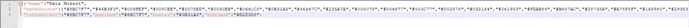
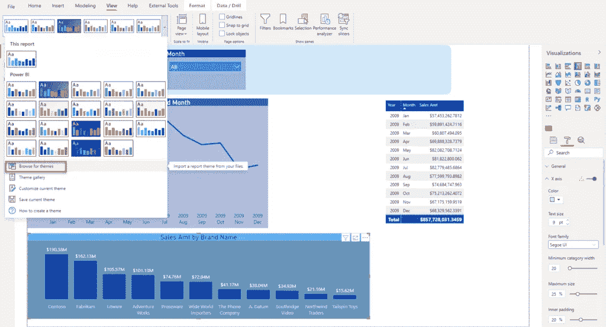
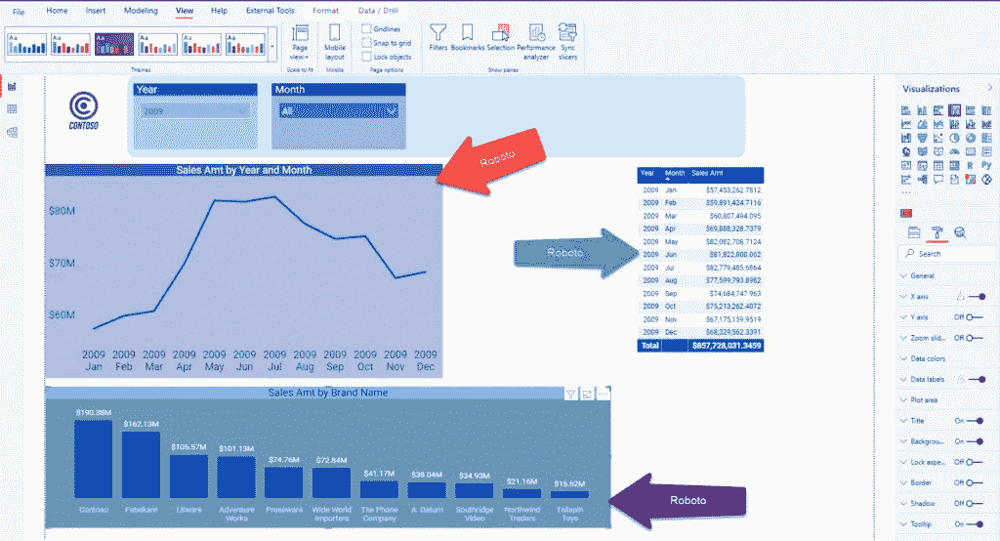
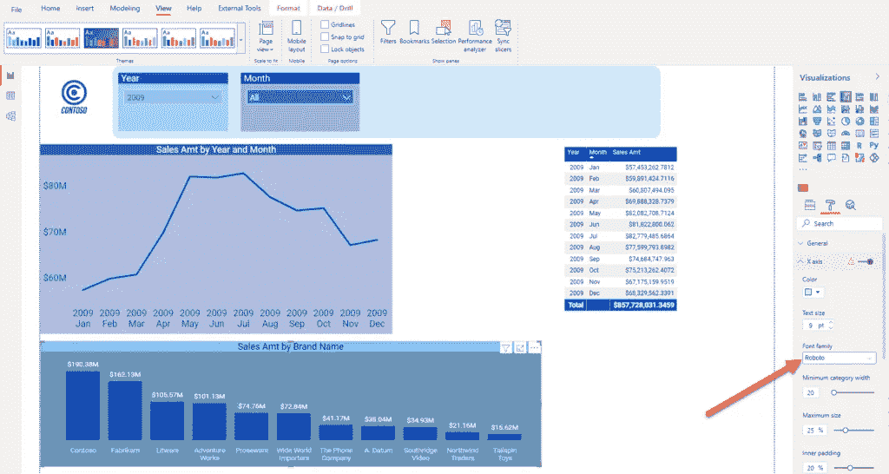
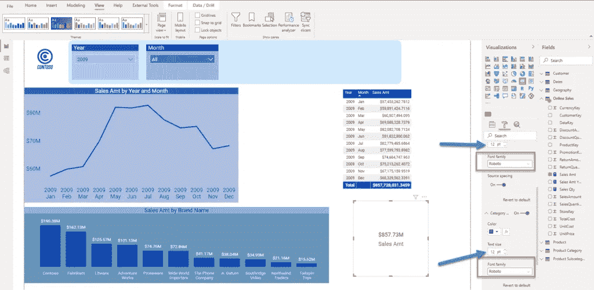
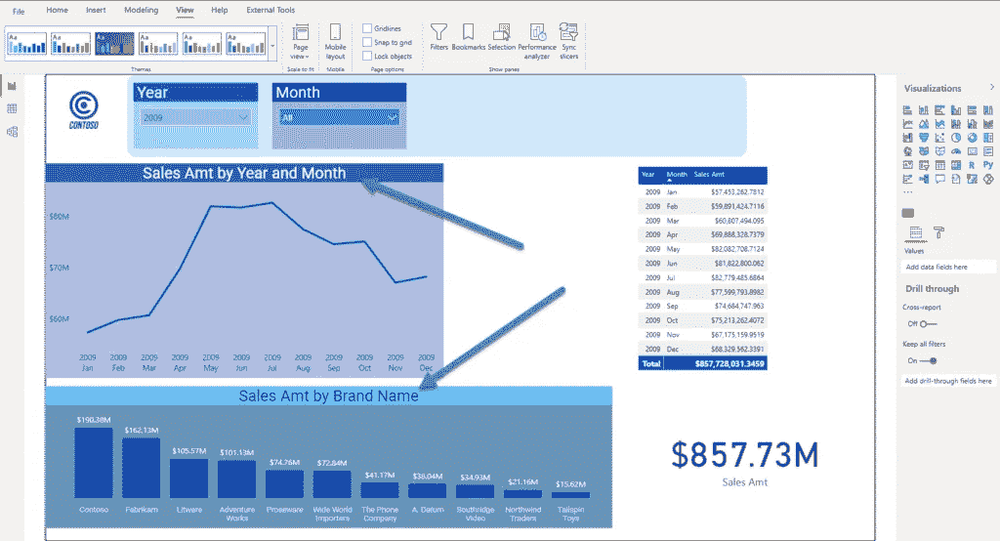
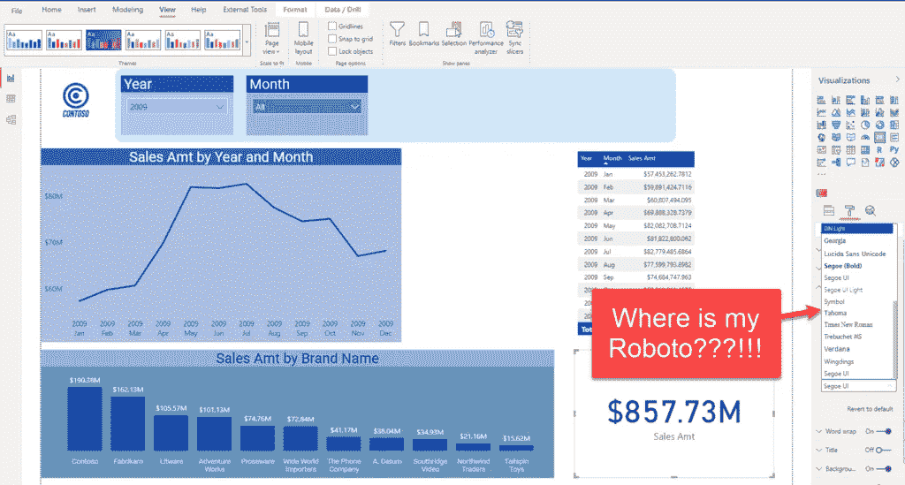
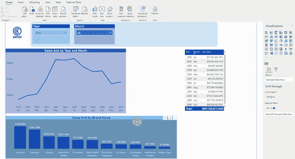

# Power BI 中的自定义字体—您想知道的一切！

> 原文：<https://towardsdatascience.com/custom-fonts-in-power-bi-everything-you-wanted-to-know-652163750ba3?source=collection_archive---------12----------------------->

## 查看如何轻松扩展预定义字体库，以满足特定客户的要求！


[https://www.pexels.com/photo/multicolored-umbrella-1146851/](https://www.pexels.com/photo/multicolored-umbrella-1146851/)

我喜欢权力 BI，真的喜欢！如果您仔细阅读我的文章，您会发现我真的认为 Power BI 是一个非常棒的工具——因为它为您讲述数据故事提供了无限的可能性。我指的不仅仅是开箱即用的解决方案，还包括定制的解决方案。

然而，我最近遇到了一个有趣的问题(或者，坦率地说，它看起来并不那么有趣，为什么我试图解决它)。那么，这到底是怎么回事？

## 方案

我正在帮助我的客户构建一个 Power BI 报告，其中一个主要要求是所有的视觉效果都应该使用 *Roboto* 字体。如果你问自己为什么——答案很简单——他们在所有的视觉解决方案、品牌等中使用 *Roboto* 字体。而且，他们希望他们的 Power BI 报告遵循该模式，并适合通用解决方案。很公平…

现在，当您打开 Power BI Desktop 并转到 visual 的格式窗格时，您可以在 25 种不同的字体之间进行选择:



作者图片

但是，这里没有 *Roboto* ！那么，我们该怎么办呢？

## 自定义报告主题

对于那些不知道的人，你可以在你的 Power BI 报告中切换不同的主题。此外，由于 Power BI 主题只不过是一个简单的 JSON 文件，所以您可以创建自己的主题，或者另外定制现有的主题！

我已经解释过[如何在你的主题](/extend-power-bi-theme-with-an-image-43167fc914b8)中嵌入背景图片，并在视觉品牌中重复使用。现在，我们将尝试使用自定义字体来扩展我们的主题。在 View 选项卡下，我将选择保存当前主题，这样我就可以直接编辑源 JSON 文件。


作者图片

还可以使用内置的 Power BI 自定义当前主题功能进行大量的调整，但是不能使用它在其中导入自定义字体。我也强烈建议检查一个来自 [powerbi.tips](https://themes.powerbi.tips/) 的极好的工具来创建你自己的主题，但是我们仍然需要一些现成的东西，所以我们将不得不手动实现我们的调整。

当我在 Notepad++中打开我的 JSON 主题文件时，我看到了我的主题的当前设置:



作者图片

为了应用字体设置，我需要使用的属性叫做:***【visual styles】***。让我们添加这个属性并定义我们的需求:

```
{"name":"Data Mozart",
"visualStyles":{"*":{"*":{"*":[{"fontSize":12,"fontFamily":"Roboto","color":{"solid":{}}}]}}},
"dataColors":["#8BC7F7","#46B3F3","#009FEF","#008CEE","#0078ED","#0050EB","#0641C8","#0B31A5","#46647C","#235A7A","#005078","#004677","#003C77","#002876","#032164","#061953","#FDAB89","#B687AC","#28738A","#A78F8F","#168980","#293537","#BB4A4A","#B59525","#475052","#6A9FB0","#BD7150","#7B4F71","#1B4D5C","#706060","#0F5C55","#1C2325"],
"tableAccent":"#8BC7F7","maximum":"#8BC7F7","center":"#0B31A5","minimum":"#D2D3D5"}
```

让我简单解释一下这个“visualStyles”定义的含义:使用它，我们指示 Power BI 将 *Roboto* 的 12 号字体和纯色应用于我们所有的报表视觉效果！开头那些星星的意思是——将此应用于所有视觉元素！

保存 JSON 文件，让我们回到我们的 Power BI 报告并导入这个主题:



作者图片

您可以立即注意到，我的所有视觉效果都发生了变化，以反映新的设置:



作者图片

如果你想确认这是真的，只需再次打开 visual 的格式窗格，你应该看到 *Roboto* 字体被应用到一个 visual:



作者图片

在这里，由于其他 X 轴设置的原因，我们的预定义大小 12pt 无法应用(您会看到这个黄色的感叹号警告)，但是如果您检查标题，您应该会看到它被自动设置为 12，正如我们所希望的那样。

## 添加新的视觉效果

好吧，它对现有的视觉效果很有吸引力，但是如果我在我的报告画布上插入一个全新的视觉效果会怎么样呢？

我在报表上放置了一个简单的卡片视图，并拖动了我的销售额度量:



作者图片

*机器人* 12？力量 BI —我爱你:)

## 潜在警告

效果非常好！但是，对此有一些潜在的警告和限制，您应该知道。例如，如果您想将特定的自定义字体仅应用于 ***标题*** (报告中的所有标题)，您应该编写如下内容:

```
{"name":"Data Mozart 2",
"visualStyles":{"*":{"*":{"title":[{"fontSize":18,"fontFamily":"Roboto","color":{"solid":{}}}]}}},
"dataColors":["#8BC7F7","#46B3F3","#009FEF","#008CEE","#0078ED","#0050EB","#0641C8","#0B31A5","#46647C","#235A7A","#005078","#004677","#003C77","#002876","#032164","#061953","#FDAB89","#B687AC","#28738A","#A78F8F","#168980","#293537","#BB4A4A","#B59525","#475052","#6A9FB0","#BD7150","#7B4F71","#1B4D5C","#706060","#0F5C55","#1C2325"],
"tableAccent":"#8BC7F7","maximum":"#8BC7F7","center":"#0B31A5","minimum":"#D2D3D5"}
```

如你所见，在“visualStyles”属性中，我已经为我的报告中的所有标题设置了 Roboto 字体大小 18。如果我们回到电源 BI 报告，您会发现它工作得很好:



作者图片

但是…如果你想调整“正常”标签，如轴，数据标签，类别等…



作者图片

字体下拉列表中不再有 *Roboto* ！由于我们明确指示 Power BI，我们希望将 *Roboto* 字体专门用于标题，因此该字体将不可用于其他视觉元素。

***还有一件重要的事情要记住*** :如果你打开。pbix 文件， ***在*** 之前导入主题，然后导入主题，修改将不会被应用！我不知道这是一个错误还是什么，但让我告诉你是什么问题:



作者图片

所以，在使用主题文件时要小心，因为它们的使用显然有一些注意事项！这个挑战的可能解决方案可能是:按照您喜欢的方式格式化所有内容，保存。pbix 文件，打开它，立即应用自定义主题！然后，不要碰任何东西:))

## 结论

正如我在一开始所说的，我喜欢 Power BI 为您提供的灵活性，以便以最吸引人的方式呈现您的数据故事。

正如您所见证的，我们能够扩展标准 Power BI 字体库，并使用自定义字体来增强我们的报告，满足客户的需求。

另一方面，当通过主题文件应用调整时，要保持警惕——有一些明显的限制(或缺陷)会带来混乱，你一定要意识到它们。

感谢阅读！

成为会员，阅读 Medium 上的每一个故事！