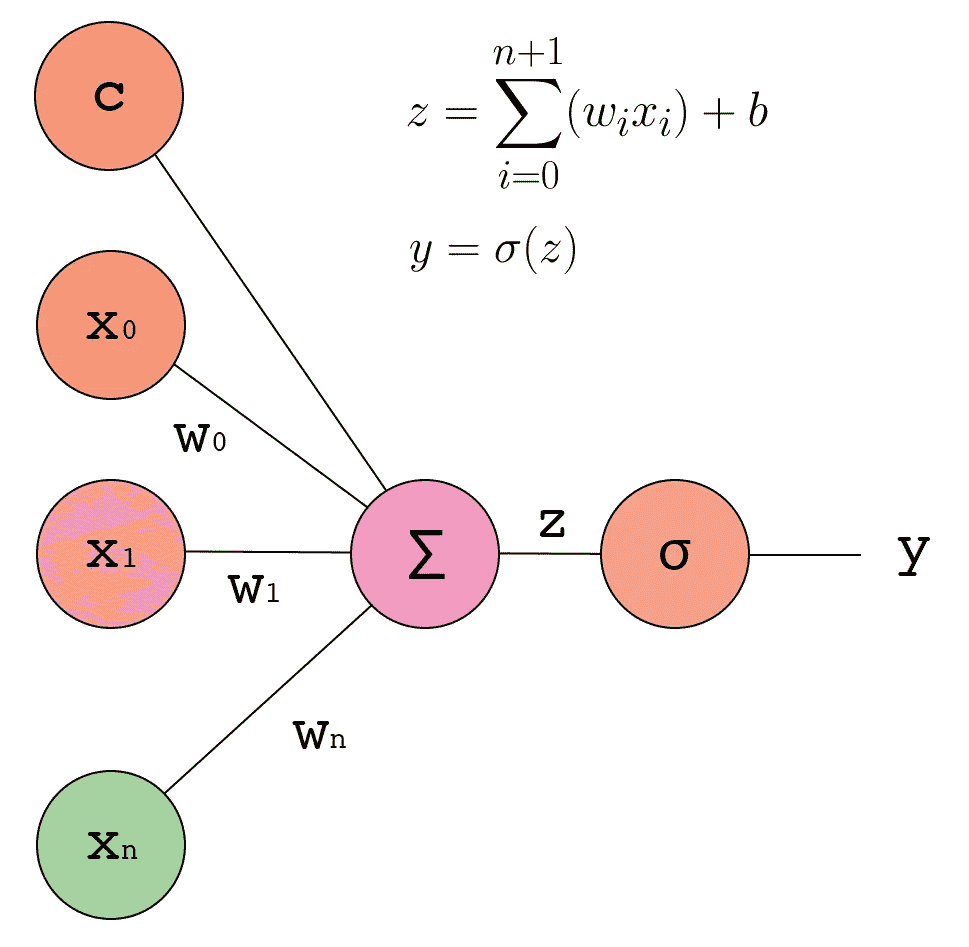
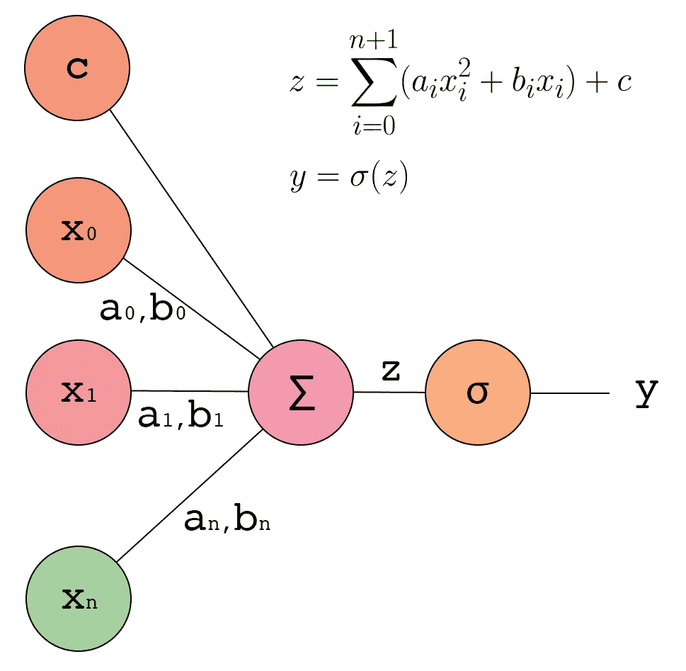
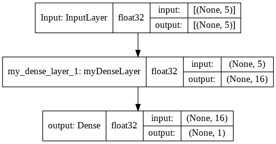
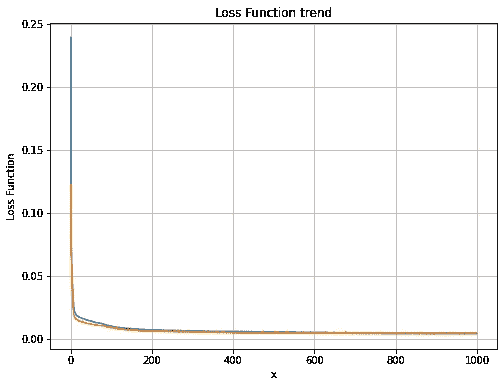
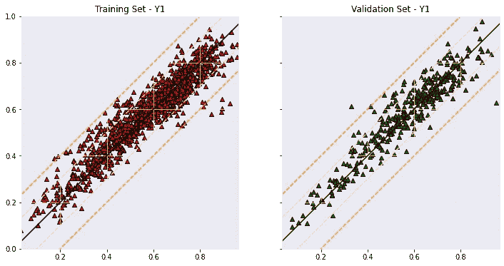

# Tensorflow 中的自定义图层

> 原文：<https://towardsdatascience.com/custom-layers-in-tensorflow-4dbd7c194b6e?source=collection_archive---------23----------------------->

## 增强 Tensorflow 体验创建您自己的层

在我对*人工智能算法*的研究中，除了陡峭的初始学习曲线之外，考虑到**开源**和免费资源的巨大可用性，我对这些算法可以被有技能的人开发和使用的即时性感到震惊。特别是， **TensorFlow** 使得以非常实用和简单的方式开发复杂的算法成为可能，即使是有经验的程序员也需要几个月的时间来实现，以获得模糊的可比结果。

丰富的文档使人们很容易理解如何应用众多的**预实现模型**，正如详细的**教程**使以实用的方式解决各种问题成为可能(自然语言处理、图像分类、监督和监督无监督学习……)。


詹姆斯·哈里森在 [Unsplash](https://unsplash.com?utm_source=medium&utm_medium=referral) 上拍摄的照片

就像科学学习的各个领域一样，总有一天，为了取得越来越好的结果，有必要对所涉及的主题进行更深入的研究。

为此，Keras 函数 API 的使用，结合 Tensorflow 的热切执行和生成*完全定制的层、损失函数、模型、指标和回调*的可能性，使得以更深入和更详细**的**方式处理人工智能问题成为可能。此外，应用张量、变量、常数的基本概念和梯度带的应用可以赋予完全原创的算法以生命并适应特定的需要，以期*【定制训练】。*

## *为什么要看这篇文章？*

*在本文中，我们将使用一个**自定义层**，它是通过在 Tensorflow 中子类化 layer 对象而开发的。我们将开发一个**二次层**，与传统的致密层相反，后者的特点是线性预激活+激活函数的应用(通常是非线性的)。我们将使用 Keras 的功能 API 创建一个非常基本的神经网络模型，并将在一个复杂工程问题的代表性数据集上测试我们的模型，从而获得良好的结果。*

## *数据集*

*翼型产生的噪声是航空航天工业的一个重要环境参数。机体总噪声的很大一部分是 ***翼型自噪声*** ，与翼型本身及其边界层产生的湍流效应的相互作用有关。[自噪声数据集](https://archive.ics.uci.edu/ml/datasets/airfoil+self-noise)由 NASA 开发。*它是在消声风洞中以不同的风洞速度和攻角对二维和三维翼型叶片段进行的一系列空气动力学和声学测试中获得的。**

***车型特点:***

*   *频率[赫兹]*
*   *攻角[度]*
*   *弦长[米]*
*   *自由流速度[米/秒]*
*   *吸入侧位移厚度[m]*

***型号标签:***

*   *标度声压级[dB]*

*我做了一个视频，是为了面对这个空气动力学问题生成一个基本的稠密神经网络，有兴趣的话来看看。你也可以在这里找到完整的代码。*

## *二次层*

*现在让我们看看如何生成一个**二次层**。要了解整个问题是如何解决的，您可以在这里找到完整的代码，或者您可以观看本文开头的视频。要理解一个**标准密集层**的工作原理，我们可以从感知器函数的概念说起。这种人工智能的基本模型包括执行神经元本身中的一组输入参数和相对权重的乘积之和，生成预激活值。一旦计算出预激活，就有必要对其应用激活函数，以将非线性分配给所生成的替代模型的输出。*

**

*感知器功能—作者图片*

*基于这些概念，密集层将由“N”个工作原理相同的神经元组成。在我们的应用案例中，我们生成一个**定制的**层，其输入和神经元本身的预激活之间的关系是**二次**，而不是线性的。*

**

*感知器二次函数—作者图片*

*为了在 Tensorflow 工作环境中生成我们的层，我们继承层对象的属性，然后初始化它的属性。我们定义了两个新的属性:层中神经元的数量和激活函数。*

*在 ***构建*** 方法中，我们定义了我们层的可训练参数。我们需要指定每个张量的大小，数据格式，因此这些参数实际上是**可训练的**。前两个参数被**随机**初始化，而偏置项被初始化为**零**。 ***调用*** 方法允许我们在前向传播阶段评估我们层的响应:我们实现上面的二次表达式。*

*我们生成简单的模型，只有一个隐藏层:我们创建的自定义层。*

**

*带有自定义图层的模型—作者提供的图像*

## *结果*

*我们编译我们的模型，定义损失函数，并选择亚当作为优化器。然后，我们训练模型 500 个时期，并检查结果。在我们的脚本中，我们还显示了训练前后自定义层的参数值之间的比较，以检查它是否正常工作。*

**

*跨时代的损失函数-按作者分类的图像*

*然后，我们运行验证图来验证模型在训练和验证集上的性能。考虑到模型是如此简单，并且没有对其超参数进行优化，结果是离散的。然而，这证实了我们的定制层的正确运行。*

**

*验证图-按作者分类的图像*

*让我们检查一些数字结果:*

```
*Y0 - mae-train - 0.05067
Y0 - mse-train - 0.00441
Y0 - r2-train - 0.87064
Y0 - pearson-train - 0.93566
Y0 - mae-test - 0.04748
Y0 - mse-test - 0.00402
Y0 - r2-test - 0.87471
Y0 - pearson-test - 0.93871*
```

## *结论*

*我们已经看到了如何使用 Colab、Tensorflow 和 Python，用相对简单的模型处理复杂的空气动力学问题。我们创建了一个只有一个隐藏层的模型，使用我们自己构建的层，而不是 Tensorflow 环境中预实现的层。我们检查了它的正确功能并核实了结果。我希望你喜欢这篇文章，欢迎任何反馈。*

 *下次见，马尔科*

# *3 分钟机器学习*

*3 分钟机器学习是一系列与人工智能、深度学习和数据科学相关的教程、视频和文章。你可以在 YouTube 上找到完整的视频集。GitHub [存储库](https://github.com/GitMarco27/TMML)包含了文章和视频中显示的所有 Google Colab 笔记本。我希望这些内容对你有用，或者只是你感兴趣。欢迎任何反馈。*

*查看其他剧集:*

*   *[使用神经类型转移和张量流生成图像](/images-generation-with-neural-style-transfer-and-tensorflow-a823b0353b06)*
*   *[猫 VS 狗卷积分类器](/cats-vs-dogs-convolutional-classifier-44ec04c8eb7a)*
*   *[使用 Keras Functional API 绘制张量流模型](/plot-a-tensorflow-model-with-keras-functional-api-f2db639dbbd8)*
*   *[预测建筑物能源性能的神经网络](/neural-network-for-predicting-the-energy-performance-of-a-building-5c2bf5820ebe)*