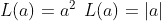
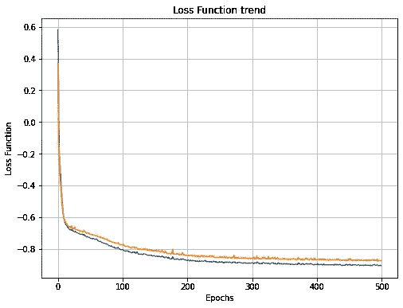

# 张量流中的自定义损失函数

> 原文：<https://towardsdatascience.com/custom-loss-function-in-tensorflow-eebcd7fed17a?source=collection_archive---------9----------------------->

## 通过创建要优化的函数来定制您的算法

在我们进入机器学习和深度学习世界的旅程中，很快将有必要从整体上处理模型、优化器、损失函数、层和算法的其他基本组件的定制。 **Tensorflow** 和 **Keras** 有大量预先实现和优化的损失函数，在工作环境中很容易调用。然而，可能有必要开发**个性化和原始损失函数**，以完全满足我们对模型表征的需求。

## 为什么要看这篇文章？

在本文和上面的 youtube 视频中，我们将回忆损失函数和成本函数的基本概念，然后我们将看到如何使用 Keras API 在 tensorflow 中创建一个自定义损失函数并子类化 Keras 的基类“loss”。然后，我们将看到如何创建一个示例损失，在这种情况下，一个定制的回归问题的准确性。我提醒你遵循我的[中](https://medium.com/@marcosanguineti)个人资料来支持这项工作。你可以在我的个人资料上找到这个系列的所有其他文章，在我的 YouTube 频道上找到这个系列的所有其他视频。您还可以在 git [存储库](https://github.com/GitMarco27/TMML)中找到所有脚本。

## 损失函数

在数学优化、统计学、机器学习和**深度学习**中 [**损失函数**](https://en.wikipedia.org/wiki/Loss_function) (也称为代价函数或误差函数)是定义一系列值和一个实数之间的相关性的函数。这个数字在概念上代表了与一个事件或一组价值相关的**成本**。通常，优化程序的目标是**最小化**损失函数。

照片由[沃尔坎·奥尔梅斯](https://unsplash.com/@volkanolmez?utm_source=medium&utm_medium=referral)在 [Unsplash](https://unsplash.com?utm_source=medium&utm_medium=referral) 上拍摄

正如官方[维基百科页面](https://en.wikipedia.org/wiki/Loss_function)所述，“良好的统计实践要求选择与特定应用环境中经历的实际变化一致的**估计函数**。因此，在实践中，选择何种统计方法来模拟一个应用问题，取决于对因问题具体情况而产生的成本的了解。”

对于大多数优化算法，希望有一个损失函数是全局**连续的**和**可微的**。两个非常常用的目标函数是**均方误差**和**偏差**。

“然而，**偏差**(利用绝对值)的缺点是在 *a=0* 处不可微分。一个**二次函数**有一个缺点，就是当对一组数值 *a* 求和时，最终的和往往是一些特别大的数据 *a* 的值，而不是平均值的表达式。”

目标函数的选择不是任意的，有时会受到希望利用的期望属性的限制。

## 张量流中的自定义损失函数

在我们的例子中，我们使用的数据集已经在本系列的其他视频和文章中使用过。我说的是 NASA 开发的[自噪声数据集](https://archive.ics.uci.edu/ml/datasets/airfoil+self-noise)，找到这篇[文章](/custom-layers-in-tensorflow-4dbd7c194b6e)了解更多信息。在使用 **Tensorflow** 和 **Keras** 开发人工智能算法的过程中，我最喜欢的功能之一是能够完全定制训练的每个方面，同时保持这些 API 使用的简单性和流畅性。

为了理解**自定义损失函数**的重要性，让我们从一个简短的例子开始。您想在数据集上训练一个回归变量，但数据中有太多噪音。您可能会继续进行数据预处理(数据清理、删除/修复异常值……)，但是让我们假设这个过程还不够。在加载、标准化和拆分数据之后，您已经创建了神经网络拓扑，但是您仍然需要编译您的模型并定义适当的优化器和损失函数。均方误差( **mse** )可能会过多地惩罚异常值，而平均绝对误差( **mae** )不会对它们进行足够的惩罚，并且训练可能会太长且不准确。对于这个特定的应用程序，我们可以考虑一个完全自定义的损失函数，Keras API 没有提供。对于这个应用， **Huber 损耗**可能是一个不错的解决方案！我们可以找到这个预实现的损失函数( *tf.keras.losses.Huber* )，但是让我们创建这个损失函数的完整定制版本。

我们可以注意到，我们只需指定自定义损失函数的参数:模型输出的真实值和预测值。但是，Tensorflow 语法只需要这两个参数，不需要其他参数。要生成一个参数损失函数，我们可以继续使用给出的解决方法:一个 double 函数，外部函数返回内部方法。这允许我们在此范围内引入新的属性，即定义 Huber 损失函数的阈值！

为了从我们的算法中获得最佳效果，我们可以:

1.  更喜欢我们函数的矢量化实现
2.  仅使用 TensorFlow 操作，以受益于 TensorFlow 的图形功能
3.  返回包含每个实例一个损失的张量，而不是平均损失。这允许 Keras 在必要时应用类别/样本权重。

在参考 YouTube 视频/Colab 笔记本中，我为一个回归问题创建了一个**自定义精度损失**，定义为:

我们只需用我们的客户损失编译我们的模型，并训练回归器。对于这个应用程序，我已经子类化了 *tf.keras.losses.Loss 的 Loss 类，但这不是强制性的。*

损失函数趋势-按作者分类的图像

## 结论

我们回顾了损失函数的关键概念，了解了如何在 Tensorflow 中为两个不同的问题创建完全定制的损失函数，并举例说明了一个应用案例。我们看到了一些从我们的实现中获得最佳效果的方法。我希望你喜欢这篇文章，欢迎任何反馈。

下次见，马尔科

# 3 分钟机器学习

3 分钟机器学习是一系列与人工智能、深度学习和数据科学相关的教程、视频和文章。你可以在 YouTube 上找到完整的视频集。GitHub [库](https://github.com/GitMarco27/TMML)包含了文章和视频中显示的所有 Google Colab 笔记本。希望这些内容对你有用，或者只是你感兴趣。欢迎任何反馈。

查看其他剧集:

*   [用神经风格转移和张量流生成图像](/images-generation-with-neural-style-transfer-and-tensorflow-a823b0353b06)
*   [猫 VS 狗卷积分类器](/cats-vs-dogs-convolutional-classifier-44ec04c8eb7a)
*   [使用 Keras Functional API 绘制张量流模型](/plot-a-tensorflow-model-with-keras-functional-api-f2db639dbbd8)
*   [预测建筑物能源性能的神经网络](/neural-network-for-predicting-the-energy-performance-of-a-building-5c2bf5820ebe)
*   [tensor flow 中的自定义图层](/custom-layers-in-tensorflow-4dbd7c194b6e)