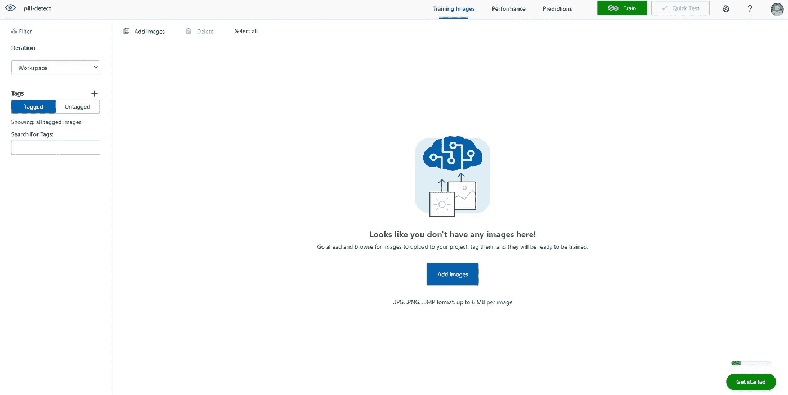

# 自定义对象检测使用 React with Tensorflow.js

> 原文：<https://towardsdatascience.com/custom-object-detection-using-react-with-tensorflow-js-7f79adee9cd4?source=collection_archive---------9----------------------->

## 与 TENSORFLOW 反应。射流研究…

## 让我们用 Azure 自定义视觉在不到 30 分钟的时间内训练一个实时自定义对象检测器


詹娜·哈姆拉摄于[佩克斯](https://www.pexels.com/photo/pink-floral-selective-focus-photography-979931/?utm_content=attributionCopyText&utm_medium=referral&utm_source=pexels)

你听说过有人使用人工智能来解决他们的行业问题吗，比如[医生使用人工智能识别癌细胞](https://www.nature.com/articles/d41586-020-03157-9)，CCTV 识别货架上的空产品，甚至是 cat 探测器？这些“人工智能”背后的基本逻辑是*自定义对象检测。*

欢迎来到我的与 Tensorflow.js 反应系列的第四个故事，在这个故事中，我们将探索**如何通过向 AI 提供大量药丸图像来训练它检测定制药丸**💊💊使用 Microsoft Azure 自定义视觉。(不到 30 分钟！)


作者使用 react with tensorflow.js. GIF 自定义药丸检测器

你可以在家里用一个简单的黄色药丸玩[这里](https://pilldetect.manfye.com/)，或者访问代码[这里](https://github.com/manfye/react-tfjs-azure-objDetect)。

**注意:此 web 应用程序不仅仅对桌面视图进行了优化。*

## 💡目标检测

目标检测是一项计算机视觉任务，包括两个主要任务:

1.  定位图像中的一个或多个对象，以及
2.  对图像中的每个对象进行分类


图像分类与目标检测(分类和定位)。原文照片由[克里斯滕·梅里曼](https://www.pexels.com/@kmerriman?utm_content=attributionCopyText&utm_medium=referral&utm_source=pexels)从[派克斯](https://www.pexels.com/photo/short-coated-gray-cat-20787/?utm_content=attributionCopyText&utm_medium=referral&utm_source=pexels)拍摄，照片由[莎伦·麦卡琴](https://www.pexels.com/@mccutcheon?utm_content=attributionCopyText&utm_medium=referral&utm_source=pexels)从[派克斯](https://www.pexels.com/photo/person-holding-siamese-cat-and-chihuahua-1909802/?utm_content=attributionCopyText&utm_medium=referral&utm_source=pexels)拍摄

与图像分类(图 2)相反，对象检测的目标是通过边界框和所定位对象的类别来预测对象在图像中的位置，输出可以多于一个类别。关于深入的解释，你可以在我之前的文章[这里](/how-to-use-tensorflow-js-in-react-js-object-detection-98b3782f08c2)阅读

## 💡自定义对象检测

目前，网上有各种预训练的模型，如 [COCO-SSD](https://github.com/tensorflow/tfjs-models/tree/master/coco-ssd) ，能够检测 80 多种常见用途的对象，如检测人、铅笔和智能手机。然而，这个模型不能满足检测自定义对象的需要，以我的情况为例，我是一名药剂师，我想做一个 web 应用程序，能够检测和计数网络摄像机中的药丸。

传统上，为了训练一个自定义对象，你需要尽可能多地将带标签的图像输入到训练框架中，比如 tensorflow 和 pytorch。然后运行该框架以获得能够检测目标的最终训练模型。


训练自定义对象检测模型的流程。作者图片

目前，*最先进的方法*是使用 pytorch 和 tensorflow 等训练框架来训练模型，但是这种方法有很多缺点，如计算量大、设置时间长、需要显卡以及不适合初学者。

因此，出现了商业(免费层可用)的方法来训练模型。在本文中，我将展示使用 [**微软 Azure 自定义视觉**](https://www.customvision.ai/) **方法的方式，只需几次点击**就可以训练一个 tensorflow.js 对象检测模型**。**

# **🔎**物体检测模型训练

自定义视觉是微软 Azure 应用计算机视觉的 AI 服务和端到端平台。[1]它为 Azure 用户提供了一个免费层来训练他们的对象检测或图像分类器模型，并将其作为一个 API(在我们的例子中，我们下载了生成的模型**😎**)跨网。对于自由层，它允许每个项目多达 5，000 个训练图像，这足以检测几类对象。


Azure 自定义视觉定价。作者图片

👉注册完成后，点击**“新建项目”**将出现资源选择界面，点击【新建】进入**新建资源**。


创建新项目。作者图片

👉然后，**创建一个新的资源组**并选择种类:**“定制视觉，培训”**和定价等级到**“F0”**以使用定制视觉培训的免费等级


创建新资源。作者图片

👉回到“创建新项目”页面，你会注意到一旦你选择了资源，你可以选择项目类型和域，选择“**对象检测**和**通用(压缩)**。通过选择 compact，微软 Azure 允许你下载各种格式的训练模型。


👉您将到达如下图所示的培训平台，**点击图片上传**。



定制视力训练平台。作者图片

👉上传您的未标记的图像用于标记目的。对于本文，我的药丸图片资源是[这里](https://drive.google.com/drive/folders/1sCZ6y5W_iXmiyh6Ejzfe0p_BIrpM_goP)。[2]就我而言，我上传了大约 50-100 张图片用于训练。

*感谢 Github 用户*[*mepotts*](https://github.com/mepotts)*提供图片资源。*


上传的图片。作者图片

👉接下来，逐一标记您的图像(这是繁琐的部分)，幸运的是，Custom Vision 为您提供了一个非常用户友好的标记工具，可以简化您的标记过程。


图像的标记。作者图片

👉完成标记后，点击**“训练”**按钮，等待几分钟，结果如下:


培训结果。作者图片

👉点击**导出**选择 Tensorflow，然后 **TensorFlow.js** 导出。恭喜您，您在 Tf.js 中拥有了第一个自定义对象检测模型


已训练模型的导出。作者图片

# **🔎**使用 React with Tensorflow.js 检测自定义对象

## 1.设置您的创建反应应用程序

通过终端中的以下命令创建一个 [Create-React-App](https://reactjs.org/docs/create-a-new-react-app.html) :

```
npx create-react-app tfjs-azureObject
cd tfjs-azureObject
```

安装 tensorflow.js 和 Microsoft Customvision，如下所示:

```
npm install @tensorflow/tfjs
npm install @microsoft/customvision-tfjs
```

安装 react-网络摄像头，如下所示:

```
npm install react-webcam
```

并启动应用程序

```
npm start
```

> 所有代码只会发生在 App.js 中，我只会显示重要的代码，完整代码可以参考我的 [GitHub 库](https://github.com/manfye/react-tfjs-azure-objDetect)

## 2.导入所需的包

```
import React, { useEffect, useState, useRef } from "react";
import Webcam from "react-webcam";
import * as cvstfjs from "@microsoft/customvision-tfjs";
```

3.构建用户界面
该项目的用户界面包括:

*   按钮—用于启动检测
*   画布-用于绘制边界框，以及
*   网络摄像头—用于输入图像/视频

```
//**Button**: Trigger a predictionFunction() on Click<Button
variant={"contained"}
style={{
color: "white",
backgroundColor: "blueviolet",
width: "50%",
maxWidth: "250px",
}}
onClick={() => {
predictionFunction();
}}
>
Start Detect
</Button>**Webcam:**
const webcamRef = React.useRef(null);
const [videoWidth, setVideoWidth] = useState(960);
const [videoHeight, setVideoHeight] = useState(640);const videoConstraints = {
height: 1080,
width: 1920,
facingMode: "environment",
};<div style={{ position: "absolute", top: "400px" }}>
<Webcam
audio={false}
id="img"
ref={webcamRef}
screenshotQuality={1}
screenshotFormat="image/jpeg"
videoConstraints={videoConstraints}
/>
</div>**Canvas:**
<div style={{ position: "absolute", top: "400px", zIndex: "9999" }}>
<canvas
id="myCanvas"
width={videoWidth}
height={videoHeight}
style={{ backgroundColor: "transparent" }}
/>
</div>
```

> *注意:画布和网络摄像头的大小和位置必须相同，才能在 HTML 画布中进行绘制。*

## 4.加载模型

将下载的模型解压到**“Public”文件夹**中，确保 model.json 正确地放在/model.json 路径中，并带有 weights.bin。要使用模型进行预测，代码很简单:

```
async function predictionFunction() {
setVideoHeight(webcamRef.current.video.videoHeight);
setVideoWidth(webcamRef.current.video.videoWidth);//testing azure vision api
let model = new cvstfjs.ObjectDetectionModel();
await model.loadModelAsync("model.json");
const predictions = await model.executeAsync(
document.getElementById("img")
);
```

然而，当预测的类必须显示在照片中时，事情就变得复杂了，这就是使用 HTML canvas 的原因。整个预测函数如下所示:

```
async function predictionFunction() {
setVideoHeight(webcamRef.current.video.videoHeight);
setVideoWidth(webcamRef.current.video.videoWidth);//testing azure vision api
let model = new cvstfjs.ObjectDetectionModel();
await model.loadModelAsync("model.json");const predictions = await model.executeAsync(
document.getElementById("img")
);var cnvs = document.getElementById("myCanvas");
cnvs.style.position = "absolute";
var ctx = cnvs.getContext("2d");
ctx.clearRect(0, 0, cnvs.width, cnvs.height);console.log(predictions);if (predictions[0].length > 0) {
for (let n = 0; n < predictions[0].length; n++) {
// Check scores
if (predictions[1][n] > 0.5) {
const p = document.createElement("p");p.innerText = "Pill" + ": " + Math.round(parseFloat(predictions[1][n]) * 100) + "%";let bboxLeft = predictions[0][n][0] * webcamRef.current.video.videoWidth;let bboxTop = predictions[0][n][1] * webcamRef.current.video.videoHeight;let bboxWidth = predictions[0][n][2] * webcamRef.current.video.videoWidth - bboxLeft;let bboxHeight = predictions[0][n][3] * webcamRef.current.video.videoHeight - bboxTop;ctx.beginPath();
ctx.font = "28px Arial";
ctx.fillStyle = "red";
ctx.fillText( "Pill" + ": " + Math.round(parseFloat(predictions[1][n]) * 100) + "%", bboxLeft, bboxTop + 70 );ctx.rect(bboxLeft, bboxTop + 80, bboxWidth, bboxHeight);
ctx.strokeStyle = "#FF0000";
ctx.lineWidth = 3;
ctx.stroke();}}setTimeout(() => predictionFunction(), 500);
}}
```

*该函数将创建一个边界框，在该框上方显示检测到的对象类别。*它包括 4 个部分，第一部分是清除绘制的 HTML 画布，然后开始对象的模型检测。

如果模型检测到对象，模型将返回预测数据。通过使用边界框数据，我们可以使用 HTML 画布绘制来绘制边界框。然后，使用 500 毫秒的超时重新运行整个功能，我们将运行我们的对象检测 web 应用程序。

# 最终想法

这是我关于用 Tensorflow.js 进行 React 的第四篇文章的结尾，我很高兴能够通过介绍 React 中的这个精彩工具来帮助 TF.js 社区。

在本文中，我们演练了如何使用 Microsoft Custom Vision free 层创建自定义对象检测模型，这大大减少了创建自定义对象检测模型的工作量和障碍(我认为减少了 80%)。然后，我们使用 react 将模型合并到 Tensorflow.js 中，并用不到 100 行代码编写了整个 web 应用程序。

每个行业对定制对象检测的需求都很高，在本文中，我为我的药房使用创建了一个药丸计数器，我希望在了解定制检测技术后，它可以启发您为您的行业创建更多工具。如果你这样做，一定要和我分享！

最后，

感谢您的阅读。

希望你喜欢这篇文章

# 我对 Tensorflow.js 文章的反应:

[](/how-to-use-tensorflow-js-in-react-js-object-detection-98b3782f08c2) [## 如何在 react.js 中使用 tensorflow.js 对象检测

### 使用 COCO-SSD 模型定位和识别单个图像中的多个对象

towardsdatascience.com](/how-to-use-tensorflow-js-in-react-js-object-detection-98b3782f08c2) [](/how-to-use-tensorflow-js-in-react-js-sentimental-analysis-59c538c07256) [## 如何在 react.js 中使用 tensorflow.js 情感分析

### 2018 年 3 月，谷歌发布了 tensor flow . js 1.0 版本，该版本使开发者能够使用机器学习(ML)模型…

towardsdatascience.com](/how-to-use-tensorflow-js-in-react-js-sentimental-analysis-59c538c07256) [](/loading-models-into-tensorflow-js-using-react-js-f3e118ee4a59) [## 使用 react.js 将模型加载到 tensorflow.js

### 立即在 react.js 中使用您的 python Tensorflow 模型

towardsdatascience.com](/loading-models-into-tensorflow-js-using-react-js-f3e118ee4a59) 

# 参考

1.  【https://www.customvision.ai/ 
2.  [https://github.com/mepotts/Pill-Detection](https://github.com/mepotts/Pill-Detection)