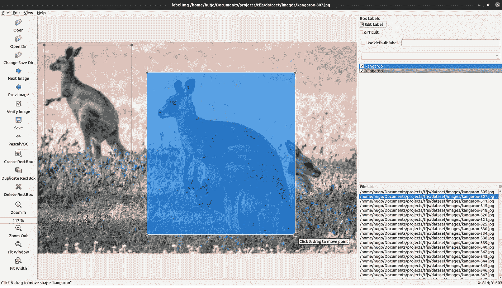
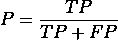

# 使用 TensorFlow.js 在浏览器中自定义实时对象检测

> 原文：<https://towardsdatascience.com/custom-real-time-object-detection-in-the-browser-using-tensorflow-js-5ca90538eace?source=collection_archive---------8----------------------->

> 使用 TensorFlow 2 对象检测 API 和 Google Colab 训练一个 MobileNetV2，转换模型，通过 TensorFlow.js 在浏览器中运行实时推理。

目标检测的任务是检测和分类图像中的每个感兴趣的目标。在计算机视觉中，这项技术用于图像检索、安全摄像机和自动驾驶汽车等应用中。

用于对象检测的深度卷积神经网络(DNN)最著名的家族之一是 YOLO(你只看一次)，通过单个端到端模型实现了接近最先进的结果( [Redmon，Joseph，et al .-2016](https://arxiv.org/abs/1506.02640))。然而，要实时运行它，就必须有一个好的显卡，像 Nvidia Tesla V100([Bochkovskiy，a .，王，C. Y .，&廖，H. Y. M. — 2020](https://arxiv.org/abs/2004.10934) )，不是每个人都可以使用的。因此，以经济高效的方式将这些模型投入生产仍然是一个核心挑战。

在这篇文章中，我们将使用 *TensorFlow* 开发一个端到端的解决方案，在 *Python* 中训练一个自定义的对象检测模型，将其投入生产，并通过 *TensorFlow.js* 在浏览器中运行实时推理。不需要强大的计算机或复杂的图书馆。

这篇文章将分为以下四个步骤:


物体检测管道(图片由作者提供)

# 准备数据

训练一个好模型的第一步是要有好的质量数据。在开发这个项目时，我没有找到一个好的小型对象检测数据集，所以我决定创建自己的数据集。

我环顾四周，看到了我卧室里的袋鼠标志——这是我买来纪念我在澳大利亚的日子的纪念品。所以我决定建造一个袋鼠探测器。

为了建立我的数据集，我从谷歌下载了 350 张袋鼠图片，并使用 [LabelImg](https://github.com/tzutalin/labelImg) 应用程序手工给它们贴上标签。因为我们可以在每张图片上有不止一只动物，这个过程产生了 520 只被标记的袋鼠。



图 2:标签示例(图片由作者提供)

在这种情况下，我只选择了一个类，但是该软件也可以用来注释多个类。它将为每幅图像生成一个 XML 文件(Pascal VOC 格式),其中包含所有注释和边界框。

XML 注释示例

为了便于操作，我生成了两个 CSV 文件，其中包含已经在训练和测试中分割的数据(80%-20%)。这些文件有 9 列:

*   **文件名**:图像名称
*   **宽度**:图像宽度
*   **高度**:图像高度
*   **类**:图像类(袋鼠)
*   **xmin** :最小包围盒 *x* 坐标值
*   **ymin** :最小包围盒 *y* 坐标值
*   **xmax** :包围盒的 *x* 坐标的最大值
*   **ymax** :包围盒的 *y* 坐标的最大值
*   **来源**:图像来源

使用 [LabelImg](https://github.com/tzutalin/labelImg) 可以很容易地创建你自己的数据集，但是请随意使用[我的袋鼠数据集](https://www.kaggle.com/hugozanini1/kangaroodataset)，我已经把它上传到 Kaggle:


[袋鼠数据集](https://www.kaggle.com/hugozanini1/kangaroodataset)(图片由作者提供)

# 训练模型

有了好的数据集，就该考虑模型了。TensorFlow 2 提供了一个[对象检测 API](https://github.com/tensorflow/models/tree/master/research/object_detection) ，可以轻松构建、训练和部署对象检测模型( [Allibhai，即— 2018](/building-a-deep-learning-model-using-keras-1548ca149d37) )。在这个项目中，我们将使用这个 API，并使用一个[谷歌协作笔记本](https://colab.research.google.com/drive/1dyuGpeLh1K4rqOkxELLTTlSqhfbTnFac?usp=sharing)来训练这个模型。本节的剩余部分解释了如何设置环境、模型选择和培训。**如果你想直接跳到 Colab 笔记本，** [**点击这里**](https://colab.research.google.com/drive/1MdzgmdYJk947sXyls45V7auMPttHelBZ?usp=sharing) **。**

## 设置环境

[创建](https://colab.research.google.com/)一个新的 Google Colab 笔记本，选择一个 GPU 作为硬件加速器:

```
*Runtime > Change runtime type > Hardware accelerator: GPU*
```

克隆、安装并测试 *TensorFlow 对象检测 API* :

## 获取和处理数据

如前所述，该模型将使用 Kaggle 上的[袋鼠数据集](https://www.kaggle.com/hugozanini1/kangaroodataset)进行训练。如果你也想使用它，有必要创建一个用户，进入*帐户*部分，并获得一个 *API 令牌:*


图 4:获取 API 令牌

然后，您就可以下载数据了:

现在，有必要创建一个 *labelmap* 文件来定义将要使用的类。Kangaroo 是唯一的一个，所以在 *Google Colab* 上的*文件*部分右击，创建一个名为`labelmap.pbtxt`的*新文件*，如下所示:

最后一步是将数据转换成一系列二进制记录，以便将它们输入到 *Tensorflow* 的对象检测 API 中。为此，使用[袋鼠数据集](https://www.kaggle.com/hugozanini1/kangaroodataset)中的`generate_tf_records.py`脚本将数据转换为 *TFRecord* 格式:

## 选择模型

我们已经准备好选择将成为袋鼠探测器的模型。 *TensorFlow* *2* 在 [COCO 2017 数据集](https://cocodataset.org/#home)上提供了 40 个预训练的检测模型。这个集合是 *TensorFlow 2 检测模型 Zoo* ，可以在这里访问[。](https://github.com/tensorflow/models/blob/master/research/object_detection/g3doc/tf2_detection_zoo.md)

每个模型都有速度、平均精度(mAP)和输出。一般来说，较高的 mAP 意味着较低的速度，但由于这个项目是基于一类对象检测问题，所以较快的模型( *SSD MobileNet v2 320x320* )应该足够了。

除了模型动物园， *TensorFlow* 还提供了一个[模型配置库](https://github.com/tensorflow/models/tree/master/research/object_detection/configs/tf2)。在那里，可以获得在训练之前必须修改的配置文件。让我们下载文件:

## 配置培训

如前所述，下载的权重在 [COCO 2017 数据集](https://cocodataset.org/#home)上进行了预训练，但这里的重点是训练模型识别一个类，因此这些权重将仅用于初始化网络——这种技术被称为[迁移学习](https://www.tensorflow.org/tutorials/images/transfer_learning)，它通常用于加快学习过程。

从现在开始，要做的就是建立 *mobilenet_v2.config* 文件，并开始训练。我强烈推荐阅读 *MobileNetV2 论文* ( [桑德勒、马克等人——2018](https://arxiv.org/abs/1801.04381))来获得架构的要旨。

选择最佳超参数是一项需要实验的任务。由于 Google Colab 中的资源有限，我将使用与论文相同的批量大小，设置一些步骤以获得合理的低损失，并将所有其他值保留为默认值。如果你想尝试一些更复杂的方法来找到超参数，我推荐 [Keras Tuner](https://blog.tensorflow.org/2020/01/hyperparameter-tuning-with-keras-tuner.html) —一个易于使用的框架，它应用了贝叶斯优化、超波段和随机搜索算法。

设置好参数后，开始训练:

为了确定培训进行得如何，我们使用损失值。Loss 是一个数字，表示模型对训练样本的预测有多差。如果模型的预测是完美的，损失为零；否则损失更大。训练模型的目标是找到一组在所有例子中平均损失较低的权重和偏差([下降到 ML:训练和损失|机器学习速成班](https://developers.google.com/machine-learning/crash-course/descending-into-ml/training-and-loss))。

从日志中，可以看到值的下降趋势，所以我们说“*模型正在收敛*”。在下一部分，我们将为所有训练步骤绘制这些值，趋势将更加清晰。

这个模型花了大约 4 个小时来训练，但是通过设置不同的参数，你可以使这个过程更快或更慢。一切都取决于你使用的类的数量和你的精度/召回目标。识别多个类别的高度准确的网络将采取更多步骤，并需要更详细的参数调整。

# 验证模型

现在，让我们使用测试数据来评估经过训练的模型:

评估在 89 幅图像中进行，并基于 [COCO 检测评估指标](https://cocodataset.org/#detection-eval)提供三个指标:精度、召回率和丢失率。

召回衡量的是模型击中正类的程度，即**从正样本中，算法答对了多少？**


回忆

Precision 定义了您可以在多大程度上依赖于肯定的类预测:**从模型说是肯定的样本中，实际上有多少是肯定的？**



精确

**设置一个实际例子**:假设我们有一张包含 10 只袋鼠的图像，我们的模型返回 5 个检测，分别是 3 只真实的袋鼠(TP = 3，FN =7)和 2 只错误的检测(FP = 2)。在这种情况下，我们有 30%的召回率(该模型检测到图像中 10 只袋鼠中的 3 只)和 60%的精确度(从 5 次检测中，3 次是正确的)。

精确度和召回率由交集(IoU)阈值划分。IoU 定义为交集的面积除以预测边界框(Bₚ)与地面实况框(Bₜ)( [曾，N. — 2018](https://blog.zenggyu.com/en/post/2018-12-16/an-introduction-to-evaluation-metrics-for-object-detection/) )的并集的面积:


并集上的交集

为简单起见，可以认为 IoU 阈值用于确定检测是真阳性(TP)、假阳性(FP)还是假阴性(FN)。请参见下面的示例:


IoU 阈值示例(图片由作者提供)

记住这些概念，我们可以分析从评估中获得的一些指标。[来自 TensorFlow 2 检测模型 Zoo](https://github.com/tensorflow/models/blob/master/research/object_detection/g3doc/tf2_detection_zoo.md)*SSD MobileNet v2 320 x320*的 mAP 为 0.202。我们的模型为不同的 iou 提供了以下平均精度(AP ):

```
AP@[IoU=0.50:0.95 | area=all | maxDets=100] = 0.222
AP@[IoU=0.50      | area=all | maxDets=100] = 0.405
AP@[IoU=0.75      | area=all | maxDets=100] = 0.221
```

那挺好的！我们可以将获得的 AP 与来自 [COCO 数据集文档](https://cocodataset.org/#detection-eval)的 *SSD MobileNet v2 320x320* 图进行比较:

> 我们不区分 AP 和 mAP(AR 和 mAR 也是一样),并假设这种差异在上下文中很明显。

平均召回率(AR)除以每幅图像的最大检测次数(1，10，100)。当我们每张图片只有一只袋鼠时，召回率约为 30%，而当我们有 100 只袋鼠时，召回率约为 51%。这些值不是很好，但是对于我们试图解决的问题来说是合理的。

```
(AR)@[ IoU=0.50:0.95 | area=all | maxDets=  1] = 0.293
(AR)@[ IoU=0.50:0.95 | area=all | maxDets= 10] = 0.414
(AR)@[ IoU=0.50:0.95 | area=all | maxDets=100] = 0.514
```

损失分析非常简单，我们有 4 个值:

```
INFO:tensorflow: + Loss/localization_loss: 0.345804
INFO:tensorflow: + Loss/classification_loss: 1.496982
INFO:tensorflow: + Loss/regularization_loss: 0.130125
INFO:tensorflow: + Loss/total_loss: 1.972911
```

定位损失计算预测的边界框和标记的边界框之间的差异。分类损失指示边界框类是否与预测类匹配。正则化损失由网络的正则化函数产生，并有助于在正确的方向上驱动优化算法。最后一项是总损失，是前三项的总和。

*Tensorflow* 提供了一个工具，以一种简单的方式可视化所有这些指标。它被称为 [TensorBoard](https://www.tensorflow.org/tensorboard) ，可以通过以下命令进行初始化:

```
%load_ext tensorboard
%tensorboard --logdir '/content/training/'
```

这将会显示出来，您可以探索所有培训和评估指标。


Tensorboard — Loss(图片由作者提供)

在标签`IMAGES`中，可以找到一些预测和实际情况的对比。在验证过程中，这也是一个非常有趣的资源。


Tensorboard —测试图片(图片由作者提供)

## 导出模型

既然培训已经通过了验证，那么是时候导出模型了。我们将把训练检查点转换成一个 *protobuf (pb)* 文件。这个文件将包含图形定义和模型的权重。

由于我们将使用 *TensorFlow.js* 和 *Google Colab* 部署模型，其最大生命周期限制为 12 小时，因此让我们下载训练好的权重并将其保存在本地。

如果您想检查模型是否被正确保存，加载并测试它。我已经创建了一些函数来简化这个过程，所以可以从我的 GitHub 中克隆`inferenceutils.py`文件[来测试一些图像。](https://github.com/hugozanini/object-detection/blob/master/inferenceutils.py)

一切都运行良好，所以我们准备将模型投入生产。

# 部署模型

该模型将被部署为任何人都可以打开 PC 或移动相机，通过网络浏览器实时进行推理。为此，我们将把保存的模型转换为 [Tensorflow.js](https://www.tensorflow.org/js) layers 格式，将模型加载到 javascript 应用程序中，并使所有内容在 [Glitch](https://glitch.com/) 上都可用。

## 转换模型

此时，您应该在本地保存了类似于此结构的内容:

```
├── inference-graph
│ ├── saved_model
│ │ ├── assets
│ │ ├── saved_model.pb
│ │ ├── variables
│ │ ├── variables.data-00000-of-00001
│ │ └── variables.index
```

在推理图文件夹中打开一个终端，创建并激活一个新的虚拟环境:

```
virtualenv -p python3 venv
source venv/bin/activate
```

安装 [TensorFlow.js 转换器](https://github.com/tensorflow/tfjs/tree/master/tfjs-converter):

```
pip install tensorflowjs[wizard]
```

启动转换向导:

```
tensorflowjs_wizard
```

现在，该工具将引导您完成转换，为您需要做出的每个选择提供解释。图 8 显示了转换模型的所有选择。大多数都是标准的，但是像碎片大小和压缩这样的选项可以根据您的需要进行更改。

为了使浏览器能够自动缓存权重，建议将它们分成 4MB 左右的碎片文件。为了保证转换能够进行，也不要跳过 op 验证，并不是所有的 *TensorFlow* 操作都受支持，因此一些模型可能与 *TensorFlow.js* 不兼容—参见[此列表](https://github.com/tensorflow/tfjs/blob/master/tfjs-converter/docs/supported_ops.md)中当前支持的 op。


使用 Tensorflow.js 转换器进行模型转换(全分辨率图片[此处](https://drive.google.com/file/d/1G-8uRdLeP6FpCtMeDNZ9yxHyygoKUSc2/view?usp=sharing) —作者图片)

如果一切顺利，您将在`web_model`目录中将模型转换为 *Tensorflow.js* layers 格式。该文件夹包含一个`model.json` 文件和一组二进制格式的分片权重文件。`model.json`既有模型拓扑(又名“架构”或“图”:对层以及它们如何连接的描述)，也有权重文件的清单([林、宗毅等人](https://cocodataset.org/#detection-eval))。

```
└ web_model
  ├── group1-shard1of5.bin
  ├── group1-shard2of5.bin
  ├── group1-shard3of5.bin
  ├── group1-shard4of5.bin
  ├── group1-shard5of5.bin
  └── model.json
```

## 配置应用程序

这个模型已经可以用 javascript 加载了。我已经创建了一个应用程序来直接从浏览器执行推理。让我们[克隆存储库](https://github.com/hugozanini/TFJS-object-detection)来弄清楚如何实时使用转换后的模型。这是项目结构:

```
├── models
│   └── kangaroo-detector
│       ├── group1-shard1of5.bin
│       ├── group1-shard2of5.bin
│       ├── group1-shard3of5.bin
│       ├── group1-shard4of5.bin
│       ├── group1-shard5of5.bin
│       └── model.json
├── package.json
├── package-lock.json
├── public
│   └── index.html
├── README.MD
└── src
    ├── index.js
    └── styles.css
```

为了简单起见，我已经在`models`文件夹中提供了一个转换后的`kangaroo-detector` 模型。不过，我们还是把上一节生成的`web_model`放在`models`文件夹里测试一下吧。

首先要做的是定义如何在函数`load_model`中加载模型(文件`src>index.js`中的第 10–15 行)。有两个选择。

第一个选择是在本地创建一个 *HTTP 服务器*,这将使模型在一个允许请求的 URL 中可用，并被视为一个 REST API。加载模型时， *TensorFlow.js* 会做如下请求:

```
GET /model.json
GET /group1-shard1of5.bin
GET /group1-shard2of5.bin
GET /group1-shard3of5.bin
GET /group1-shardo4f5.bin
GET /group1-shardo5f5.bin
```

如果选择该选项，定义`load_model`功能如下:

然后安装 [http-server](https://www.npmjs.com/package/http-server) :

```
npm install http-server -g
```

转到`models > web_model`并运行下面的命令，使模型在`http://127.0.0.1:8080`可用。当您希望将模型权重保存在一个安全的地方并控制谁可以请求对其进行推断时，这是一个很好的选择。

```
http-server -c1 --cors .
```

第二个选项是将模型文件上传到某个地方，在我的例子中，我选择了自己的 Github repo，并在`load_model`函数中引用了`model.json` URL:

这是一个很好的选择，因为它为应用程序提供了更多的灵活性，并使其更容易在某些平台上运行。

## 本地运行

要在本地运行应用程序，请安装所需的软件包:

```
npm install
```

并开始:

```
npm start
```

应用程序将在`[http://localhost:3000](http://localhost:3000)`运行，您应该会看到类似这样的内容:


本地运行的应用程序(图片由作者提供)

该模型需要 1 到 2 秒的时间来加载，之后，你可以向相机显示袋鼠的图像，应用程序将在它们周围绘制边界框。

## 在 Glitch 发布

[Glitch](https://glitch.com/) 是一个创建网络应用的简单工具，我们可以上传代码，让网络上的每个人都可以使用这个应用。在 GitHub repo 中上传模型文件，并在`load_model` 函数中引用它们，我们可以简单地登录 *Glitch* ，点击`New project > Import from Github`并选择应用库。

等待几分钟安装软件包，您的应用程序将在公共 URL 中可用。点击`Show > In a new window`，将会打开一个选项卡。复制此 URL 并将其粘贴到任何网络浏览器(PC 或移动)中，您的对象检测就可以运行了。请看下面视频中的一些例子:

在不同设备上运行模型(视频由作者提供)

首先，我做了一个显示袋鼠标志的测试，以验证应用程序的健壮性。它表明该模型特别关注袋鼠的特征，而不是专注于许多图像中存在的不相关的特征，如苍白的颜色或灌木。

然后，我打开手机上的应用程序，展示了一些测试集的图片。该模型运行平稳，能够识别大多数袋鼠。如果你想测试我的 live app，这里有(小故障需要几分钟才能醒来)。

除了准确性，这些实验的一个有趣部分是推理时间——一切都是实时运行的。在浏览器中运行并且使用少量计算资源的良好对象检测模型在许多应用中是必须的，主要是在工业中。将机器学习模型放在客户端意味着降低成本和更安全的应用程序，因为无需将信息发送到任何服务器来执行推理。

# 后续步骤

浏览器中的自定义实时对象检测可以解决许多现实世界的问题，我希望这篇文章可以作为涉及计算机视觉、Python、TensorFlow 和 Javascript 的新项目的基础。

作为下一步，我想做更详细的训练实验。由于缺乏资源，我无法尝试许多不同的参数，我相信这个模型还有很大的改进空间。

我更关注模特的训练，但我希望看到应用程序有更好的用户界面。如果有人对这个项目感兴趣，可以在[项目报告](https://github.com/hugozanini/TFJS-object-detection)中创建一个拉动请求。做一个更用户友好的应用就好了。

如果你有任何问题或建议，你可以通过 [Linkedin](https://www.linkedin.com/in/hugozanini/?locale=en_US) 联系我。感谢阅读！

# 参考

[0]雷德蒙，j .，迪夫瓦拉，s .，吉尔希克，r .，法尔哈迪，A. (2016)。你只看一次:统一的，实时的物体检测。在*IEEE 计算机视觉和模式识别会议论文集*(第 779-788 页)。

[1]波奇科夫斯基，王，陈春英，廖海民(2020).YOLOv4:物体检测的最佳速度和精确度。arXiv 预印本 arXiv:2004.10934 。

[2] Allibhai，E. (2018 年 11 月 21 日)。使用 Keras 构建深度学习模型。2020 年 12 月 28 日检索，来自[https://towards data science . com/building-a-deep-learning-model-using-keras-1548 ca 149 d37](/building-a-deep-learning-model-using-keras-1548ca149d37)

[3] Sandler，m .、Howard，a .、朱，m .、Zhmoginov，a .、陈，L. C. (2018)。Mobilenetv2:反向残差和线性瓶颈。IEEE 计算机视觉和模式识别会议论文集(第 4510-4520 页)。

[4]降入 ML:训练与损耗|机器学习速成班。(未注明)。检索于 2020 年 12 月 28 日，来自[https://developers . Google . com/machine-learning/crash-course/descending-into-ml/training-and-loss](https://developers.google.com/machine-learning/crash-course/descending-into-ml/training-and-loss)

[5] Zeng, N. (2018, December 16). An Introduction to Evaluation Metrics for Object Detection: NickZeng: 曾广宇. Retrieved December 28, 2020, from [https://blog.zenggyu.com/en/post/2018-12-16/an-introduction-to-evaluation-metrics-for-object-detection/](https://blog.zenggyu.com/en/post/2018-12-16/an-introduction-to-evaluation-metrics-for-object-detection/)

[6]林，宗毅，等.“微软 coco:情境中的公共对象”欧洲计算机视觉会议。施普林格，查姆，2014 年。检索于 2020 年 12 月 28 日，来自[https://cocodataset.org/#detection-eval](https://cocodataset.org/#detection-eval)

[7]将 Keras 模型导入 tensor flow . js(2020 年 3 月 31 日)。检索于 2020 年 12 月 28 日，来自[https://www . tensor flow . org/js/tutorials/conversion/import _ keras](https://www.tensorflow.org/js/tutorials/conversion/import_keras)