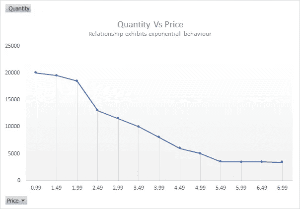
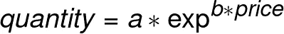

# 使用 PyCaret 的自定义估算器|第 1 部分|作者:Fahad Akbar

> 原文：<https://towardsdatascience.com/custome-estimator-with-pycaret-part-1-by-fahad-akbar-839513315965?source=collection_archive---------33----------------------->

## 通过 PyCaret 创建、使用和部署灵活的定制估算器

## 通过 PyCaret 在 Scipy 中从头开始构建和部署 Sklearn 兼容估算器的实践指南

图片来源:[https://unsplash.com/photos/D5nh6mCW52c](https://unsplash.com/photos/D5nh6mCW52c)

我们同意，PyCaret 很棒。在这么短的时间内，它对你有很大的帮助。但是有时光有这些是不够的，您希望带来您自己开发的更适合您的问题的解决方案，或者在其他地方可以获得的解决方案，并且您希望 PyCaret 来选择它。这就是我们今天要努力实现的，我们将分两部分来做。

在第一部分中，我们将学习:
1️⃣如何使用 python 的类对象制作一个简单的估算器(模型)
2️⃣如何使用 Scipy 的 curve_fit 为我们带来优势
3️⃣如何使 curve_fit 更加灵活&敏捷以便进一步集成

在第 2 部分中，我们将学习:
4️⃣如何使定制的估算器 sklearn 兼容
5️⃣如何与 PyCaret 集成

在本练习中，我们将创建一个回归估计量，因为想法是一样的，您可以创建任何类型的估计量。让我们开始建造吧

# 👉一个简单的估算器:

我们将使用 Python 的类对象制作估算器。课堂就像蓝图。你可以从一个类创建许多独立的对象，就像你可以从一个蓝图建造许多房子一样。例如，从“sklearn.linear_model”导入的“LogisticRegression”是一个类，当我们通过设置 *cls = LogisticRegression()* 来“实例化”这个类时，我们构建了一个 LogisticRegression 的对象。还有一点，类里面的函数叫做‘方法’。比如 fit() / predict()就是 LogisticRegression 类内部的函数，我们只要调用 cls.fit()等就可以使用。在我们的例子中，我们将有一个带有 fit & predict 方法的类。稍后，我们将添加另一个方法，称为 score。你可以在这里 了解更多关于 [***的课程***](https://docs.python.org/3/tutorial/classes.html)

我们要建立的第一个估计量是一个简单的均值估计量，然后会跳到一个更实用的估计量。这个估计器将简单地预测平均值。我们将从训练数据中“估计”这个“平均值”。下面是我们如何做的(注意评论，我在编码时试图解释很多💻) :

现在我们已经做了一个简单的估计器，我们可以继续做一个更具体的例子，这个例子需要一个更复杂的算法。

# 👉科学曲线拟合:

在我的行业中，我们经常需要通过价格来预测产品的数量。当我们可视化价格和数量信息时，我们通常会观察到一种弹性行为，即随着产品价格的上升，数量会下降。然而，这种行为在某些价位上表现出来。在极端价格点，数量对价格的进一步变化没有弹性/没有反应。在图上，这看起来像一条指数曲线。

作者图片:数量与价格

在这种情况下，我们通常需要通过拟合指数形状的曲线来概括这种行为。指数方程应该是这样的:

作者图片

我们可以利用这个方程，通过 scipy 的【优化模块】*[***curve _ fit***](https://docs.scipy.org/doc/scipy/reference/generated/scipy.optimize.curve_fit.html)函数，希望找到/求解系数 a & b .过程相当简单。我们定义自定义函数，然后将该函数传递给 curve_fit 函数的参数(以及其他一些参数)。**出于连续性目的，我将继续使用我们之前使用的玩具数据。价格和数量说明只是为了证明使用自定义等式的意义。**我们将挑选一个特征，并尝试将其与标签相匹配。稍后，我们将对多个特征重复相同的练习。这就是我们如何使用只有一个特征的指数函数进行曲线拟合(同样，请阅读代码中的注释！):*

# *👉一种更实用的估算方法:*

*到目前为止一切顺利　‘👌，但是你注意到什么了吗？如果你认为它不实用，那你就猜对了！。在现实生活中，还有更多的特性可用，在试验时，您将添加或减少不同的特性/列。如果我们像上面写的那样写代码，那么每次我们试验一个新特性时，添加/删除系数将是一场噩梦。我们希望能够足够灵活地提供任意数量的系数(特性),而不必改变函数。让我们试着解决这个问题。我们想要一个可编程函数，它可以拟合具有 n 个特征的指数曲线*

**

*作者图片*

*答案是用位置参数(*args)打包/解包。这是处理这种情况的一个非常有用的工具。你可以在这里 阅读更多关于立场论点 [***。在我们的 exp_curve 函数中(在参数 x 之后),我们将允许用户通过*args 传递任意数量的系数(事实上，在*之后的名称并不重要，是*具有魔力)。在函数内部，*args 将产生一个系数元组(名称为 args ),我们将使用一个循环来构造我们的公式。毕竟，我们的大部分公式只不过是彼此的序列和积。我们将使用***](https://www.python.org/dev/peps/pep-0570/) ***[***枚举***](https://docs.python.org/3/library/functions.html#enumerate) 函数，该函数将返回系数及其在元组中的位置/索引。检查下面的代码，了解当我们一起使用位置参数解包&枚举函数时会发生什么。****

*还有另一个微妙但重要的点。在我们的等式中，系数的数量将等于特征的数量+1。额外的一个是截距“a”，它将始终位于索引/位置 0。现在让我们再来看一个新函数:*

*作者图片*

*简单地说，我们从设置`y_=0 ,` 开始，从`args[1:0]`中选取第一个系数`a` ，将其乘以第一列`X[:,i]`，然后更新`y_`。我们继续循环的下一次迭代，得到下一个系数和特征列的乘积，将其添加到`y_`中(记住指数方程)。一旦我们完成了所有的系数/特征，我们只需将第一个系数(截距)`args[0]` 乘以`y_`的指数，并将其保存为`y`。*

> **我们可以通过使用矩阵乘法来进一步完善这个函数。这可以大大提高速度。对于这一部分，我将继续使用迭代方法，在下一部分将切换到矩阵乘法。**

*如果你已经走了这么远，明白发生了什么，给你自己和我一个鼓励😄。剩下的事情就简单了。我们所需要的就是使用我们的自定义函数&我们之前创建的类中的 curve_fit 函数。*

*这一集到此为止。在这一部分，我们学习了 ***估计器、python 类对象、指数函数、curve_fit 函数、位置参数打包/解包、枚举函数&，最终构建了一个更加定制化的&灵活回归估计器*** 。*

*在下一集，我们将使这个估计器 sklearn 兼容，然后将它与 pycaret 集成。敬请期待！*

*➖➖➖➖➖➖➖➖➖➖➖➖➖➖➖➖➖➖➖➖➖➖➖
你可以在 [**上关注我**](https://medium.com/@fahadakbar_50702) &上联系我 [**LinkedIn**](https://www.linkedin.com/in/fahadakbar/) &访问我的[**github**](https://github.com/brainalysis)➖➖➖➖➖➖➖➖➖➖➖➖➖➖➖➖➖➖➖➖➖➖➖*

## *您可能还对以下内容感兴趣:*

> *👉[Docker](/make-your-data-science-life-easy-with-docker-c3e1fc0dee59)
> 让您的数据科学生活变得轻松👉[使用 PyCaret 的自定义估算器，第 2 部分](https://fahadakbar-50702.medium.com/custom-estimator-with-pycaret-part-2-by-fahad-akbar-aee4dbdacbf)*