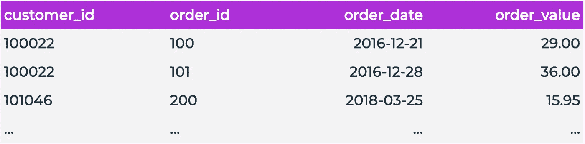
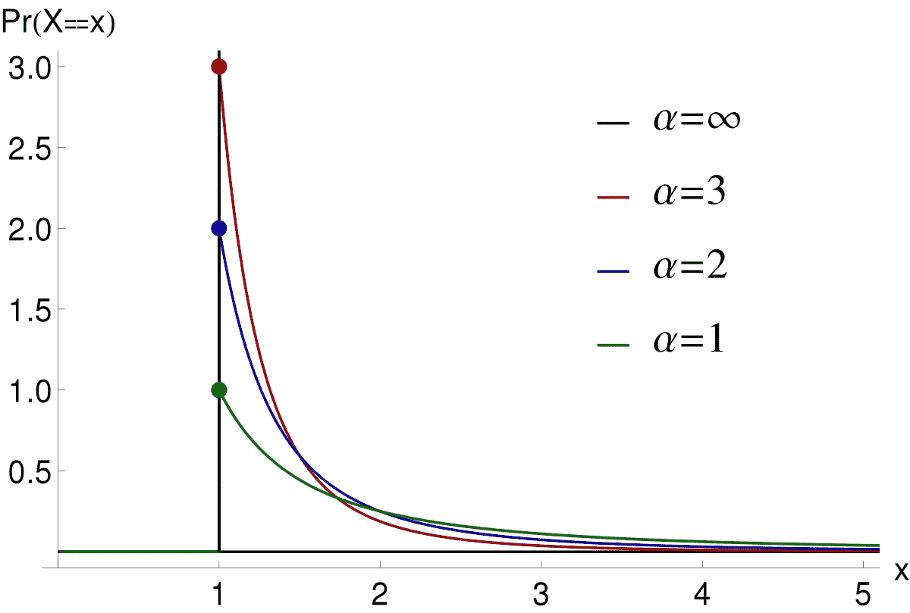
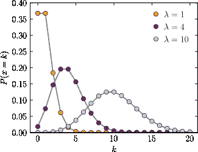
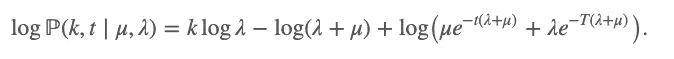
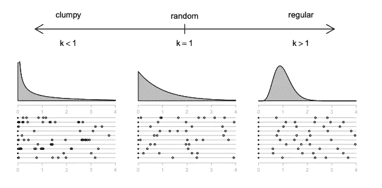
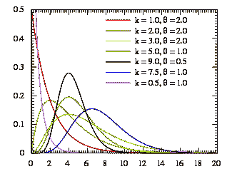

# 顾客行为建模:购买到死模型

> 原文：<https://towardsdatascience.com/customer-behavior-modeling-buy-til-you-die-models-6f9580e38cf4?source=collection_archive---------6----------------------->

## 简要介绍预测购买行为的 BTYD 家族、帕累托/NBD 和帕累托/GGG

预测客户的终身价值，或者他们在未来几年将花费多少，是一个非常具有挑战性的问题。一些数据科学家(我)有全职工作致力于解决这个问题。

[自由股票](https://unsplash.com/@freestocks?utm_source=medium&utm_medium=referral)在 [Unsplash](https://unsplash.com?utm_source=medium&utm_medium=referral) 上的照片

幸运的是，有一个专门为解决这个棘手问题而构建的模型家族:BTYD 模型！

在本文中，我希望你能了解(1)什么是 BTYD 模型,( 2)概念上最常见的 BTYD 模型是如何工作的。

我们开始吧！

*注意:在我看来，BTYDplus R 包是任何语言中探索 BTYD 模型的事实上最好的库。Python 中的生存期包对来说很棒，但我个人遇到了一些问题/错误，这让我坚定地站在了 BYTDplus 阵营…*

## #1:什么是 BTYD 型号？

**Buy-till-you-Die (BTYD)模型**是一个奇怪命名的模型系列，旨在将客户购买行为建模为一系列分布。BTYD 模型有几种不同的风格/风味(我们将介绍常见的版本),但它们都围绕几个要点:

订单表示例

**订单表输入。**为所有 BTYD 模型生成客户级价值预测所需的输入只是一个完整的订单表。虽然不同的模型以不同的方式处理这个表，但是它们都共享一个公共的输入结构。*例外是 Abe 模型，它可以选择性地接受无序特征。*由于这一输入要求，您拥有的客户群纵向数据越多，模型预测就越强。我发现合理预测的最小订单规模是大约 2 年的订单，至少 20%的客户群至少有第二次购买。

**概率建模。**所有这些模型都生成分布来描述客户行为。虽然 BTYD 家族的成员在创建这些发行版的方式或这些发行版的外观上有所不同，但他们都有一个共同的主要目标。一旦了解了这些分布，模型就可以简单地从这些分布中进行采样，以预测未来的客户价值

**RFM 分布。**虽然一些模型可能会给它们的行为分布添加一些不同的附加功能，但它们都来自于相同的总体精神&策略，即捕捉哪些行为:

*   **最近度**:顾客多久前购买的？
*   **频率**:客户多久/持续购买一次？
*   **货币**:一个顾客平均消费多少钱？

RFM 模型的每一个元素在 BTYD 模型分布中都扮演着重要的角色。RFM 建模和分析是当前企业捕获客户行为常用策略，这些模型只是这种思路的更复杂的扩展。

# **BTYD 历史**

有许多型号属于“BTYD”类别，如下所示:

## **1959 年 NBD 车型**

安德鲁·埃伦贝尔。"消费者购买的模式。"应用统计学(1959):26–41。

## 1987 年帕累托/NBD——黄金标准

*施米特莱因博士，莫里森博士，&科伦坡，R. (1987 年)。清点你的客户:他们是谁，他们下一步会做什么？管理科学，33(1)，1–24*

## 2005 年 BG / NBD

*法德尔，p .，哈迪，b .，&李，K. (2005)。简单的方法“计算你的顾客”:帕累托/NBD 模型的替代方案。营销科学，24(2)，275–284*

## 2007 MBG / NBD

*巴蒂斯拉姆，E.P .，m .丹尼泽尔，a .菲利兹特金。2007.顾客群分析模型的实证验证与比较。国际市场营销研究杂志 24(3)201–209。*

## 2009 年帕累托/ NBD

*安倍真由。"逐一统计你的顾客:帕累托/NBD 模型的分层贝叶斯扩展."营销科学 28.3(2009):541–553。*

## 2016 帕累托/ GGG —最新和最棒的

迈克尔和托马斯·罗伊特勒。"计时:计时规则有助于更好地预测客户活动."营销科学(2016)。

虽然每个模型都有自己的优点和缺点，但在这篇文章中，我将重点介绍两个最流行的(也是最强大的)模型:**帕累托/NBD** 和**帕累托/GGG**

***注:因为 Medium 目前不支持下标符号，所以我不得不使用上标符号。它看起来更糟，但希望传达相同的故事***

# **帕累托/NBD (PNBD)模型**

帕累托/NBD 模型最早出现在 1987 年的开创性论文《统计你的客户:他们是谁？他们下一步会做什么？》中。

该名称是指用于客户流失的帕累托分布和用于未来购买预测的负二项式分布(NBD)。作为输入，帕累托/NBD 只需要一个订单表。

帕累托/NBD 的目标是在 RFM 分析的基础上，在决定(1)一个客户是否已经过期,( 2)他们购买的频率时，通过捕捉客户是谁的*背景*。例如，考虑两个客户:Allen & Billy。

[rupixen.com](https://unsplash.com/@rupixen?utm_source=medium&utm_medium=referral)在 [Unsplash](https://unsplash.com?utm_source=medium&utm_medium=referral) 上拍照

艾伦隔天在我们店里买的，持续 2 个月。但是，他在过去两周内没有购买。

在过去的 6 个月里，Billy 大约每月从我们商店购买一次。他在过去两周也没有购买。

尽管两个客户有相同的最近(14 天)，购买行为的差异改变了失效的概率。此外，尽管在同一家商店购物，他们表现出明显不同的购买模式(隔天与每月)，因此任何预测都必须考虑他们的购买习惯。

帕累托/NBD 通过模拟两种人口分布来做到这一点，**寿命**和**随着时间推移的购买量**

## **寿命**

客户的寿命(`Tᶜ`)定义为:

> `Tᶜ ~ Exp(μᶜ)`

帕累托分布。看看形状参数α如何改变分布的严重性，从而改变失效的可能性。来源:维基百科

`Exp()`指的是指数或幂律分布。它也被称为帕累托分布。`μᶜ`值是从`μ`分布中提取的客户级形状参数(参见**先验**部分！)基本上抓住了您企业中该客户的典型失败率。如果你有大量的一次性顾客，寿命分布将比顾客更经常回来的企业严重得多

如果你还没有猜到，商业中著名的“帕累托原则”——也称为 80/20 法则——是基于(非常非常松散地……)帕累托分布的:

> 对于许多结果来说，80%的后果来自 20%的原因(至关重要的少数原因)——[维基百科](https://en.wikipedia.org/wiki/Pareto_principle)

将这一点解释回购买行为:一般来说，大多数客户在成为客户后会相对较快地流失，但一小部分客户会停留很长时间。这是帕累托·NBD 提出的一个假设，从我对不同企业的经验来看，这个假设相当合适:许多企业都有“小鱼”客户，即只进行 1-2 次小额采购的客户，以及“鲸鱼”客户，即持续进行大额采购的客户。

因此，通过从由我们特定业务的客户购买行为定义的帕累托分布中取样，我们可以预测与我们业务相关的每个客户的预期寿命。

## **一段时间内的购买量**

客户在一定时间(`t`)内的购买次数(`k`)定义为:

> `k~Poisson(t*λᶜ)`

泊松分布。这种分布在形状方面有更大的灵活性，这也是为什么它是跨企业捕捉购买行为的好选择。来源:维基百科

`Poisson()`指的是帕累托/NBD 假设购买时间的泊松分布。**实际上，顾名思义，帕累托/NBD 使用负二项式分布，其中泊松分布是一种特殊情况**与`μᶜ`一样，`λᶜ`是从`λ`分布中提取的客户级形状参数(参见**之前的**部分！)基本上捕捉了牵引间隔时间(ITT)，或购买之间的时间。

泊松分布是模拟 ITT 的一个合适的选择，因为不同的业务会有不同的 ITT，并且客户也可能表现出不同的购买模式。

## 传道者

如前所述，`μᶜ`和`λᶜ`取自 mu 和 lambda 分布。`μ`和`λ`都是伽玛先验分布。我不会深究估计先验分布的数学方面，因为这篇文章的目的是高层次的理解，但本质上，你可以通过观察现实世界并从这些观察到的实例反向工作来找到这些分布，并了解可能的先验分布应该是什么样子。PNBD 使用的过程被称为对数似然推断。通过学习公司过去的历史，贝叶斯模型可以预测未来。

求解 PNBD 先验的符号。来源:[https://www . briancallander . com/posts/customer _ lifetime _ value/Pareto-NBD . html](https://www.briancallander.com/posts/customer_lifetime_value/pareto-nbd.html)

## 做预测

因此，要找到客户的终身价值，帕累托 NBD…

1.  通过从寿命帕累托分布中抽样来查找客户的预期寿命。
2.  通过对一段时间内的购买量分布进行抽样来查找客户的预期交易数
3.  将预期交易次数乘以平均购买金额

在某种程度上，您可以将帕累托/NBD 预测方法直接映射回 RFM 分析。相当酷！

# 帕累托/GGG 模型

帕累托/GGG 模型最初是在 2016 年的开创性论文“滴答走时刻:时间规律性有助于更好地预测客户活动”中引入的。它以平克·弗洛伊德的歌曲“时间”命名并介绍了这首歌。好像贝叶斯建模还不够时髦😎

Platzer & Reutterer 听到了这些话，并受到启发，重新发明了客户行为建模。来源:[https://www.pinterest.co.uk/pin/548313323377868100/](https://www.pinterest.co.uk/pin/548313323377868100/)

帕累托/伽马伽马，或者说帕累托/GGG，使用了很多和我们刚刚讨论的 PNBD 模型相同的原理。它使用帕累托分布对下降进行建模，并具有人口和客户级别的分布。但是，它在两个有意义的方面有所不同:

1.  PGGG 使用三种伽玛分布，而不是 NBD 来模拟一段时间内的购买情况
2.  PGGG 不是从对数似然中学习先验，而是从蒙特卡罗马尔可夫链(MCMC)中学习先验

## 三伽玛&结块

通过从 3 个伽玛分布中取样，可以得到超过的购买次数，从而得到距离下一次购买的时间(ITT)。从购买 j 到下一次购买(`Δtʲ`)的 ITT 定义为:

`Δtʲ~Gamma(k, k*λ)`

其中参数`k`和`λ`都来自它们自己的伽马先验分布:

`k~Gamma(t, γ)`

`λ~Gamma(r, α)`

***当我第一次阅读 PGGG 论文时，我被这个名称弄糊涂了，因为从技术上讲有 4 种伽马分布，因为* `*μ*` *伽马先验分布仍然用于模拟时间推移。我猜 GGG 比 GGG 更吸引人*

为了理解以这种方式模拟 ITT 的价值，让我首先引用这篇论文，然后提供一些额外的解释。正如普拉茨和罗伊特勒在他们 2016 年的论文中所说:

> "λ决定频率，形状参数 k 决定交易时间的规律性."

Platzer & Reutterer 意识到需要在模型中捕捉的客户行为是**交易的节奏/聚集**。虽然 ITT 的平均值可以概括客户的行为，但它不能显示他们是否会定期回来，或者他们是否会在“疯狂购物”之间休息很长时间他们在论文中直观地展示了这一点:

归功于(Platzer & Reutterer，2016 年)

下面的例子可以说明上述情况的一个夸张的例子:

坎迪斯和王思然都有相同的…

*   平均 ITT — 1 个月，
*   寿命— 1 年
*   购买数量— 12

…但消费习惯却大相径庭。

坎迪斯每个月的第一天都会准时从你的店里买东西。

王思然，在她第一次购买后，忘记了你的商店 6 个月。但是一旦她记起来了，她就开始疯狂购物，一天之内买了 5 样东西。现在满足了，她又等了 6 个月，继续同样大的购物狂欢，在一天之内买了 6 件东西。

如果我们的行为模型没有解决购买聚集问题，我们可能会错误地假设这两个客户在接下来的两个月里有相同的购买机会。但是对于 PGGG，我们会给坎迪斯一个很高的 k 值，给王思然一个很低的 k 值。

选择伽马分布的另一个价值是它们提供了很大程度的灵活性。这使得 PGGG 能够捕捉更多的购买行为，这使它与大多数业务类型相关。

伽玛分布。查看定义此分布类型的形状/速率参数如何允许它捕捉大量行为。来源:维基百科

根据我在客户行为建模方面的经验，帕累托/NBD 和帕累托/GGG 在基于订阅的业务上表现都很好，但在非订阅业务上，PGGG 胜过 PNBD。这是有道理的——PGGG 解释了人们在你的商店中的不规则购买模式！

## MCMC 采样

PGGG 和 PNBD 的另一大区别是 PGGG 使用 MCMC 来求解它的先验分布。正如 PNBD 提到的，解决先验知识是一个非常困难的过程，有时恢复真实的先验知识是不可能的。自 PNBD 诞生以来，随着计算能力的增长，一种新的(计算代价昂贵的)寻找先验的策略出现了，它是以**蒙特卡罗马尔可夫链**的形式出现的。

蒙特卡洛这个名字，指的是摩纳哥著名的酒店，是一个代号，因为取样方法是在洛斯阿拉莫斯核武器项目期间发明的。由[阿米特·拉哈夫](https://unsplash.com/@amit_lahav?utm_source=medium&utm_medium=referral)在 [Unsplash](https://unsplash.com?utm_source=medium&utm_medium=referral) 上拍摄

已经有大量的资源可以帮助您理解 MCMC 采样如何帮助寻找分布，但本质上的想法是以一种连续的方式随机采样，以“猜测”我们的先验方法。通过对未知分布生成的值进行数百万次模拟，我们最终可以重建出它们的采样分布。随机抽样方法提供了"[蒙特卡罗"](https://en.wikipedia.org/wiki/Monte_Carlo_method)部分的名称，而样本间的关系提供了"[马尔可夫链](https://en.wikipedia.org/wiki/Markov_chain)部分的名称

在非常高的水平上，MCMC 通常提供比以前的恢复方法更精确和更概括的先验分布预测。

# 应用

我希望本指南能为您提供这类模型如何工作的简单工作知识。如果有兴趣了解更多信息，我强烈推荐:

1.  你自己看报纸
2.  自己实现模型

R 包已经构建了所有这些模型并准备好了，而[文档](https://www.rdocumentation.org/packages/BTYDplus/versions/1.1.4)是惊人的并且容易理解。

感谢阅读！