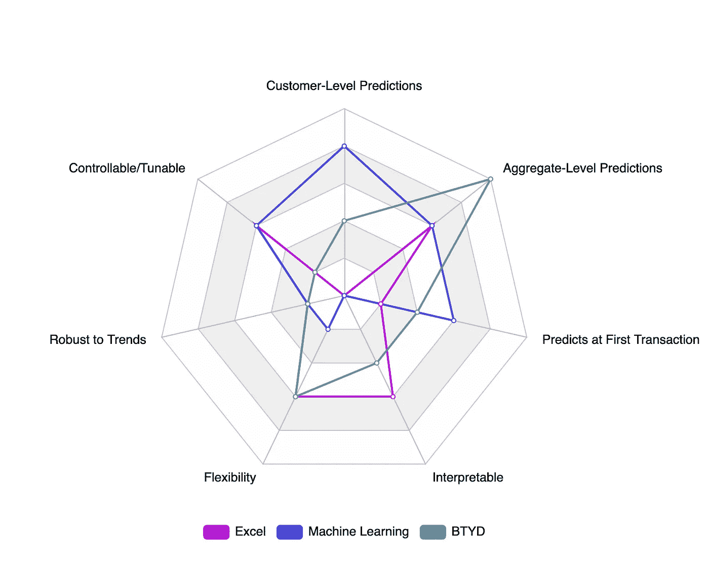
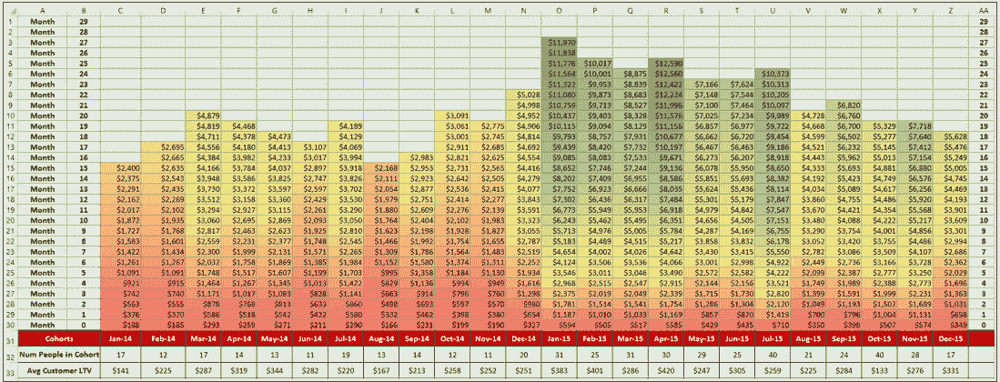
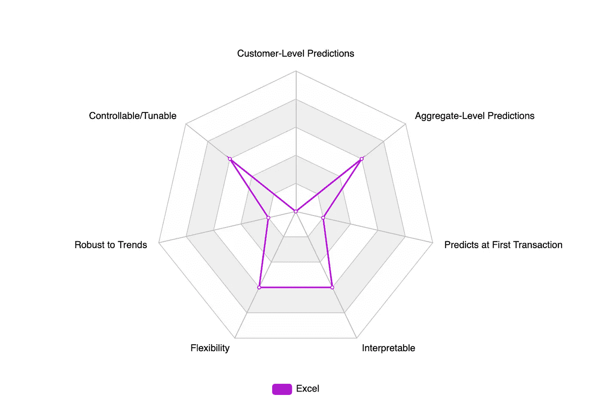
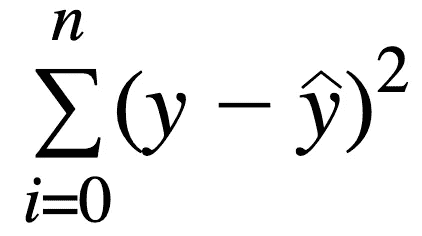
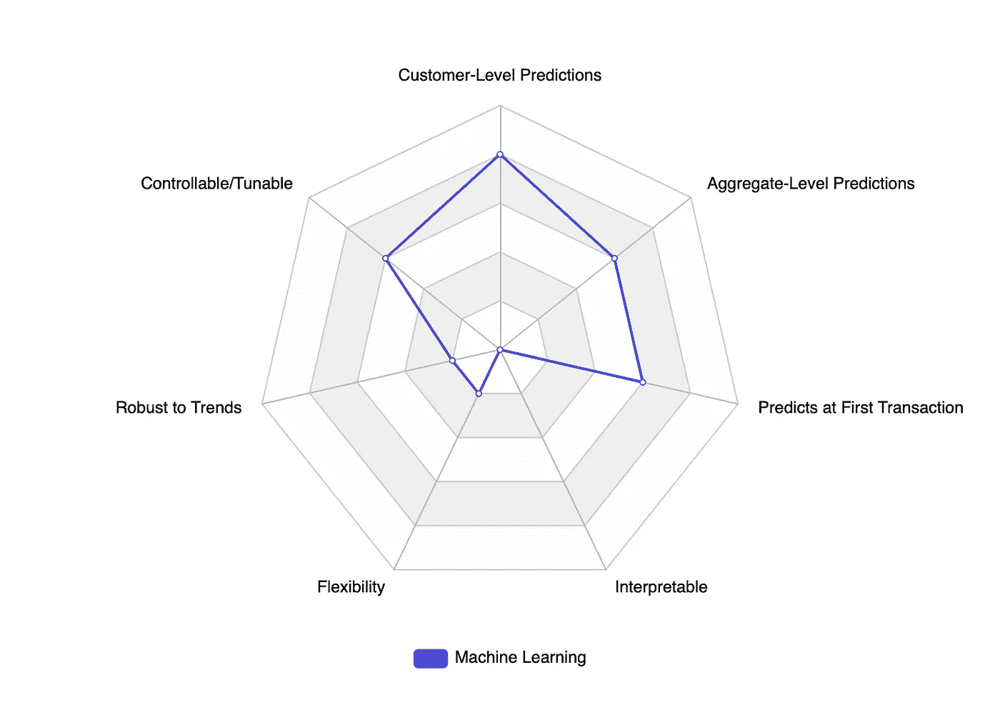
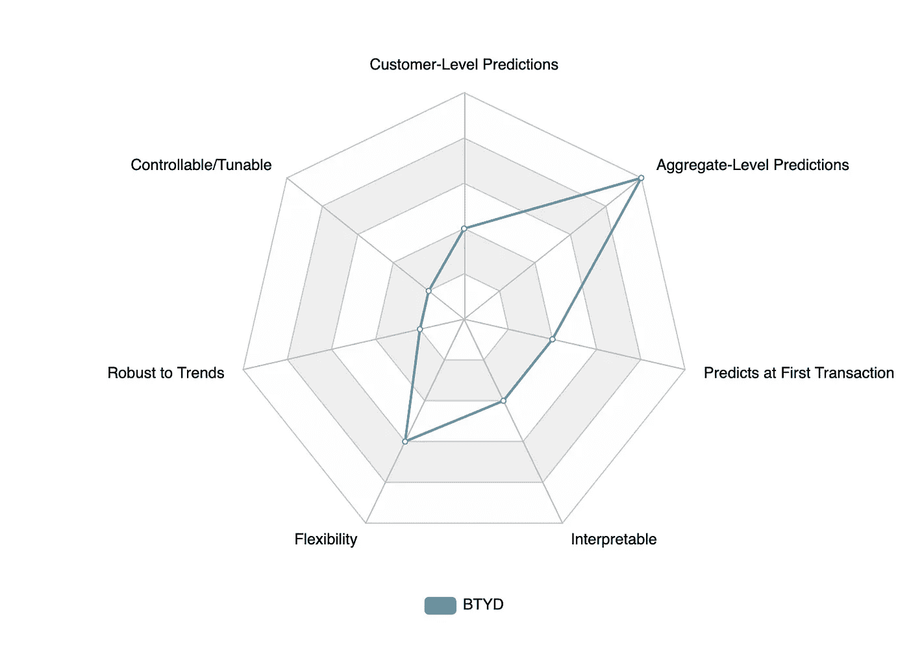

# 顾客行为建模:后 COVID 世界的最佳模型

> 原文：<https://towardsdatascience.com/customer-behavior-modeling-the-best-models-for-a-post-covid-world-3e388926609c?source=collection_archive---------26----------------------->

## 并非所有的客户模型都是一样的

我们都同意 COVID 完全改变了客户行为。越来越多的人在网上购物，越来越多的人被困在家里，越来越多的人在旅行/度假中投资于个人舒适。

如果他们和我一样，更多的人会在周末去亚马逊疯狂购物…

在这一点上，联邦快递的邮递员是我最好的朋友。

Elena Mozhvilo 在 [Unsplash](https://unsplash.com?utm_source=medium&utm_medium=referral) 上的照片

即使发生了所有这些变化(尤其是因为这些变化)，我们也需要确保我们的业务能够了解我们的客户群，并在这个动荡的时代继续增长。

为您的企业开发一个强大而准确的长期价值模型，几乎可以为每一项战略计划带来巨大的回报。即使是最简单的预测模型也能提供价值和洞察力。

**为什么是 CLV？**与首次购买价值或收购数量等其他短期指标不同，CLV 可以捕捉到企业的实际健康状况。你的企业可能已经获得了大量的新客户，但如果这些客户不留下来，你的品牌将很快回归到 COVID 之前的水平。

泰勒·弗兰塔在 [Unsplash](https://unsplash.com?utm_source=medium&utm_medium=referral) 上的照片

聪明的企业会发现谁是他们最好的客户，并利用他们的经验和产品来吸引更多的客户。

话虽如此，LTV 模型还是有等级之分的，有些比另一些强得多。

在这篇文章中，我希望通过一个强大的 LTV 模型的标准，一些市场上更常见的模型，并最终有助于提供清晰的哪种模型最适合你的特定情况。

由于这篇文章是为更具技术性的读者而写的，我们将更深入地探究这些模型是如何产生预测的。这将有望揭示我们选项之间的重要细微差别和差异。我们开始吧！

TLDR:这是每种型号的相对优势。继续阅读，了解更多信息！(作者制作)

# **什么是好的 LTV 模型？**

设定一个好的 LTV 模型的期望将确保我们的评估能够涵盖贵公司可能感兴趣的所有元素。

## **#1 预测强度指标**

一个好的 LTV 模型的表标要求当然是它必须准确。一个强有力的 LTV 模型应该能够高度准确地预测客户价值。

**(1)合计预测准确性**是一个经典的数据科学指标，用于比较模型，并可直接应用于业务。如果团队升级到产生更准确的综合预测的模型，董事会报告和收入预测都可以提升到下一个级别。

**(2)客户级别预测准确性**是我们将寻求的另一个预测强度指标。我以前写过为什么这是客户行为模型的一个重要指标([链接](/customer-behavior-modeling-the-problem-with-aggregate-statistics-be369d95bcaa))，但总结一下:

客户级别的指标对于比较模型来说是至关重要的，因为我们需要了解模型的能力，以便准确地将客户划分为低/中/高细分市场，而这是无法通过汇总统计数据来验证的。

这就是说，一个强大的 CLV 模型在客户和总量层面上都是准确的。

## **#2 可操作输出**

除了预测能力之外，一个好的客户行为模型还应该有一些额外的属性，使其可以在生产中使用。以下是我们要看的几个:

**(3)首次交易时/之前。**模型越早做出准确的 CLV 预测，它在营销和报告中的应用就越有效。如果一个团队需要等待几个月才能对他们的模型预测有信心，那么这意味着他们在这段时间内执行次优活动的风险很大。

快速了解一项商业战略(如付费收购活动或电子邮件保留活动)在提升长期客户价值方面是否有效，对企业来说具有难以置信的价值，因此我们将把能够更早准确预测的视为更好的模型

**(4)可解释的**。可怕的数据科学黑箱在每个预测模型项目中都露出了丑陋的一面，客户行为建模也不例外。虽然黑盒模型的准确性通常非常强大，但不了解*为什么*客户会得到某个分数可能会导致灾难性的结果。可解释性高的模型优于可解释性低的模型

作为一名数据科学家，“相信模型”是一种糟糕的心态。我们需要能够剖析我们的模型，并理解假设和优势到一个可接受的水平，而这种理解能力往往是以原始预测能力为代价的。这当然是一种权衡，但我倾向于解释能力而不是力量

**(5)灵活性&长期**。使用 CLV 模型可以很容易地预测未来不同的时间长度，这对企业来说是一个有用的功能。这使得财务团队可以找到预测的平均回报时间、2 年 CLV 以及任何其他感兴趣的时间框架。我个人曾与只对季度预测值感兴趣的公司和其他关心预测未来 15 年的公司合作过。能够处理所有这些请求的模型比只能猜测单一时间范围的模型更有价值

**(6)顺应潮流**。客户行为和趋势会随着时间的推移而变化，能够轻松应对不断变化的客户环境的模型是放在产品中的更健壮、更现实的模型。在后 COVID 时代，这一点尤为重要，在这个时代，每个人都在深入思考客户购买习惯将在 2020 年及以后发生的变化。如果一个模型在一种新的客户群出现时就崩溃了，或者破坏了试图抓住这种新客户群的整体预测，那么对营销人员来说采取行动就没什么用了。

使用所有这 6 个指标，我们可以为每个可用的客户模型开发一个记分卡。在 0-5 分的范围内，每个数字的含义如下:

*   **0** :做不到
*   **1:** 做不好
*   **2** :能胜任
*   **3** :能做好
*   **4** :能做得很好
*   **5** :无敌

提到成功的标准后，让我们进入不同的模型吧！

# **客户行为模型**

# **模型类型#1: Excel CLV 模型**

**什么事？**

这是最简单和最普遍的客户价值建模形式。在世界各地的许多金融预测模型中，基本公式可以概括为:

> Excel CLV =平均销售额 x 平均重复销售额 x 预期留存时间 x 利润率

通常，财务团队会将该公式与每个变量的公司范围内的一般数字一起使用，并将其插入 excel 中，以生成丰富多彩的群组 clv excel 电子表格(因此有了“excel CLV”的昵称)

队列 CLV 和保留曲线。由 Excel 电子表格(作者制作)提供给您

**记分卡:**

## 客户级别预测:0/5

不幸的是，因为输入值都是群组级别的统计数据，所以预测不可避免地只适用于整个群组。任何客户级别预测的尝试对所有客户来说都是完全相同的数字，而且是不准确的数字。

## 总水平预测:3/5

Excel CLV 模型可以相对较好地捕捉总体客户行为；这也是他们出现在许多董事会报告中的原因。虽然它们不如我们将要讨论的其他模型准确，但从方向上来说，这个模型是可用的，因此获得了 3/5 的分数

## 首次交易时的预测:1/5

是的，有可能在一群人加入时计算他们的 CLV，但这里的问题是，如果使用相同的输入，每个群组将会有相同的第一笔交易预测。在做预测时，购买行为的任何差异都不会被考虑在内，所以它通常是非常不准确的。1/5

## 可解释性:3/5

Excel CLV 模型的确是可以解释的…但不一定是以一种有帮助的方式。我们可以很快得到为什么给出预测的字面解释——这是一个简单的公式——但我们对驱动这些预测的实际客户行为没有更深入的理解。所以它可以给我们一个字面上的解释，但非常有用

## 灵活性:3/5

使用 Excel，我们可以像在队列保持分析中一样分解 CLV，因为保持是公式本身的一部分。我们可以根据我们感兴趣的任何时间段对 CLV 进行细分，尽管由于留存+平均销售额是常数，这种灵活性无法捕捉其他模型所表现出的季节性。

## 趋势稳健:1/5

该模型没有防范客户行为变化的护栏。有一个人在循环中，当这些事情发生变化时，他可以编辑平均销售额/保留率，但由于这两个指标都是滞后指标，需要几个月才能出现和验证，所以我们的 excel CLV 模型在被修改之前，将会在相当长的一段时间内做出糟糕的预测。这显然是一个问题，也是许多高管在 COVID 成功后突然发现他们的项目不再符合现实时面临的问题。几个月后，这个问题仍然存在。

## 可控和可调:3/5

Excel CLV 确实让我们很容易获得可调性，因为它需要一个人来找到/学习它的参数。但是营销界的任何人都可以告诉你，其他因素也会影响客户的 CLV，因为模型不会学习/控制这些特征，所以我们无法调整我们的模型来解决这些因素。

Excel 模型记分卡。作者制作

# 模型类型#2:监督机器学习

**什么事？**

监督机器学习模型是任何“学习”如何基于标签预测 CLV 的模型的总称。数据输入和模型架构是这些模型的两个基本部分。

这些模型的输入是通常在训练模型之前设计的特征。基于客户订单表的常见特性包括新近性(客户购买后多久)、频率(他们购买的频率)和货币性(他们平均花费多少)。您总是可以派生出其他特性，如生命周期(客户开始购买后多久),甚至包括客户或产品特性，如他们第一次购买了什么产品或通过什么渠道购买的。

有各种各样的风格和架构，都有自己的卖点和权衡:

*   **线性回归**:在`yi=b1*xi+b0`中找到`b0`和`b1`的参数值，其中`(xi,yi)`是提供的一组坐标，找到的线使误差平方和最小

*   **K-最近邻聚类(KNN)** :对于每个新客户，找出 K 个最相似的客户，并给他们分配一个聚类。为群集中的每个客户选择最典型的 CLV 值
*   **前馈神经网络**:一系列连接的节点，每个节点都有自己的权值，以接受输入的方式组装，通过神经元层(称为隐藏层)进行馈送，产生所需的输出。通过最小化在提供的标签上计算的误差，并使用*反向传播*将误差分布在节点上并对权重进行调整，来优化权重值
*   **递归神经网络**:具有上述所有元素的神经网络，具有隐藏层的附加组件，其连接方式允许更深隐藏层的输出被视为更早隐藏层的输入

该记分卡将专注于更复杂的机器学习版本，即神经网络，因为这些是生产中最常用的模型。简单的 ML 模型，像回归，是很棒的，因为它们是可解释的，但缺乏在现实世界中使用的必要的准确性。

## **记分卡:**

## 客户级别预测:4/5

如果你选择了正确的模型，客户层面的预测对于监督的 ML 模型来说是相当强的。我发现使用梯度增强的机器特别成功，在数据集之间达到< = 20%相对误差的峰值

## 总水平预测:3/5

对于监督 ML 模型来说，总水平预测是可以的，考虑到客户水平的误差是好的，这是很奇怪的。这源于这样一个事实，即由于该模型不一定是基于现实的假设，如 Excel CLV 或 BTYD 中的那些假设，受监督的 ML 模型有时会对隐藏在中间客户级别统计数据中的鲸鱼(业务的前 5%，有时比普通客户花费更多的数量级)做出疯狂的预测。这种有趣的怪癖已经出现了足够多次，值得一提

## 首次交易时的预测:3/5

监督的最大似然模型确实可以在客户层面上做出第一天的预测，而且比简单的 excel CLV 模型更准确。然而，预测强度不如其他模型准确。虽然我对这些数字的准确性有实际经验，历史上这些数字的相对误差在+- 100%左右浮动，但有一些理论原因表明第一次交易预测强度不是最佳的。监督式 ML 模型旨在预测标签，而不是客户行为。这意味着它正在对输入特征和(通常有噪声的)美元金额之间的关系进行建模，而不是对客户类型或消费习惯进行建模。虽然这对于普通客户来说是可以接受的，但是新客户总是需要了解较少的信息，因此 ML 模型将使用平均值或排除这些客户，从而导致较低的性能。

## 可解释性:0/5

ML 模型具有强大的学习能力来准确预测标签，是黑盒。全国各地都有研究项目致力于找出如何解释和理解非线性关系，但今天我们真的很难解开神经网络内部的计算复杂性网络。当一个预测看起来很奇怪，或者准确性由于数据漂移而开始下降时，您的团队将没有问题所在的提示。这是使用这些模型的一个主要缺点

## 灵活性:1/5

与其他模型不同，您不能任意选择一个时间范围来进行预测。ML 模型需要在标签本身内训练之前定义的时间尺度。您可以更改用于训练模型的时间长度，但每次想要修改时间刻度时都要重新训练模型，这在使用 CLV 模式的公司中很常见。你也不能保证这个新训练的模型会做出和以前的模型一样的预测…

## 趋势稳健:1/5

不平衡的数据集导致较差的 ML 模型性能。如果趋势太小，模型将简单地用多数覆盖它，因为这将使它的损失函数保持较低。如果趋势是主要的，它会因为完全相同的原因重写之前的预测。如灵活性部分所述，重新训练模型会对 CLV 预测的连续性产生重大影响

## 可控和可调 3/5

一个强大的数据科学家或 ML 工程师肯定可以迭代模型架构和数据输入。但是这是有挑战性的，并且只能由一个老练的技术人员全职负责这个项目。此外，ML 模型有大量的参数需要调整。正如在可解释性一节中提到的，该模型没有提供任何关于哪些参数如果调整得当会产生最佳增益的指示。

ML 模型记分卡。作者制作

# 型号 3: **BTYD 型号**

**什么事？**

BTYD 模型，或称“买到死”模型，是一类统计模型，专门用于计算客户群的终身价值。在 Python 中，它们是在生存期包中实现的，而在 R 中，它们是在 BTYDplus 包中实现的。它们是贝叶斯模型，这意味着它们使用已知的概率分布来生成 CLV 预测。我在这里写了一个简短的总结。

在这篇文章中，我将关注帕累托/GGG，因为它是模型家族中最新也是最强大的。

帕累托/GGG 中的三个“g”代表“Gamma Gamma”，指的是模型内部工作的固有分布。该模型试图从数据中学习三种分布。我上面链接的帖子也详细讨论了这个模型是如何工作的！

**记分卡:**

## 客户级别预测:2/5

BTYD 模型的一个好口号可以是“个人的贫穷，集体的伟大”尽管 BTYD 模型在总体上具有优势，但在客户层面上却表现不佳。这种情况经常出现，因为 BTYD 模型通常不能很好地预测客户流失，导致每个客户损失几美元。这是一个如何计算客户未来的神器。从个人经验来看，我还发现对客户支出的预测是错误的——该模型使用聚合统计数据来确定支出，因此即使客户经常支出 20 美元，如果总体支出通常为 50 美元，则该模型将预测支出。

## 总水平预测:5/5

BTYD 模型在总体上是好的。如前一节所述，分配给每个客户的几美元很好地平衡了对高价值客户的低估，因此总的来说结果相当准确。如果您主要对董事会报告或群组分析感兴趣，请使用 BTYD 模型。

## 首次交易时的预测:2/5

BTYD 模型的一个缺陷是它们几乎完全依赖订单信息。这似乎不是一个主要缺点，但这意味着模型需要学习客户的购买行为，然后才能做出有意义的预测。大多数企业的购买间隔时间在一个月左右，这意味着该模型需要几个月的数据才能准确区分一次性客户和高价值客户。这种准确性的延迟是 BTYD 模型在客户生命周期早期表现不佳的原因

## 可解释性:2/5

BTYD 模型预测和模型本身之间的关系在模型从数据中学习的分布形状中清楚地描述出来。也就是说，在知道参数值有限且非常复杂的情况下，您可能会采取的措施。数据科学家/分析师不仅需要深入了解贝叶斯模型和 MCMC(例如，如果 Gelman stat 超过 1.5)，还需要深入了解实际的 BTYD 模型(例如，为 PGGG 选择合适的起始参数)。因为缺乏这方面的知识，并且修改 BYTD 或 Lifetimes 包的能力有限(参见可调小节)，所以我给这些模型打了 2 分

## 灵活性:3/5

你可以在 BTYD 的基础包中选择不同的时间尺度来预测，这很棒。如上所述，您还可以选择输出“固定 t 形星”或“变化 t 形星”，这是 CLV 模型中的一个很大的特性。唯一阻碍这些模型的是，您必须重新训练模型以同时接收多个不同的时间尺度，并且重新训练 BTYD 需要大量的时间。

## 趋势稳健:1/5

由于模型严重依赖订单数据，BTYD 模型很难适应新趋势，因为它们缺乏对这些客户独特性的洞察。此外，一分为二的客户群会给模型带来严重的问题。；从经验来看，如果你为每个业务领域训练一个单独的 BTYD 模型，你可以产生更强的结果，但是如果有重叠的话，这会引起问题。你可以想象，如果出现新的客户趋势，这将更具挑战性——你不能只是从你的模型中忽略这些客户，但包括他们将会扭曲所有其他客户的预测。正如在“首次交易”一节中提到的，BTYD 模型在预测的前几个月是不稳定的，如果出现新的客户趋势，这种情况就会加剧。

## 可控和可调:1/5

正如在可解释性一节中提到的，如果您有必要的领域知识，BTYD 模型确实提供了一些有限的控制。然而，这些可调部分不是很直观，也不一定能帮助您更好地理解数据。根据经验，选择自定义的起始参数可能会修改预测，但是除了强力网格搜索之外，您无法真正保证它们是否成功。

BTYD 模型记分卡。作者制作

# 所以…哪个型号最好？

像数据科学/生活中的所有难题一样，正确答案是**视情况而定**。基于模型的使用和团队的需求，上面的每一个都有自己的优点

**如果你想马上使用 CLV**，你最好的选择是 Excel 模型。它非常容易实现，不需要任何代码，并且可以很快用于判断您的客户的近似值

**如果你想利用 CLV 的整体商业健康**，BTYD 模型可能是你的最佳选择。他们在判断一个企业的总体客户价值方面非常有效，所以如果你需要 CLV 来做董事会报告，BTYD 模型将会帮你

**如果你想用 CLV 来做客户层面的决策**，你可能想用 ML 模型。只要你有一个成熟的团队，能够正确地瞄准模型并确保预测是合理的，ML 模型将产生最佳的客户级预测

**如果你在客户层面寻找可解释的、健壮的、仍然准确的东西**，打电话给我。我也在积极寻找——让我们合作吧。

但是，使用我的记分卡，每个模型的平均得分是:

> **Excel** : 2.00
> 
> **毫升** : 2.14
> 
> **BTYD** : 2.28

作者制作

当然，还有无数其他用例及模型可供选择。我目前的公司使用 BTYD 模型和 ML 模型的混合来消除两者的缺点，并在上面撒了一点无监督聚类。你绝对应该和他们中的任何一个或所有人玩一玩，看看哪一个适合你。

感谢阅读！