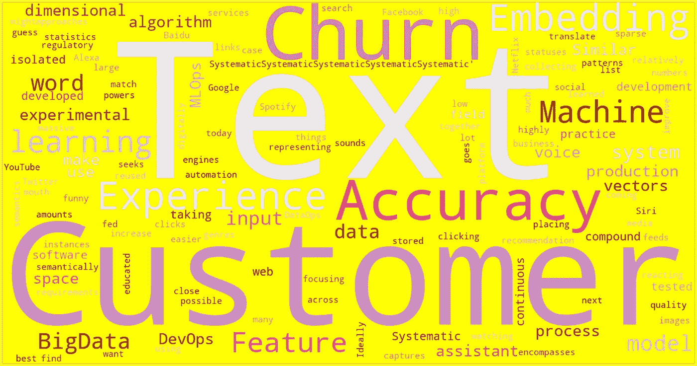
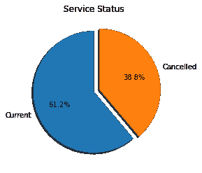
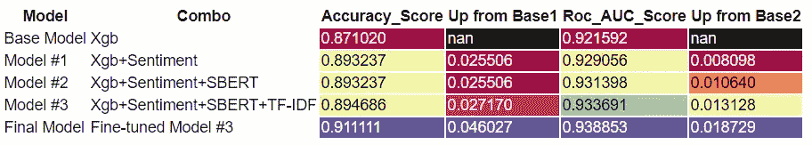
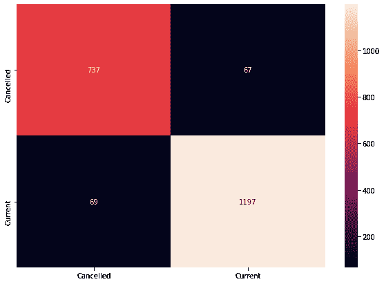
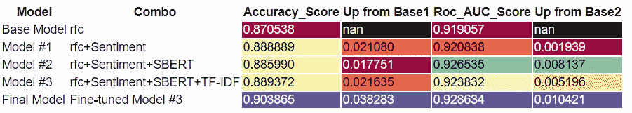
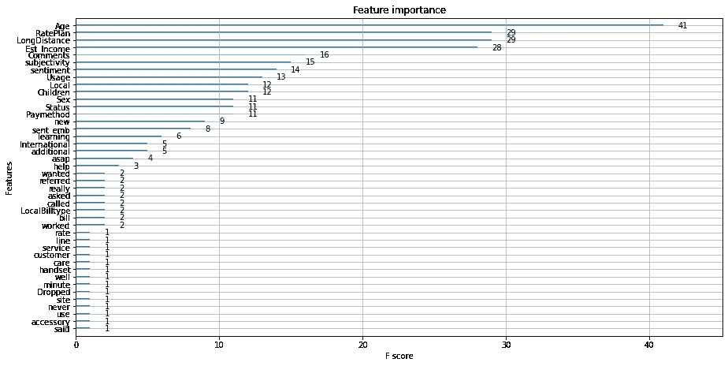

# 客户流失准确度:通过 TextBlob & SBERT 提高了 4.6%

> 原文：<https://towardsdatascience.com/customer-churn-accuracy-a-4-6-increase-with-feature-engineering-29bcb1b1ee8f?source=collection_archive---------30----------------------->

## 关于我如何通过客户服务说明将小型客户流失数据集的准确率提高了 4.6%的演练



作者图片

# 目录

*   **动机**
*   **商业问题&数据**
*   **特征工程&建模**
*   **评估&特征分析**
*   **总结**

# 动机

在我上一篇博客“[什么是嵌入，你能用它做什么](/what-is-embedding-and-what-can-you-do-with-it-61ba7c05efd8)”中，我谈到了嵌入可以将高维、非结构化的数据变成低维的数值表示，可以用在各种机器学习模型中。在另一篇博客“[什么是 MLOps，为什么我们应该关注](/what-is-mlops-and-why-we-should-care-9b2d79a29e75)”中，我还提到高质量的数据将有助于将机器学习引入小企业的运营。因此，在今天的博客中，我将向您介绍我是如何利用额外的客户服务注释将小型客户流失数据集的准确率提高 4%的。

我在我以前的一个项目中建立了这个博客。然而，我通过应用情感分析和 SBERT 句子嵌入扩展了旧项目。然后我用 XGBoost(流行的竞争算法)和 Random Forests(流行的研究算法)拟合数据。

# 业务问题和数据

一家电话公司从其 2070 名客户那里收集了原始数据集，标记为服务状态(当前/已取消)。该电话公司希望使用这些数据来了解客户流失问题，以便采取战略性措施来留住那些将来可能会取消服务的客户。这种分析也被认为有助于公司识别使顾客取消服务的因素。

数据集包含 17 个要素，包括客户 id、一般人口统计信息和服务使用信息。该公司还提供了其客服留下的评论，指出了客户的问题以及他们如何帮助客户。标签以 3:2 的比例分发。还有 115 个独特的客户服务说明。



作者图片

# **特征工程&建模**

我将在我们的数据上演示四种不同的特征工程方法:首先，我对所有的分类变量使用 one-hot-encoding。其次，我对客户服务记录应用了情感分析、句子嵌入和 TF-IDF。

## 一次热编码

```
# load package
from sklearn.preprocessing import LabelEncoder
import pandas as pd# read data
customer = pd.read_csv("Customers.csv")
comment = pd.read_csv("Comments.csv")# extract the categorical variables
le = LabelEncoder()
col = customer.select_dtypes(include=object)
col_names = col.columns# transform the categorical variables
for x in col_names:
customer[x]=le.fit(customer[x]).transform(customer[x])
```

LabelEncoder 将帮助我们将所有分类变量转化为数字。比如它会把性别变量(M/F)变成[1 或者 2]。由于这个项目的主要重点是演示如何将文本特征纳入我们的分析，我没有对数据做任何额外的特征工程。

## 情感分析

```
# load textblob
from textblob import TextBlob# define functions to extract polarity and subjectivity
def find_pol(review):
    return TextBlob(review).sentiment.polarity
def find_sub(review):
    return TextBlob(review).sentiment.subjectivity# perform the sentiment analysis
customer['sentiment'] = comment['Comments'].apply(find_pol)
customer['subjectivity'] = comment['Comments'].apply(find_sub)# assign the average score to the same message
for i in range(0,115):
    value = customer[customer.Comments==i].sentiment
    mean = customer[customer.Comments==i].sentiment.mean()
    std = customer[customer.Comments==i].sentiment.std()
    outliers = (value-mean).abs() > std
    customer["sentiment"][outliers.index]= mean
```

在这个项目中，我使用了 TextBlob，一种流行的情感分析技术，来提取极性和主观性。然而，不知何故，它给了相同的信息不同的分数。所以我做了一个转换来平均出相同信息的分数方差。你可以在这里找到更多关于 textblob [的信息。](https://textblob.readthedocs.io/en/dev/quickstart.html#sentiment-analysis)

## 用 SBERT 嵌入句子

```
# load SBERT from sentence_transformer
from sentence_transformers import SentenceTransformer
sbert_model = SentenceTransformer('stsb-mpnet-base-v2',
                                   device='cuda')sentence_embeddings = sbert_model.encode(comment.Comments) 
# the shape of the embedding is (2070,768), convert it to 1
sent_emb = pd.DataFrame(sentence_embeddings).mean(axis=1)
customer["sent_emb"] = sent_emb
```

句子 BERT (SBERT)是自然语言处理中最先进的模型之一。它基于 BERT 的想法，由德国达姆施塔特技术大学的 UKP 实验室开发。他们有许多针对各种用途的预训练模型。你可以在这里查看完整的[名单](https://docs.google.com/spreadsheets/d/14QplCdTCDwEmTqrn1LH4yrbKvdogK4oQvYO1K1aPR5M/edit#gid=0)。

句子嵌入有 768 个特征，这对我们的模型来说太多了。我用 Tensorflow 测试了 autoencoder，但它没有显示出明显的改进。因此，我对这些值进行平均，将它们转换为每个客户的一个值。

## 基于 TF-IDF 的词汇抽取

```
# load packages
from sklearn.feature_extraction.text import TfidfVectorizer
import math# calculate the # of unique words in the corpus
feature = []
for i in df["patterns"]:
    feature.append(i.split())
    flat_list = [item for items in feature for item in items]
    feature=len(set(flat_list))# only take the top 10% of the most frequent words
# set the max document frequency to 0.2 to maintain the uniquenessmax_feature = math.ceil(feature*0.1)
tfidfvectoriser=TfidfVectorizer(strip_accents="ascii",
                                max_features=max_feature,
                                max_df = 0.2)
tfidfvectoriser.fit(df["patterns"])
tfidf_vectors=tfidfvectoriser.transform(df["patterns"])
tfidf_vectors=pd.DataFrame(tfidf_vectors.toarray())
tfidf_vectors.columns = tfidfvectoriser.get_feature_names()# merge the words into the original table
customer = pd.merge(customer,
                    tfidf_vectors,
                    left_index=True,
                    right_index=True)
```

到目前为止，我们已经对文本数据进行了情感分析、句子嵌入和 TF-IDF。这三种不同的技术帮助我们从文档级、句子级和词汇级提取信息。现在，让我们看看这些功能工程会对模型产生什么影响，并探索影响客户决定保留或离开服务的功能。

# **评测&特征分析**

由于我只有一个相当小的数据集(2070 个观察值)，过拟合很有可能发生。因此，我使用了交叉验证技术，而不是简单地将其分成训练和测试数据集。我将折叠数设置为 10，并将平均准确度和平均 roc_auc_score 作为最终输出。

## XGBoost



作者图片

我从基本的 xgboostclassifier 模型开始，逐步将情感特征、句子嵌入和 TF-IDF 添加到模型中。如您所见，通过添加这三个新功能，准确性得分比基础模型提高了 2.7%，roc-auc 得分比基础模型提高了 1.3%。用
[贝叶斯优化](https://github.com/fmfn/BayesianOptimization)进行超参数调优后， ***最终准确率评分比基础模型提高了 4.6%*** ，roc-auc 评分也上升了 1.9%。



作者图片

上面的混淆矩阵显示，假阳性和假阴性的数量非常接近，所以没有发生过度拟合。如果企业想找出模型无法识别这些客户的原因，我认为他们应该手动查看数据，研究他们内部的相似性以及这些客户与其他人之间的不同之处。

## 随机森林

你可能已经注意到，在许多学术研究论文中，作者通常更喜欢随机森林而不是梯度推进机器。我发现在 [Quora](https://www.quora.com/When-would-one-use-Random-Forests-over-Gradient-Boosted-Machines-GBMs) 上解释了两个原因:第一，RF 比 GBM 容易调得多；其次，RF 比 GBM 更难过拟合。因此，我还检查了这些特性如何适用于随机森林。



作者图片

如图所示，最终的准确度分数和 roc_auc 分数分别上升了 3.8%和 1%。对于超参数调谐 RF，我发现[这篇文章](/hyperparameter-tuning-the-random-forest-in-python-using-scikit-learn-28d2aa77dd74)可能有用。

## 功能的重要性

为了研究模型中最重要的特性，我使用了 xgboost 内置函数:“plot_importance”

```
from xgboost import plot_importanceplot_importance(model_final)
plt.subplots_adjust(left=0.5, bottom=1.6, right=2.4, top=6)
plt.show()
```



作者图片

它表明，最重要的特征是:年龄，费率计划，长途，估计收入，客户服务信息，主观性，情绪极性等。

通过研究这些特征并执行一些基本的统计分析，我发现，与取消服务的客户相比，*当前客户平均年龄大 5 个月，费率计划更低，长途电话更少，每年多产生大约 7，000 美元，并且得到了更积极、更少主观的服务。*

# **总结**

在这篇博客中，我演示了如何通过从文档级、句子级和词汇级提取信息来将文本数据合并到分类问题中。这个项目展示了精细标记的小型数据集如何为小型企业实现理想的性能。它还说明了如何使用自然语言处理技术来促进监督机器学习问题，如分类。分析表明，我创建的功能是模型中最重要的功能之一，它们有助于建立对不同客户群的描述。

***联系我上***[***LinkedIn***](https://www.linkedin.com/in/jinhangjiang/)***如果你想讨论任何关于数据科学的事情！***

# **相关阅读**:

[**将文本特征纳入分类项目**](/integrate-text-content-into-classification-project-eddd8e18a7e9)