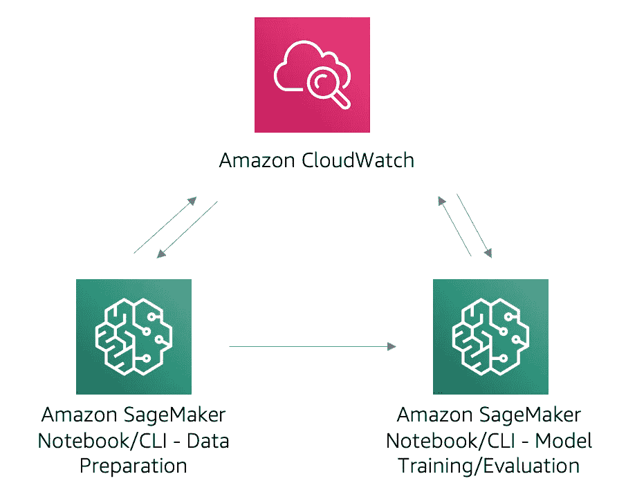
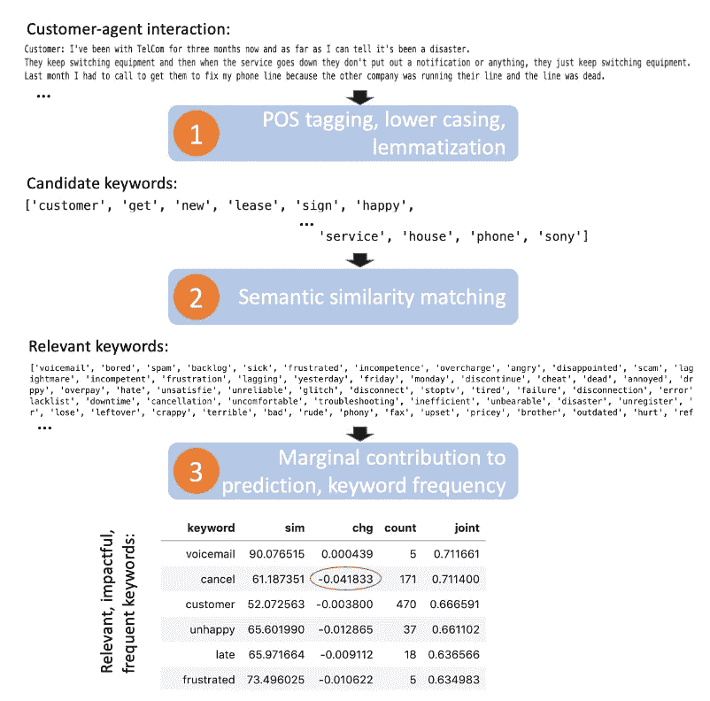
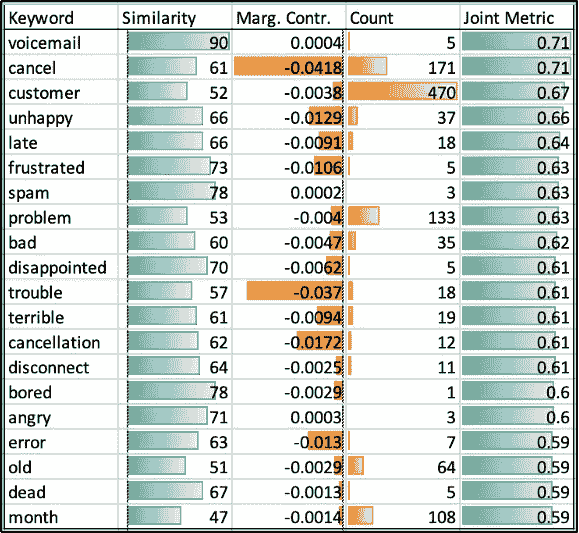

# 具有文本和可解释性的客户流失预测

> 原文：<https://towardsdatascience.com/customer-churn-prediction-with-text-and-interpretability-bd3d57af34b1?source=collection_archive---------18----------------------->

## [行业笔记](https://towardsdatascience.com/tagged/notes-from-industry)

## 预测客户是否想要离开，并了解客户为什么想要离开。

由[丹尼尔·赫克特](https://www.linkedin.com/in/daniel-herkert/)，[泰勒·马伦巴赫](https://www.linkedin.com/in/tyler-mullenbach-4b4994b0/)

这篇博文附带的代码库可以在[这里](https://github.com/aws-samples/churn-prediction-with-text-and-interpretability)找到。

客户流失，即当前客户的流失，是许多公司面临的问题。当试图留住客户时，将精力集中在更有可能离开的客户上符合公司的最佳利益，但公司需要一种方法来在客户决定离开之前发现他们。容易流失的用户通常会在用户行为和客户支持聊天日志中留下他们倾向的线索，使用自然语言处理(NLP)工具可以检测和理解这些线索。

在这里，我们演示了如何构建一个利用文本和结构化数据(数字和分类)的客户流失预测模型，我们称之为双模态模型架构。我们使用 Amazon SageMaker 来准备、构建和训练模型。发现可能流失的客户只是战斗的一部分，找到根本原因是实际解决问题的重要部分。由于我们不仅对客户流失的可能性感兴趣，而且对驱动因素也感兴趣，因此我们通过分析文本和非文本输入的特征重要性来补充预测模型。这个帖子的代码可以在[这里](https://github.com/aws-samples/churn-prediction-with-text-and-interpretability)找到。

在这个解决方案中，我们重点关注 Amazon SageMaker，它用于准备数据、训练流失预测模型，以及评估和解释训练好的模型。我们使用 Amazon SageMaker 来存储训练数据和模型工件，使用 Amazon CloudWatch 来记录数据准备和模型训练输出(图 1)。

图 1:包含 AWS 服务的架构图

与线性回归等更简单的模型相比，最先进的自然语言模型更难解释。尽管它们的性能一流，但可解释性问题会阻碍业务的采用。在这篇文章中，我们展示了一些从 NLP 模型中提取理解的方法。我们使用 BERT 句子编码器[2][3]来处理文本输入，并提供了一种将模型预测归因于输入特征的方法。虽然有不同的方法来解释语言模型，但我们选择对相关关键字子集进行消融分析，这可以很容易地扩展到整个数据集，从而为我们提供对语言模型预测的全局解释。

**探索和准备数据**

为了模拟分类和文本流失数据集，我们利用了结构化数据的 [Kaggle:客户流失预测 2020](https://www.kaggle.com/c/customer-churn-prediction-2020/data) ，并将其与使用 GPT-2 [1]创建的合成文本数据集相结合。数据集由 21 列组成，其特征包括分类特征(州、国际计划、语音邮件计划)、数字特征(账户长度、区号等)。)，以及一个包含文本的列，用于保存由 GPT-2 生成的客户和代理之间的聊天日志。

下图显示了数据的摘录。

为了准备用于建模的数据，我们使用一键编码将分类特征值转换成数字形式，并用相应的平均值来估算缺失的数字特征值。由于这篇文章的重点是预测和解释语言模型，我们不会花更多的时间来探索或研究分类和数字特征。相反，我们将把我们的重点放在客户代理的互动上。

如前所述，聊天记录是由 GPT-2 使用一组手动创建的客户代理对话样本生成的。以下是 GPT-2 产生的客户-代理对话的摘录。

虽然新 GPT 协议生成的对话比实际对话的广度小，并且(如上所述)有时不能完全理解，但我们相信，代替公共客户-代理数据集，这种生成的数据是获得关于流失的大型客户-代理交互数据集的合理方式。

我们在 Amazon SageMaker 上准备文本特征，通过使用来自拥抱人脸模型存储库的预训练句子-BERT 编码器(SBERT)将每个聊天日志转换为向量表示[4]。拥抱脸库提供了开源的、经过预训练的自然语言模型，可以用来对文本进行编码，而不需要对模型进行任何进一步的训练。SBERT 是预训练的 BERT 网络的修改，其使用以下网络架构来导出语义上有意义的句子嵌入。

在应用汇集操作以生成每个输入句子的固定大小的句子嵌入之前，使用彼此独立的 BERT 对一对句子进行编码。作为双折叠结构的一部分，通过更新权重对 BERT 进行微调，使得生成的句子嵌入在语义上有意义，并且可以与余弦相似度进行比较。

使用包括分类和回归在内的目标组合来训练 SBERT。为了对两个句子之间的关系进行分类的目的(图 2a)，在将句子嵌入传递到分类层之前，通过计算元素方面的差异并将它们乘以可训练的权重来连接句子嵌入。对于回归目标(图 2b)，计算两个句子嵌入之间的余弦相似度。

图 2:带有(a)分类目标函数和(b)回归目标函数的 SBERT 架构的例子

使用 SBERT 优于其他嵌入技术(如 InferSent，Universal sent Encoder)的好处是，它更高效，在大多数语义相似性任务中取得更好的结果[3]。

因为 BERT 是为编码单词片段而构建的，所以我们的文本数据几乎不需要预处理。我们可以直接把每个聊天记录转换成 768 维的语义有意义的嵌入向量。

将上述预处理步骤应用于所有分类、数字和文本特征导致数据现在以数字形式被编码，因此它可以被我们的神经网络处理。

**创建双模态 ML 模型**

该网络架构包括三个全连接层和用于二进制分类的 Sigmoid 激活函数(搅动/无搅动)。首先，编码的分类/数字数据在与编码的文本数据连接之前被送入全连接层。然后，在应用用于二进制分类的 Sigmoid 激活之前，连接的数据被馈送到第二和第三全连接层。第一个全连接层用于减少稀疏分类/数字输入数据的维度(参见下文的更多细节)。第二和第三全连接层充当编码数据的解码器，以便将输入分类为抖动/无抖动。我们称该架构为双模态，因为它将结构化和非结构化数据(即分类/数字和文本数据)作为输入，以便生成预测。

下图(图 3)展示了该模型的双模式架构。

图 3:使用结构化数据和文本作为输入的双模态模型架构

正如上一节所讨论的，分类数据已经使用 one-hot-encoding 转换为数值，其中每个特征的类别由单独列中的二进制值表示。当有许多类别时，这导致结果编码数据的稀疏性(许多零),如具有 51 个类别(包括哥伦比亚特区)的特征“州”。此外，通过输入数字特征的缺失值而创建的指示符列也有助于编码数据的稀疏性。第一个全连接层用于减少这种稀疏性，从而产生更有效的模型训练。

我们使用亚马逊 SageMaker 上的 SGD(随机梯度下降)优化器和 BCE(二元交叉熵)损失函数来训练该模型，并在大约 8-10 个时期后在测试数据集上实现了 0.98 AUC 的性能。作为比较，仅用分类和数字数据训练模型实现了 0.93 AUC 的性能，或者比使用文本数据时低约 5%(图 4)。由于具有文本数据的模型具有更多用于做出决策的信息，因此可以预期具有真实数据的类似改进。

图 4:仅用分类/数字数据以及分类/数字数据和文本训练的模型的 PR 曲线[图片由作者提供]

**重要特征**

然而，为了防止客户流失，仅仅知道流失事件发生的可能性是不够的。此外，我们需要找出驱动因素，以便采取预防措施。

**分类和数字特征**

我们将使用经过训练的神经网络的预测标签作为目标值，在分类和数值数据上训练 XGBoost 模型[5]，以找出哪些分类/数值特征对我们的模型的预测贡献最大。相对特性重要性的内置方法允许我们获得最重要特性的概述，如图 5 所示。

图 5:十大最重要的分类和数字特征[图片由作者提供]

从上图中，我们可以看到，决定客户是否会流失的前三个特征包括 vmail 消息的数量、客户服务电话的数量以及没有国际计划(x2_no)。特征 x0_xx 指示状态。

**文字特征**

现在让我们把注意力集中在客户-代理对话上，并尝试把模型的预测归因于它的文本输入特征。虽然存在不同的方法来解释自然语言的深度学习模型，但它们的主要焦点似乎是单独解释每个预测。例如，Captum 库[6]实现了基于梯度或 SHAP 值的技术，用于评估文本序列中的每个标记/单词。虽然这些方法在局部级别上提供了可解释性，但它们不容易扩展到整个数据集，从而限制了它们对训练模型预测的全局解释的使用。

我们使用 SBERT 编码的文本特征来解释训练模型的方法对于本地可解释性(单个聊天日志)和全局可解释性(整个数据集)都很有效，它可以有效地扩展，并且由我们在 Amazon SageMaker 上执行的以下步骤组成。我们首先使用词性(POS)标记和语义相似性匹配将文本子集化为关键词，以进行搅动。然后，我们执行消融分析，以确定每个关键词对模型预测的边际贡献。最后，我们将语义相似性、边际贡献以及关键字频率组合成一个单一的分数，这允许我们对关键字进行排序，并提供最相关的关键字进行流失。

下面的流程图(图 6)说明了我们提取关键字的方法:

图 6:描述寻找重要特性的文本转换的流程图。步骤 1:通过应用词类过滤、小写和词条化获得候选关键词。第二步:通过应用关键词的语义相似度匹配来获得相关关键词，从而进行流失。步骤 3:通过消融分析计算关键词的边际贡献。带圆圈的区域(红色)表示在移除标记 cancel 后模型的流失预测减少[图片由作者提供]

该方法从原始文本对话开始；我们通过关注候选关键字的子集来减少文本正文的大小，我们通过应用几个令牌过滤器来获得候选关键字的子集，如图 6 的步骤 1 所示。我们应用 Spacy 的词性标注，只保留形容词、动词和名词[7]。然后，我们删除停用词，小写，并 lemmatize 的令牌。

接下来，我们将候选关键词按照与两个类别结果的语义相似度进行排序，这里我们将重点关注流失(图 6，步骤 2)。具体来说，我们使用预先训练的 SBERT 对每个关键字进行编码，并计算每个关键字与所有 SBERT 编码的聊天日志的平均嵌入的余弦相似性，从而导致客户流失。这允许我们通过与客户流失的相似性对关键字进行排序，这进一步将关键字子集减少为与客户流失相关的关键字子集。从上图中你可以看到，通过语义相似度对关键词进行排名已经让我们对为什么客户会产生兴趣有了重要的了解。包括“取消”、“沮丧”或“不开心”在内的许多关键词都表示负面情绪。

除了与流失的语义相似性之外，我们希望通过测量关键字对模型预测的边际贡献来进一步量化关键字的影响(图 6，步骤 3)。我们嵌入包含和不包含相关关键字的聊天日志(在它们出现的地方),并测量平均预测差异。例如，关键字 cancel 在所有客户流失聊天日志中出现了 171 次，删除它会导致模型的客户流失预测在 171 个实例中平均减少 4.18%。

最后，我们将语义相似性、边际贡献和关键字频率这三个分数合并成一个联合度量，以实现重要关键字的最终排名。通过将单个指标设置为相同的比例(通过范围限制的最小/最大比例器)并计算加权平均值来计算联合指标。

**结果**

下表(图 7)显示了预测客户流失的 20 个最重要的关键词。它们包括“语音邮件”、“取消”、“垃圾邮件”、“营业额”、“沮丧”和“不高兴”，表明客户满意度低或其他问题。

图 7:预测客户流失最重要的 20 个关键词的表格

为了提供关于关键字的更多上下文，并帮助更好地解释客户流失事件，我们添加了一个功能来查询在客户-代理对话中使用关键字的短语。例如，当顾客抱怨被“大量的电子邮件和电话，成千上万的假发票垃圾邮件”淹没时，就使用了关键词“垃圾邮件”提到垃圾邮件的原始聊天记录:

*“我昨晚刚收到一些垃圾短信，今天一直收到很多短信，说我‘没有 SIM 卡’，我需要我的 SIM 卡。”*

*“电信公司开始用电子邮件和电话淹没我，给我发来数以千计的假发票。”*

“基本上，我每天都会接到很多垃圾电话，都是一个叫迈克尔的家伙打来的，他的电话号码很奇怪。”

理解关键词及其上下文将使我们能够采取措施解决客户流失问题。例如，一些客户似乎受到大量垃圾电话的困扰，因此决定离开这项服务。我们可以设计一个计划来减少垃圾电话的问题，从而降低客户流失率。

或者，我们可以通过将不同的关键字或短语分类到不同的主题中来获得更多的洞察力，并基于这些主题制定行动。然而，考虑到我们的合成数据集具有相当窄的对话主题的性质，我们发现它对我们的情况没有帮助。

**结论**

在这篇文章中，我们展示了如何将基于客户代理交互的文本数据与传统的客户账户数据相结合，从而提高预测客户流失的性能。此外，我们引入了一种方法，使我们能够从文本中学习洞察力，特别是哪些关键词最能表明客户流失。鉴于我们对语言模型的全局可解释性的关注，我们的方法有效地扩展到整个数据集，这意味着我们能够理解所有客户代理对话中流失的主要驱动因素。所有数据转换步骤，以及模型训练、评估和解释步骤都在 Amazon SageMaker 上执行。

**参考文献:**

[1] [语言模型是无监督的多任务学习器](https://www.semanticscholar.org/paper/Language-Models-are-Unsupervised-Multitask-Learners-Radford-Wu/9405cc0d6169988371b2755e573cc28650d14dfe)，，吴等。艾尔。, 2019

[2] [BERT:用于语言理解的深度双向转换器的预训练](https://arxiv.org/abs/1810.04805)，Devlin，Chang 等，2019

[3] [句子-BERT:使用连体 BERT 网络的句子嵌入](https://arxiv.org/abs/1908.10084)，Reimers，Gurevych，2019

【4】[拥抱脸句子变形金刚](https://huggingface.co/sentence-transformers)

[5] [XGBoost 型号](https://xgboost.readthedocs.io/en/latest/)

[6] [模型可解释性的 Captum 库](https://github.com/pytorch/captum)

[7] [用于文本处理的空间库](https://github.com/explosion/spaCy)