# 基于客户旅程的市场细分

> 原文：<https://towardsdatascience.com/customer-journey-based-segmentation-for-marketplaces-70e5a56838a7?source=collection_archive---------17----------------------->

由 [Margarida CSilva](https://unsplash.com/@marg_cs?utm_source=medium&utm_medium=referral) 在 [Unsplash](https://unsplash.com?utm_source=medium&utm_medium=referral) 上拍摄的照片

# 介绍

很有可能你偶尔会碰到一个叫做‘了解你的观众’的概念。这是大多数企业用来识别不同客户群及其各自需求的重要方法。这个概念对企业的重要性在于能够更好地理解和接触客户。这使得企业能够以更有效和个性化的方式向客户提供其内容和信息。

> 这一概念让企业有机会从“一刀切”转向更加以客户为中心的战略。

客户细分是一个常用的广义术语，用于将“了解你的受众”的概念应用到电子商务中。有数十种不同的方法可以做到这一点，在本文中，我们将与您分享我们基于客户旅程分析对 eCG(易贝分类集团)市场进行客户细分的方法。

文章的其余部分将遵循下面的大纲:

**问题定义**

*   我们试图完成什么？
*   主要目标是什么？
*   这个分析是针对哪个用户群做的？
*   该模型是为哪个 eCG 市场品牌开发的？

**数据探索**

*   客户之旅概述
*   观众特征的简短描述
*   回复功能的简短描述
*   确定分析的时间段

**方法论**

*   K-均值聚类的假设
*   第一步:剔除异常值
*   步骤 2:数据重新缩放
*   步骤 3:为维度赋予权重
*   第四步:K 均值聚类

**结果**

*   观众群的简短描述和指示器
*   回复群集的简短描述和指示器
*   详细的集群和集群之间的过渡

**结论**

# 问题定义

> 我们试图完成什么？

在这个项目中，我们希望根据用户当前的客户旅程阶段，将他们分成更小的群体。因此，需要回答的主要问题是**‘我们能否在我们的市场平台上清楚地识别完整用户体验的有意义的旅程阶段？’** 这样，我们将能够定义一些与我们的平台具有不同参与度的用户群。

> 主要目标是什么？

这个项目的最终目标是能够针对我们的用户在平台上的不同现状。换句话说:“个性化目标”。在这一模式的帮助下，我们将有机会相应地区分我们的客户定位策略，从而对我们的用户更加有效，并增加平台上的活跃用户数量。

> 这个分析是针对哪个用户群做的？

在这个阶段，我们问自己的问题是，我们应该支持买方还是卖方。买家是那些在平台上寻找产品进行购买的人，而卖家则是通过发布新的列表来销售他们的产品。由于买家在市场平台上创建的用户操作(如查看商品、保存商品或向用户发送消息)的数量远远超过卖家，我们决定仅对买家进行客户旅程分析。也有一种方法可以为卖家做类似的分析，但是现在，我们只关注买家，只是为了简单和高效。因此，在文章的其余部分，有时我们会使用“买家之旅”这一短语来指代该问题。

在市场平台中，主要有两种不同的用户类型:B2C(经销商)和 C2C(个人)。经销商是我们平台上发布广告的主要来源，他们占我们卖家的很大一部分。因此，我们决定将所有经销商排除在此分析之外，因为将他们归入购买者旅程阶段没有任何意义。为了防止分析受到经销商数据的误导，我们只对 C2C 用户进行了全面的分析。

> 该模型是为哪个 eCG 市场品牌开发的？

Ebay 分类集团(eCG)是一家伞式公司，目前在全球运营 14 个不同的分类平台。eCG 品牌下有两种不同的平台类型:水平和垂直市场。横向市场是指由许多不同类别组成的平台，如我们的荷兰租户“Marktplaats”。然而，eCG 中的垂直指的是用于特定产品类别的平台:汽车。

这个项目是为 eCG 的垂直平台之一开发的: **Kijiji Autos** 是加拿大领先的市场品牌，人们可以在这里购买或出售汽车。

# 数据探索

## 客户之旅概述

在易贝这样的电子商务平台上，我们知道用户的交易或购买情况，客户之旅大多从注册开始，以购买产品结束。出于这个原因，这些旅程通常被称为这些企业的“购买漏斗”或“转换漏斗”。然而，在我们的分类业务中，事情并不是那么明确。因此，我们需要更细致地处理这个问题，尤其是在项目的第一步:定义因素——特征——这些因素将在项目的后续步骤中用于形成不同的客户旅程阶段。

在探索阶段，我们发现市场平台上的 C2C 用户主要有两个不同的群体:浏览者和回复者。

**浏览者:**最近没有回复列表但只是浏览我们平台的用户。

**回复者:**最近回复过至少一个列表的用户。

我们首先将所有用户分成两个用户子组的主要原因是，他们表现出不同的客户行为特征。对于最近没有回复的用户——浏览者，我们只能跟踪他们在平台上的浏览行为，而我们更喜欢关注他们过去的信息行为，而不是浏览回复者。

以下是分别为查看者和回复者提取的特征列表:

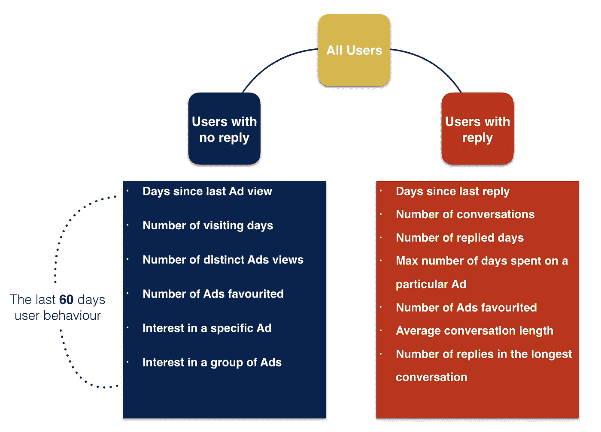

**两个不同用户群的功能列表:查看者-无回复和回复者-有回复**(图片由作者提供)

## 观众特征的简短描述

**自上次广告查看以来的天数:**自用户上次在平台上查看列表以来的天数。

**访问天数:**用户访问平台的不同天数。

**不同广告视图的数量:**用户查看的不同列表的数量

**喜欢的广告数量:**用户保存的列表数量

**对特定广告的兴趣:**用户访问的最常查看列表的天数与该用户的总访问天数的比率。

**对一组广告的兴趣:**用户查看的不同列表的数量与该用户查看的列表总数的比率。

## 回复功能的简短描述

**自上次回复后的天数:**自上次用户回复平台上的卖家后的天数。

**对话次数:**与不同卖家的对话次数。

**回复天数:**用户回复平台卖家的天数。

**在特定广告上花费的最大天数:**用户对同一列表回复卖家的最大天数。

**喜爱的广告数量:**用户保存的列表数量

**平均对话长度:**用户回复的总次数与用户进行的对话次数的比率。

**最长对话中的回复数:**最长对话中发送给卖家的消息数

## 确定分析的时间段

在从数据中提取任何用户行为特征之前，我们需要为这个过程设定一个时间框架。这是因为只有相对最近的用户行为才能对用户的当前客户旅程阶段产生影响。正如您从上图中看到的，对于我们的案例，这个时间段是 60 天，这是一个迭代过程的结果，如下图所示。

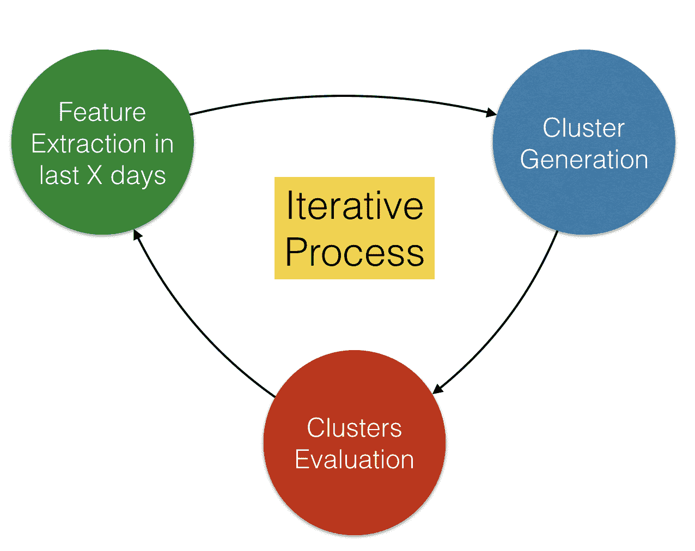

**迭代时间周期确定**(图片由作者提供)

整个过程从提取用户最近 X 天在平台上的行为开始，然后我们相应地生成聚类，并在最后一步评估这些最终聚类的质量。这个迭代过程一直持续下去，直到我们以最好的历史时间段结束，在我们的例子中是 60 天。

# 方法学

由于我们的数据中没有任何预定义的用户旅程阶段，我们将我们的细分问题视为无监督学习:聚类。我们只知道用户过去在平台上的行为，但有多少有意义的客户旅程阶段(集群)仍是一个有待该分析回答的开放性问题。实际上，这是聚类分析的优点和挑战。你会发现一些新的东西，可能会对你的业务有所帮助，但你也必须解决一个有许多未知的问题。

虽然大多数数据科学家可能认为聚类分析没有挑战性，但事实上，如果你错过了几个关键点，就很容易犯很多基本错误。无论您使用哪种算法，您都应该考虑在聚类算法背后的一些假设。因为我们选择了“K-Means”算法来解决我们的聚类问题，所以我将专门研究该算法的假设，并在本文的其余部分逐一讨论我们是如何处理这些假设的。

在谈论这些假设和它们各自的补救措施之前，让我们花点时间提一下我们在整个项目中使用的技术堆栈。

*   **上一步:**特征提取→ SparkSQL 和 Spark 的 DataFrame API。
*   **以下步骤** →通过汽水包在 Spark 上运行不同的 H2O 算法。

如果你还没有尝试在 Spark 上使用 H2O，你应该给它一个机会，因为我相信一旦你意识到这些 H2O 算法与 SparkML 包中的对应算法相比有多快，你就会喜欢上它。

## K-均值聚类的假设

*   集群在空间上被分组或称为“球形”
*   集群具有相似的大小

由于 K-Means 试图优化聚类内的平方和，它可能对异常值非常敏感。换句话说，数据中异常值的存在可能会偏离聚类中心，并最终扭曲聚类的形成。因此，在对数据应用 k-means 算法之前，必须去除异常值。

## 第一步:剔除异常值

隔离森林算法已被用于从数据中移除异常值。讨论算法的细节超出了本文的范围，但是我们想简单地提一下背后的逻辑。

隔离林基本上是一个带有随机拆分的随机林，而不是选择每个节点拆分的最佳候选功能。这是一种无监督的异常检测方法，就像我们的情况一样。它从构建多个决策树开始，这样树就可以将观察结果隔离在它们的叶子中。由于异常值对于某些特征来说具有极值，因此与其他观测值相比，隔离这些异常值会更容易、更快。换句话说，它们在树上的树枝往往比其他树枝短。因此，通过对每一次观察取树中节点分裂的平均数，我们得到分数，其中观察需要的分裂越少，它越有可能是异常的。

类似于随机森林，我们也有参数，如树的数量，树的高度或抽样率进行调整。然而，我们有一个特定于隔离林的额外参数，用于指示数据中异常值的总体比率:“污染率”。这决定了分数宣布观察异常与否的分界点。

在下图中，您将看到异常值移除过程对我们数据空间中观察值分布的影响。我们的数据空间是多维的，但我们应用主成分分析(PCA)将维数减少到 3，以便可视化，使我们能够在笛卡尔坐标系中显示数据点。在从数据中剔除这些异常值之前，几乎所有的数据点都彼此紧密靠近，因此不适合进行聚类分析。然而，正如你从右边的图中看到的，在处理之后，观察值在坐标系上更均匀或更不密集。

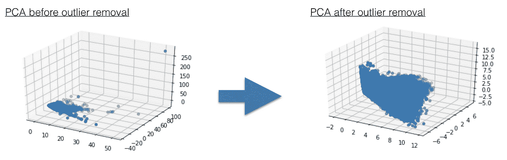

**异常值去除:PCA 图之前-之后**(图片由作者提供)

## 步骤 2:数据重新缩放

由于 K-Means 是一种空间算法，它使用距离度量来确定两个观测值之间的接近程度，因此均值归一化对于均衡每个维度对聚类形成的影响非常重要。

建议在移除异常值之前重新调整数据比例，因为如果应用线性异常值检测，任何比其他维度比例大得多的维度都可能支配和否决其他维度。然而，由于我们使用隔离林来捕捉那些异常，所以在我们的例子中没有这样的限制。我们重新调整数据只是为了消除维度的影响，并为下一步做好准备:给维度赋予权重

## 步骤 3:为维度赋予权重

当处理任何集群问题时，在制定方法时，您应该始终考虑您的业务假设。对于聚类算法来说，事情并不总是简单明了的，您可能希望根据自己的需求和假设来调整它。

K-Means 算法被设计成在生成聚类时所有维度都同等重要，但这并不总是理想的情况。在我们的例子中，我们想给一些维度更多的权重，以增加它们的重要性和对集群形成的影响。

对于观众，我们将下列维度的权重加倍:

*   自上次广告查看以来的天数
*   探访天数
*   不同广告浏览量

对于复制器，我们将下列尺寸的重量加倍:

*   自上次回复以来的天数
*   对话数量
*   最长对话中的回复数

在下图中，您可以看到在对维度应用不同权重的步骤之前和之后，2d 坐标系中观察值分布之间的差异。很明显，该步骤对簇的形成有很大影响。

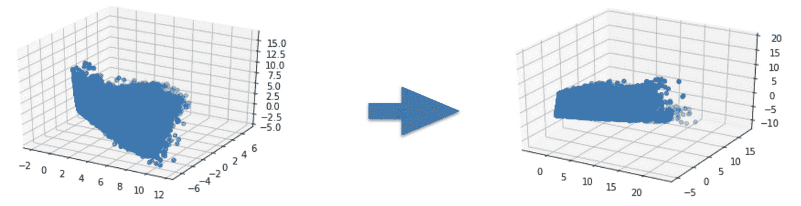

**加权尺寸:前-后 PCA 图**(图片由作者提供)

## 第四步:K 均值聚类

在我们完成了加权维度后，下一步是在这些数据上应用 k-means 算法。由于我们对客户旅程的可能阶段一无所知，这是我们应该确定最佳集群数量或不同旅程阶段的地方。找到最佳聚类数的方法是肘分析。我们将使 K-Means 算法适合一组不同数量的聚类，并通过查看聚类间距离平方和来评估这些聚类的质量。

我们对两个主要的用户群分别进行分析:查看者和回复者，如下图所示。在第一个图中，我们以总共 3 个集群结束——正如肘部功能所暗示的，观众的旅程阶段。然而，我们总共有 4 个聚类，作为对回复者的肘形分析的结果，如右图所示。

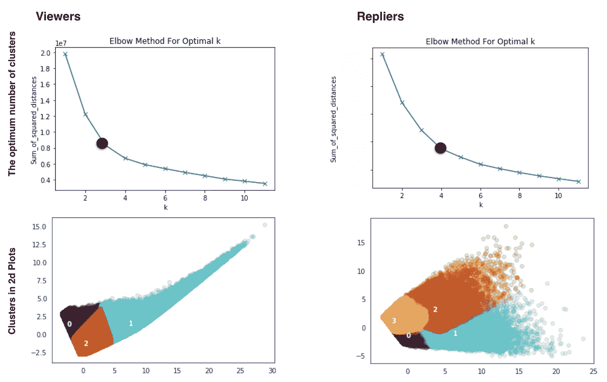

**肘分析和 2D——观众和回帖者最佳聚类的表示**(图片由作者提供)

下面，您可以找到一个详细的大图，它总结了整个项目过程中采取的所有步骤，从将我们的用户群划分为两个主要用户组开始，直到以集群结束—客户旅程阶段。

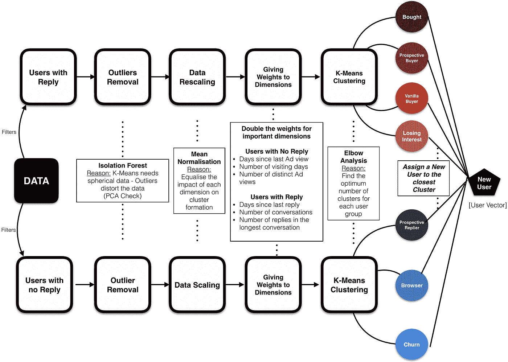

**整条管道的大图**(图片由作者提供)

# 结果

在找出了查看者和回复者这两个用户群的最佳聚类数后，我们根据每个聚类的质心的不同维数，给每个聚类取了一个有意义的代表名。

首先，让我们仔细看看下表中给出的星团的质心。我们通过解释不同维度上的簇形心值得出了簇的名称。我们通过在表格中的单元格周围放置红色边框来指示集群中的决定性维度。

检查完质心后，我们强烈建议您通读下面部分中对集群的简短描述和指示器，以便更清楚地了解这些集群名称背后的基本原理。

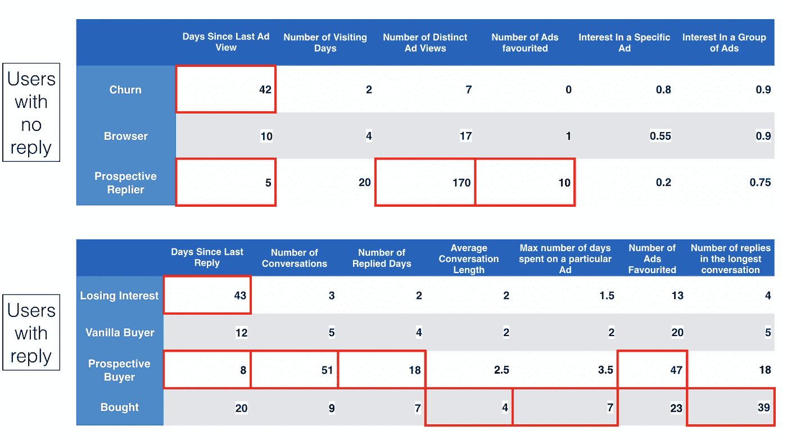

**聚类质心的维度值**(图片由作者提供)

## 观众群的简短描述和指示器

**1-客户流失:**他们很久以前就不再访问我们的平台了。

*   查看者中最大“自上次广告查看后天数”

他们仍然会访问我们的平台，但不那么活跃了。

*   一般来说，任何维度都没有极值

**3-潜在回答者:**目前，他们积极访问我们的平台。这群用户最有可能开始与卖家对话。

*   观众中“自上次观看广告后的最短天数”
*   查看者中不同广告查看次数的最大值
*   观众最喜欢的广告数量

## 回复群集的简短描述和指示器

**1-失去兴趣:**他们前阵子不回复房源了。最有可能的是，他们已经放弃了在平台上寻找汽车。

*   回复者中的最大“自上次回复后的天数”

**2-普通买家:**目前，他们仍在与卖家进行一些对话，但不那么积极。

*   一般来说，任何维度都没有极值

**3-潜在买家:**目前，他们正积极地与不同的卖家进行大量对话。这部分用户是最有可能买车的。

*   回复者中最少的“自上次回复后的天数”
*   回复者之间的最大“对话次数”
*   回复者中的最大“回复天数”
*   回复者中最大的“偏好广告数量”

**4-已买:**最近他们已经买了车，离开了我们的平台。

*   回答者之间的最大“平均对话长度”
*   回复者在特定广告上花费的最大“最大天数”
*   回答者之间的最大“最长对话长度”

在下图中，您可以看到不同集群中用户数量的分布。

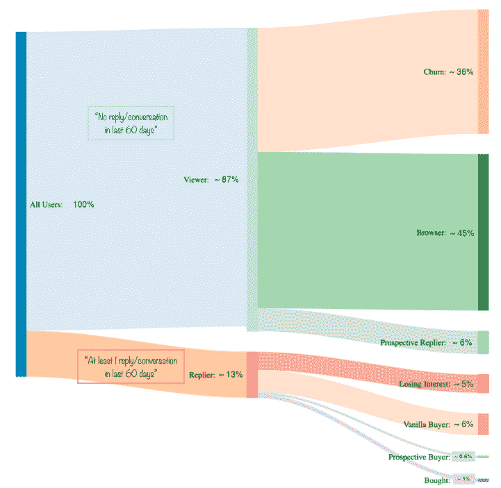

**用户在旅程各阶段的分布**(图片由作者提供)

## 详细的集群和集群之间的过渡

在集群生成之后，我们还想知道 7 天内集群之间的转换。要回答的问题是，在接下来的 7 天内，每个集群中有多少百分比的用户移动到任何其他集群。换句话说，我们测量有多少集群倾向于保持稳定状态。创建这些转换的另一个原因是对我们的集群生成过程进行健全性检查，以查看集群之间是否发生了任何意外或不可思议的转换。在下面的饼图中，您将看到 7 天内从该特定集群到其他集群的转换百分比。

## 观众群

> **搅动**

*   整个用户群的 36%
*   过去 60 天没有回复(查看器)
*   他们不久前甚至停止访问我们的平台。(最近一次访问:~40 天前)
*   与其他旅程阶段相比，他们更倾向于停留在同一阶段(约 90%)

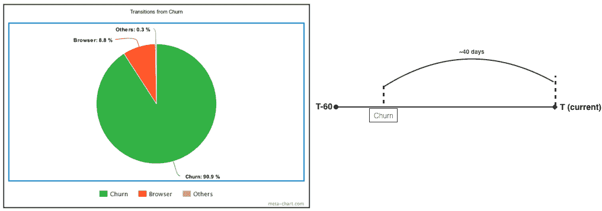

**未来 7 天从流失旅程阶段的过渡分布**(图片由作者提供)

> **浏览器**

*   整个用户群的 45%
*   过去 60 天没有回复(查看器)
*   他们仍然访问我们的平台，但不那么积极。(最近一次访问:~ 10 天)
*   这些用户最有可能流失(7 天内的流失率:14%)
*   在 7 天内，这些用户中只有 1.5%成为“潜在回复者”(下一阶段)

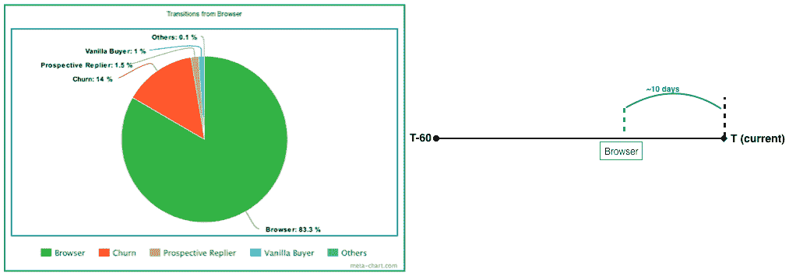

**未来 7 天浏览器旅程阶段的过渡分布**(图片由作者提供)

> **预期回答者**

*   占整个用户群的 6.7%
*   过去 60 天没有回复(查看器)
*   目前，他们积极访问我们的平台。
*   这群用户最有可能开始与卖家对话。

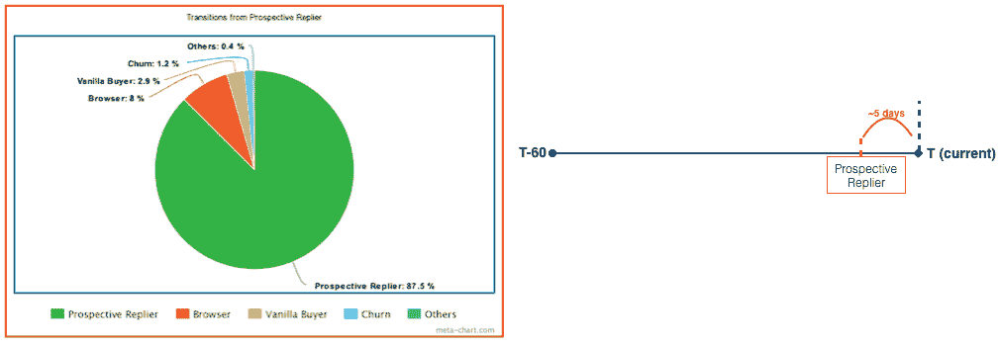

**未来 7 天预期回复者旅程阶段的过渡分布**(图片由作者提供)

## 复制器簇

> **失去兴趣**

*   占整个用户群的 5.4 %
*   在过去 60 天内，他们至少收到了 1 封回复(回复者)
*   他们不久前停止回复广告。(上次回复:~45 天前)
*   他们很容易成为流失用户。(一周内的流失率:~ 5.6 %)
*   这些用户中有 6.8%在 7 天内再次成为“浏览者”(前一阶段)
*   这些用户中只有 5.4%继续他们的购买之旅(下一阶段:普通买家)

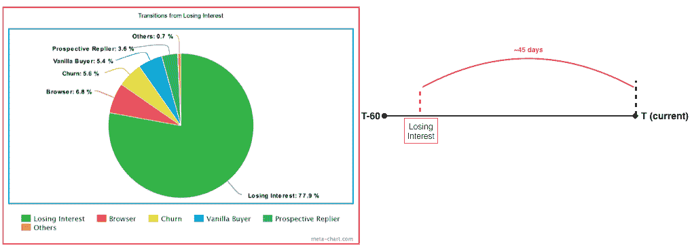

**未来 7 天从失去兴趣旅程阶段开始的过渡分布**(图片由作者提供)

> **普通买家**

*   占整个用户群的 6.4%
*   他们仍在与卖家进行一些对话，但不那么积极。
*   购买过程中最活跃的用户群之一(25%的用户倾向于在 7 天内改变他们的阶段)
*   这些用户中有 18.2%在 7 天内转向“失去兴趣”(前一阶段)
*   这些用户中只有 5%继续他们的购买之旅(下一阶段:潜在买家或已购买者)

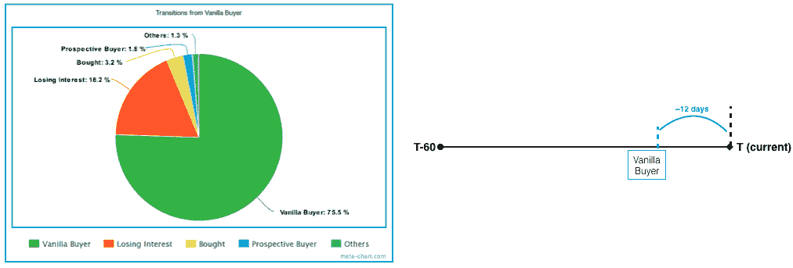

**未来 7 天从普通买家旅程阶段的过渡分布**(图片由作者提供)

> **潜在买家**

*   占整个用户群的 0.6%
*   目前，他们正在积极地与卖家进行大量对话。
*   最稳定的用户群之一(7 天后停留在同一阶段的比例:90%)
*   这部分用户是最有可能买车的。(7 天内进入“买入”阶段的比率:2.4%)

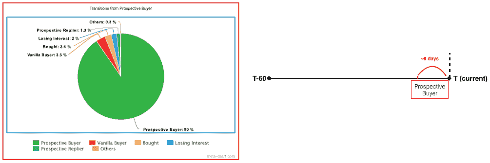

**未来 7 天潜在买家旅程阶段的过渡分布**(图片由作者提供)

> **买了**

*   整个用户群的 1%
*   他们已经买了一辆汽车
*   最近离开了我们的平台(上次回复:~20 天前)
*   这些用户在离开之前与卖家进行了最长时间的对话
*   这些用户可能会暂时被排除在我们的活动之外

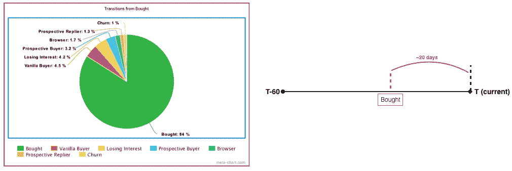

**未来 7 天购买旅程阶段的过渡分布**(图片由作者提供)

# 结论

在本文中，我们向您介绍了我们在项目中采取的步骤:基于客户旅程的市场细分。首先，我们从定义我们在整个分析中使用的维度——特征——开始。然后，我们谈到了 k-means 聚类的一些关键假设，并讨论了在我们的案例中我们是如何处理这些问题的。在那之后，我们也提到了我们是如何通过解释星团质心来得出这些星团名称的。在文章的结尾，我们深入探讨了集群的细节以及集群之间的转换是如何形成的。

本文的主要观点是，解决聚类问题可能很棘手，因此，在进行分析时，您最好记住一些关键点。我们希望你喜欢阅读这篇文章，并发现它是有用的。

作者签名